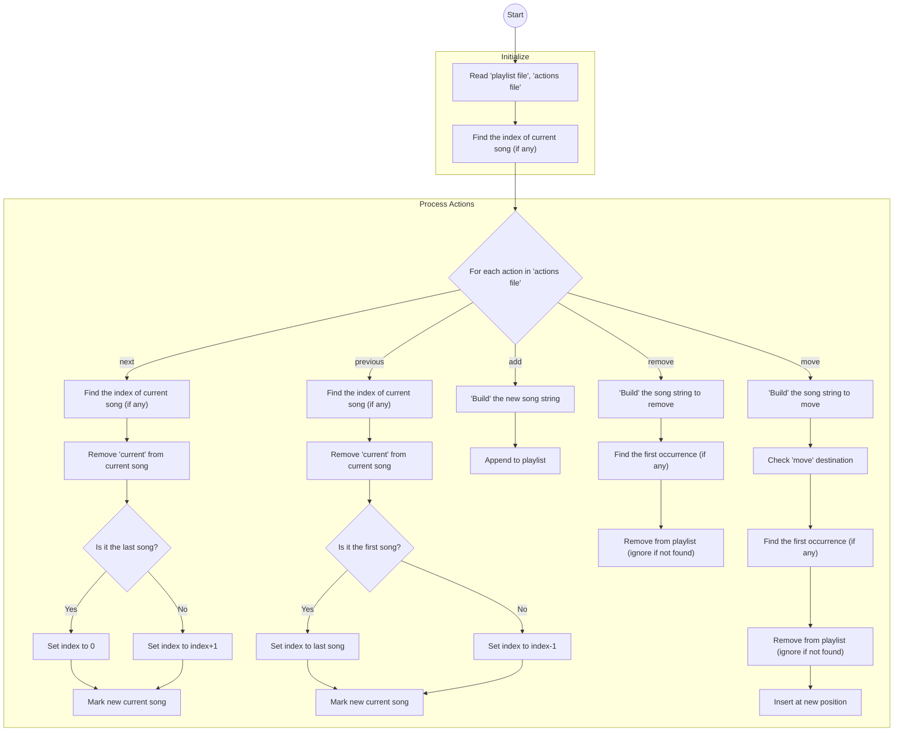
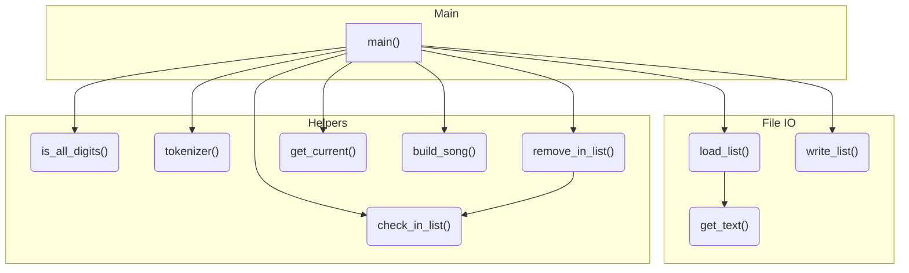

<!--more-->

## Assignment Requirements


Before starting this homework, make sure you have read and understood the Academic Integrity Policy.

In this assignment you will develop a program to manage music playlists like Spotify does, let's call this program New York Playlists. Please read the entire handout before starting to code the assignment. 

## Learning Objectives

- Practice handling command line arguments.
- Practice handling file input and output.
- Practice the C++ Standard Template Library string and vector classes. 

## Command Line Arguments

Your program will be run like this:

```console
./nyplaylists.exe playlist.txt actions.txt output.txt
```

Here:

- nyplaylists.exe is the executable file name.
- playlist.txt is the name of an input file which contains a playlist - in this README, we will refer to this file as the **playlist file**.
- actions.txt is an input file which defines a sequence of actions - in this README, we will refer to this file as the **actions file**.
- output.txt where to print your output to.

## Playlist File Format and Output File Format

The playlist file and the output file have the same format. Take the playlist_tiny1.txt as an example, this file has the following 4 lines:

```console
"Perfect Duet" Ed Sheeran, Beyonce
"Always Remember Us This Way" Lady Gaga current
"Million Reasons" Lady Gaga
"I Will Never Love Again - Film Version" Lady Gaga, Bradley Cooper
```

Except the second line, each line has two fields, the music title, and the artist(s). There is one single space separating these two fields. 

The second line is special, it ends with the word **current**, meaning that the song "Always Remember Us This Way" is the currently playing song. This word **current** appears in the **playlist file** once and should also appear in the output file once.

## Actions File Format

The actions file defines actions. Take actions1.txt as an example, this file has the following lines:

```console
add "Umbrella" Rihanna
add "We Are Young" Fun
add "You Are Still the One" Shania Twain
remove "Million Reasons" Lady Gaga
add "Viva La Vida" Coldplay
move "I Will Never Love Again - Film Version" Lady Gaga, Bradley Cooper 1
next
next
next
previous
move "You Are Still the One" Shania Twain 4
```

The **actions file** may include 5 different types of actions:

- add, which adds a song to the end of the playlist.
- remove, which removes a song from the playlist.
- move, which moves a song to a new position - the new position is always included at the end of the line. The line *move "I Will Never Love Again - Film Version" Lady Gaga, Bradley Cooper 1*, moves the song "I Will Never Love Again - Film Version" to position 1, and the line *move "You Are Still the One" Shania Twain 4*, moves the song "You Are Still the One" to position 4. Note that, unliked array indexing in C/C++, positioning in Spotify starts at 1, as opposed to 0. This can be seen in the above Spotify screenshot: the first position is position 1.
- next, which skips the currently playing song and starts playing the song that is listed directly after it. Note that if the currently playing song is already at the bottom of the playlist, the action *next* will make the first song (i.e., the song at the very top of the playlist) as the currently playing song.
- previous, which skips the currently playing song and goes to the song listed directly before the currently playing song. Note that if the currently playing song is already at the top of the playlist, the action *previous* will make the last song (i.e., the song at the bottom of the playlist) as the currently playing song.

According to this sample **actions file**, 4 songs will be added to the playlist, 1 song will be removed, 2 songs will be moved. And the currently playing song will be a different song, instead of the song "Always Remember Us This Way".

When playlist_tiny1.txt and actions1.txt are supplied to your program as the two input files, your program should produce the following output file:

```console
"I Will Never Love Again - Film Version" Lady Gaga, Bradley Cooper
"Perfect Duet" Ed Sheeran, Beyonce
"Always Remember Us This Way" Lady Gaga
"You Are Still the One" Shania Twain
"Umbrella" Rihanna
"We Are Young" Fun current
"Viva La Vida" Coldplay
```

## Non-existent Songs

If a move action or a remove action as defined in the **actions file** attempts to move or remove a song which does not exist in the playlist, your program should ignore such an action.

## Duplicated Songs

In cases where the same song appears more than once on the playlist, choose the first song (to move or remove) - i.e., search the playlist, starting from the top to the bottom, identify the first occurrence of this song, and use it (to move or remove).

## Instructor's Code

You can test (but not view) the instructor's code here: [instructor code](http://ds.cs.rpi.edu/hws/playlists/). Note that this site is hosted on RPI's network and you can visit this site only if you are on RPI's network: either on campus or using a VPN service. Also note that, it is not your job in this assignment to play musics, the instructor's C++ code here is just used as the backend to manage the playlist.

## Program Requirements & Submission Details

In this assignment, you are required to use both std::string and std::vector. You are NOT allowed to use any data structures we have not learned so far.

Use good coding style when you design and implement your program. Organize your program into functions: don’t put all the code in main! Be sure to read the [Homework Policies](https://www.cs.rpi.edu/academics/courses/spring25/csci1200/homework_policies.php) as you put the finishing touches on your solution. Be sure to make up new test cases to fully debug your program and don’t forget to comment your code! Complete the provided template [README.txt](./README.txt). You must do this assignment on your own, as described in the [Collaboration Policy & Academic Integrity](https://www.cs.rpi.edu/academics/courses/spring25/csci1200/academic_integrity.php) page. If you did discuss the problem or error messages, etc. with anyone, please list their names in your README.txt file. Prepare and submit your assignment as instructed on the course webpage. Please ask a TA if you need help preparing your assignment for submission.

**Due Date**: 01/16/2025, 10pm.

## Rubric

13 pts
- README.txt Completed (3 pts)
  - One of name, collaborators, or hours not filled in. (-1)
  - Two or more of name, collaborators, or hours not filled in. (-2)
  - No reflection. (-1)
- STL Vector & String (3 pts)
  - Uses data structures which have not been covered in this class. (-3)
  - Did not use STL vector (-2)
  - Did not use STL string (-2)
- Program Structure (7 pts)
  - No credit (significantly incomplete implementation) (-7)
  - Putting almost everything in the main function. It's better to create separate functions for different tasks. (-2)
  - Improper uses or omissions of const and reference. (-1)
  - Almost total lack of helpful comments. (-4)
  - Too few comments. (-2)
  - Contains useless comments like commented-out code, terminal commands, or silly notes. (-1)
  - Overly cramped, excessive whitespace, or poor indentation. (-1)
  - Lacks error checking (num of args, invalid file names, invalid command, etc.) (-1)
  - Poor choice of variable names: non-descriptive names (e.g. 'vec', 'str', 'var'), single-letter variable names (except single loop counter), etc. (-2)
  - Uses global variables. (-1)
  - Overly long lines, in excess of 100 or so characters. It's recommended to keep all lines short and put comments on their own lines. (-1)


## Supporting Files



## Program Design

Before start, we need to find out what need to do. Let's draw a flowchart to exam what are the steps.



Then, we can plan what function to use in this program.



## Pitfalls

1. It's hard to load each argument correctly. For example, song can include spaces, the singer can also have space or something else in their names. But luckily, we don't need care too much about the middle part. I mean the first argument is always the command. The rest of it is the song information we need to add / delete. I split the arguments / songs into parts by space. `<action> <song> <location>` and take the each part as needed.
2. When I am moving / adding the song. It's possible that the song has a `current` string at the end of line (in the playlist file already). If we only check the song's name, it will not pass some test cases. For example, this is how I handle this case for `move` command.

    ```diff
    if (tokens[0] == "move") {
        if (is_all_digits(tokens.back())){
            //set target position
            int dest = std::stoi(tokens.back());
            //build song from tokens
            std::string song;
            song = build_song(tokens, 1, tokens.size() - 1);
    +       //fix song name if it has current tag
    +       if (!check_in_list(song, playlist) &&
    +           !check_in_list(song + " current", playlist)) {continue;}
    +       else if (check_in_list(song + " current", playlist)) {
    +           song += " current";
    +       }
            remove_in_list(song, playlist);
            playlist.insert(playlist.begin() + dest - 1, song);
        } else {
            std::cout << "ERROR: Missing move destination" << std::endl;
            continue;
        }
    }
    ```

    I added another check with the song + `current` in the playlist before I actually add it into the playlist.

## Solution

### nyplaylists.cpp

```cpp
//An implement of CSCI-1200 HW1 Spotify Playlists
//Date: 2025/1/16
//Author: JamesFlare
#include <vector>
#include <string>
#include <iostream>
#include <fstream>

std::string get_text(const std::string &fname) {
    //load a text file into a string
    std::ifstream inFile(fname);
    //check if file exists
    if (!inFile) {
        std::cout << "Error: File not found" << std::endl;
        return "";
    }
    std::string text;
    std::string line;
    while (std::getline(inFile, line)) {
        text += line;
        text += "\n";
    }
    inFile.close();

    return text;
}

std::vector<std::string> load_list(const std::string &fname) {
    //load a text file into a vector of strings
    std::string text = get_text(fname);

    std::vector<std::string> lines;
    std::size_t start = 0;
    std::size_t end   = 0;
    while ((end = text.find('\n', start)) != std::string::npos) {
        lines.push_back(text.substr(start, end - start));
        start = end + 1;    
    }
    if (start < text.size()) {
        lines.push_back(text.substr(start));
    }

    return lines;
}

bool is_all_digits(const std::string& s) {
    //check if string is int
    for (char c : s) {
        if (!std::isdigit(static_cast<unsigned char>(c))) {
            return false;
        }
    }
    return !s.empty();
}

std::vector<std::string> tokenizer(const std::string &s) {
    //split string into tokens
    std::vector<std::string> tokens;
    std::string token;
    for (char c : s) {
        if (c == ' ') {
            tokens.push_back(token);
            token = "";
        } else {
            token += c;
        }
    }
    tokens.push_back(token);
    return tokens;
}

bool check_in_list (const std::string &s, const std::vector<std::string> &list) {
    //check if string is in list
    for (std::string item : list) {
        if (s == item) {
            return true;
        }
    }
    return false;
}

void remove_in_list (const std::string &s, std::vector<std::string> &list) {
    //remove string from list
    if (!check_in_list(s, list)) {return;}
    for (int i = 0; i < list.size(); i++) {
        if (list[i] == s) {
            list.erase(list.begin() + i);
            return;
        }
    }
}

int get_current (std::vector<std::string> &playlist) {
    //return the index of the string has word current at the end
    for (int i = 0; i < playlist.size(); i++) {
        if (playlist[i].find("current") != std::string::npos) {
            return i;
        }
    }
    return -1;
}

std::string build_song (const std::vector<std::string> &tokens, const int &start, const int &end) {
    //build string from tokens w/ start and end positions
    std::string song;
    for (int i = start; i < end; i++) {
        song += tokens[i];
        if (i != end - 1) {
            song += " ";
        }
    }
    return song;
}

void write_list(const std::string &fname, const std::vector<std::string> &list) {
    //write list to file
    std::ofstream outFile(fname);
    for (std::string line : list) {
        outFile << line << std::endl;
    }
    outFile.close();
}

int main(int argc, char *argv[]) {
    //take 3 arguments
    if (argc < 3) {
        std::cout << "Error: Not enough arguments" << std::endl;
        return 1;
    }
    //load arguments
    std::string playlist_fname = argv[1];
    std::string action_list_fname = argv[2];
    std::string output_fname = argv[3];
    //load working files
    std::vector<std::string> playlist = load_list(playlist_fname);
    std::vector<std::string> action_list = load_list(action_list_fname);
    //get current playing song id
    int current_song_id = get_current(playlist);
    //execute actions
    for (std::string command : action_list) {
        //split command into tokens
        std::vector<std::string> tokens = tokenizer(command);
        if (tokens[0] == "next") {
            current_song_id = get_current(playlist);
            //remove "current" tag
            playlist[current_song_id].erase(playlist[current_song_id].length() - 8);
            if (current_song_id == playlist.size() - 1) {
                current_song_id = 0;
            } else {
                current_song_id++;
            }
            //update current song
            playlist[current_song_id] += " current";
        }
        if (tokens[0] == "previous") {
            current_song_id = get_current(playlist);
            //remove "current" tag
            playlist[current_song_id].erase(playlist[current_song_id].length() - 8);
            if (current_song_id == 0) {
                current_song_id = playlist.size() - 1;
            } else {
                current_song_id--;
            }
            //update current song
            playlist[current_song_id] += " current";
        }
        if (tokens[0] == "add") {
            std::string song;
            song = build_song(tokens, 1, tokens.size());
            playlist.push_back(song);
        }
        if (tokens[0] == "remove") {
            std::string song;
            song = build_song(tokens, 1, tokens.size());
            remove_in_list(song, playlist);
        }
        if (tokens[0] == "move") {
            if (is_all_digits(tokens.back())){
                //set target position
                int dest = std::stoi(tokens.back());
                //build song from tokens
                std::string song;
                song = build_song(tokens, 1, tokens.size() - 1);
                //fix song name if it has current tag
                if (!check_in_list(song, playlist) &&
                    !check_in_list(song + " current", playlist)) {continue;}
                else if (check_in_list(song + " current", playlist)) {
                    song += " current";
                }
                remove_in_list(song, playlist);
                playlist.insert(playlist.begin() + dest - 1, song);
            } else {
                std::cout << "ERROR: Missing move destination" << std::endl;
                continue;
            }
        }
    }
    //write back file
    write_list(output_fname, playlist);
    return 0;
}
```
