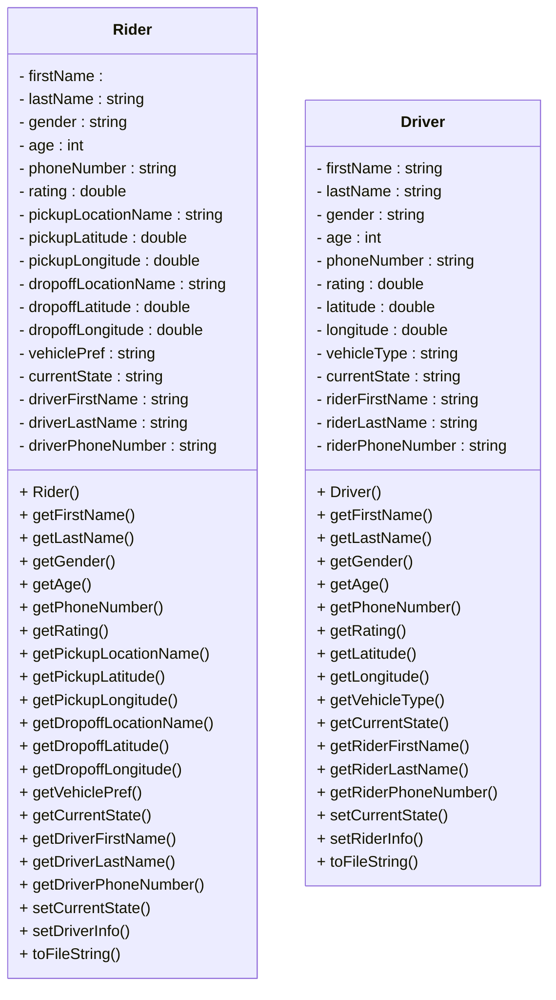

<!--more-->

## Assignment Requirements

````markdown
# Homework 2 — Designing a Simple Uber

In this assignment you will develop a simple ride sharing application called New York Ride. Please read the entire handout before starting to code the assignment.

## Learning Objectives

- Practice implementing and working with C++ classes.
- Practice using std::string, std::vector.

## Specification

The New York Ride application should support 2 different roles: drivers, riders. Riders can perform two tasks:

- Request a ride
- Cancel a ride request 

Drivers can perform one task:

- Cancel a ride request

*Note*: A commercial ride sharing product like Uber or Lyft of course allows riders and drivers to perform more tasks, but let's be honest, Uber/Lyft has thousands of software engineers, but you only have one person and only have one week to work on this assignment, so let's simplify the tasks.

## Input Files

Companies like Uber and Lyft maintain all drivers and riders information in their database, but database is way beyond the scope of this course, and therefore we will just store drivers information and riders information in two simple text files, [drivers.txt](drivers.txt) and [riders.txt](riders.txt). In this assignment you will once again read these files as the input of your program, parse them so as to retrieve drivers and/or riders information, and store them in your own data structures. In this assignment, you must use *std::vector* to store drivers and riders. You are recommended to use one *std::vector* instance to store all drivers, use another *std::vector* instance to store all riders.

### Driver Information

The [drivers.txt](drivers.txt) has a format like this:

```console
Sandra Huang Female 25 853-977-5304 3.1 40.4269 -73.0753 Standard On_the_way_to_pickup Michael Richard 445-915-1645
Susan Li Female 51 997-217-1025 3.7 40.5863 -73.8684 Premium On_the_way_to_pickup Lucia Kenneth 829-477-7963
Mary Zhang Female 47 765-620-6297 4.5 40.6988 -73.3988 Economy On_the_way_to_pickup Amy Lee 545-639-2924
William David Male 37 324-571-7028 3.8 40.2445 -73.5073 Premium Available null null null
Christopher Javier Male 25 218-980-8846 4.5 40.5784 -73.5479 Economy During_the_trip Daniel Chen 820-327-7312
Dorothy Daniel Female 21 332-586-7858 4 40.6672 -73.2472 Premium During_the_trip Juan Carlos 204-752-4660
Mateo Andres Male 55 201-564-6348 3.8 40.8771 -73.6288 Standard During_the_trip Karen Michael 534-197-2988
Dorothy Liu Female 41 507-944-8147 4.5 40.4938 -73.9905 Economy On_the_way_to_pickup Amy Christopher 601-148-3144
Mateo Robert Male 49 592-397-3458 3.5 40.4106 -73.3736 Economy On_the_way_to_pickup William David 693-200-8952
Valentina Andres Female 40 299-602-1498 3.3 40.3159 -73.8891 Standard On_the_way_to_pickup Susan Edward 809-345-5043
```

The above is the first 10 lines of the [drivers.txt](drivers.txt) file. It has 13 fields, separated by a space. And these 13 fields are:

- Driver's first name
- Driver's last name
- Driver's gender
- Driver's age
- Driver's phone number
- Driver's rating
- Driver's current latitude
- Driver's current longitude
- Driver's vehicle type
- Driver's current state
- Rider's first name
- Rider's last name
- Rider's phone number

The last 3 fields will only be meaningful if a ride request is assigned to this driver. In this assignment, we assume that drivers will accept the request whenever it is assigned to this driver.

A driver can be in one of the following states:

- Available (waiting for a request)
- On the way to a pickup location (request accepted)
- During a trip

When the driver is in an Available state, it means this driver is not assigned a ride request, and therefore is not associated with any rider, and as such, the last 3 fields of this driver will just be 
```console
null null null
```

### Rider Information

The [riders.txt](riders.txt) has a format like this:

```console
Isabella Richard Female 39 301-144-6533 3.2 Top_of_the_Rock 40.7593 -73.979 Gowanus 40.6733 -73.99 Economy Ready_to_request null null null
Juan James Male 47 717-480-4710 3.2 Forest_Hills 40.7196 -73.8448 Park_Slope 40.6728 -73.9778 Standard Driver_on_the_way Melissa Kim 435-773-6289
Deborah Thomas Female 45 501-380-7736 5 Park_Slope 40.6728 -73.9778 Flatiron_Building 40.7411 -73.9897 Economy Driver_on_the_way Paul Daniel 815-649-6492
Sofia Steven Female 28 780-650-6240 3 Bay_Ridge 40.635 -74.019 High_Line_Park 40.748 -74.0048 Premium During_the_trip Thomas Edward 557-939-8060
Anthony Thomas Male 58 302-206-4102 4.3 Prospect_Heights 40.6775 -73.9692 East_River_Park 40.7135 -73.9756 Economy During_the_trip Juan Timothy 471-264-9092
Lucia Andres Female 59 256-799-3283 3.1 Grand_Central_Terminal 40.7527 -73.9772 Central_Park_Zoo 40.7678 -73.9718 Economy Driver_on_the_way Camila Mark 939-309-5453
Melissa Christopher Female 28 392-390-8218 4.6 The_High_Line 40.748 -74.0048 The_Vessel 40.7536 -74.0023 Standard Driver_on_the_way Brian Luis 845-708-1986
William Timothy Male 46 808-688-3264 3.7 Broadway_Theater_District 40.7589 -73.9851 Coney_Island 40.5749 -73.9859 Economy Driver_on_the_way Brenda Christopher 886-285-9845
Linda Chen Female 60 320-807-7264 4.6 Bushwick 40.6944 -73.9213 Columbia_University 40.8075 -73.9642 Premium Ready_to_request null null null
Brenda Thomas Female 45 470-325-3275 3.2 Bay_Ridge 40.635 -74.019 High_Line_Park 40.748 -74.0048 Premium Driver_on_the_way John Javier 446-656-6614
```

The above is the first 10 lines of the [riders.txt](riders.txt) file. It has 17 fields, separated by a space. And these 17 fields are:

- Rider's first name
- Rider's last name
- Rider's gender
- Rider's age
- Rider's phone number
- Rider's rating
- The name of the rider's pickup location
- The latitude of the rider's pickup location
- The longitude of the rider's pickup location
- The name of the rider's dropoff location
- The latitude of the rider's dropoff location
- The longitude of the rider's dropoff location
- Rider's vehicle preference
- Rider's current state
- Driver's first name
- Driver's last name
- Driver's phone number

A rider can be in one of the following states:

- Ready to request
- Driver on the way (to pickup)
- During a trip

Ideally, there should be four states, and this other state would be: Ride requested but not yet accepted by any driver. However, as we mentioned, in this assignment, we assume that when a rider issues a request, it will be accepted by a driver, and thus we can exclude this state from our consideration.

When the rider is in Ready_to_request state, it means no driver is now assigned to this ride request, and therefore, the last 3 fields of this rider will just be 

```console
null null null
```

## Commands to Support

Your program only needs to support two commands:

### Ride Request

The first command allows the rider can to send a ride request.

```console
nyride.exe drivers.txt riders.txt output0.txt output1.txt output2.txt phoneNumber request
```

Here

- drivers.txt is the input file which contains all drivers' information. Your program should never change this file.
- riders.txt is the input file which contains all riders' information. Your program should never change this file.
- output0.txt is the output file where you print messages to rider or driver.
- output1.txt is the output file where you print the updated drivers information, thus this file should have the same format as drivers.txt.
- output2.txt is the output file where you print the updated riders information, thus this file should have the same format as riders.txt.
- phoneNumber. Ideally this should be a phone number which corresponds to one of the riders in the riders.txt whose state is "Ready_to_request"; but life is not always ideal, and how your program should cope with various phone number cases will be described in this section.
- request indicates this is a ride request.

When this command is run, and

1. if a driver is found, your program should

1.1 print the following information into the output0.txt file:
```console
Ride requested for rider Rebecca, looking for an Economy vehicle.
Pick Up Location: Williamsburg, Drop Off Location: Statue_of_Liberty.
We have found the closest driver Elena(4.7) for you.
Elena is now 7.9 miles away from you.
```
Replace *Rebecca* with the rider's first name, replace *Economy* with the rider's preferred vehicle type, replace *Williamsburg* with the rider's pickup location, and replace *Statue_of_Liberty* with the rider's drop off location. Replace *Elena* with the driver's first name, replace *4.7* with the driver's rating. Replace *7.9* with the driver's distance from the rider.

1.2 print an updated version of drivers.txt into output1.txt.

1.3 print an updated version of riders.txt into output2.txt.

2. if a driver can not be found, your program should print the following message into the output0.txt file:
```console
Ride requested for rider Isabella, looking for a Luxury vehicle.
Pick Up Location: Williamsburg, Drop Off Location: Boerum_Hill.
Sorry we can not find a driver for you at this moment.
```

Replace *Isabella* with the rider's first name, replace *Luxury* with the rider's preferred vehicle type, replace Williamsburg with the rider's pickup location, and replace Boerum_Hill with the rider's drop off location.

3. if the phone number provided from the command line is not in the format of xxx-xxx-xxxx, your program should print the following message to the output0.txt file:
```console
Phone number is invalid.
```

4. if the phone number provided from the command line does not match with any of the riders' phone numbers, your program should print the following message to the output0.txt file:
```console
Account does not exist.
```

5. if the rider who is issuing this request is in a state of "Driver_on_the_way", your program should print the following message to the output0.txt file:
```console
You have already requested a ride and your driver is on the way to the pickup location.
```

6. if the rider who is issuing this request is in a state of "During_the_trip", your program should print the following message to the output0.txt file:
```console
You can not request a ride at this moment as you are already on a trip.
```

### Canceling a Request

The second command allows a rider or a driver to cancel the request. Keep in mind that both the rider and the driver has the right to cancel the request.

```console
nyride.exe drivers.txt riders.txt output0.txt output1.txt output2.txt phoneNumber cancel
```

The only difference between this command and the first command is the last argument here is *cancel*, whereas in the first command, the last argument is *request*.

When a rider cancels a request, you should just cancel the request; when a driver cancels a request, you should cancel the request, but at the same time, find another closest driver for this rider.

Only drivers who are on the way to a pickup location, or riders whose driver is on the way, should be allowed to cancel a request. 

When this second command is run, and

1. if the phone number provided from the command line does not match with any of the riders' phone numbers, and does not match with any of the drivers' phone numbers, your program should print the following message to the output0.txt file:
```console
Account does not exist.
```

2. if the canceling request is issued by a rider whose state is NOT Driver_on_the_way, your program should print the following message to the output0.txt file:
```console
You can only cancel a ride request if your driver is currently on the way to the pickup location.
```

3. if the canceling request is issued by a driver whose state is NOT On_the_way_to_pickup, your program should print the following message to the output0.txt file:
```console
You can only cancel a ride request if you are currently on the way to the pickup location.
```

4. if the canceling request is issued by a rider whose state is Driver_on_the_way, your program should:

4.1 print the following message to the output0.txt file:
```console
Ride request for rider Brenda is now canceled by the rider.
```
4.2 print an updated version of drivers.txt into output1.txt: the driver's state should be changed from On_the_way_to_pickup to Available, and the last 3 fields of the driver should be reset to null, meaning that this driver is now not associated with any rider.

4.3 print an updated version of riders.txt into output2.txt: the rider's state should be changed from Driver_on_the_way to Ready_to_request, and the last 3 fields of the rider should be reset to null, meaning that no driver is now associated with this rider.

5. if the canceling request is issued by a driver whose state is On_the_way_to_pickup, your program should:

5.1 print the following message to the output0.txt file:
```console
Your driver Edward has canceled the ride request. We will now find a new driver for you.
Ride requested for rider Angela, looking for a Standard vehicle.
Pick Up Location: The_Met_Cloisters, Drop Off Location: Brooklyn_Navy_Yard.
We have found the closest driver Robert(3.2) for you.
Robert is now 2.1 miles away from you.
```

Replace *Edward* with the driver's first name. Replace *Angela* with the rider's first name, replace *Standard* with the rider's preferred vehicle type. Replace *The_Met_Cloisters* with the rider's pickup location, and replace *Brooklyn_Navy_Yard* with the rider's drop off location. Replace *Robert* with the new driver's first name. Replace *3.2* with the new driver's rating. Replace *2.1* with the new driver's distance to the rider.

5.2 print an updated version of drivers.txt into output1.txt: the old driver's state should be changed from On_the_way_to_pickup to Available. A new driver should be assigned and that new driver's state should be updated accordingly. Also the old driver should no longer be associated with this rider, and the new driver should now be associated with this rider.

5.3 print an updated version of riders.txt into output2.txt: the rider should now be associated with the new driver.

## Calculate Distance Based on Haversine Formula

When finding the driver, you must always find the closest driver whose vehicle type matches with the rider's preference. And when the closest driver is found, you also need to print the distance between this driver and the rider. Thus, you need a way to calculate the distance between two coordinates, and for that purpose, in this assignment, you will use the Haversine Formula, and the code of using the Haversine formula is given below:

```cpp
// calculate the distance between two coordinates using Haversine formula
double calculateDistance(double lat1, double lon1, double lat2, double lon2) {
    const double radiusOfEarth = 6371.0; // Earth's radius in kilometers

    // convert latitude and longitude from degrees to radians
    lat1 *= M_PI / 180.0;
    lon1 *= M_PI / 180.0;
    lat2 *= M_PI / 180.0;
    lon2 *= M_PI / 180.0;

    // Haversine formula
    double dLat = lat2 - lat1;
    double dLon = lon2 - lon1;
    double a = sin(dLat / 2.0) * sin(dLat / 2.0) + cos(lat1) * cos(lat2) * sin(dLon / 2.0) * sin(dLon / 2.0);
    double c = 2.0 * atan2(sqrt(a), sqrt(1.0 - a));
    // distance in kilometers
    double distanceKM = radiusOfEarth * c;
    // convert it to distance in miles
    double distanceMiles = distanceKM * 0.621371;

    return distanceMiles;
}
```

This function takes four parameters, which are the latitude and longitude of two geographical locations, and this function returns the distance (in miles) between these two locations. This function calls several math library functions, and therefore you need to include the *cmath* library:

```cpp
#include <cmath>
```

## Include Guards

If you are writing more than one class, you may run into strange compiler errors when you compile everything. This may be due to a problem with including your class files, which can be solved as follows: for a header file called myclass.h add these two lines at the very top of the header file:

```cpp
#ifndef __MYCLASS_H
#define __MYCLASS_H
```

and at the very bottom of your .h file, add this line:

```cpp
#endif
```

This technique is known as the "Include Guards". Include guards ensure that the compiler will process a header file only once, no matter how many times it is included.

## FAQs

1. Q: Is the requested vehicle type from a rider's perspective a strict requirement for finding a matching driver? Or is it just a preference. Essentially, if a rider requests Economy and there is no available drivers for Economy, but available drivers with other vehicle types, should we output that no driver could be found, or match the nearest driver with different vehicle type?

A: It is a strict requirement. Do not pick a different vehicle type for the rider.

2. Q: What is the precision of the output distance? Is it one decimal place or significant figures or holding a certain number of spaces? Do we round up round down or simply trim it down?

A: Same as Uber. One decimal place. Just trim it. For example, if the distance is 11.4571 miles, you should output 11.4 miles, instead of 11.5 miles.

## Program Requirements & Submission Details

In this assignment, you are required to use a vector to store all drivers, and use a vector to store all riders. You are NOT allowed to use any data structures we have not learned so far, especially std::list. Your program should involve the definition of at least two classes that have their own .h and .cpp files, named appropriately.

Use good coding style when you design and implement your program. Organize your program into functions:
don’t put all the code in main! Be sure to read the [Homework Policies](https://www.cs.rpi.edu/academics/courses/spring25/csci1200/homework_policies.php) as you put the finishing touches on your solution. Be sure to make up new test cases to fully debug your program and don’t forget
to comment your code! Use the provided template [README.txt](./README.txt) file for notes you want the grader to read.
You must do this assignment on your own, as described in the [Collaboration Policy & Academic Integrity](https://www.cs.rpi.edu/academics/courses/spring25/csci1200/academic_integrity.php) page. If you did discuss the problem or error messages, etc. with anyone, please list their names in your
README.txt file. 

**Due Date**: 01/23/2025, Thursday, 10pm.

## Rubric

14 pts

- README.txt Completed (3 pts)
  - One of name, collaborators, or hours not filled in. (-1)
  - Two or more of name, collaborators, or hours not filled in. (-2)
  - No reflection. (-1)
- OVERALL CLASS DECLARATION & IMPLEMENTATION AND CODING STYLE (Good class design, split into a .h and .cpp file.  Functions > 1 line are in .cpp file.  Organized class implementation and reasonable comments throughout. Correct use of const/const& and of class method const. ) (6 pts)
  - No credit (significantly incomplete implementation) (-6)
  - Does not successfully declare & use any new classes. (-6)
  - Only declares/uses a single class. (-5)
  - Putting almost everything in the main function. It's better to create separate functions for different tasks. (-2)
  - Improper uses or omissions of const and reference. (-1)
  - Function bodies containing more than one statement are placed in the .h file. (okay for templated classes) (-2)
  - Functions are not well documented or are poorly commented, in either the .h or the .cpp file. (-1)
  - Overly cramped, excessive whitespace, or poor indentation. (-1)
  - Poor file organization: Puts more than one class in a file (okay for very small helper classes) (-1)
  - Poor choice of variable names: non-descriptive names (e.g. 'vec', 'str', 'var'), single-letter variable names (except single loop counter), etc. (-2)
  - Uses global variables. (-1)
- DATA REPRESENTATION (Must use vectors for the implementation.) (5 pts)
  - No credit (significantly incomplete implementation). (-5)
  - Does not use std::vector to store drivers or riders. (-5)
  - Uses std::list or data structures which have not been covered in this class. (-5)
  - Member variables are public. (-2)
````

## Supporting Files



## Program Design

Due to the complexity of this assignment, it is best to carefully plan how to implement it before starting. Here I will use two scenarios: "request" and "cancel", respectively designing their individual processes, then using these parts in the main program. Let's call them `handleRequest()` and `handleCancel()`.

Since the flowchart is quite large, I have temporarily converted it into an image.



Mermaid source code as follows:

```text
flowchart TD
    subgraph "Main Program"
        A(["Start main()"]) --> B["Read command line arguments 'drivers.txt' 'riders.txt' 'output0.txt' 'output1.txt' 'output2.txt' 'phoneNumber' 'command'"]
        B --> C["loadDrivers(): Read 'drivers.txt' into drivers"]
        C --> D["loadRiders(): Read 'riders.txt' into riders"]
        D --> E{"command == 'request'?"}
        E -- Yes --> MR["Call handleRequest()"]
        E -- No --> F{"command == 'cancel'?"}
        F -- Yes --> MC["Call handleCancel()"]
        F -- No --> G["Output 'Invalid command.'"]
        MR --> H["Output processing results to 'output0.txt'"]
        MC --> H
        G --> H
        H --> I["Write updated drivers to 'output1.txt'"]
        I --> J["Write updated riders to 'output2.txt'"]
        J --> K(["End main()"])
    end
  
    subgraph "handleRequest()"
        R1["Check phone number format (xxx-xxx-xxxx)"] --> R2{"Valid?"}
        R2 -- No --> R3["Output 'Phone number is invalid.'"]
        R2 -- Yes --> R4["Search for matching phone number in riders"]
        R4 --> R5{"Find Rider?"}
        R5 -- No --> R6["Output 'Account does not exist.'"]
        R5 -- Yes --> R7{"Rider.state?"}
        R7 -- "Driver_on_the_way" --> R71["Output 'You have already requested a ride...'"]
        R7 -- "During_the_trip" --> R72["Output 'You can not request a ride...'"]
        R7 -- "Ready_to_request" --> R8["Output 'Ride requested...' information,<br/>Search for matching vehicle type<br/>and state is 'Available' in drivers"]
        R8 --> R9{"Find available Driver?"}
        R9 -- No --> R10["Output 'Sorry we can not find a driver...'"]
        R9 -- Yes --> R11["Calculate distance, update status:<br/>Driver='On_the_way_to_pickup', Rider='Driver_on_the_way'<br/>Output 'We have found the closest driver...`"]
    end
  
    subgraph "handleCancel()"
        C1["Search for phone number in riders"] --> C2{"Find Rider?"}
        C2 -- No --> C3["Search for phone number in drivers"]
        C3 --> C4{"Find Driver?"}
        C4 -- No --> C5["Output 'Account does not exist.'"]
        C4 -- Yes --> C6{"Driver.state == 'On_the_way_to_pickup'?"}
        C6 -- No --> C7["Output 'You can only cancel...'"]
        C6 -- Yes --> C8["Driver cancels: state->'Available'<br/>Clear Rider associated information"]
        C8 --> C9["Output 'Your driver X has canceled...'"]
        C9 --> C10["Temporarily reset Rider state to 'Ready_to_request',<br/>then automatically find new Driver (similar to request)"]
        C10 --> C11{"Find new Driver?"}
        C11 -- No --> C12["Output 'Sorry we can not find...'"]
        C11 -- Yes --> C13["Update new Driver='On_the_way_to_pickup',<br/>Rider='Driver_on_the_way'<br/>Output 'We have found the closest driver...`"]
        
        C2 -- Yes --> C14{"Rider.state == 'Driver_on_the_way'?"}
        C14 -- No --> C15["Output 'You can only cancel...'"]
        C14 -- Yes --> C16["Output 'Ride request for rider X is now canceled...',<br/>Driver->'Available', Rider->'Ready_to_request`"]
    end
```

With the flowchart, we can start implementing them step by step. Of course, you don't necessarily need to write `handleRequest()` and `handleCancel()` as separate functions; implementing their logic directly in `main()` is also acceptable. I am just using this approach for clarity.

Additionally, we need to design two classes because it's a requirement of the assignment and it makes our implementation easier.



## Pitfalls

1. When printing `output0.txt`, the phrase "looking for" should be followed by a rider's preferred vehicle type, which may contain vowels. Therefore, you need to determine whether to use "a" or "an". This is a small issue but don't forget it. I used a function to return "a" or "an".

   ```cpp
   std::string autoAAn(const std::string &word) {
       if (word.empty()) return "";
       if (word[0] == 'A' || word[0] == 'E' || word[0] == 'I' || word[0] == 'O' || word[0] == 'U') {
           return "an";
       }
       return "a";
   }
   ```

   Then, use `ostringstream` from `<sstream>` to concatenate fields obtained from the Rider class. The following code demonstrates this logic and structure.

   ```cpp
   #include <sstream>
   //...
   Rider &r = riders[rIdx]; //just consider `r` as your rider class
   std::ostringstream msg;
   msg << "Ride requested for rider " << r.getFirstName()
       << ", looking for " << autoAAn(r.getVehiclePref()) << " "
       << r.getVehiclePref() << " vehicle.\n"
       << "Pick Up Location: " << r.getPickupLocationName()
       << ", Drop Off Location: " << r.getDropoffLocationName() << ".\n";
   ```

2. Be very careful when handling driver states, as changes need to be updated immediately because some logic depends on the current state of the driver. For example, when a driver transitions from `On_the_way_to_pickup` to `Available`, clear Rider associated information and automatically find a new Driver for the Rider. When re-locating a new Driver, avoid finding previously assigned Drivers.
3. Class variables should not be public (as per assignment requirements); access them through methods rather than directly manipulating the variables.
4. According to the assignment requirements, we cannot use `auto` keyword, which necessitates modifying for-loops as follows:

   ```diff
   void exportDrivers(const std::string &filename, const std::vector<Driver> &drivers) {
       //...
       std::ofstream ofs(filename);
   -    for (const auto &d : drivers) {
   +    for (int i = 0; i < (int)drivers.size(); i++) {
   +        const Driver &d = drivers[i];
           ofs << d.toFileString() << "\n";
       }
       ofs.close();
   }
   ```

## Solution

### nyrider.cpp

```cpp
//An implement of CSCI-1200 HW2 Ride Sharing
//Author: JamesFlare
//Date: 2025/1/20
//#include <algorithm>
//#include <cstdlib>
#include <cmath>
#include <vector>
#include <fstream>
#include <sstream>
#include <string>
#include <iostream>
#include <iomanip>

#include "Driver.h"
#include "Rider.h"

void debug_print(const std::string &msg) {
    std::cout << "DEBUG: " << msg << std::endl;
}

bool isPhoneNumberValid(const std::string &phone)
{
    if (phone.size() != 12) return false;
    //xxx-xxx-xxxx
    for (int i = 0; i < 12; i++) {
        if (i == 3 || i == 7) {
            if (phone[i] != '-') return false;
        } else {
            if (!std::isdigit((unsigned char)phone[i])) return false;
        }
    }
    return true;
}

void loadDrivers(std::ifstream &ifs, std::vector<Driver> &drivers) {
    //read the file line by line, total of 13
    while (!ifs.eof()) {
        std::string fName, lName, gender, phone, vehicleType, state;
        std::string rF, rL, rP;
        int age;
        double rating, lat, lon;
        ifs >> fName >> lName >> gender >> age >> phone >> rating >> lat >> lon
            >> vehicleType >> state >> rF >> rL >> rP;
        if (!ifs.fail()) {
            //change "null" to empty string
            if (rF == "null") rF = "";
            if (rL == "null") rL = "";
            if (rP == "null") rP = "";
            //create driver
            Driver d(fName, lName, gender, age, phone, rating, lat, lon,
                     vehicleType, state, rF, rL, rP);
            drivers.push_back(d);
        }
    }
    ifs.close();
}

void loadRiders(std::ifstream &ifs, std::vector<Rider> &riders) {
    //read the file line by line, total of 17
    while (!ifs.eof()) {
        std::string fName, lName, gender, phone, pickupLoc, dropoffLoc, vPref, state;
        std::string dF, dL, dP;
        int age;
        double rating, pickupLat, pickupLon, dropoffLat, dropoffLon;
        ifs >> fName >> lName >> gender >> age >> phone >> rating
            >> pickupLoc >> pickupLat >> pickupLon
            >> dropoffLoc >> dropoffLat >> dropoffLon
            >> vPref >> state
            >> dF >> dL >> dP;
        if (!ifs.fail()) {
            //fill null with empty string
            if (dF == "null") dF = "";
            if (dL == "null") dL = "";
            if (dP == "null") dP = "";
            //create rider
            Rider r(fName, lName, gender, age, phone, rating,
                    pickupLoc, pickupLat, pickupLon,
                    dropoffLoc, dropoffLat, dropoffLon,
                    vPref, state, dF, dL, dP);
            riders.push_back(r);
        }
    }
    ifs.close();
}

std::ifstream loadFile(const std::string &filename) {
    //read file and return ifstream
    std::ifstream ifs(filename);
    if (!ifs) {
        std::cerr << "Error opening file: " << filename << std::endl;
        exit(1);
    }
    return ifs;
}

void saveFile(const std::string &filename, const std::string &msg) {
    std::ofstream ofs(filename);
    if (!ofs) {
        std::cerr << "Error opening file: " << filename << std::endl;
        exit(1);
    }
    ofs << msg;
    ofs.close();
}

void exportDrivers(const std::string &filename, const std::vector<Driver> &drivers) {
    //save drivers to file
    std::ofstream ofs(filename);
    if (!ofs) {
        std::cerr << "Error opening output file: " << filename << std::endl;
        return;
    }
    for (int i = 0; i < (int)drivers.size(); i++) {
        const Driver &d = drivers[i];
        ofs << d.toFileString() << "\n";
    }
    ofs.close();
}

void exportRiders(const std::string &filename, const std::vector<Rider> &riders) {
    //save riders to file
    std::ofstream ofs(filename);
    if (!ofs) {
        std::cerr << "Error opening output file: " << filename << std::endl;
        return;
    }
    for (int i = 0; i < (int)riders.size(); i++) {
        const Rider &r = riders[i];
        ofs << r.toFileString() << "\n";
    }
    ofs.close();
}

// calculate the distance between two coordinates using Haversine formula
double calculateDistance(double lat1, double lon1, double lat2, double lon2) {
    const double radiusOfEarth = 6371.0; // Earth's radius in kilometers
    // convert latitude and longitude from degrees to radians
    lat1 *= M_PI / 180.0;
    lon1 *= M_PI / 180.0;
    lat2 *= M_PI / 180.0;
    lon2 *= M_PI / 180.0;
    // Haversine formula
    double dLat = lat2 - lat1;
    double dLon = lon2 - lon1;
    double a = sin(dLat / 2.0) * sin(dLat / 2.0) + cos(lat1) * cos(lat2) * sin(dLon / 2.0) * sin(dLon / 2.0);
    double c = 2.0 * atan2(sqrt(a), sqrt(1.0 - a));
    // distance in kilometers
    double distanceKM = radiusOfEarth * c;
    // convert it to distance in miles
    double distanceMiles = distanceKM * 0.621371;

    return distanceMiles;
}

int findClosestDriver(const std::vector<Driver> &drivers,
                      const Rider &rider) {
    double minDistance = 1e9;
    int bestIndex = -1;
    for (int i = 0; i < (int)drivers.size(); i++) {
        const Driver &drv = drivers[i];
        if (drv.getCurrentState() == "Available" &&
            drv.getVehicleType() == rider.getVehiclePref()) {
            double dist = calculateDistance(drv.getLatitude(), drv.getLongitude(),
                                            rider.getPickupLatitude(), rider.getPickupLongitude());
            if (dist < minDistance) {
                minDistance = dist;
                bestIndex = i;
            }
        }
    }
    return bestIndex;
}

int findRiderIndexByPhone(const std::vector<Rider> &riders, const std::string &phone) {
    for (int i = 0; i < (int)riders.size(); i++) {
        if (riders[i].getPhoneNumber() == phone) {
            return i;
        }
    }
    return -1;
}

int findDriverIndexByPhone(const std::vector<Driver> &drivers, const std::string &phone) {
    for (int i = 0; i < (int)drivers.size(); i++) {
        if (drivers[i].getPhoneNumber() == phone) {
            return i;
        }
    }
    return -1;
}

std::string autoAAn(const std::string &word) {
    if (word.empty()) return "";
    if (word[0] == 'A' || word[0] == 'E' || word[0] == 'I' || word[0] == 'O' || word[0] == 'U') {
        return "an";
    }
    return "a";
}

int main(int argc, char *argv[]) {
    //take 3 arguments
    if (argc < 8) {
        std::cout << "Usage: nyride drivers.txt riders.txt output0.txt output1.txt output2.txt phoneNumber [request|cancel]\n" << std::endl;
        return 1;
    }
    //load arguments
    const std::string drivers_fName = argv[1];
    const std::string riders_fName = argv[2];
    std::string msg_fName = argv[3];
    std::string updated_drivers_fName = argv[4];
    std::string updated_riders_fName = argv[5];
    std::string phone_number = argv[6];
    std::string command = argv[7];
    //turn on debug mode is last argument is debug
    bool debug_mode = false;
    if (std::string(argv[argc - 1]) == "debug") {
        debug_mode = true;
    }

    if (debug_mode) {
        debug_print("drivers_fName = " + drivers_fName);
        debug_print("riders_fName = " + riders_fName);
        debug_print("msg_fName = " + msg_fName);
        debug_print("updated_drivers_fName = " + updated_drivers_fName);
        debug_print("updated_riders_fName = " + updated_riders_fName);
        debug_print("phone_number = " + phone_number);
        debug_print("command = " + command);
    }
    //load drivers
    std::vector<Driver> drivers;
    std::ifstream drivers_file = loadFile(drivers_fName);
    loadDrivers(drivers_file, drivers);
    //load riders
    std::vector<Rider> riders;
    std::ifstream riders_file = loadFile(riders_fName);
    loadRiders(riders_file, riders);
    if (debug_mode) {
        debug_print("drivers.size() = " + std::to_string(drivers.size()));
        debug_print("riders.size() = " + std::to_string(riders.size()));
    }
    //check if phone number is valid
    std::ostringstream msg;
    if (!isPhoneNumberValid(phone_number)) {
        std::cout << "Error: Invalid phone number" << std::endl;
        msg << "Phone number is invalid.\n";
        saveFile(msg_fName, msg.str());
        return 1;
    }
    //check if command is valid
    if (command != "request" && command != "cancel") {
        std::cout << "Error: Invalid command" << std::endl;
        return 1;
    } else if (command == "request") {
        //for request cases
        int rIdx = findRiderIndexByPhone(riders, phone_number);
        if (rIdx == -1) {
            //if rider does not exist
            msg << "Account does not exist.\n";
            saveFile(msg_fName, msg.str());
            return 1;
        }
        Rider &r = riders[rIdx];
        //check rider
        if (r.getCurrentState() == "Driver_on_the_way") {
            msg << "You have already requested a ride and your driver is on the way to the pickup location.\n";
            saveFile(msg_fName, msg.str());
            return 1;
        }
        if (r.getCurrentState() == "During_the_trip") {
            msg << "You can not request a ride at this moment as you are already on a trip.\n";
            saveFile(msg_fName, msg.str());
            return 1;
        }
        if (r.getCurrentState() == "Ready_to_request") {
            msg << "Ride requested for rider " << r.getFirstName()
                << ", looking for " << autoAAn(r.getVehiclePref()) << " "
                << r.getVehiclePref() << " vehicle.\n"
                << "Pick Up Location: " << r.getPickupLocationName()
                << ", Drop Off Location: " << r.getDropoffLocationName() << ".\n";
            //find closest driver
            int dIdx = findClosestDriver(drivers, r);
            if (dIdx == -1) {
                //no driver
                msg << "Sorry we can not find a driver for you at this moment.\n";
            } else {
                Driver &d = drivers[dIdx];
                double dist = calculateDistance(d.getLatitude(), d.getLongitude(),
                                                r.getPickupLatitude(), r.getPickupLongitude());
                dist = (int)(dist * 10) / 10.0; //cut to 1 decimal
                msg << "We have found the closest driver " << d.getFirstName() << "("
                    << std::fixed << std::setprecision(1) << d.getRating() << ") for you.\n"
                    << d.getFirstName() << " is now " 
                    << std::fixed << std::setprecision(1) << dist 
                    << " miles away from you.\n";
                //update status
                d.setCurrentState("On_the_way_to_pickup");
                d.setRiderInfo(r.getFirstName(), r.getLastName(), r.getPhoneNumber());
                r.setCurrentState("Driver_on_the_way");
                r.setDriverInfo(d.getFirstName(), d.getLastName(), d.getPhoneNumber());
            }
        }
    } else if (command == "cancel") {
        //for cancel cases
        //find phone_number in riders
        int rIdx = findRiderIndexByPhone(riders, phone_number);
        if (rIdx == -1) {
            //in case of driver's cancel
            int dIdx = findDriverIndexByPhone(drivers, phone_number);
            if (dIdx == -1) {
                //in case of not both rider and driver
                msg << "Account does not exist.\n";
                saveFile(msg_fName, msg.str());
                return 1;
            }
            Driver &driver = drivers[dIdx];
            if (driver.getCurrentState() != "On_the_way_to_pickup") {
                msg << "You can only cancel a ride request if you are currently on the way to the pickup location.\n";
                saveFile(msg_fName, msg.str());
                return 1;
            }
            //get rider's phone number
            std::string rPh = driver.getRiderPhoneNumber();
            //clean driver's rider info
            driver.setCurrentState("Available");
            driver.setRiderInfo("", "", "");
            msg << "Your driver " << driver.getFirstName()
                << " has canceled the ride request. We will now find a new driver for you.\n";
            //find rider
            int theRiderIdx = findRiderIndexByPhone(riders, rPh);
            Rider &r = riders[theRiderIdx];
            //reset rider
            r.setCurrentState("Ready_to_request");
            r.setDriverInfo("", "", "");
            //find a new driver
            msg << "Ride requested for rider " << r.getFirstName()
                << ", looking for " << autoAAn(r.getVehiclePref()) << " "
                << r.getVehiclePref() << " vehicle.\n"
                << "Pick Up Location: " << r.getPickupLocationName()
                << ", Drop Off Location: " << r.getDropoffLocationName() << ".\n";
            int newDIdx = findClosestDriver(drivers, r);
            if (newDIdx == -1) {
                msg << "Sorry we can not find a driver for you at this moment.\n";
            } else {
                Driver &newDriver = drivers[newDIdx];
                double dist = calculateDistance(newDriver.getLatitude(), newDriver.getLongitude(),
                                                r.getPickupLatitude(), r.getPickupLongitude());
                dist = (int)(dist * 10) / 10.0; //cut to 1 decimal
                msg << "We have found the closest driver " << newDriver.getFirstName() << "("
                    << std::fixed << std::setprecision(1) << newDriver.getRating() << ") for you.\n"
                    << newDriver.getFirstName() << " is now " 
                    << std::fixed << std::setprecision(1) << dist 
                    << " miles away from you.\n";
                //update driver's status
                newDriver.setCurrentState("On_the_way_to_pickup");
                newDriver.setRiderInfo(r.getFirstName(), r.getLastName(), r.getPhoneNumber());
                //update rider's status
                r.setCurrentState("Driver_on_the_way");
                r.setDriverInfo(newDriver.getFirstName(), newDriver.getLastName(), newDriver.getPhoneNumber());
            }
        } else {
            //in case of rider's cancel
            Rider &rider = riders[rIdx];
            if (rider.getCurrentState() != "Driver_on_the_way") {
                msg << "You can only cancel a ride request if your driver is currently on the way to the pickup location.\n";
                saveFile(msg_fName, msg.str());
                return 1;
            }
            //find driver's phone_number
            std::string dPh = rider.getDriverPhoneNumber();
            msg << "Ride request for rider " << rider.getFirstName()
                << " is now canceled by the rider.\n";
            //set driver's status to Available
            int dIdx = findDriverIndexByPhone(drivers, dPh);
            if (dIdx != -1) {
                Driver &drv = drivers[dIdx];
                drv.setCurrentState("Available");
                drv.setRiderInfo("", "", "");
            }
            //set rider's status to Ready_to_request
            rider.setCurrentState("Ready_to_request");
            rider.setDriverInfo("", "", "");
        }
    }
    //save msg
    saveFile(msg_fName, msg.str());
    //save updated drivers and riders
    exportDrivers(updated_drivers_fName, drivers);
    exportRiders(updated_riders_fName, riders);

    return 0;
}
```

### Rider.h

```cpp
#ifndef __RIDER_H
#define __RIDER_H

#include <string>

class Rider {
private:
    std::string firstName;
    std::string lastName;
    std::string gender;
    int age;
    std::string phoneNumber;
    double rating;
    std::string pickupLocationName;
    double pickupLatitude;
    double pickupLongitude;
    std::string dropoffLocationName;
    double dropoffLatitude;
    double dropoffLongitude;
    std::string vehiclePref;
    std::string currentState;
    //driver's info
    std::string driverFirstName;
    std::string driverLastName;
    std::string driverPhoneNumber;

public:
    //init
    Rider();
    Rider(const std::string &fName, const std::string &lName,
          const std::string &gen, int a, const std::string &phone,
          double r, const std::string &pickupLocName, double pickupLat, double pickupLon,
          const std::string &dropoffLocName, double dropoffLat, double dropoffLon,
          const std::string &vehiclePref, const std::string &state,
          const std::string &dF, const std::string &dL, const std::string &dP);

    //getters & setters
    const std::string& getFirstName() const;
    const std::string& getLastName() const;
    const std::string& getGender() const;
    int getAge() const;
    const std::string& getPhoneNumber() const;
    double getRating() const;
    const std::string& getPickupLocationName() const;
    double getPickupLatitude() const;
    double getPickupLongitude() const;
    const std::string& getDropoffLocationName() const;
    double getDropoffLatitude() const;
    double getDropoffLongitude() const;
    const std::string& getVehiclePref() const;
    const std::string& getCurrentState() const;
    const std::string& getDriverFirstName() const;
    const std::string& getDriverLastName() const;
    const std::string& getDriverPhoneNumber() const;

    void setCurrentState(const std::string &state);
    void setDriverInfo(const std::string &df, const std::string &dl, const std::string &dp);
    //return a string representation of the rider
    std::string toFileString() const;
};

#endif
```

### Rider.cpp

```cpp
#include "Rider.h"
#include <sstream>

Rider::Rider()
 : age(0), rating(0.0), pickupLatitude(0.0), pickupLongitude(0.0),
   dropoffLatitude(0.0), dropoffLongitude(0.0) {}

Rider::Rider(const std::string &fName, const std::string &lName,
             const std::string &gen, int a, const std::string &phone,
             double r, const std::string &pickupLocName, double pickupLat, double pickupLon,
             const std::string &dropoffLocName, double dropoffLat, double dropoffLon,
             const std::string &vPref, const std::string &state,
             const std::string &dF, const std::string &dL, const std::string &dP)
 : firstName(fName), lastName(lName), gender(gen), age(a),
   phoneNumber(phone), rating(r),
   pickupLocationName(pickupLocName), pickupLatitude(pickupLat), pickupLongitude(pickupLon),
   dropoffLocationName(dropoffLocName), dropoffLatitude(dropoffLat), dropoffLongitude(dropoffLon),
   vehiclePref(vPref), currentState(state),
   driverFirstName(dF), driverLastName(dL), driverPhoneNumber(dP) {}

const std::string& Rider::getFirstName() const { return firstName; }
const std::string& Rider::getLastName() const { return lastName; }
const std::string& Rider::getGender() const { return gender; }
int Rider::getAge() const { return age; }
const std::string& Rider::getPhoneNumber() const { return phoneNumber; }
double Rider::getRating() const { return rating; }
const std::string& Rider::getPickupLocationName() const { return pickupLocationName; }
double Rider::getPickupLatitude() const { return pickupLatitude; }
double Rider::getPickupLongitude() const { return pickupLongitude; }
const std::string& Rider::getDropoffLocationName() const { return dropoffLocationName; }
double Rider::getDropoffLatitude() const { return dropoffLatitude; }
double Rider::getDropoffLongitude() const { return dropoffLongitude; }
const std::string& Rider::getVehiclePref() const { return vehiclePref; }
const std::string& Rider::getCurrentState() const { return currentState; }
const std::string& Rider::getDriverFirstName() const { return driverFirstName; }
const std::string& Rider::getDriverLastName() const { return driverLastName; }
const std::string& Rider::getDriverPhoneNumber() const { return driverPhoneNumber; }

void Rider::setCurrentState(const std::string &state) {
    currentState = state;
}

void Rider::setDriverInfo(const std::string &df, const std::string &dl, const std::string &dp) {
    driverFirstName = df;
    driverLastName = dl;
    driverPhoneNumber = dp;
}

std::string Rider::toFileString() const {
    //Isabella
    //Richard
    //Female
    //39
    //301-144-6533
    //3.2
    //Top_of_the_Rock
    //40.7593 -73.979
    //Gowanus
    //40.6733
    //-73.99
    //Economy
    //Ready_to_request
    //null
    //null
    //null
    std::ostringstream oss;
    oss << firstName << " "
        << lastName << " "
        << gender << " "
        << age << " "
        << phoneNumber << " "
        << rating << " "
        << pickupLocationName << " "
        << pickupLatitude << " "
        << pickupLongitude << " "
        << dropoffLocationName << " "
        << dropoffLatitude << " "
        << dropoffLongitude << " "
        << vehiclePref << " "
        << currentState << " "
        << (driverFirstName.empty() ? "null" : driverFirstName) << " "
        << (driverLastName.empty() ? "null" : driverLastName) << " "
        << (driverPhoneNumber.empty() ? "null" : driverPhoneNumber);

    return oss.str();
}
```

### Driver.h

```cpp
#ifndef __DRIVER_H
#define __DRIVER_H

#include <string>

class Driver {
private:
    std::string firstName;
    std::string lastName;
    std::string gender;
    int age;
    std::string phoneNumber;
    double rating;
    double latitude;
    double longitude;
    std::string vehicleType;
    std::string currentState;
    //rider's info
    std::string riderFirstName;
    std::string riderLastName;
    std::string riderPhoneNumber;

public:
    //init
    Driver();
    Driver(const std::string &firstName, const std::string &lastName,
           const std::string &gender, int age, const std::string &phoneNumber,
           double rating, double latitude, double longitude,
           const std::string &vehicleType, const std::string &currentState,
           const std::string &riderFirstName, const std::string &riderLastName,
           const std::string &riderPhoneNumber);

    //getters & setters
    const std::string& getFirstName() const;
    const std::string& getLastName() const;
    const std::string& getGender() const;
    int getAge() const;
    const std::string& getPhoneNumber() const;
    double getRating() const;
    double getLatitude() const;
    double getLongitude() const;
    const std::string& getVehicleType() const;
    const std::string& getCurrentState() const;
    const std::string& getRiderFirstName() const;
    const std::string& getRiderLastName() const;
    const std::string& getRiderPhoneNumber() const;

    void setCurrentState(const std::string &state);
    void setRiderInfo(const std::string &rf, const std::string &rl, const std::string &rp);
    //return a string representation of the driver
    std::string toFileString() const;
};

#endif
```

### Driver.cpp

```cpp
#include "Driver.h"
#include <sstream>

Driver::Driver() : age(0), rating(0.0), latitude(0.0), longitude(0.0) {}

Driver::Driver(const std::string &fName, const std::string &lName,
               const std::string &gen, int a, const std::string &phone,
               double r, double lat, double lon,
               const std::string &vehType, const std::string &state,
               const std::string &rF, const std::string &rL,
               const std::string &rP)
 : firstName(fName), lastName(lName), gender(gen), age(a),
   phoneNumber(phone), rating(r), latitude(lat), longitude(lon),
   vehicleType(vehType), currentState(state),
   riderFirstName(rF), riderLastName(rL), riderPhoneNumber(rP) {}

//getters
const std::string& Driver::getFirstName() const { return firstName; }
const std::string& Driver::getLastName() const { return lastName; }
const std::string& Driver::getGender() const { return gender; }
int Driver::getAge() const { return age; }
const std::string& Driver::getPhoneNumber() const { return phoneNumber; }
double Driver::getRating() const { return rating; }
double Driver::getLatitude() const { return latitude; }
double Driver::getLongitude() const { return longitude; }
const std::string& Driver::getVehicleType() const { return vehicleType; }
const std::string& Driver::getCurrentState() const { return currentState; }
const std::string& Driver::getRiderFirstName() const { return riderFirstName; }
const std::string& Driver::getRiderLastName() const { return riderLastName; }
const std::string& Driver::getRiderPhoneNumber() const { return riderPhoneNumber; }

//setters
void Driver::setCurrentState(const std::string &state) {
    currentState = state;
}

void Driver::setRiderInfo(const std::string &rf, const std::string &rl, const std::string &rp) {
    riderFirstName = rf;
    riderLastName = rl;
    riderPhoneNumber = rp;
}

std::string Driver::toFileString() const {
    //Sandra
    //Huang
    //Female
    //25
    //853-977-5304  
    //3.1
    //40.4269
    //-73.0753
    //Standard
    //On_the_way_to_pickup
    //Michael
    //Richard
    //445-915-1645
    std::ostringstream oss;
    oss << firstName << " "
        << lastName << " "
        << gender << " "
        << age << " "
        << phoneNumber << " "
        << rating << " "
        << latitude << " "
        << longitude << " "
        << vehicleType << " "
        << currentState << " "
        << (riderFirstName.empty() ? "null" : riderFirstName) << " "
        << (riderLastName.empty() ? "null" : riderLastName) << " "
        << (riderPhoneNumber.empty() ? "null" : riderPhoneNumber);
    return oss.str();
}
```
