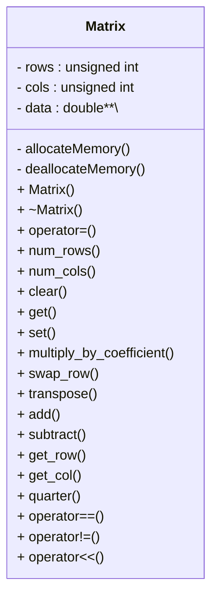

<!--more-->

## Assignment Requirements


In this assignment you will build a custom class named Matrix, which will mimic traditional matrices (the plural of matrix). You will not be expected to have intimate knowledge of matrices, but if you are curious you can read more about them online: [Matrix (mathematics)](https://en.wikipedia.org/wiki/Matrix_(mathematics)).

Matrices are used in many different applications, and over the years many optimizations, tricks, and numerical methods have been developed to quickly handle matrix operations and solve more complicated problems.

Building this data structure will give you practice with pointers, dynamic array allocation and deallocation, 2D pointers, and class design. The implementation of this data structure will involve writing one new class. You are not allowed to use any of the STL container classes in your implementation or use any additional classes or structs besides Matrix. You will need to make use of the new and delete keywords. You can use array indexing `[]`. Please read the entire handout before beginning your implementation.

## The Data Structure

A matrix is a two-dimensional arrangement of numbers. In this assignment we will assume every matrix contains doubles. We refer to the size of a matrix with m rows and n columns as an m×n matrix. For example, shown below is a 4×3 matrix:

$$
\begin{bmatrix}
-6 & 10 & 1 \\
3 & -8 & 22 \\
-17 & 4 & 7 \\
2 & 5 & 0
\end{bmatrix}
$$

We will represent the data inside our Matrix class by using a two-dimensional array. Because a matrix may be any size, you will need to use dynamic memory for this task. The same matrix shown above can be represented like so:



We will denote $a_{i,j}$ as the value in matrix $A$ that is in row $i$ and column $j$. So a general matrix can be described as:

$$
A = \begin{bmatrix}
a_{0,0} & a_{0,1} & \cdots & a_{0,n-2} & a_{0,n-1} \\
a_{1,0} & a_{1,1} & \cdots & a_{1,n-2} & a_{1,n-1} \\
\vdots  & \vdots  & \ddots & \vdots    & \vdots    \\
a_{m-2,0} & a_{m-2,1} & \cdots & a_{m-2,n-2} & a_{m-2,n-1} \\
a_{m-1,0} & a_{m-1,1} & \cdots & a_{m-1,n-2} & a_{m-1,n-1}
\end{bmatrix}
$$

## Basic Functionality

The private section of your class will be fairly small, and the main challenge will be working with the dynamic memory as you implement features to make the class functional. You can implement these methods in any order; we start by mentioning a few that will make debugging easier.

The first thing we suggest is writing a constructor that takes two `unsigned ints`: a rows count and a columns count, and a double fill value. The constructor should create a data representation of a rows×columns matrix with every value initialized to fill. If either dimension is 0, the resulting matrix should be of size 0×0.

Your class must support the equality operator `==` and the inequality operator `!=`. Two matrices are considered to be equal if they have the same value in every position. In other words, matrices A and B are equal if and only if

$$(\forall_{i, j}|i \in \\{0,1,\ldots,m-2,m-1\\}, j \in \\{0,1,\ldots,n-2,n-1\\})a_{i,j} = b_{i,j}$$

$\forall$ is a common shorthand for “for all,” so $\forall_{i, j}$ means “for every value of i and j.” $\in$ is a common shorthand for “in”.

Since a matrix has two dimensions, you will need to implement `num_rows()` and `num_cols()` which return the number of rows and the number of columns in the matrix respectively. We may want to change a previously filled matrix to an empty one, so you must write a `clear()` method as well. This method should reset the number of rows and columns to 0, and deallocate any memory currently held by the Matrix.

Naturally we want to be able to access data stored in the Matrix class. To do so we will implement a “safe” accessor called `get()`, which takes in a `row, a column`, and a `double`. If the row and column are within the bounds of the matrix, then the value at `arow,col` should be stored in the `double`, and the function should return `true`. Otherwise the function should return `false`.

A complementary, but similar task to accessing data is to be able to set a value at a particular position in the matrix. This is done through a safe modifier called `set()`. This function also takes in a `row, column`, and a `double` value. `set()` returns `false` if the position is out of bounds, and true if the position is valid. If the position is valid, the function should also set `arow,col` to the value of the double that was passed in.

## Overloaded Output Operator

At some point, it is probably a good idea to write a method to do output for us. Unlike previous classes where we wrote a method to do the printing, we will instead rely on a non-member overload of the `operator<<`. We have practiced overloading other operators for calls to `std::sort()` before, and this will be similar. Outside of the Matrix class definition, but still in your .cpp and .h files, you should write the following `operator:`

```cpp
std::ostream& operator<< (std::ostream& out, const Matrix& m)
```

This will allow us to print one or more outputs sequentially. All of the following code should work if your `operator<<` is implemented correctly:

```cpp
Matrix m1;
Matrix m2;
std::ofstream outfile(output_filename); //Assuming we already had the filename
std::cout << m1 << m2 << std::endl;
outfile << m1;
outfile << m2 << std::endl;
std::cout << "Done printing." << std::endl;
```

Let us assume in the above example that:

$$
m1 = \begin{bmatrix} \quad \end{bmatrix}, \quad
m2 = \begin{bmatrix}
3 & 5.21 \\
-2 & 4 \\
-18 & 1
\end{bmatrix}
$$

Then the output should look something like this:

```console
0 x 0 matrix:
[ ]
3 x 2 matrix:
[ 3 5.21
-2 4
-18 1 ]
Done printing.
```

We will ignore whitespace, but we do expect that your operator outputs the elements of the matrix in the right order, that the size output comes before the matrix and follows the format shown below - one row per line, and spacing between elements. Note that even in these examples, the alignment is not ideal. We would rather you focus on the task of implementing the Matrix class correctly and handling memory properly instead of focusing on making the output pretty.

### Simple Matrix Operations

To start with, we introduce some basic matrix operations. The first is the method `multiply_by_coefficient()`, which takes a double called a coefficient. The method should multiply every element in the matrix by the coefficient. For example:

$$
m1 = \begin{bmatrix} 1 & 2 \\ 3 & 4 \end{bmatrix}, \quad
m1 \text{.multiply\_by\_coefficient(5)} \Longrightarrow \begin{bmatrix}
5 & 10 \\
15 & 20
\end{bmatrix}
$$

Another common operation is to swap two rows of a matrix. This will be accomplished by the method `swap_row()`, which takes two arguments of type `unsigned int`: a source row number and a target row number. If both rows are inside the bounds of the matrix, then the function should switch the values in the two rows and return `true`. Otherwise the function should return `false`. For example:

$$
m1 = \begin{bmatrix}
1 & 2 & 3 \\
4 & 5 & 6 \\
7 & 8 & 9
\end{bmatrix}, \quad
m1\text{.swap\_row(1,2)} \Longrightarrow \begin{bmatrix}
1 & 2 & 3 \\
7 & 8 & 9 \\
4 & 5 & 6
\end{bmatrix}
$$

> [!NOTE]
> With the basic functions and `swap_row()` done, the tests related to the provided `rref()` function in `matrix_main.cpp` can be called. We do not explain the function in detail here, and you don’t need to know how it works, but computing the Reduced Row Echelon Form (RREF) can be used to find an inverse matrix, which is important in many fields. We use a simple to implement method called Gauss-Jordan Elimination, which you can read about here: [Gaussian elimination](https://en.wikipedia.org/wiki/Gaussian_elimination). There are other techniques for finding the RREF that are better, but we chose this one for its simplicity.

It is common to need to “flip” a matrix, a process called transposition. You will need to write the `transpose()` method, which has a return type of void. Formally, transposition of $m \times n$ matrix $A$ into $n \times m$ matrix $A^T$ is defined as:

$$(\forall_{i, j}|i \in \\{0,1,\ldots,m-2,m-1\\}, j \in \\{0,1,\ldots,n-2,n-1\\})a_{i,j}^{T} = a_{j,i}$$

$$
m1 = \begin{bmatrix}
1 & 2 & 3 \\
4 & 5 & 6
\end{bmatrix}, \quad
m1\text{.transpose\_row(1,2)} \Longrightarrow \begin{bmatrix}
1 & 4 \\
2 & 5 \\
3 & 6
\end{bmatrix}
$$

## Binary Matrix Operations

Binary matrix operations are ones that involve two matrices. To keep things simple, we will write them as methods (not operators) that are inside the class definition, so the current Matrix object will always be the “left-hand” matrix $A$. You will be required to implement both `add()` and `subtract()`. Both functions take in just one argument, a second Matrix which we will refer to as $B$, and modify $A$ if the dimensions of $A$ and $B$ match. If the dimensions match, the functions should return `true`, otherwise they should return `false`. Addition of two matrices, $C = A + B$, and subtraction of two matrices, $D = A − B$ are formally defined as:

$$
(\forall_{i, j}|i \in \\{0,1,\ldots,m-2,m-1\\}, j \in \\ {0,1,\ldots,n-2,n-1\\})C_{i,j} = a_{i,j} + b_{i,j}
$$
$$
(\forall_{i, j}|i \in \\{0,1,\ldots,m-2,m-1\\}, j \in \\{0,1,\ldots,n-2,n-1\\})D_{i,j} = a_{i,j} - b_{i,j}
$$

Consider these two matrices:

$$
m1 = \begin{bmatrix}
1 & 2 & 3 \\
4 & 5 & 6
\end{bmatrix}, \quad
m2 = \begin{bmatrix}
4 & 16 & 25 \\
14 & 3.4 & 3.64159
\end{bmatrix}
$$

$$
m1 + m2 = \begin{bmatrix}
1 + 4 & 2 + 16 & 3 + 25 \\
4 + 14 & 5 + 3.4 & 6 + 3.64159
\end{bmatrix}
= \begin{bmatrix}
5 & 18 & 28 \\
18 & 8.4 & 9.64159
\end{bmatrix}
$$

$$
m1 - m2 = \begin{bmatrix}
1 - 4 & 2 - 16 & 3 - 25 \\
4 - 14 & 5 - 3.4 & 6 - 3.64159
\end{bmatrix}
= \begin{bmatrix}
-3 & -14 & -22 \\
-10 & 1.6 & 2.35841
\end{bmatrix}
$$

## Harder Matrix Operations

If we want to get the contents of an entire row or column, it’s annoying to have to extract the values one by one using `get()`, especially since our implementation is a “safe” accessor so we can’t use some of the coding shortcuts we normally use. To fix this, you will implement two more accessors, `get_row()` and `get_col()`. Both functions take one unsigned int and return a `double*`. For `get_row()` the argument is the number of row to retrieve, while for `get_col()` the argument is the number of the column to retrieve. If the requested row/column is outside of the matrix bounds, the method should return a pointer set to `NULL`.

The final method we expect you to implement, `quarter()`, is not a traditional matrix operation. The method takes no arguments and returns a `Matrix*` containing four new Matrix elements in order: an Upper Left (UL) quadrant, an Upper Right (UR) quadrant, a Lower Left (LL) quadrant, and finally a Lower Right (LR) quadrant. All four quadrants should be the same size. Remember that when a function ends all local variables go out of scope and are destroyed, so you will need to be particularly careful about how you construct and return the quadrants. On the next page are two examples of the quarter operation:

$$
m1 = \begin{bmatrix}
1 & 2 & 3 & 4 \\
5 & 6 & 7 & 8
\end{bmatrix}, \quad
m2 = \begin{bmatrix}
1 & 2 & 3 & 4 \\
5 & 6 & 7 & 8 \\
9 & 10 & 11 & 12
\end{bmatrix}
$$

$$
m1^{(\mathrm{UL})} = \begin{bmatrix} 1 & 2 \end{bmatrix}, \quad
m1^{(\mathrm{UR})} = \begin{bmatrix} 3 & 4 \end{bmatrix}, \quad
m1^{(\mathrm{LL})} = \begin{bmatrix} 5 & 6 \end{bmatrix}, \quad
m1^{(\mathrm{LR})} = \begin{bmatrix} 7 & 8 \end{bmatrix}
$$

$$
m2^{(\mathrm{UL})} = \begin{bmatrix}
1 & 2 \\
5 & 6
\end{bmatrix}, \quad
m2^{(\mathrm{UR})} = \begin{bmatrix}
3 & 4 \\
7 & 8
\end{bmatrix}, \quad
m2^{(\mathrm{LL})} = \begin{bmatrix}
5 & 6 \\
9 & 10
\end{bmatrix}, \quad
m2^{(\mathrm{LR})} = \begin{bmatrix}
7 & 8 \\
11 & 12
\end{bmatrix}
$$

## Testing and Debugging

We provide a [matrix_main.cpp](matrix_main.cpp) file with a wide variety of tests of the Matrix class. Some of these tests are initially commented out. We recommend that you get your class working on the basic tests, and then uncomment the additional tests as you implement and debug the remaining functionality. Study the provided test cases to understand the arguments and return values.

Note: Do not edit the provided [matrix_main.cpp](matrix_main.cpp) file, except to uncomment the provided test cases as you work through your implementation and to add your own test cases where specified.

The `assert()` function is used throughout the test code. This is a function available in both C and C++ that will do nothing if the condition is true, and will cause an immediate crash if the condition is false. If the condition is false, your command line should show the assertion that failed immediate prior to the crash.

We recommend using a memory debugging tool to find memory errors and memory leaks. Information on installation and use of the memory debuggers “Dr. Memory” (available for Linux/MacOSX/Windows) and “Valgrind” (available for Linux/OSX) is presented on the course webpage: http://www.cs.rpi.edu/academics/courses/fall23/csci1200/memory_debugging.php

The homework submission server will also run your code with Dr. Memory to search for memory problems. Your program must be memory error free and memory leak free to receive full credit.

## Your Task & Provided Code

You must implement the Matrix class as described in this handout. Your class should be split between a .cpp and a .h file. You should also include some extra tests in the StudentTest() function in [matrix_main.cpp](matrix_main.cpp). When implementing the class, pay particular attention to correctly implementing the copy constructor, assignment operator, and destructor.

As you implement your classes, be careful with return types, the const keyword, and passing by reference. If you have correctly implemented the Matrix class, then running the provided [matrix_main.cpp](matrix_main.cpp) file with your class, should produce the output provided in [sample_output.txt](sample_output.txt). We are not going to be particularly picky about differences in whitespace, but you should be making an effort to try and match both spacing and newlines between our output and your output.

## Submission

You will need to submit your [matrix_main.cpp](matrix_main.cpp), Matrix.cpp, Matrix.h, and README.txt file. Be aware that Submitty will be using an instructor copy of [matrix_main.cpp](matrix_main.cpp) for most of the tests, so you must make sure your Matrix implementation can compile given the provided file. Also make sure to name your class implementation files with a capital letter since Linux is case sensitive.

Be sure to write your own new test cases and don’t forget to comment your code! Use the provided template [README.txt](README.txt) file for notes you want the grader to read. Fill out the order notation section as well in the [README.txt](README.txt) file. You must do this assignment on your own, as described in the “Collaboration Policy & Academic Integrity” handout. If you did discuss this assignment, problem solving techniques, or error messages, etc. with anyone, please list their names in your README.txt file.

**Due Date**: 02/06/2025, Thursday, 10pm.

## Rubric

20 pts

- README.txt Completed (3 pts)
  - One of name, collaborators, or hours not filled in. (-1)
  - Two or more of name, collaborators, or hours not filled in. (-2)
  - No reflection. (-1)
- OVERALL CLASS DECLARATION & IMPLEMENTATION AND CODING STYLE (Good class design, split into a .h and .cpp file.  Functions > 1 line are in .cpp file.  Organized class implementation and reasonable comments throughout. Correct use of const/const& and of class method const. ) (5 pts)
  - No credit (significantly incomplete implementation) (-5)
  - No documentation for Matrix itself is provided (function documentation and section headings don't count). (-1)
  - Function bodies containing more than one statement are placed in the .h file. (okay for templated classes) (-2)
  - Functions are not well documented or are poorly commented, in either the .h or the .cpp file. (-1)
  - Improper uses or omissions of const and reference. (-1)
  - Overly cramped, excessive whitespace, or poor indentation. (-1)
  - Poor choice of variable names: non-descriptive names (e.g. 'vec', 'str', 'var'), single-letter variable names (except single loop counter), etc. (-2)
- DATA REPRESENTATION (4 pts)
  - No credit (significantly incomplete implementation). (-4)
  - Uses STL data structures (lists, vectors, etc).  (-4)
  - Member variables are public. (-2)
- ORDER NOTATION (Readme contains correct analysis of order notation, including proper notation and use of provided variables.) (5 pts)
- ADDITIONAL TEST CASES (A wide variety of additional student-written test cases.) (4 pts)
  - Does not test `transpose()`.  (-1)
  - Does not test `multiply_by_coefficient()`. (-1)
  - Does not test `get_col()`.  (-1)
  - Does not test corner cases of some kind (rows or cols = 0, quartering with odd dimensions, etc). (-1)
  - No test cases, or else trivial/minimal ones that only test things covered in SimpleTests. (-4)


## Supporting Files



## Program Design

First, we need to figure out the design for the Matrix class. Based on the given information, I made a diagram.



## Pitfalls

1. The matrix is not always odd number in size. So, when we handle some case near the edges. We need extra effort.
2. We need write some test cases by ourself. And they will be test by hidden auto grader

## Solution

### Matrix.h

```cpp
#ifndef MATRIX_H
#define MATRIX_H

#include <iostream>

class Matrix {
public:
    // Constructors & Destructor
    Matrix();  // Default constructor (creates an empty 0 x 0 matrix)
    Matrix(unsigned int rows, unsigned int cols, double fill);
    Matrix(const Matrix &other);
    ~Matrix();

    Matrix& operator=(const Matrix &other);

    // Accessors for dimensions
    unsigned int num_rows() const;
    unsigned int num_cols() const;

    // Clears the matrix (deallocates any memory and sets size to 0 x 0)
    void clear();

    // Safe accessor and modifier methods
    bool get(unsigned int row, unsigned int col, double &value) const;
    bool set(unsigned int row, unsigned int col, double value);

    // Simple matrix operations
    void multiply_by_coefficient(double coefficient);
    bool swap_row(unsigned int row1, unsigned int row2);
    void transpose();

    // Binary matrix operations (modifies this matrix)
    bool add(const Matrix &other);
    bool subtract(const Matrix &other);

    // Advanced accessors: returns a dynamic array with the requested row or column.
    // The caller is responsible for deleting the returned array.
    double* get_row(unsigned int row) const;
    double* get_col(unsigned int col) const;

    // Quarter the matrix into four equally sized quadrants.
    // The four matrices are returned in a dynamically allocated array in the order:
    // UL, UR, LL, LR.
    // If the matrix is too small (i.e. less than 2 rows or 2 cols), returns four empty matrices.
    Matrix* quarter() const;

    // Equality operators
    bool operator==(const Matrix &other) const;
    bool operator!=(const Matrix &other) const;

    // Friend overloaded output operator for printing the matrix.
    friend std::ostream& operator<<(std::ostream &out, const Matrix &m);

private:
    unsigned int rows;
    unsigned int cols;
    double** data;

    // Helper functions to allocate and deallocate the 2D array.
    void allocate(unsigned int r, unsigned int c, double fill);
    void deallocate();
};

#endif
```

### Matrix.cpp

```cpp
#include "Matrix.h"
#include <iostream>

//-------------------------
// Private Helper Functions
//-------------------------

// Allocates memory for an r x c matrix and fills every element with 'fill'
void Matrix::allocate(unsigned int r, unsigned int c, double fill) {
    rows = r;
    cols = c;
    data = new double*[rows];
    for (unsigned int i = 0; i < rows; i++) {
        data[i] = new double[cols];
        for (unsigned int j = 0; j < cols; j++) {
            data[i][j] = fill;
        }
    }
}

// Deallocates the memory used by the matrix
void Matrix::deallocate() {
    if (data) {
        for (unsigned int i = 0; i < rows; i++) {
            delete [] data[i];
        }
        delete [] data;
    }
    data = nullptr;
    rows = 0;
    cols = 0;
}

//-------------------------
// Constructors & Destructor
//-------------------------

// Default constructor: creates an empty matrix (0 x 0)
Matrix::Matrix() : rows(0), cols(0), data(nullptr) {}

// Parameterized constructor: creates an r x c matrix filled with 'fill'
// If either dimension is 0, an empty matrix is created.
Matrix::Matrix(unsigned int r, unsigned int c, double fill) : rows(0), cols(0), data(nullptr) {
    if (r == 0 || c == 0) {
        // Create an empty matrix.
        rows = 0;
        cols = 0;
        data = nullptr;
    } else {
        allocate(r, c, fill);
    }
}

// Copy constructor
Matrix::Matrix(const Matrix &other) : rows(0), cols(0), data(nullptr) {
    if (other.rows == 0 || other.cols == 0) {
        rows = 0;
        cols = 0;
        data = nullptr;
    } else {
        allocate(other.rows, other.cols, 0.0);
        for (unsigned int i = 0; i < rows; i++) {
            for (unsigned int j = 0; j < cols; j++) {
                data[i][j] = other.data[i][j];
            }
        }
    }
}

// Destructor
Matrix::~Matrix() {
    deallocate();
}

// Assignment operator
Matrix& Matrix::operator=(const Matrix &other) {
    if (this == &other)
        return *this;

    deallocate();

    if (other.rows == 0 || other.cols == 0) {
        rows = 0;
        cols = 0;
        data = nullptr;
    } else {
        allocate(other.rows, other.cols, 0.0);
        for (unsigned int i = 0; i < rows; i++) {
            for (unsigned int j = 0; j < cols; j++) {
                data[i][j] = other.data[i][j];
            }
        }
    }
    return *this;
}

//-------------------------
// Dimension Accessors & Clear
//-------------------------

unsigned int Matrix::num_rows() const {
    return rows;
}

unsigned int Matrix::num_cols() const {
    return cols;
}

void Matrix::clear() {
    deallocate();
}

//-------------------------
// Safe Accessors & Modifiers
//-------------------------

// get(): If (row,col) is within bounds, set value and return true; otherwise, return false.
bool Matrix::get(unsigned int row, unsigned int col, double &value) const {
    if (row >= rows || col >= cols)
        return false;
    value = data[row][col];
    return true;
}

// set(): If (row,col) is valid, assign value and return true; else return false.
bool Matrix::set(unsigned int row, unsigned int col, double value) {
    if (row >= rows || col >= cols)
        return false;
    data[row][col] = value;
    return true;
}

//-------------------------
// Simple Matrix Operations
//-------------------------

// Multiplies every element in the matrix by the given coefficient.
void Matrix::multiply_by_coefficient(double coefficient) {
    for (unsigned int i = 0; i < rows; i++) {
        for (unsigned int j = 0; j < cols; j++) {
            data[i][j] *= coefficient;
        }
    }
}

// Swaps the entire contents of row1 and row2 if both indices are valid.
bool Matrix::swap_row(unsigned int row1, unsigned int row2) {
    if (row1 >= rows || row2 >= rows)
        return false;
    double* temp = data[row1];
    data[row1] = data[row2];
    data[row2] = temp;
    return true;
}

// Transposes the matrix in place.
// For non-square matrices, a new 2D array is allocated, the contents are transposed,
// and the old memory is deallocated.
void Matrix::transpose() {
    if (rows == 0 || cols == 0)
        return;

    // Allocate new array with swapped dimensions.
    double** newData = new double*[cols];
    for (unsigned int i = 0; i < cols; i++) {
        newData[i] = new double[rows];
    }
    // Transpose: newData[j][i] becomes data[i][j]
    for (unsigned int i = 0; i < rows; i++) {
        for (unsigned int j = 0; j < cols; j++) {
            newData[j][i] = data[i][j];
        }
    }
    // Free old data.
    for (unsigned int i = 0; i < rows; i++) {
        delete [] data[i];
    }
    delete [] data;

    // Swap dimensions.
    unsigned int temp = rows;
    rows = cols;
    cols = temp;
    data = newData;
}

//-------------------------
// Binary Matrix Operations
//-------------------------

// Adds the corresponding elements of other to this matrix.
// Returns true if dimensions match, else returns false.
bool Matrix::add(const Matrix &other) {
    if (rows != other.rows || cols != other.cols)
        return false;
    for (unsigned int i = 0; i < rows; i++) {
        for (unsigned int j = 0; j < cols; j++) {
            data[i][j] += other.data[i][j];
        }
    }
    return true;
}

// Subtracts the corresponding elements of other from this matrix.
// Returns true if dimensions match, else returns false.
bool Matrix::subtract(const Matrix &other) {
    if (rows != other.rows || cols != other.cols)
        return false;
    for (unsigned int i = 0; i < rows; i++) {
        for (unsigned int j = 0; j < cols; j++) {
            data[i][j] -= other.data[i][j];
        }
    }
    return true;
}

//-------------------------
// Advanced Accessors
//-------------------------

// Returns a new dynamically allocated array containing the requested row.
// Returns nullptr if the row index is out of bounds.
double* Matrix::get_row(unsigned int row) const {
    if (row >= rows)
        return nullptr;
    double* rowArray = new double[cols];
    for (unsigned int j = 0; j < cols; j++) {
        rowArray[j] = data[row][j];
    }
    return rowArray;
}

// Returns a new dynamically allocated array containing the requested column.
// Returns nullptr if the column index is out of bounds.
double* Matrix::get_col(unsigned int col) const {
    if (col >= cols)
        return nullptr;
    double* colArray = new double[rows];
    for (unsigned int i = 0; i < rows; i++) {
        colArray[i] = data[i][col];
    }
    return colArray;
}

//-------------------------
// Quarter Operation
//-------------------------

// Splits the matrix into four quadrants (UL, UR, LL, LR) and returns them in a new array.
// All four quadrants will have the same dimensions.
// If the matrix has fewer than 2 rows or 2 columns, returns four empty matrices.
Matrix* Matrix::quarter() const {
    Matrix* quadrants = new Matrix[4];
    if (rows < 2 || cols < 2) {
        // Return four empty matrices.
        return quadrants;
    }

    // Determine quadrant dimensions.
    // Using (dim + 1) / 2 ensures that if the dimension is odd the shared middle row/col is included.
    unsigned int quad_rows = (rows + 1) / 2;
    unsigned int quad_cols = (cols + 1) / 2;

    quadrants[0] = Matrix(quad_rows, quad_cols, 0.0); // Upper Left (UL)
    quadrants[1] = Matrix(quad_rows, quad_cols, 0.0); // Upper Right (UR)
    quadrants[2] = Matrix(quad_rows, quad_cols, 0.0); // Lower Left (LL)
    quadrants[3] = Matrix(quad_rows, quad_cols, 0.0); // Lower Right (LR)

    // Fill UL quadrant: rows 0 .. quad_rows-1, cols 0 .. quad_cols-1.
    for (unsigned int i = 0; i < quad_rows; i++) {
        for (unsigned int j = 0; j < quad_cols; j++) {
            quadrants[0].set(i, j, data[i][j]);
        }
    }

    // Fill UR quadrant: rows 0 .. quad_rows-1, cols (cols - quad_cols) .. (cols - 1).
    for (unsigned int i = 0; i < quad_rows; i++) {
        for (unsigned int j = 0; j < quad_cols; j++) {
            quadrants[1].set(i, j, data[i][(cols - quad_cols) + j]);
        }
    }

    // Fill LL quadrant: rows (rows - quad_rows) .. (rows - 1), cols 0 .. quad_cols-1.
    for (unsigned int i = 0; i < quad_rows; i++) {
        for (unsigned int j = 0; j < quad_cols; j++) {
            quadrants[2].set(i, j, data[(rows - quad_rows) + i][j]);
        }
    }

    // Fill LR quadrant: rows (rows - quad_rows) .. (rows - 1), cols (cols - quad_cols) .. (cols - 1).
    for (unsigned int i = 0; i < quad_rows; i++) {
        for (unsigned int j = 0; j < quad_cols; j++) {
            quadrants[3].set(i, j, data[(rows - quad_rows) + i][(cols - quad_cols) + j]);
        }
    }

    return quadrants;
}

//-------------------------
// Equality Operators
//-------------------------

bool Matrix::operator==(const Matrix &other) const {
    if (rows != other.rows || cols != other.cols)
        return false;
    for (unsigned int i = 0; i < rows; i++) {
        for (unsigned int j = 0; j < cols; j++) {
            if (data[i][j] != other.data[i][j])
                return false;
        }
    }
    return true;
}

bool Matrix::operator!=(const Matrix &other) const {
    return !(*this == other);
}

//-------------------------
// Overloaded Output Operator
//-------------------------

std::ostream& operator<<(std::ostream &out, const Matrix &m) {
    out << m.rows << " x " << m.cols << " matrix:" << std::endl;
    out << "[";
    if (m.rows > 0 && m.cols > 0) {
        for (unsigned int i = 0; i < m.rows; i++) {
            out << " ";
            for (unsigned int j = 0; j < m.cols; j++) {
                out << m.data[i][j];
                if (j < m.cols - 1)
                    out << " ";
            }
            if (i < m.rows - 1)
                out << std::endl;
        }
        out << " ]";
    } else {
        out << " ]";
    }
    return out;
}
```

### matrix_main.cpp (with more test cases)

```cpp
// =======================================================
//
// IMPORTANT NOTE: Do not modify this file
//     (except to uncomment the provided test cases 
//     and add your test cases where specified)
//
// =======================================================


#include <iostream>
#include <fstream>
#include <cmath>
#include <cassert>
#include "Matrix.h"

#define __EPSILON 0.0000000001 //Need this to compare doubles because representation.

void SimpleTest(); //Some basic tests
void StudentTest(); //Write your own test cases here

//Function to test a ton of matrices at once.
void BatchTest(double start, double step, unsigned int rows, unsigned int cols,
               unsigned int num);

//Quick function that returns if two doubles are very similar to each other.
bool double_compare(double a, double b);

//Uses Gauss-Jordan elimination to create a Reduced Row Echelon Form matrix.
Matrix rref(const Matrix& m);

int main(){
  SimpleTest();
  std::cout << "Completed all simple tests." << std::endl;

  //Uncomment this to allocate a lot of 100x100 matrices so leaks will be bigger.
  BatchTest(100,0.1,100,100,50);
  std::cout << "Completed all batch tests." << std::endl;

  StudentTest();
  std::cout << "Completed all student tests." << std::endl;

  return 0;
}

////////////////Test functions//////////////////////
//Some basic tests
void SimpleTest(){  //well behaved getrow/read after
  //Default constructor
  Matrix m1;
  assert(m1.num_rows() == 0 && m1.num_cols() == 0);

  //Copy constructor
  Matrix m2(3,4,0);
  assert(m2.num_rows() == 3 && m2.num_cols() == 4);

  Matrix m2_copy(m2);
  assert(m2_copy.num_rows() == 3 && m2_copy.num_cols() == 4);
  m2_copy.set(1,1,27);
  double d0;
  assert(m2.get(1,1,d0));
  assert(double_compare(d0,0.0));
  assert(m2_copy.get(1,1,d0));
  assert(double_compare(d0,27));

  //Equality and Inequality
  Matrix m3;
  assert(m1 == m3);
  assert(m1 != m2);

  //Printing
  std::cout << "Empty matrix:";
  std::cout << m1 << std::endl;

  std::cout << "Zeroed 3x4 matrix:";
  std::cout << m2 << std::endl;

  std::cout << "One after the other:";
  std::cout << m1 << m2 << std::endl;

  //Set & get
  Matrix m5(4,4,2);
  Matrix m6(4,4,12);
  assert(m6.set(2,1,7));
  assert(m6.set(3,3,11));
  double d1;
  assert(m6.get(2,1,d1));
  assert(d1==7);

  //Addition
  std::cout << "Adding m5 and m6" << std::endl;
  std::cout << m5 << m6 << std::endl;

  Matrix m7;
  m7 = m5;
  Matrix m8(m5);
  assert(m7 == m8);

  assert(m7.add(m6));
  std::cout << "The result" << std::endl;
  std::cout << m7 << std::endl;

  double* r1 = NULL;
  r1 = m7.get_row(2);
  assert(r1[0] == 14 && r1[1] == 9);

  delete [] r1; //Remember we need to clean up dynamic allocations.

  Matrix m9(3,6,0);
  m9.set(0,0,1);
  m9.set(0,1,2);
  m9.set(0,2,1);
  m9.set(0,3,1);
  m9.set(1,0,2);
  m9.set(1,1,3);
  m9.set(1,2,-1);
  m9.set(1,4,1);
  m9.set(2,0,3);
  m9.set(2,1,-2);
  m9.set(2,2,-1);
  m9.set(2,5,1);

  std::cout << "Attempting Gauss-Jordan reduced row echelon form." 
      << m9 << std::endl;
  Matrix m12 = rref(m9);
  std::cout << m12 << std::endl;
  double comparison_value;
  assert(m12.get(0,3,comparison_value));
  assert(double_compare(comparison_value,0.25));
  assert(m12.get(0,1,comparison_value));
  assert(double_compare(comparison_value,0.0));
  assert(m12.get(1,5,comparison_value));
  assert(double_compare(comparison_value,-3.00/20));
  assert(m9.get(0,3,comparison_value));
  assert(double_compare(comparison_value,1.0));
  assert(m9.get(0,1,comparison_value));
  assert(double_compare(comparison_value,2.0));
  assert(m9.get(1,5,comparison_value));
  assert(double_compare(comparison_value,0.0));

  Matrix m11(3,4,0);
  m11.set(0,0,1);
  m11.set(0,1,2);
  m11.set(0,2,3);
  m11.set(0,3,4);

  m11.set(1,0,5);
  m11.set(1,1,6);
  m11.set(1,2,7);
  m11.set(1,3,8);

  m11.set(2,0,9);
  m11.set(2,1,10);
  m11.set(2,2,11);
  m11.set(2,3,12);

  std::cout << "M11 to be quartered: " << std::endl;
  std::cout << m11 << std::endl;

  Matrix* ma1 = NULL;
  ma1 = m11.quarter();
  assert(ma1 != NULL);

  std::cout << "UL: " << std::endl << ma1[0] << std::endl;
  std::cout << "UR: " << std::endl << ma1[1] << std::endl;
  std::cout << "LL: " << std::endl << ma1[2] << std::endl;
  std::cout << "LR: " << std::endl << ma1[3] << std::endl;

  for(unsigned int i=0; i<4; i++){
    assert((ma1[i].num_rows() == 2) && (ma1[i].num_cols() == 2));
  }

  //Upper Left
  assert(ma1[0].get(0,0,comparison_value));
  assert(double_compare(comparison_value,1));
  assert(ma1[0].get(1,1,comparison_value));
  assert(double_compare(comparison_value,6));

  //Upper Right
  assert(ma1[1].get(0,0,comparison_value));
  assert(double_compare(comparison_value,3));
  assert(ma1[1].get(1,1,comparison_value));
  assert(double_compare(comparison_value,8));

  //Lower Left
  assert(ma1[2].get(0,0,comparison_value));
  assert(double_compare(comparison_value,5));
  assert(ma1[2].get(1,1,comparison_value));
  assert(double_compare(comparison_value,10));

  //Lower Right
  assert(ma1[3].get(0,0,comparison_value));
  assert(double_compare(comparison_value,7));
  assert(ma1[3].get(1,1,comparison_value));
  assert(double_compare(comparison_value,12));

  delete [] ma1;
}

//Write your own test cases here
void StudentTest() {
    double val;
    
    // Test 1: Transpose a non-square matrix.
    Matrix m(2, 3, 1.0);
    m.set(0, 0, 1.0); m.set(0, 1, 2.0); m.set(0, 2, 3.0);
    m.set(1, 0, 4.0); m.set(1, 1, 5.0); m.set(1, 2, 6.0);
    m.transpose();  // Now m should be 3 x 2.
    assert(m.num_rows() == 3 && m.num_cols() == 2);
    m.get(0, 0, val); assert(val == 1.0);
    m.get(0, 1, val); assert(val == 4.0);
    m.get(1, 0, val); assert(val == 2.0);
    m.get(1, 1, val); assert(val == 5.0);
    m.get(2, 0, val); assert(val == 3.0);
    m.get(2, 1, val); assert(val == 6.0);

    // Test 2: Multiply matrix by a coefficient.
    Matrix m2(2, 2, 2.0);
    m2.multiply_by_coefficient(3.0);
    m2.get(0, 0, val); assert(val == 6.0);
    m2.get(1, 1, val); assert(val == 6.0);

    // Test 3: get_col() functionality.
    Matrix m3(3, 3, 0.0);
    int counter = 1;
    for (unsigned int i = 0; i < 3; i++) {
        for (unsigned int j = 0; j < 3; j++) {
            m3.set(i, j, counter++);
        }
    }
    double* col1 = m3.get_col(1);
    // Expecting column 1 to be: 2, 5, 8.
    assert(col1[0] == 2);
    assert(col1[1] == 5);
    assert(col1[2] == 8);
    delete [] col1;

    // Test 4: swap_row().
    Matrix m4(2, 3, 0.0);
    m4.set(0, 0, 1); m4.set(0, 1, 2); m4.set(0, 2, 3);
    m4.set(1, 0, 4); m4.set(1, 1, 5); m4.set(1, 2, 6);
    m4.swap_row(0, 1);
    m4.get(0, 0, val); assert(val == 4);
    m4.get(1, 0, val); assert(val == 1);

    // Test 5: subtract().
    Matrix m5(2, 2, 10.0);
    Matrix m6(2, 2, 3.0);
    bool success = m5.subtract(m6);
    assert(success);
    m5.get(0, 0, val); assert(val == 7.0);

    // Test 6: quarter() on an even-dimensioned matrix.
    Matrix m7(4, 4, 0.0);
    counter = 1;
    for (unsigned int i = 0; i < 4; i++) {
        for (unsigned int j = 0; j < 4; j++) {
            m7.set(i, j, counter++);
        }
    }
    Matrix* quads = m7.quarter();
    // For a 4 x 4 matrix, quadrant size should be (4+1)/2 = 2 (integer division)
    assert(quads[0].num_rows() == 2 && quads[0].num_cols() == 2);
    // Upper Left quadrant should be:
    // [ 1 2 ]
    // [ 5 6 ]
    quads[0].get(0, 0, val); assert(val == 1);
    quads[0].get(0, 1, val); assert(val == 2);
    quads[0].get(1, 0, val); assert(val == 5);
    quads[0].get(1, 1, val); assert(val == 6);
    delete [] quads;

    // Test 7: clear() method.
    Matrix m8(3, 3, 9.0);
    m8.clear();
    assert(m8.num_rows() == 0 && m8.num_cols() == 0);

    // Test 8: Self-assignment.
    Matrix m9(2, 2, 7.0);
    m9 = m9;
    m9.get(0, 0, val); assert(val == 7.0);

    // Test 9: Binary add() with mismatched dimensions.
    Matrix m10(2, 3, 1.0);
    Matrix m11(3, 2, 1.0);
    bool res = m10.add(m11);
    assert(res == false);

    // Test 10: Binary subtract() with mismatched dimensions.
    res = m10.subtract(m11);
    assert(res == false);
}


////////////////Utility functions//////////////////////

/*  Function that quickly populates a rows x cols matrix with values from     
 *  start in increments of step. Does this num_times times.
 */
void BatchTest(double start, double step, unsigned int rows, unsigned int cols,
               unsigned int num){
  Matrix* m_arr = new Matrix[num];
  for(unsigned int i=0; i<num; i++){
    m_arr[i] = Matrix(rows,cols,0.0);
    unsigned int curr_elem = 0;
    for(unsigned int j=0; j<rows; j++){
      for(unsigned int k=0; k<rows; k++){
        m_arr[i].set(j,k,start+(step*curr_elem));
        curr_elem++;
      }
    }
  }
  delete [] m_arr;
}

//Quick function that returns if two doubles are very similar to each other.
bool double_compare(double a, double b){
  return (fabs(a-b) < __EPSILON);
}

/*  Uses Gauss-Jordan elimination to create a Reduced Row Echelon Form matrix.
 *  These are some good and some bad variable names.
 *  See how much harder it makes it to follow the code?
 *  The lack of comments doesn't help either.
 */

Matrix rref(const Matrix& m){
  Matrix ret(m);
  unsigned int curr_col = 0;
  double dummy;
  for(unsigned int i=0; i<ret.num_rows(); i++){
    bool col_all_zeros = true;
    //while(col_all_zeros && col_all_zeros < ret.num_cols()){
    while(col_all_zeros && curr_col < ret.num_cols()){
      for(unsigned int scan_i = 0; scan_i < ret.num_rows(); scan_i++){
        ret.get(scan_i,curr_col,dummy);
        if (!double_compare(dummy,0.0)){
          col_all_zeros = false;
          break;
        }
      }
      if(col_all_zeros){
        curr_col += 1;
      }
    }
    if(curr_col>=ret.num_cols()){
      return ret;
    }

    ret.get(i,curr_col,dummy);
    if(double_compare(dummy,0.0)){
      //Swap with a nonzero row
      for(unsigned int scan_i = i+1; scan_i < ret.num_rows(); scan_i++){
        ret.get(scan_i,curr_col,dummy);
        if(!double_compare(dummy,0.0)){
          ret.swap_row(scan_i,i);
          break;
        }
      }
    }

    //Now we know ret i,curr_col is non-zero so we can use it as a pivot.
    double pivot;
    ret.get(i,curr_col,pivot);
    for(unsigned int j=0; j<ret.num_cols(); j++){
      ret.get(i,j,dummy);
      ret.set(i,j,dummy/pivot);
    }

    for(unsigned int row_i = 0; row_i < ret.num_rows(); row_i++){
      if (row_i == i){
        continue;
      }
      double row_leading_coeff;
      ret.get(row_i,curr_col,row_leading_coeff);
      for(unsigned int col_j = 0; col_j < ret.num_cols(); col_j++){
        double lhs_dummy,rhs_dummy;
        ret.get(row_i,col_j,lhs_dummy);
        ret.get(i,col_j,rhs_dummy);
        ret.set(row_i,col_j,lhs_dummy - (row_leading_coeff*rhs_dummy));
      }
    }
    curr_col +=1 ;
  }
  return ret;
}
```
