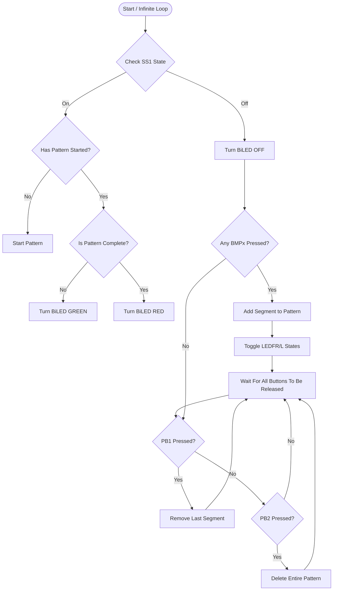

<!--more-->

## Laboratory Description

In this lab, simple digital inputs are used to program the TI-RSLK to drive in a desired pattern composed of independent segments:

1. Drive and turn left 90°
2. Drive and turn left 45°
3. Drive forward
4. Drive and turn right 45°
5. Drive and turn right 90°
6. Stop for 1 second.

The bumper buttons on the car will be used to input each sequential step while a breadboard wired slide switch will cause the inputted pattern to execute and/or stop. One breadboard wired pushbutton is used to delete the last step inputted while a second wired pushbutton will delete all steps inputted. A BiColor LED will provide indication of if the pattern is running (GREEN), the pattern is complete (RED) or the program is waiting for user input (OFF).

### Laboratory Goals

This laboratory is designed to further a student's understanding of:

* The Code Composer Studio (CCS) Integrated Development Environment
* Programming the MSP432P401R microcontroller,
* The implementation and use of inputs and outputs,
* The development of modular C programs towards producing a function system, and
* The functionality of the TI Robotics System Learning Kit (TI-RSLK).

### Preparation

Students should complete Activities 1-5 prior to starting this laboratory. *A good understanding of the tasks in Activity 5 is essential for this laboratory.*

### Hardware and Tools

- TI-RSLK Robotic Car
- Breadboard
- Components (provided):
  - 2x Pushbutton
  - 1x Slideswitch
  - 1x BiColor LED (BiLED)
  - Various Resistors (1x 510Ω, 3x 1kΩ)
- Wire (available in classroom)

### Project Template



## Part A: Build and Test I/O

The first day of this lab consists of building the hardware required, producing the GPIO initialization code, and implementing tests to verify the correct operation of all inputs and outputs. The circuitry needed is shown in the Figure Lab 1 Schematic. Note that this schematic provides both the circuitry included on the |rslk| and that which needs to be built. The circuitry that needs to be built should be done on an external breadboard, *not the one mounted on the RSLK*, to allow for other teams to use the same car.

> [!WARNING]
> There are no 5V connections within Lab 1 Schematic, only 3.3V! This is because the microcontroller pins are only 3.3V tolerant and will likely fail if 5V is applied to them. Ensure that you never use 5V when connecting to this microcontroller!



Both the left and right drive motors on the RSLK are controlled by two output lines: **On/Off** and **Direction**. The **On/Off** line will turn the motor on (High) or off (Low) whereas the **Direction** pin indicates if the wheel should rotate forward (Low) or reverse (High).

With the circuitry built, the GPIO pins must be initialized. **You must use the template project** [lab1_template.zip](lab1_template.zip). This template project has a purpose-built library ([Lab1Lib Driver Library](#lab1lib-driver-library-functions)) for interacting with the motors. Within this project, initialize the pins as specified in the schematic within `GPIOInit()` using the **DriverLib** functions only; do not use **registers**.

> [!IMPORTANT]
> You must use the DriverLib function
>
> ```c
> void GPIO_setAsInputPinWithPullUpResistor(uint8_t port,uint8_t pins);
> ```
>
> to initialize the bumper buttons. This is needed as the corresponding resistor, **R_PU**, as shown on the schematic is **part of the microcontroller** and not an actual component. Therefore, **R_PU** must be enabled through the microcontroller to create the needed **pullup resistor**.

Finally, finish the code provided within function `testIO()` to test the inputs and outputs. The input values should be printed each time a keyboard key is pressed. Further, if the keyboard key pressed is contained within the list below, the specified operation should be completed to test the output. An example on how to complete this is given in the template code.

|    Key      | Function                  |
|:-----------:|:-------------------------:|
|     `a`     | LEDFL On                  |
|     `z`     | LEDFL Off                 |
|     `s`     | LEDFR On                  |
|     `x`     | LEDFR off                 |
|     `q`     | BiLED1 Red                |
|     `w`     | BiLED1 Off                |
|     `e`     | BiLED1 Green              |

> [!WARNING]
> Do not forget to turn the car on to test! The motors will not work without the car being turned on; however, all other components work regardless.

To turn on/off the car: Push the very small button marked "Power" on the back corner of the car. A blue LED will light near the car to indicate it is on, **assuming there are charged batteries in the car**.

Please remember to turn off the car when you are done with it!

Ask a staff member to check off **Part A** when complete; then continue with **Part B**.

## Part B: Pattern Input and Running

With the inputs and outputs built, configured, and tested, the pattern control routine may be added to the project. As provided in the description above, each of the bumper buttons are used to input a specific action into the pattern. They should be configured such that:

- BMP0 adds the "turn right 90°" segment
- BMP1 adds the "turn right 45°" segment
- BMP2 adds the "drive forward" segment
- BMP3 adds the "stop for 1s" segment
- BMP4 adds the "turn left 45°" segment
- BMP5 adds the "turn left 90°" segment

Each time a bumper button is pressed, **LEDFR** and **LEDFL** should switch off or on, with one always being on; this used to indicate a success input of a segment. If the breadboard pushbutton is pressed, the last segment input should be deleted from the program. Finally, if the breadboard slide switch is toggled from off to on, the program should trigger the pattern to be run and the BiLED lit to GREEN. Once the pattern completes, the BiLED should be lit RED until the slide switch is toggled back off. While the BiLED is lit either color, the inputs are ignored.

The simple functional description above can be translated into a flow diagram:



Blocks with red text indicate functionality provided by functions within the [Lab1Lib Driver Library](#lab1lib-driver-library-functions).

> [!WARNING]
> The bumper buttons are prone to bouncing. You will need to debounce your button press/release and slide switch on/off detection to avoid registering multiple button presses for a single physical press.

Implement the control scheme above within the function `controlSystem()`. The flow chart must be **explicitly followed**; that is, do not make assumptions about system behavior that are not described by the diagram. You will need to comment out the function call to `testIO()` and uncomment the call to `controlSystem()` within the `main()` function's `while(1)` loop.

Ask a staff member to check off **Part B** when complete and submit the final code to [Gradescope]. The code must successfully implement the logic as described above and not be prone to button bouncing. For demonstrational purposes, a simplistic obstacle course may be set up in the classroom for the cars to traverse.

## Lab1Lib Driver Library Functions

### initSequence

```c
void initSequence(void)
```

This function initializes the Lab1Lib Driver.

### recordSegment

```c
int8_t recordSegment(int8_t mv)
```

This function adds a segment to the programmed sequence. The input, `int8_t mv`, represents the segment to add:

| `mv` value |   Corresponding Segment  |
|:----------:|:------------------------:|
|     -2     | Drive and Turn 90° Left  |
|     -1     | Drive and Turn 45° Left  |
|      0     | Drive Straight           |
|      1     | Drive and Turn 45° Right |
|      2     | Drive and Turn 90° Right |
|     127    | Stop for 1s              |

This function will output:

- `0` if segment was added to the sequence
- `1` if the segment has reached the maximum length (50), segment was not added
- `-1` if the value of `mv` is not in the table above

### popSegment

```c
uint8_t popSegment(void)
```
This function removes the most recently added segment. Outputs 0 if a segment was erased or 1 is there is no segments to erase (sequence is empty).

### clearSequence

```c
void clearSequence(void)
```

Erase the currently programmed sequence.

### runSequence

```c
uint8_t runSequence(void)
```

Runs the programmed sequence. Returns 0 if started properly, 1 if the sequence is empty, or 2 if the GPIO pins for the motor are not set up properly. In the case of a return of 2, the program will also print a message indicating the issue.

### statusSegment

```c
int8_t statusSegment(void)
```

Returns the currently running segment in the sequence (see table for `record_segment`) or 100 if the sequence is not running (either hasn't run or is complete).

### statusSequence

```c
uint8_t statusSequence(void)
```

Returns the step that a running sequence is on (1,2,3, etc.) or 100 if the sequence is not running (either hasn't run or is complete)

### getSequenceLength

```c
uint8_t getSequenceLength(void)
```

Returns the total number of segments currently programmed into the sequence. The maximum length of a sequence is 50.

## My Approach

### Part A

The Part A is not that hard, the trick is that you need use all kinds of functions to setup pins.

For `GPIOInit()` it should looks like

```c
void GPIOInit(){
    //MP0 ~ BMP5 P4.0, P4.2, P4.3, P4.5, P4.6, P4.7
    GPIO_setAsInputPinWithPullUpResistor(GPIO_PORT_P4, GPIO_PIN0);
    GPIO_setAsInputPinWithPullUpResistor(GPIO_PORT_P4, GPIO_PIN2);
    GPIO_setAsInputPinWithPullUpResistor(GPIO_PORT_P4, GPIO_PIN3);
    GPIO_setAsInputPinWithPullUpResistor(GPIO_PORT_P4, GPIO_PIN5);
    GPIO_setAsInputPinWithPullUpResistor(GPIO_PORT_P4, GPIO_PIN6);
    GPIO_setAsInputPinWithPullUpResistor(GPIO_PORT_P4, GPIO_PIN7);

    //PB1 P2.4
    //PB2 P2.5
    GPIO_setAsInputPin(GPIO_PORT_P2, GPIO_PIN4);
    GPIO_setAsInputPin(GPIO_PORT_P2, GPIO_PIN5);

    //SS1 P5.6
    GPIO_setAsInputPin(GPIO_PORT_P5, GPIO_PIN6);

    //LEDFL P8.0
    //LEDFR P8.5
    GPIO_setAsOutputPin(GPIO_PORT_P8, GPIO_PIN0);
    GPIO_setOutputLowOnPin(GPIO_PORT_P8, GPIO_PIN0);

    GPIO_setAsOutputPin(GPIO_PORT_P8, GPIO_PIN5);
    GPIO_setOutputLowOnPin(GPIO_PORT_P8, GPIO_PIN5);

    //BiColor LED P6.0, P6.1
    GPIO_setAsOutputPin(GPIO_PORT_P6, GPIO_PIN0);
    GPIO_setOutputLowOnPin(GPIO_PORT_P6, GPIO_PIN0);

    GPIO_setAsOutputPin(GPIO_PORT_P6, GPIO_PIN1);
    GPIO_setOutputLowOnPin(GPIO_PORT_P6, GPIO_PIN1);

    //left and right motor
    GPIO_setAsOutputPin(GPIO_PORT_P3, GPIO_PIN7);
    GPIO_setOutputLowOnPin(GPIO_PORT_P3, GPIO_PIN7);
    GPIO_setAsOutputPin(GPIO_PORT_P5, GPIO_PIN4);
    GPIO_setOutputLowOnPin(GPIO_PORT_P5, GPIO_PIN4);

    GPIO_setAsOutputPin(GPIO_PORT_P3, GPIO_PIN6);
    GPIO_setOutputLowOnPin(GPIO_PORT_P3, GPIO_PIN6);
    GPIO_setAsOutputPin(GPIO_PORT_P5, GPIO_PIN5);
    GPIO_setOutputLowOnPin(GPIO_PORT_P5, GPIO_PIN5);
}
```

Then, just finish the rest of `TestIO()`.

```c
void testIO(){
    while(1){
        uint8_t cmd = getchar();
        if(cmd == 'a'){
            // Turn LEDL On
            GPIO_setOutputHighOnPin(GPIO_PORT_P8, GPIO_PIN0);
            printf("LEDL is on.\n\r");

        }else if(cmd == 'z'){
            // Turn LEDL Off
            GPIO_setOutputLowOnPin(GPIO_PORT_P8,GPIO_PIN0);
            printf("LEDL is off.\n\r");

        }else if(cmd == 's'){
            //Turn LEDR On
            GPIO_setOutputHighOnPin(GPIO_PORT_P8, GPIO_PIN5);
            printf("LEDR is on.\n\r");

        } else if (cmd == 'x'){
            //Turn LEDR Off
            GPIO_setOutputLowOnPin(GPIO_PORT_P8,GPIO_PIN5);
            printf("LEDR is off.\n\r");

        } else if (cmd == 'q'){
            //Turn BiLED Red
            GPIO_setOutputLowOnPin(GPIO_PORT_P6,GPIO_PIN0);
            GPIO_setOutputHighOnPin(GPIO_PORT_P6, GPIO_PIN1);
            printf("Turn BiLED Red.\n\r");

        } else if (cmd == 'w'){
            //Turn BiLED Off
            GPIO_setOutputLowOnPin(GPIO_PORT_P6,GPIO_PIN0 | GPIO_PIN1);
            printf("Turn BiLED off.\n\r");

        } else if (cmd == 'e'){
            //Turn BiLED Green
            GPIO_setOutputLowOnPin(GPIO_PORT_P6,GPIO_PIN1);
            GPIO_setOutputHighOnPin(GPIO_PORT_P6, GPIO_PIN0);
            printf("Turn BiLED Green.\n\r");
        }
    }
}
```

The BMPs need to use `GPIO_setAsInputPinWithPullUpResistor()` to setup the pins, and PBs need to use `GPIO_setAsInputPin()` to setup pins. Since, we already connect resistor to PBs.

### Part B

Part B is way more complex. If you are looking at the given flowchart. You probably will be lost. So, I just rewrite the flowchart using mermaid. And make it into a single loop view (it will work, since there is an infinite loop inside the main program. `controlSystem()` only needs to be a single loop)



After that, we can create our function easier. (The complete main.c is at the bottom of page)

```c
void controlSystem(void){
    // Keep track whether sequence is currently running (so we know
    // if it just finished, or if it's not started at all yet, etc.)
    static uint8_t patternRunning = 0;
    static uint8_t runSeq = 1;

    uint8_t ss_state = GPIO_getInputPinValue(GPIO_PORT_P5, GPIO_PIN6);

    if (ss_state == GPIO_INPUT_PIN_HIGH){
        //in case SS1 is on
        printf("SS1 is on\n\r");
        if (statusSequence() == 100){
        //in case the sequence is complete or empty
            uint8_t seqLength = getSequenceLength();
            if (seqLength == 0){
                //in case sequence is empty
                patternRunning = 1;
                printf("sequence is empty, won't start\n\r");
            } else {
                //in case sequence is not empty
                uint8_t seqCallback;
                if (runSeq == 1){
                    seqCallback = runSequence();
                    runSeq = 0;
                }
                if (seqCallback == 0){
                    //in case sequence started OK
                    printf("sequence started OK\n\r");
                } else if (seqCallback == 1){
                    //in case sequence is empty
                    printf("sequence is empty\n\r");
                } else if (seqCallback == 2){
                    //in case GPIO error
                    printf("fail to start sequence\n\r");
                }
            }
        }
        if (patternRunning){
            //in case sequence is running
            if (statusSequence() == 100){
                //in case sequence is finished => turn BiLED RED
                GPIO_setOutputLowOnPin(GPIO_PORT_P6, GPIO_PIN0);
                GPIO_setOutputHighOnPin(GPIO_PORT_P6, GPIO_PIN1);
            } else{
                //in case sequence is running => Turn BiLED GREEN
                GPIO_setOutputHighOnPin(GPIO_PORT_P6, GPIO_PIN0);
                GPIO_setOutputLowOnPin(GPIO_PORT_P6, GPIO_PIN1);
            }
        }
    } else{
        //in case SS1 is off
        patternRunning = 0;
        //turn BiLED off
        GPIO_setOutputLowOnPin(GPIO_PORT_P6, GPIO_PIN0 | GPIO_PIN1);

        // A static toggle variable to keep track of which front LED
        // is on next time we successfully record a segment
        static uint8_t toggleLED = 0;

        if (runSeq == 0){
            runSeq = 1;
            clearSequence();
        }

        // Check each bumper individually
        if (GPIO_getInputPinValue(GPIO_PORT_P4, GPIO_PIN0) == GPIO_INPUT_PIN_LOW) {
            // Debounce – wait until it’s released
            while (GPIO_getInputPinValue(GPIO_PORT_P4, GPIO_PIN0) == GPIO_INPUT_PIN_LOW) {}
            __delay_cycles(240e3); // ~ simple debounce delay

            // Record the requested segment
            int8_t recStatus = recordSegment(2);  // Turn right 90
            if (recStatus == 0) {
                printf("Turn right 90 added.\r\n");
                // Toggle the front LEDs
                if (toggleLED == 0) {
                    GPIO_setOutputHighOnPin(GPIO_PORT_P8, GPIO_PIN5);
                    GPIO_setOutputLowOnPin(GPIO_PORT_P8, GPIO_PIN0);
                    toggleLED = 1;
                    printf("Left LED toggled.\r\n");
                } else {
                    GPIO_setOutputHighOnPin(GPIO_PORT_P8, GPIO_PIN0);
                    GPIO_setOutputLowOnPin(GPIO_PORT_P8, GPIO_PIN5);
                    toggleLED = 0;
                    printf("Right LED toggled.\r\n");
                }
            } else if (recStatus == 1) {
                printf("ERROR: Sequence reached max length (50). Segment not added.\r\n");
            } else if (recStatus == -1) {
                printf("ERROR: mv value not recognized by recordSegment.\r\n");
            }
        }
        else if (GPIO_getInputPinValue(GPIO_PORT_P4, GPIO_PIN2) == GPIO_INPUT_PIN_LOW) {
            // Debounce – wait until it’s released
            while (GPIO_getInputPinValue(GPIO_PORT_P4, GPIO_PIN2) == GPIO_INPUT_PIN_LOW) {}
            _delay_cycles(240e3); // ~ simple debounce delay

            // Record the requested segment
            int8_t recStatus = recordSegment(1);  // Turn right 45
            if (recStatus == 0) {
                printf("Turn right 45 added.\r\n");
                // Toggle the front LEDs
                if (toggleLED == 0) {
                    GPIO_setOutputHighOnPin(GPIO_PORT_P8, GPIO_PIN5);
                    GPIO_setOutputLowOnPin(GPIO_PORT_P8, GPIO_PIN0);
                    toggleLED = 1;
                    printf("Left LED toggled.\r\n");
                } else {
                    GPIO_setOutputHighOnPin(GPIO_PORT_P8, GPIO_PIN0);
                    GPIO_setOutputLowOnPin(GPIO_PORT_P8, GPIO_PIN5);
                    toggleLED = 0;
                }
            } else if (recStatus == 1) {
                printf("ERROR: Sequence reached max length (50). Segment not added.\r\n");
            } else if (recStatus == -1) {
                printf("ERROR: mv value not recognized by recordSegment.\r\n");
            }
        }
        else if (GPIO_getInputPinValue(GPIO_PORT_P4, GPIO_PIN3) == GPIO_INPUT_PIN_LOW) {
            // Debounce – wait until it’s released
            while (GPIO_getInputPinValue(GPIO_PORT_P4, GPIO_PIN3) == GPIO_INPUT_PIN_LOW) {}
            __delay_cycles(240e3); // ~ simple debounce delay

            // Record the requested segment
            int8_t recStatus = recordSegment(0);  // Drive forward
            if (recStatus == 0) {
                printf("Drive forward added.\r\n");
                // Toggle the front LEDs
                if (toggleLED == 0) {
                    GPIO_setOutputHighOnPin(GPIO_PORT_P8, GPIO_PIN5);
                    GPIO_setOutputLowOnPin(GPIO_PORT_P8, GPIO_PIN0);
                    toggleLED = 1;
                    printf("Left LED toggled.\r\n");
                } else {
                    GPIO_setOutputHighOnPin(GPIO_PORT_P8, GPIO_PIN0);
                    GPIO_setOutputLowOnPin(GPIO_PORT_P8, GPIO_PIN5);
                    toggleLED = 0;
                }
            } else if (recStatus == 1) {
                printf("ERROR: Sequence reached max length (50). Segment not added.\r\n");
            } else if (recStatus == -1) {
                printf("ERROR: mv value not recognized by recordSegment.\r\n");
            }
        }
        else if (GPIO_getInputPinValue(GPIO_PORT_P4, GPIO_PIN5) == GPIO_INPUT_PIN_LOW) {
            // Debounce – wait until it’s released
            while (GPIO_getInputPinValue(GPIO_PORT_P4, GPIO_PIN5) == GPIO_INPUT_PIN_LOW) {}
            __delay_cycles(240e3); // ~ simple debounce delay

            // Record the requested segment
            int8_t recStatus = recordSegment(127);  // Stop for 1 s
            if (recStatus == 0) {
                printf("Stop for 1 s added.\r\n");
                // Toggle the front LEDs
                if (toggleLED == 0) {
                    GPIO_setOutputHighOnPin(GPIO_PORT_P8, GPIO_PIN5);
                    GPIO_setOutputLowOnPin(GPIO_PORT_P8, GPIO_PIN0);
                    toggleLED = 1;
                    printf("Left LED toggled.\r\n");
                } else {
                    GPIO_setOutputHighOnPin(GPIO_PORT_P8, GPIO_PIN0);
                    GPIO_setOutputLowOnPin(GPIO_PORT_P8, GPIO_PIN5);
                    toggleLED = 0;
                }
            } else if (recStatus == 1) {
                printf("ERROR: Sequence reached max length (50). Segment not added.\r\n");
            } else if (recStatus == -1) {
                printf("ERROR: mv value not recognized by recordSegment.\r\n");
            }
        }
        else if (GPIO_getInputPinValue(GPIO_PORT_P4, GPIO_PIN6) == GPIO_INPUT_PIN_LOW) {
            // Debounce – wait until it’s released
            while (GPIO_getInputPinValue(GPIO_PORT_P4, GPIO_PIN6) == GPIO_INPUT_PIN_LOW) {}
            __delay_cycles(240e3); // ~ simple debounce delay

            // Record the requested segment
            int8_t recStatus = recordSegment(-1);  // Turn left 45
            if (recStatus == 0) {
                printf("Turn left 45 added.\r\n");
                // Toggle the front LEDs
                if (toggleLED == 0) {
                    GPIO_setOutputHighOnPin(GPIO_PORT_P8, GPIO_PIN5);
                    GPIO_setOutputLowOnPin(GPIO_PORT_P8, GPIO_PIN0);
                    toggleLED = 1;
                    printf("Left LED toggled.\r\n");
                } else {
                    GPIO_setOutputHighOnPin(GPIO_PORT_P8, GPIO_PIN0);
                    GPIO_setOutputLowOnPin(GPIO_PORT_P8, GPIO_PIN5);
                    toggleLED = 0;
                }
            } else if (recStatus == 1) {
                printf("ERROR: Sequence reached max length (50). Segment not added.\r\n");
            } else if (recStatus == -1) {
                printf("ERROR: mv value not recognized by recordSegment.\r\n");
            }
        }
        else if (GPIO_getInputPinValue(GPIO_PORT_P4, GPIO_PIN7) == GPIO_INPUT_PIN_LOW) {
            // Debounce – wait until it’s released
            while (GPIO_getInputPinValue(GPIO_PORT_P4, GPIO_PIN7) == GPIO_INPUT_PIN_LOW) {}
            __delay_cycles(240e3); // ~ simple debounce delay

            // Record the requested segment
            int8_t recStatus = recordSegment(-2);  // Turn left 90
            if (recStatus == 0) {
                printf("Turn left 90 added.\r\n");
                // Toggle the front LEDs
                if (toggleLED == 0) {
                    GPIO_setOutputHighOnPin(GPIO_PORT_P8, GPIO_PIN5);
                    GPIO_setOutputLowOnPin(GPIO_PORT_P8, GPIO_PIN0);
                    toggleLED = 1;
                    printf("Left LED toggled.\r\n");
                } else {
                    GPIO_setOutputHighOnPin(GPIO_PORT_P8, GPIO_PIN0);
                    GPIO_setOutputLowOnPin(GPIO_PORT_P8, GPIO_PIN5);
                    toggleLED = 0;
                }
            } else if (recStatus == 1) {
                printf("ERROR: Sequence reached max length (50). Segment not added.\r\n");
            } else if (recStatus == -1) {
                printf("ERROR: mv value not recognized by recordSegment.\r\n");
            }
        }
        // -- Check PB1 (pop last segment) --
        if(!GPIO_getInputPinValue(GPIO_PORT_P2, GPIO_PIN4) == GPIO_INPUT_PIN_LOW)
        {
            // Wait for release
            while(!GPIO_getInputPinValue(GPIO_PORT_P2, GPIO_PIN4) == GPIO_INPUT_PIN_LOW){}
            __delay_cycles(200000);

            uint8_t popRes = popSegment();
            if(popRes == 0)
            {
                printf("Last segment popped.\r\n");
            }
            else
            {
                printf("No segment to pop.\r\n");
            }
        }

        // -- Check PB2 (clear entire sequence) --
        if(!GPIO_getInputPinValue(GPIO_PORT_P2, GPIO_PIN5) == GPIO_INPUT_PIN_LOW)
        {
            // Wait for release
            while(!GPIO_getInputPinValue(GPIO_PORT_P2, GPIO_PIN5) == GPIO_INPUT_PIN_LOW){}
            __delay_cycles(200000);

            clearSequence();
            printf("Entire sequence cleared.\r\n");
        }
    }
}
```

There are a few tricks. First, the BMPs will bounce as we released the micro switches. Without debouncing, it will create more than 50 clicks in a seconds. To debounce, I used an empty while loop to wait it to be released and a delay to wait the bouncing ends.

```diff
if (GPIO_getInputPinValue(GPIO_PORT_P4, GPIO_PIN0) == GPIO_INPUT_PIN_LOW) {
+    while (GPIO_getInputPinValue(GPIO_PORT_P4, GPIO_PIN0) == GPIO_INPUT_PIN_LOW) {}
+    __delay_cycles(240e3);
    //...
}
```

Second, make sure `runSequence()` only run once as needed. Otherwise, the car will never stop. My solution to that is create a global variable to track that and keep it updated.

```diff
void controlSystem(void){
+   static uint8_t runSeq = 1;
    if (ss_state == GPIO_INPUT_PIN_HIGH){
        //in case SS1 is on
        if (statusSequence() == 100){
          //in case the sequence is complete or empty
          if (seqLength == 0){
              //in case sequence is empty
          } else {
              //in case sequence is not empty
+             if (runSeq == 1){
                  seqCallback = runSequence();
+                 runSeq = 0;
              }
              //...
          }
        }
        //...
    } else{
        //in case SS1 is off
+       if (runSeq == 0){
+           runSeq = 1;
+           clearSequence();
+       }
        //...
    }
}
```

Last, print enough debug information and error log based on status code which returned by the functions.

### Final Code

```c
#include "engr2350_msp432.h"
#include "lab1lib.h"
#include <stdlib.h>

void GPIOInit();
void testIO();
void controlSystem();

uint8_t LEDFL = 0; // Two variables to store the state of
uint8_t LEDFR = 0; // the front left/right LEDs (on-car)

int main() {

    sysInit(); // Basic car initialization
    initSequence(); // Initializes the lab1Lib Driver
    GPIOInit();

    printf("\r\n\n"
           "===========\r\n"
           "Lab 1 Begin\r\n"
           "===========\r\n");

    while(1){
        //testIO(); // Used in Part A to test the IO
        controlSystem(); // Used in Part B to implement the desired functionality
    }
}


void GPIOInit(){
    //MP0 ~ BMP5 P4.0, P4.2, P4.3, P4.5, P4.6, P4.7
    GPIO_setAsInputPinWithPullUpResistor(GPIO_PORT_P4, GPIO_PIN0);
    GPIO_setAsInputPinWithPullUpResistor(GPIO_PORT_P4, GPIO_PIN2);
    GPIO_setAsInputPinWithPullUpResistor(GPIO_PORT_P4, GPIO_PIN3);
    GPIO_setAsInputPinWithPullUpResistor(GPIO_PORT_P4, GPIO_PIN5);
    GPIO_setAsInputPinWithPullUpResistor(GPIO_PORT_P4, GPIO_PIN6);
    GPIO_setAsInputPinWithPullUpResistor(GPIO_PORT_P4, GPIO_PIN7);

    //PB1 P2.4
    //PB2 P2.5
    GPIO_setAsInputPin(GPIO_PORT_P2, GPIO_PIN4);
    GPIO_setAsInputPin(GPIO_PORT_P2, GPIO_PIN5);

    //SS1 P5.6
    GPIO_setAsInputPin(GPIO_PORT_P5, GPIO_PIN6);

    //LEDFL P8.0
    //LEDFR P8.5
    GPIO_setAsOutputPin(GPIO_PORT_P8, GPIO_PIN0);
    GPIO_setOutputLowOnPin(GPIO_PORT_P8, GPIO_PIN0);

    GPIO_setAsOutputPin(GPIO_PORT_P8, GPIO_PIN5);
    GPIO_setOutputLowOnPin(GPIO_PORT_P8, GPIO_PIN5);

    //BiColor LED P6.0, P6.1
    GPIO_setAsOutputPin(GPIO_PORT_P6, GPIO_PIN0);
    GPIO_setOutputLowOnPin(GPIO_PORT_P6, GPIO_PIN0);

    GPIO_setAsOutputPin(GPIO_PORT_P6, GPIO_PIN1);
    GPIO_setOutputLowOnPin(GPIO_PORT_P6, GPIO_PIN1);

    //left and right motor
    GPIO_setAsOutputPin(GPIO_PORT_P3, GPIO_PIN7);
    GPIO_setOutputLowOnPin(GPIO_PORT_P3, GPIO_PIN7);
    GPIO_setAsOutputPin(GPIO_PORT_P5, GPIO_PIN4);
    GPIO_setOutputLowOnPin(GPIO_PORT_P5, GPIO_PIN4);

    GPIO_setAsOutputPin(GPIO_PORT_P3, GPIO_PIN6);
    GPIO_setOutputLowOnPin(GPIO_PORT_P3, GPIO_PIN6);
    GPIO_setAsOutputPin(GPIO_PORT_P5, GPIO_PIN5);
    GPIO_setOutputLowOnPin(GPIO_PORT_P5, GPIO_PIN5);
}

void testIO(){
    while(1){
        uint8_t cmd = getchar();
        if(cmd == 'a'){
            // Turn LEDL On
            GPIO_setOutputHighOnPin(GPIO_PORT_P8, GPIO_PIN0);
            printf("LEDL is on.\n\r");

        }else if(cmd == 'z'){
            // Turn LEDL Off
            GPIO_setOutputLowOnPin(GPIO_PORT_P8,GPIO_PIN0);
            printf("LEDL is off.\n\r");

        }else if(cmd == 's'){
            //Turn LEDR On
            GPIO_setOutputHighOnPin(GPIO_PORT_P8, GPIO_PIN5);
            printf("LEDR is on.\n\r");

        } else if (cmd == 'x'){
            //Turn LEDR Off
            GPIO_setOutputLowOnPin(GPIO_PORT_P8,GPIO_PIN5);
            printf("LEDR is off.\n\r");

        } else if (cmd == 'q'){
            //Turn BiLED Red
            GPIO_setOutputLowOnPin(GPIO_PORT_P6,GPIO_PIN0);
            GPIO_setOutputHighOnPin(GPIO_PORT_P6, GPIO_PIN1);
            printf("Turn BiLED Red.\n\r");

        } else if (cmd == 'w'){
            //Turn BiLED Off
            GPIO_setOutputLowOnPin(GPIO_PORT_P6,GPIO_PIN0 | GPIO_PIN1);
            printf("Turn BiLED off.\n\r");

        } else if (cmd == 'e'){
            //Turn BiLED Green
            GPIO_setOutputLowOnPin(GPIO_PORT_P6,GPIO_PIN1);
            GPIO_setOutputHighOnPin(GPIO_PORT_P6, GPIO_PIN0);
            printf("Turn BiLED Green.\n\r");
        }
    }
}

void controlSystem(void){
    // Keep track whether sequence is currently running (so we know
    // if it just finished, or if it's not started at all yet, etc.)
    static uint8_t patternRunning = 0;
    static uint8_t runSeq = 1;

    uint8_t ss_state = GPIO_getInputPinValue(GPIO_PORT_P5, GPIO_PIN6);

    if (ss_state == GPIO_INPUT_PIN_HIGH){
        //in case SS1 is on
        printf("SS1 is on\n\r");
        if (statusSequence() == 100){
        //in case the sequence is complete or empty
            uint8_t seqLength = getSequenceLength();
            if (seqLength == 0){
                //in case sequence is empty
                patternRunning = 1;
                printf("sequence is empty, won't start\n\r");
            } else {
                //in case sequence is not empty
                uint8_t seqCallback;
                if (runSeq == 1){
                    seqCallback = runSequence();
                    runSeq = 0;
                }
                if (seqCallback == 0){
                    //in case sequence started OK
                    printf("sequence started OK\n\r");
                } else if (seqCallback == 1){
                    //in case sequence is empty
                    printf("sequence is empty\n\r");
                } else if (seqCallback == 2){
                    //in case GPIO error
                    printf("fail to start sequence\n\r");
                }
            }
        }
        if (patternRunning){
            //in case sequence is running
            if (statusSequence() == 100){
                //in case sequence is finished => turn BiLED RED
                GPIO_setOutputLowOnPin(GPIO_PORT_P6, GPIO_PIN0);
                GPIO_setOutputHighOnPin(GPIO_PORT_P6, GPIO_PIN1);
            } else{
                //in case sequence is running => Turn BiLED GREEN
                GPIO_setOutputHighOnPin(GPIO_PORT_P6, GPIO_PIN0);
                GPIO_setOutputLowOnPin(GPIO_PORT_P6, GPIO_PIN1);
            }
        }
    } else{
        //in case SS1 is off
        patternRunning = 0;
        //turn BiLED off
        GPIO_setOutputLowOnPin(GPIO_PORT_P6, GPIO_PIN0 | GPIO_PIN1);

        // A static toggle variable to keep track of which front LED
        // is on next time we successfully record a segment
        static uint8_t toggleLED = 0;

        if (runSeq == 0){
            runSeq = 1;
            clearSequence();
        }

        // Check each bumper individually
        if (GPIO_getInputPinValue(GPIO_PORT_P4, GPIO_PIN0) == GPIO_INPUT_PIN_LOW) {
            // Debounce – wait until it’s released
            while (GPIO_getInputPinValue(GPIO_PORT_P4, GPIO_PIN0) == GPIO_INPUT_PIN_LOW) {}
            __delay_cycles(240e3); // ~ simple debounce delay

            // Record the requested segment
            int8_t recStatus = recordSegment(2);  // Turn right 90
            if (recStatus == 0) {
                printf("Turn right 90 added.\r\n");
                // Toggle the front LEDs
                if (toggleLED == 0) {
                    GPIO_setOutputHighOnPin(GPIO_PORT_P8, GPIO_PIN5);
                    GPIO_setOutputLowOnPin(GPIO_PORT_P8, GPIO_PIN0);
                    toggleLED = 1;
                    printf("Left LED toggled.\r\n");
                } else {
                    GPIO_setOutputHighOnPin(GPIO_PORT_P8, GPIO_PIN0);
                    GPIO_setOutputLowOnPin(GPIO_PORT_P8, GPIO_PIN5);
                    toggleLED = 0;
                    printf("Right LED toggled.\r\n");
                }
            } else if (recStatus == 1) {
                printf("ERROR: Sequence reached max length (50). Segment not added.\r\n");
            } else if (recStatus == -1) {
                printf("ERROR: mv value not recognized by recordSegment.\r\n");
            }
        }
        else if (GPIO_getInputPinValue(GPIO_PORT_P4, GPIO_PIN2) == GPIO_INPUT_PIN_LOW) {
            // Debounce – wait until it’s released
            while (GPIO_getInputPinValue(GPIO_PORT_P4, GPIO_PIN2) == GPIO_INPUT_PIN_LOW) {}
            _delay_cycles(240e3); // ~ simple debounce delay

            // Record the requested segment
            int8_t recStatus = recordSegment(1);  // Turn right 45
            if (recStatus == 0) {
                printf("Turn right 45 added.\r\n");
                // Toggle the front LEDs
                if (toggleLED == 0) {
                    GPIO_setOutputHighOnPin(GPIO_PORT_P8, GPIO_PIN5);
                    GPIO_setOutputLowOnPin(GPIO_PORT_P8, GPIO_PIN0);
                    toggleLED = 1;
                    printf("Left LED toggled.\r\n");
                } else {
                    GPIO_setOutputHighOnPin(GPIO_PORT_P8, GPIO_PIN0);
                    GPIO_setOutputLowOnPin(GPIO_PORT_P8, GPIO_PIN5);
                    toggleLED = 0;
                }
            } else if (recStatus == 1) {
                printf("ERROR: Sequence reached max length (50). Segment not added.\r\n");
            } else if (recStatus == -1) {
                printf("ERROR: mv value not recognized by recordSegment.\r\n");
            }
        }
        else if (GPIO_getInputPinValue(GPIO_PORT_P4, GPIO_PIN3) == GPIO_INPUT_PIN_LOW) {
            // Debounce – wait until it’s released
            while (GPIO_getInputPinValue(GPIO_PORT_P4, GPIO_PIN3) == GPIO_INPUT_PIN_LOW) {}
            __delay_cycles(240e3); // ~ simple debounce delay

            // Record the requested segment
            int8_t recStatus = recordSegment(0);  // Drive forward
            if (recStatus == 0) {
                printf("Drive forward added.\r\n");
                // Toggle the front LEDs
                if (toggleLED == 0) {
                    GPIO_setOutputHighOnPin(GPIO_PORT_P8, GPIO_PIN5);
                    GPIO_setOutputLowOnPin(GPIO_PORT_P8, GPIO_PIN0);
                    toggleLED = 1;
                    printf("Left LED toggled.\r\n");
                } else {
                    GPIO_setOutputHighOnPin(GPIO_PORT_P8, GPIO_PIN0);
                    GPIO_setOutputLowOnPin(GPIO_PORT_P8, GPIO_PIN5);
                    toggleLED = 0;
                }
            } else if (recStatus == 1) {
                printf("ERROR: Sequence reached max length (50). Segment not added.\r\n");
            } else if (recStatus == -1) {
                printf("ERROR: mv value not recognized by recordSegment.\r\n");
            }
        }
        else if (GPIO_getInputPinValue(GPIO_PORT_P4, GPIO_PIN5) == GPIO_INPUT_PIN_LOW) {
            // Debounce – wait until it’s released
            while (GPIO_getInputPinValue(GPIO_PORT_P4, GPIO_PIN5) == GPIO_INPUT_PIN_LOW) {}
            __delay_cycles(240e3); // ~ simple debounce delay

            // Record the requested segment
            int8_t recStatus = recordSegment(127);  // Stop for 1 s
            if (recStatus == 0) {
                printf("Stop for 1 s added.\r\n");
                // Toggle the front LEDs
                if (toggleLED == 0) {
                    GPIO_setOutputHighOnPin(GPIO_PORT_P8, GPIO_PIN5);
                    GPIO_setOutputLowOnPin(GPIO_PORT_P8, GPIO_PIN0);
                    toggleLED = 1;
                    printf("Left LED toggled.\r\n");
                } else {
                    GPIO_setOutputHighOnPin(GPIO_PORT_P8, GPIO_PIN0);
                    GPIO_setOutputLowOnPin(GPIO_PORT_P8, GPIO_PIN5);
                    toggleLED = 0;
                }
            } else if (recStatus == 1) {
                printf("ERROR: Sequence reached max length (50). Segment not added.\r\n");
            } else if (recStatus == -1) {
                printf("ERROR: mv value not recognized by recordSegment.\r\n");
            }
        }
        else if (GPIO_getInputPinValue(GPIO_PORT_P4, GPIO_PIN6) == GPIO_INPUT_PIN_LOW) {
            // Debounce – wait until it’s released
            while (GPIO_getInputPinValue(GPIO_PORT_P4, GPIO_PIN6) == GPIO_INPUT_PIN_LOW) {}
            __delay_cycles(240e3); // ~ simple debounce delay

            // Record the requested segment
            int8_t recStatus = recordSegment(-1);  // Turn left 45
            if (recStatus == 0) {
                printf("Turn left 45 added.\r\n");
                // Toggle the front LEDs
                if (toggleLED == 0) {
                    GPIO_setOutputHighOnPin(GPIO_PORT_P8, GPIO_PIN5);
                    GPIO_setOutputLowOnPin(GPIO_PORT_P8, GPIO_PIN0);
                    toggleLED = 1;
                    printf("Left LED toggled.\r\n");
                } else {
                    GPIO_setOutputHighOnPin(GPIO_PORT_P8, GPIO_PIN0);
                    GPIO_setOutputLowOnPin(GPIO_PORT_P8, GPIO_PIN5);
                    toggleLED = 0;
                }
            } else if (recStatus == 1) {
                printf("ERROR: Sequence reached max length (50). Segment not added.\r\n");
            } else if (recStatus == -1) {
                printf("ERROR: mv value not recognized by recordSegment.\r\n");
            }
        }
        else if (GPIO_getInputPinValue(GPIO_PORT_P4, GPIO_PIN7) == GPIO_INPUT_PIN_LOW) {
            // Debounce – wait until it’s released
            while (GPIO_getInputPinValue(GPIO_PORT_P4, GPIO_PIN7) == GPIO_INPUT_PIN_LOW) {}
            __delay_cycles(240e3); // ~ simple debounce delay

            // Record the requested segment
            int8_t recStatus = recordSegment(-2);  // Turn left 90
            if (recStatus == 0) {
                printf("Turn left 90 added.\r\n");
                // Toggle the front LEDs
                if (toggleLED == 0) {
                    GPIO_setOutputHighOnPin(GPIO_PORT_P8, GPIO_PIN5);
                    GPIO_setOutputLowOnPin(GPIO_PORT_P8, GPIO_PIN0);
                    toggleLED = 1;
                    printf("Left LED toggled.\r\n");
                } else {
                    GPIO_setOutputHighOnPin(GPIO_PORT_P8, GPIO_PIN0);
                    GPIO_setOutputLowOnPin(GPIO_PORT_P8, GPIO_PIN5);
                    toggleLED = 0;
                }
            } else if (recStatus == 1) {
                printf("ERROR: Sequence reached max length (50). Segment not added.\r\n");
            } else if (recStatus == -1) {
                printf("ERROR: mv value not recognized by recordSegment.\r\n");
            }
        }
        // -- Check PB1 (pop last segment) --
        if(!GPIO_getInputPinValue(GPIO_PORT_P2, GPIO_PIN4) == GPIO_INPUT_PIN_LOW)
        {
            // Wait for release
            while(!GPIO_getInputPinValue(GPIO_PORT_P2, GPIO_PIN4) == GPIO_INPUT_PIN_LOW){}
            __delay_cycles(200000);

            uint8_t popRes = popSegment();
            if(popRes == 0)
            {
                printf("Last segment popped.\r\n");
            }
            else
            {
                printf("No segment to pop.\r\n");
            }
        }

        // -- Check PB2 (clear entire sequence) --
        if(!GPIO_getInputPinValue(GPIO_PORT_P2, GPIO_PIN5) == GPIO_INPUT_PIN_LOW)
        {
            // Wait for release
            while(!GPIO_getInputPinValue(GPIO_PORT_P2, GPIO_PIN5) == GPIO_INPUT_PIN_LOW){}
            __delay_cycles(200000);

            clearSequence();
            printf("Entire sequence cleared.\r\n");
        }
    }
}
```

## Area Can be Improved

First, there are a lot of duplicated code. For example, the debouncing logic has been applied every times there is switches been turned on. I could pack them into a function and call it over times.

```diff
+void debouncePin(uint8_t port, uint16_t pin) {
+    while (GPIO_getInputPinValue(port, pin) == GPIO_INPUT_PIN_LOW) {}
+    __delay_cycles(240000); 
+}

if (GPIO_getInputPinValue(GPIO_PORT_P4, GPIO_PIN0) == GPIO_INPUT_PIN_LOW) {
-    while (GPIO_getInputPinValue(GPIO_PORT_P4, GPIO_PIN0) == GPIO_INPUT_PIN_LOW) {}
-    __delay_cycles(240000);
+    debouncePin(GPIO_PORT_P4, GPIO_PIN0);
    // ... do the rest ...
}
```

Farther, we can move more code into function For example, put "recordSegment" checks in a function. Normally, we do something like

```c
int8_t recStatus = recordSegment(2);  // or some other value
if (recStatus == 0) {
    // ...
} else if (recStatus == 1) {
    // ...
} else if (recStatus == -1) {
    // ...
}
```

Because it repeats the same checks and messages, we could make a helper function.

```c
void handleSegmentRecord(int8_t mv, uint8_t *toggleLED, const char *message)
{
    int8_t recStatus = recordSegment(mv);
    if (recStatus == 0) {
        printf("%s added.\r\n", message);
        toggleFrontLEDs(toggleLED);
    } else if (recStatus == 1) {
        printf("ERROR: Sequence reached max length.\r\n");
    } else if (recStatus == -1) {
        printf("ERROR: mv value not recognized.\r\n");
    }
}
```

Then we can do:

```c
if (GPIO_getInputPinValue(GPIO_PORT_P4, GPIO_PIN0) == GPIO_INPUT_PIN_LOW) {
    debouncePin(GPIO_PORT_P4, GPIO_PIN0);
    handleSegmentRecord(2, &toggleLED, "Turn right 90");
}
```
