<!--more-->

## How Does the Model Generate Responses?

The mainstream models currently use autoregressive generation, which generates subsequent text based on the preceding context. The model itself has no memory and isn't truly engaging in a conversation with you. Instead, it works like this:



Each conversation adds to the context length until it exceeds a limit, known as the context window. When this happens, either the content is discarded or compressed and summarized. This limit is called the context window.

In some cases, if the context window isn't large enough, it can't effectively handle certain content. Google's Gemini 2.5 Pro supports a context length of 1 million tokens, while OpenAI's newly released GPT-4.1 also supports a maximum context length of 1 million tokens, and o3 has a context length of 200,000 tokens.

### Temperature

Temperature is a parameter in LLMs that affects the randomness and creativity of the generated text. A lower temperature, such as 0.2, makes the output more focused and predictable, suitable for tasks requiring accuracy, like technical writing. A higher temperature, such as 0.7, makes the output more diverse and creative, suitable for storytelling or brainstorming.

IBM has written a good article: [What is LLM Temperature?](https://www.ibm.com/think/topics/llm-temperature)

### Top-K and Top-P

Top-K restricts the selection of the next Token to the top K most probable options from the model's output. For example, if K is set to 5, the model will only consider the top 5 most probable Tokens, making the generated text more coherent and predictable. This helps reduce randomness, but setting K too low may limit creativity.

Top-P (also known as nucleus sampling) works by selecting the smallest set of Tokens whose cumulative probability exceeds a specified threshold (e.g., 0.9). This includes all Tokens that collectively account for 90% of the probability mass, thereby allowing for more varied output while avoiding Tokens with very low probabilities that might be meaningless. It is generally considered more flexible than Top-K.

There's a well-written article: [How to generate text: using different decoding methods for language generation with Transformers](https://huggingface.co/blog/how-to-generate)

### Small Practice

If you haven't fully grasped the concept of context, take a look at this request first:



```bash
curl https://api.openai.com/v1/chat/completions \
  -H "Content-Type: application/json" \
  -H "Authorization: Bearer $OPENAI_API_KEY" \
  -d '{
    "model": "gpt-4.1",
    "messages": [
      {
        "role": "developer",
        "content": "You are a helpful assistant."
      },
      {
        "role": "user",
        "content": "Hello!"
      }
    ],
    "temperature": 0.7
  }'
```

It sends a message "Hello!" to the model `gpt-4.1`. Its system prompt is "You are a helpful assistant." with a `temperature` of `0.7`.

> [!Tip]
> Here, `developer` is a new role. It replaces the previous `system` role in o1 and later models.

You should receive a response like this:



```json
{
  "id": "chatcmpl-BPctVve9zkK7PuUsFvpWbsWzWdR0b",
  "object": "chat.completion",
  "created": 1745447409,
  "model": "gpt-4.1-2025-04-14",
  "choices": [
    {
      "index": 0,
      "message": {
        "role": "assistant",
        "content": "Hello! How can I help you today?",
        "refusal": null,
        "annotations": []
      },
      "logprobs": null,
      "finish_reason": "stop"
    }
  ],
  "usage": {
    "prompt_tokens": 19,
    "completion_tokens": 10,
    "total_tokens": 29,
    "prompt_tokens_details": {
      "cached_tokens": 0,
      "audio_tokens": 0
    },
    "completion_tokens_details": {
      "reasoning_tokens": 0,
      "audio_tokens": 0,
      "accepted_prediction_tokens": 0,
      "rejected_prediction_tokens": 0
    }
  },
  "service_tier": "default",
  "system_fingerprint": "fp_b38e740b47"
}
```

A multi-turn conversation would be initiated like this:



```bash
curl https://api.openai.com/v1/chat/completions \
  -H "Content-Type: application/json" \
  -H "Authorization: Bearer $OPENAI_API_KEY" \
  -d '{
    "model": "gpt-4.1",
    "messages": [
      {
        "role": "developer",
        "content": "You are a helpful assistant."
      },
      {
        "role": "user",
        "content": "Hello!"
      },
      {
        "role": "assistant",
        "content": "Hello! How can I help you today?"
      },
      {
        "role": "user",
        "content": "1+1 equals what?"
      }
    ],
    "temperature": 0.7
  }'
```

And you would receive a response like this:



```json
{
  "id": "chatcmpl-BPcv4alGyqzbbwN9ZBzXVXUcX7CWS",
  "object": "chat.completion",
  "created": 1745447506,
  "model": "gpt-4.1-2025-04-14",
  "choices": [
    {
      "index": 0,
      "message": {
        "role": "assistant",
        "content": "1+1 equals 2.",
        "refusal": null,
        "annotations": []
      },
      "logprobs": null,
      "finish_reason": "stop"
    }
  ],
  "usage": {
    "prompt_tokens": 42,
    "completion_tokens": 8,
    "total_tokens": 50,
    "prompt_tokens_details": {
      "cached_tokens": 0,
      "audio_tokens": 0
    },
    "completion_tokens_details": {
      "reasoning_tokens": 0,
      "audio_tokens": 0,
      "accepted_prediction_tokens": 0,
      "rejected_prediction_tokens": 0
    }
  },
  "service_tier": "default",
  "system_fingerprint": "fp_a1102cf978"
}
```

This is essentially how the API works at its basic level, and you should now have a deeper understanding of the conversation format.

### Common Questions

> **How many rounds of conversation can I have?**
>
> Many user-side products limit the number of conversation rounds, with different tiers having different quotas. If you understand the content above, you'll realize that the API charges per request, which is directly related to context length but not to the number of conversation rounds. Therefore, to maximize the value of your quota, you should carefully construct prompts to complete tasks within a few conversation rounds. Additionally, even with the same model, different tier packages may have different Content Window sizes.

> **Does this model support file uploads?**
>
> Many users upload files like PPTs and PDFs to the model. However, I want to remind you that models may not inherently read these files. Most models can only handle text input and output; models that can handle multiple input/output formats are called multimodal models. Current mainstream models support image input, making them multimodal models. Some advanced models support voice and video input/output. You may have noticed that they don't support PPTs or PDF files.  
> In fact, file uploads are implemented independently by each provider. The essence is to parse the file into text content, possibly including images. If you're unsure about the principle, you can check out [Mathpix](https://mathpix.com/), which provides PDF parsing services for multiple companies. It can parse PDFs into Markdown-like text formats and include them in LLM requests for document understanding and QA. So, if you're particular, you can manually paste the text content from the PDF into the request; the results won't be worse, and might even be better.

> **Why can the model still have conversations when the text length clearly exceeds the window limit?**
>
> This is also an optimization technique. Early on, GPT-3.5 had a context window of only 4096 tokens, which quickly filled up. At that point, the model would summarize the previous context to compress the context length. In addition to this approach, there are some more advanced techniques, such as retrieval-augmented generation (RAG). However, performance is definitely inferior to the native window, and as the number of conversation rounds increases, model performance also decreases. This was very noticeable in early LLMs, but with years of industry improvements, multi-round conversation performance has greatly improved.

## Detailed Model Types

As models continue to develop, many new technologies and features have been introduced. What are their differences and what do they represent?

### Multimodal Models

If a model can only handle text input and output text, it's a unimodal model. Conversely, it's a multimodal model. For example, GPT-4 initially supported text and image input with text output, introducing image understanding capabilities to LLMs, making them multimodal models.

Now we want models to handle more modalities, such as voice input, video input, image input, and voice output, image generation. These are becoming increasingly common in recently released models.

### Reasoning Models

It was discovered early on that adding phrases like "please think step by step" in the request could significantly improve the accuracy of LLM responses.

OpenAI's o1 was the first truly large-scale commercial reasoning model. Its difference from other models is that it performs CoT (Chain-of-Thought) reasoning before generating responses. The performance improvement is particularly significant in STEM fields like mathematics and for complex tasks. OpenAI wrote an article about its performance improvements: [Learning to reason with LLMs](https://openai.com/index/learning-to-reason-with-llms/).

You can see how much the performance has improved compared to general models, ushering in a new era.

 {
  "tooltip": {
    "trigger": "axis",
    "axisPointer": {
      "type": "shadow"
    }
  },
  "legend": {
    "top": 30,
    "data": ["gpt4o", "o1 preview", "o1", "expert human"]
  },
  "grid": {
    "left": "8%",
    "right": "8%",
    "bottom": "10%",
    "containLabel": true
  },
  "xAxis": {
    "type": "category",
    "data": [
      "AIME 2024\n(Competition Math)",
      "Codeforces\n(Competition Code)",
      "GPQA Diamond\n(PhD-Level Science)"
    ],
    "axisLabel": {
      "interval": 0
    }
  },
  "yAxis": {
    "type": "value",
    "min": 0,
    "max": 100,
    "name": "Accuracy / Percentile (%)",
    "nameGap": 32,
    "nameLocation": "center"
  },
  "series": [
    {
      "name": "gpt4o",
      "type": "bar",
      "data": [13.4, 11.0, 56.1],
      "barGap": "0",
      "label": {
        "show": true,
        "position": "top"
      }
    },
    {
      "name": "o1 preview",
      "type": "bar",
      "data": [56.7, 62.0, 78.3],
      "label": {
        "show": true,
        "position": "top"
      }
    },
    {
      "name": "o1",
      "type": "bar",
      "data": [83.3, 89.0, 78.0],
      "label": {
        "show": true,
        "position": "top"
      }
    },
    {
      "name": "expert human",
      "type": "bar",
      "data": [null, null, 69.7],
      "label": {
        "show": true,
        "position": "top"
      }
    }
  ]
}


DeepSeek R1 was the first open-source reasoning model that could rival o1's performance. It also ushered in a new era, with similar training methods being applied to many models and inspiring new research. The open-source community finally had an o1-level model.

### Non-reasoning Models

After the introduction of reasoning models, models that don't perform reasoning before generating responses were categorized as non-reasoning models. Their performance in STEM fields is significantly worse than that of reasoning models. However, they offer good cost-effectiveness because CoT reasoning can be lengthy, leading to high costs. Additionally, reasoning models don't show significant advantages over non-reasoning models in literary tasks, and waiting for the model to perform reasoning isn't always acceptable in all situations.

### Hybrid Models

Is there a way to combine the performance of reasoning models with the cost-effectiveness of non-reasoning models? Anthropic's answer is Claude 3.7 Sonnet, the first hybrid model. It can switch between reasoning and non-reasoning modes and allows specifying a budget for CoT Tokens, enabling better cost control.

 {
  "tooltip": {
    "trigger": "axis",
    "axisPointer": {
      "type": "shadow"
    }
  },
  "legend": {
    "top": 30,
    "data": [
      "Claude 3.7 Sonnet (ext)",
      "Claude 3.7 Sonnet",
      "OpenAI o1",
      "DeepSeek R1"
    ]
  },
  "grid": {
    "left": "8%",
    "right": "8%",
    "bottom": "10%",
    "containLabel": true
  },
  "xAxis": {
    "type": "category",
    "data": [
      "GPQA\nDiamond",
      "SWE-bench\nVerified",
      "MMALU",
      "IFEval",
      "MATH 500",
      "AIME 2024"
    ],
    "axisLabel": {
      "interval": 0
    }
  },
  "yAxis": {
    "type": "value",
    "min": 0,
    "max": 100,
    "name": "Accuracy / Percentile (%)",
    "nameGap": 32,
    "nameLocation": "center"
  },
  "series": [
    {
      "name": "Claude 3.7 Sonnet (ext)",
      "type": "bar",
      "data": [84.8, null, 86.1, 93.2, 96.2, 80.0],
      "label": {
        "show": true,
        "position": "top",
        "fontSize": 10
      }
    },
    {
      "name": "Claude 3.7 Sonnet",
      "type": "bar",
      "data": [68.0, 70.3, 83.2, 90.8, 82.2, 23.3],
      "label": {
        "show": true,
        "position": "top",
        "fontSize": 10
      }
    },
    {
      "name": "OpenAI o1",
      "type": "bar",
      "data": [78.0, 48.9, 87.7, null, 96.4, 83.3],
      "label": {
        "show": true,
        "position": "top",
        "fontSize": 10
      }
    },
    {
      "name": "DeepSeek R1",
      "type": "bar",
      "data": [71.5, 49.2, 79.5, 83.3, 97.3, 79.8],
      "label": {
        "show": true,
        "position": "top",
        "fontSize": 10
      }
    }
  ]
}


Later, some open-source models adopted this concept, such as Cogito v1 Preview. It enables reasoning mode by adding "Enable deep thinking subroutine." to the beginning of the System Prompt.

## Model Features

LLMs are introducing more and more new features, some of which are powerful and trendy.

### Function Calling

We want to expand the model's capabilities, such as the ability to call external tools. Here's a sample request:

```bash
curl https://api.openai.com/v1/chat/completions \
-H "Content-Type: application/json" \
-H "Authorization: Bearer $OPENAI_API_KEY" \
-d '{
    "model": "gpt-4.1",
    "messages": [
        {
            "role": "user",
            "content": "Can you send an email to ilan@example.com and katia@example.com saying hi?"
        }
    ],
    "tools": [
        {
            "type": "function",
            "function": {
                "name": "send_email",
                "description": "Send an email to a given recipient with a subject and message.",
                "parameters": {
                    "type": "object",
                    "properties": {
                        "to": {
                            "type": "string",
                            "description": "The recipient email address."
                        },
                        "subject": {
                            "type": "string",
                            "description": "Email subject line."
                        },
                        "body": {
                            "type": "string",
                            "description": "Body of the email message."
                        }
                    },
                    "required": [
                        "to",
                        "subject",
                        "body"
                    ],
                    "additionalProperties": false
                },
                "strict": true
            }
        }
    ]
}'
```

You would receive a model response containing a call to the previously defined tool:

```json
{
  "id": "chatcmpl-BPy4wVm9NJBqduSwkHF3FKtyvBRF0",
  "object": "chat.completion",
  "created": 1745528842,
  "model": "gpt-4.1-2025-04-14",
  "choices": [
    {
      "index": 0,
      "message": {
        "role": "assistant",
        "content": null,
        "tool_calls": [
          {
            "id": "call_RLgC1PNJou9nepd5zB6rh3Yj",
            "type": "function",
            "function": {
              "name": "send_email",
              "arguments": "{\"to\": \"ilan@example.com\", \"subject\": \"Hello!\", \"body\": \"Hi Ilan,\"}"
            }
          },
          {
            "id": "call_zum2F3ZHdlv0ECZQ1Tur4zyZ",
            "type": "function",
            "function": {
              "name": "send_email",
              "arguments": "{\"to\": \"katia@example.com\", \"subject\": \"Hello!\", \"body\": \"Hi Katia,\"}"
            }
          }
        ],
        "refusal": null,
        "annotations": []
      },
      "logprobs": null,
      "finish_reason": "tool_calls"
    }
  ],
  "usage": {
    "prompt_tokens": 91,
    "completion_tokens": 74,
    "total_tokens": 165,
    "prompt_tokens_details": {
      "cached_tokens": 0,
      "audio_tokens": 0
    },
    "completion_tokens_details": {
      "reasoning_tokens": 0,
      "audio_tokens": 0,
      "accepted_prediction_tokens": 0,
      "rejected_prediction_tokens": 0
    }
  },
  "service_tier": "default",
  "system_fingerprint": "fp_a1102cf978"
}
```

However, the process isn't complete here because the model doesn't execute the called tools. You need to execute the tool calls and return the results to the model. The complete flow is similar to:

```mermaid
sequenceDiagram
    participant Dev as Developer
    participant LLM as Model

    Note over Dev,LLM: 1: Tool Definitions + Messages
    Dev->>LLM: get_weather(location)<br>What's the weather in Paris?

    Note over Dev,LLM: 2: Tool Calls
    LLM-->>Dev: get_weather("paris")

    Note over Dev: 3: Execute Function Code
    Dev->>Dev: get_weather("paris")<br>{"temperature": 14}

    Note over Dev,LLM: 4: Results
    Dev->>LLM: All Prior Messages<br>{"temperature": 14}

    Note over Dev,LLM: 5: Final Response
    LLM-->>Dev: It's currently 14°C in Paris.
```



For more details, you can check OpenAI's example: [Function calling](https://platform.openai.com/docs/guides/function-calling?api-mode=chat&lang=curl&example=get-weather&strict-mode=enabled).

### Structured Outputs

This refers to the literal meaning, allowing the model to return responses in predefined JSON formats. You can check OpenAI's example: [Structured Outputs](https://platform.openai.com/docs/guides/structured-outputs?api-mode=chat&lang=python).

For example, here's an example using Pydantic from SGLang's documentation:

```python
from pydantic import BaseModel, Field

# Define the schema using Pydantic
class CapitalInfo(BaseModel):
    name: str = Field(..., pattern=r"^\w+$", description="Name of the capital city")
    population: int = Field(..., description="Population of the capital city")

response = client.chat.completions.create(
    model="meta-llama/Meta-Llama-3.1-8B-Instruct",
    messages=[
        {
            "role": "user",
            "content": "Please generate the information of the capital of France in the JSON format.",
        },
    ],
    temperature=0,
    max_tokens=128,
    response_format={
        "type": "json_schema",
        "json_schema": {
            "name": "foo",
            # convert the pydantic model to json schema
            "schema": CapitalInfo.model_json_schema(),
        },
    },
)

response_content = response.choices[0].message.content
# validate the JSON response by the pydantic model
capital_info = CapitalInfo.model_validate_json(response_content)
print_highlight(f"Validated response: {capital_info.model_dump_json()}")
```

The response might look like this:

```console
Validated response: {"name":"Paris","population":2147000}
```

You can also use JSON directly:

```python
import json

json_schema = json.dumps(
    {
        "type": "object",
        "properties": {
            "name": {"type": "string", "pattern": "^[\\w]+$"},
            "population": {"type": "integer"},
        },
        "required": ["name", "population"],
    }
)

response = client.chat.completions.create(
    model="meta-llama/Meta-Llama-3.1-8B-Instruct",
    messages=[
        {
            "role": "user",
            "content": "Give me the information of the capital of France in the JSON format.",
        },
    ],
    temperature=0,
    max_tokens=128,
    response_format={
        "type": "json_schema",
        "json_schema": {"name": "foo", "schema": json.loads(json_schema)},
    },
)

print_highlight(response.choices[0].message.content)
```

The response might look like this:

```console
{"name": "Paris", "population": 2147000}
```

Of course, Structured Outputs are not limited to JSON, but this is just a starting point.
