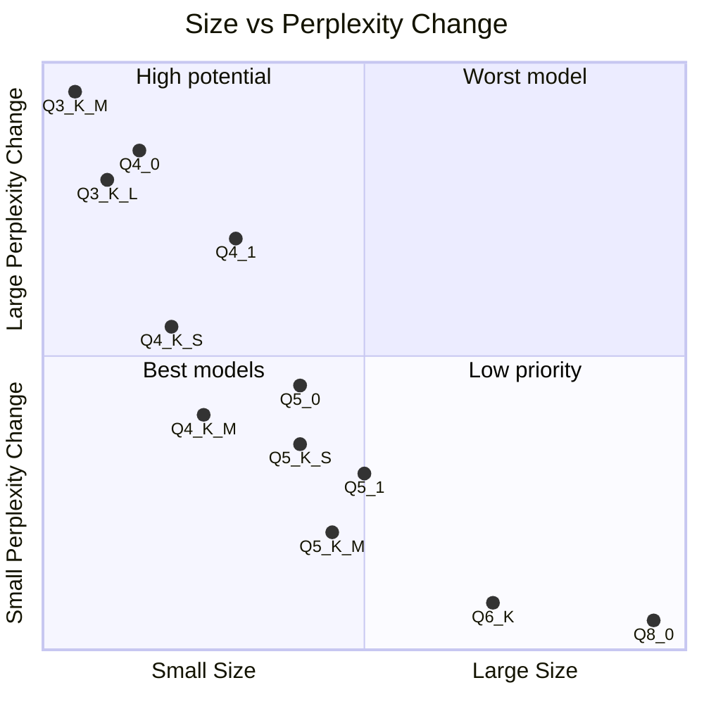

<!--more-->

When we deploy llama.cpp or Ollama instances, we prefer to run a quantized model to save memory and speed up inference.

But the quality of the quantized model is not always good. We need to choose a proper quantization type to balance the quality and the performance. 

## Quantization Type in llama.cpp

There are many quantization types in llama.cpp. You can see this print when you try to quantize a model.

```text
Allowed quantization types:
   2  or  Q4_0    :  3.56G, +0.2166 ppl @ LLaMA-v1-7B
   3  or  Q4_1    :  3.90G, +0.1585 ppl @ LLaMA-v1-7B
   8  or  Q5_0    :  4.33G, +0.0683 ppl @ LLaMA-v1-7B
   9  or  Q5_1    :  4.70G, +0.0349 ppl @ LLaMA-v1-7B
  19  or  IQ2_XXS :  2.06 bpw quantization
  20  or  IQ2_XS  :  2.31 bpw quantization
  24  or  IQ1_S   :  1.56 bpw quantization
  10  or  Q2_K    :  2.63G, +0.6717 ppl @ LLaMA-v1-7B
  21  or  Q2_K_S  :  2.16G, +9.0634 ppl @ LLaMA-v1-7B
  23  or  IQ3_XXS :  3.06 bpw quantization
  26  or  IQ3_S   :  3.44 bpw quantization
  27  or  IQ3_M   :  3.66 bpw quantization mix
  12  or  Q3_K    : alias for Q3_K_M
  22  or  Q3_K_XS : 3-bit extra small quantization
  11  or  Q3_K_S  :  2.75G, +0.5551 ppl @ LLaMA-v1-7B
  12  or  Q3_K_M  :  3.07G, +0.2496 ppl @ LLaMA-v1-7B
  13  or  Q3_K_L  :  3.35G, +0.1764 ppl @ LLaMA-v1-7B
  25  or  IQ4_NL  :  4.25 bpw non-linear quantization
  15  or  Q4_K    : alias for Q4_K_M
  14  or  Q4_K_S  :  3.59G, +0.0992 ppl @ LLaMA-v1-7B
  15  or  Q4_K_M  :  3.80G, +0.0532 ppl @ LLaMA-v1-7B
  17  or  Q5_K    : alias for Q5_K_M
  16  or  Q5_K_S  :  4.33G, +0.0400 ppl @ LLaMA-v1-7B
  17  or  Q5_K_M  :  4.45G, +0.0122 ppl @ LLaMA-v1-7B
  18  or  Q6_K    :  5.15G, +0.0008 ppl @ LLaMA-v1-7B
   7  or  Q8_0    :  6.70G, +0.0004 ppl @ LLaMA-v1-7B
   1  or  F16     : 13.00G              @ 7B
   0  or  F32     : 26.00G              @ 7B
          COPY    : only copy tensors, no quantizing
```

## Quantization Type Comparison

To help us compare the quantization types, I made a table to show the size and ppl (Perplexity) change of each quantization type. Smaller ppl change means better quality. Perplexity generally measures the confidence of the model predict result. The lower the perplexity, the better the model.

| Q Type | Size | ppl Change | Note |
|:---:|:---:|:---:|:---:|
| Q2\_K\_S | 2.16G | +9.0634 | @ LLaMA-v1-7B |
| Q2\_K | 2.63G | +0.6717 | @ LLaMA-v1-7B |
| Q3\_K\_S | 2.75G | +0.5551 | @ LLaMA-v1-7B |
| Q3\_K | - | - | alias for Q3\_K\_M |
| Q3\_K\_M | 3.07G | +0.2496 | @ LLaMA-v1-7B |
| Q3\_K\_L | 3.35G | +0.1764 | @ LLaMA-v1-7B |
| Q4\_0 | 3.56G | +0.2166 | @ LLaMA-v1-7B |
| Q4\_K\_S | 3.59G | +0.0992 | @ LLaMA-v1-7B |
| Q4\_K | - | - | alias for Q4\_K\_M |
| Q4\_K\_M | 3.80G | +0.0532 | @ LLaMA-v1-7B |
| Q4\_1 | 3.90G | +0.1585 | @ LLaMA-v1-7B |
| Q5\_0 | 4.33G | +0.0683 | @ LLaMA-v1-7B |
| Q5\_K\_S | 4.33G | +0.0400 | @ LLaMA-v1-7B |
| Q5\_1 | 4.70G | +0.0349 | @ LLaMA-v1-7B |
| Q5\_K | - | - | alias for Q5\_K\_M |
| Q5\_K\_M | 4.45G | +0.0122 | @ LLaMA-v1-7B |
| Q6\_K | 5.15G | +0.0008 | @ LLaMA-v1-7B |
| Q8\_0 | 6.70G | +0.0004 | @ LLaMA-v1-7B |

To help us understand the relationship between size and ppl change, I made a quadrant chart to show the relationship.



## Summary

From the table and the scatter plot, we can see that Q8\_0 has the best quality, but the size is the largest. Q2\_K\_S has the worst quality, but the size is the smallest. Q4\_K\_M has the best balance between quality and size. But I recommend Q5\_K\_M, which has a good quality and a reasonable size.

For small model, like 7B, 14B. I recommend Q6\_K, even it's larger than Q5\_K\_M, but the ppl change is extremely small. For GPU like RTX 4090, 24GB VRAM is more than enough. But for GPU, other quantization types like exl2 maybe a better choice.