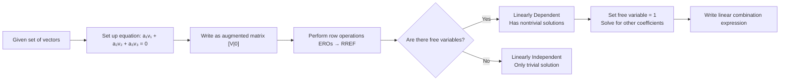
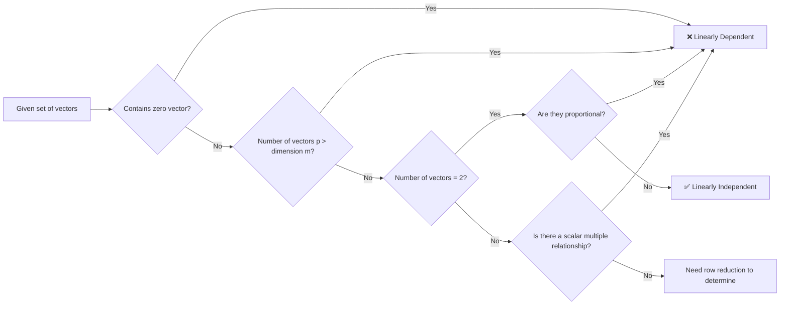

<!--more-->

## Overview

Exam #3 will be administered in Test Block on Wednesday, April 1 and will cover matrix algebra sections **1.1, 1.2, 1.3, 1.5, 1.6, 1.7, 1.9, and 3.2**.

If you submitted a ANSS memo with accommodations for exams, you will be contacted via email with details regarding the alternate location of your exam. Only students who have emailed the instructor their accommodations memorandum by Monday 3/30 at 5PM will be able to use their testing accommodations on Exam 3.

You will have 70 minutes to complete the exam. Students must arrive on time and listen to instructions regarding seating requirements. Students must leave all belongings (backpacks and jackets) in the front of the exam room up against the wall.  Do not block any exits or obstruct any walkways. You will not be granted any additional time to complete your exam if you arrive after the exam has begun. Students will be required to sign in and collected exams will be cross-checked with the sign-in sheets. Exams from students who do not sign in will not be graded.

## Questions

### Q1. System of Linear Equations with Parameters

> Consider the system $\begin{cases} x_1 = 1 \\ 2x_1 + (a^2+a-2)x_2 = a^2-a-4 \end{cases}$  
> Determine the value(s) of $a$ such that the system has
> - (i) infinitely many solutions
> - (ii) no solution
> - (iii) a unique solution with $x_2=0$
>
> Write down the vector form of the solution


We are given the system:
$$\begin{cases} x_1 = 1 \\ 2x_1 + (a^2+a-2)x_2 = a^2-a-4 \end{cases}$$

Substitute $x_1 = 1$ into the second equation:
$$2(1) + (a^2+a-2)x_2 = a^2-a-4$$
$$(a^2+a-2)x_2 = a^2-a-6$$

**Case Analysis:**

**(i) Infinitely many solutions:**  
This occurs when both coefficients and constants are zero:  
$$a^2+a-2 = 0 \quad \text{and} \quad a^2-a-6 = 0$$  
Solving $a^2+a-2=0$: $(a+2)(a-1)=0 \implies a = -2, 1$  
Solving $a^2-a-6=0$: $(a-3)(a+2)=0 \implies a = -2, 3$  
The common value is $a = -2$.

When $a = -2$, the equation becomes $0 \cdot x_2 = 0$, which is always true.  
**Solution:** $x_1 = 1$, $x_2$ is free.  
**Vector form:** $\vec{x} = \begin{bmatrix} 1 \\ 0 \end{bmatrix} + x_2 \begin{bmatrix} 0 \\ 1 \end{bmatrix}$

**(ii) No solution:**
This occurs when the coefficient is zero but the constant is non-zero.  
From above, $a^2+a-2=0$ gives $a = -2, 1$
- For $a = -2$: $0 \cdot x_2 = 0$ (infinitely many solutions, not no solution)
- For $a = 1$: $0 \cdot x_2 = 1^2-1-6 = -6 \neq 0$ (no solution)

**Answer:** $a = 1$

**(iii) Unique solution with $x_2 = 0$:**  
For unique solution, we need $a^2+a-2 \neq 0$, so $a \neq -2, 1$.  
For $x_2 = 0$, we need $a^2-a-6 = 0$, so $a = -2, 3$.  
Since $a \neq -2$, we must have $a = 3$.

When $a = 3$: $x_2 = 0$ and $x_1 = 1$.  
**Vector form:** $\vec{x} = \begin{bmatrix} 1 \\ 0 \end{bmatrix}$

**Final Answer**
- (i) Infinitely many solutions: $a = -2$, $\vec{x} = \begin{bmatrix} 1 \\ 0 \end{bmatrix} + x_2 \begin{bmatrix} 0 \\ 1 \end{bmatrix}$
- (ii) No solution: $a = 1$
- (iii) Unique solution with $x_2=0$: $a = 3$, $\vec{x} = \begin{bmatrix} 1 \\ 0 \end{bmatrix}$


### Q2. System of Linear Equations (Part 1)

> Solve the system or state that the system has no solutions:  
> $\begin{cases} 2x_1 + 4x_2 + 6x_3 = 0 \\ 4x_1 + 5x_2 + 6x_3 = 3 \\ 7x_1 + 8x_2 + 9x_3 = 6 \end{cases}$


We form the augmented matrix and perform row reduction:
$$\left[\begin{array}{ccc|c} 2 & 4 & 6 & 0 \\ 4 & 5 & 6 & 3 \\ 7 & 8 & 9 & 6 \end{array}\right]$$

**Step 0:** Write the augmented matrix (already done above)

**Step 1:** Begin with the leftmost nonzero column. Make the leading entry 1 by $R_1 \leftarrow \frac{1}{2}R_1$:
$$\left[\begin{array}{ccc|c} 1 & 2 & 3 & 0 \\ 4 & 5 & 6 & 3 \\ 7 & 8 & 9 & 6 \end{array}\right]$$

**Step 2:** Use elimination to create zeros below the leading 1.  
$R_2 \leftarrow R_2 - 4R_1$, $R_3 \leftarrow R_3 - 7R_1$:
$$\left[\begin{array}{ccc|c} 1 & 2 & 3 & 0 \\ 0 & -3 & -6 & 3 \\ 0 & -6 & -12 & 6 \end{array}\right]$$

**Step 3:** Repeat steps 1 and 2 (ignoring Row 1). Make the leading entry in Row 2 equal to 1 by $R_2 \leftarrow -\frac{1}{3}R_2$:
$$\left[\begin{array}{ccc|c} 1 & 2 & 3 & 0 \\ 0 & 1 & 2 & -1 \\ 0 & -6 & -12 & 6 \end{array}\right]$$

**Step 4:** Create zeros below the leading 1 in Row 2.  
$R_3 \leftarrow R_3 + 6R_2$:
$$\left[\begin{array}{ccc|c} 1 & 2 & 3 & 0 \\ 0 & 1 & 2 & -1 \\ 0 & 0 & 0 & 0 \end{array}\right]$$

The matrix is now in **echelon form**. The last row is all zeros, so the system is **consistent**. Since Column 3 has no leading 1, $x_3$ is a **free variable**, and the system has **infinitely many solutions**.

**Step 5:** Create zeros above each leading 1 (working upward from right to left) to get **Reduced Row Echelon Form (RREF)**.  
$R_1 \leftarrow R_1 - 2R_2$:
$$\left[\begin{array}{ccc|c} 1 & 0 & -1 & 2 \\ 0 & 1 & 2 & -1 \\ 0 & 0 & 0 & 0 \end{array}\right]$$

**Step 6:** Write the system of equations corresponding to the RREF:
$$\begin{cases} x_1 - x_3 = 2 \\ x_2 + 2x_3 = -1 \end{cases}$$

**Solve for pivot variables:**
$$\begin{cases} x_1 = 2 + x_3 \\ x_2 = -1 - 2x_3 \\ x_3 = \text{free} \end{cases}$$

**Final Answer**
The system has infinitely many solutions. In vector form:
$$\vec{x} = \begin{bmatrix} x_1 \\ x_2 \\ x_3 \end{bmatrix} = \begin{bmatrix} 2 \\ -1 \\ 0 \end{bmatrix} + x_3 \begin{bmatrix} 1 \\ -2 \\ 1 \end{bmatrix}$$


### Q3. System of Linear Equations (Part 2)

> Solve the system or state that the system has no solutions:  
> $\begin{cases} 2x_1 + 4x_2 + 6x_3 = 0 \\ 4x_1 + 5x_2 + 6x_3 = 3 \\ 7x_1 + 8x_2 + 9x_3 = 0 \end{cases}$


We form the augmented matrix and perform Gaussian elimination:

$$\left[\begin{array}{ccc|c} 2 & 4 & 6 & 0 \\ 4 & 5 & 6 & 3 \\ 7 & 8 & 9 & 0 \end{array}\right]$$

**Step 1:** Eliminate $x_1$ from rows 2 and 3
- $R_2 \leftarrow R_2 - 2R_1$: $[4, 5, 6, 3] - [4, 8, 12, 0] = [0, -3, -6, 3]$
- $R_3 \leftarrow R_3 - \frac{7}{2}R_1$: $[7, 8, 9, 0] - [7, 14, 21, 0] = [0, -6, -12, 0]$

$$\left[\begin{array}{ccc|c} 2 & 4 & 6 & 0 \\ 0 & -3 & -6 & 3 \\ 0 & -6 & -12 & 0 \end{array}\right]$$

**Step 2:** Simplify row 2
- $R_2 \leftarrow -\frac{1}{3}R_2$: $[0, 1, 2, -1]$

$$\left[\begin{array}{ccc|c} 2 & 4 & 6 & 0 \\ 0 & 1 & 2 & -1 \\ 0 & -6 & -12 & 0 \end{array}\right]$$

**Step 3:** Eliminate $x_2$ from row 3
- $R_3 \leftarrow R_3 + 6R_2$: $[0, -6, -12, 0] + [0, 6, 12, -6] = [0, 0, 0, -6]$

$$\left[\begin{array}{ccc|c} 2 & 4 & 6 & 0 \\ 0 & 1 & 2 & -1 \\ 0 & 0 & 0 & -6 \end{array}\right]$$

**Analysis:**
The last row represents the equation:
$$0x_1 + 0x_2 + 0x_3 = -6$$
which simplifies to $0 = -6$, a **contradiction**.

This indicates that the system is **inconsistent** and has **no solution**.

**Verification:**
Let's check if the equations are compatible by examining the relationships:
- From equations 1 and 2, we found $x_2 = -1 - 2x_3$ and $x_1 = 2 + x_3$ (as in Q2)
- Substituting into equation 3: $7(2+x_3) + 8(-1-2x_3) + 9x_3 = 14 + 7x_3 - 8 - 16x_3 + 9x_3 = 6 \neq 0$

This confirms the inconsistency.

**Final Answer**
The system has **no solutions** (inconsistent).


### Q4. Augmented Matrices in RREF

> Each of the following matrices are the augmented matrix for a system of linear equations in reduced row echelon form, state whether the system is consistent or inconsistent. If the system is consistent, give the vector form of the solution.  
> a) $\left[\begin{array}{ccc|c} 1 & 0 & 0 & 7 \\ 0 & 1 & 0 & -2 \\ 0 & 0 & 1 & 3 \\ 0 & 0 & 0 & 0 \end{array}\right]$  
> b) $\left[\begin{array}{cccc|c} 1 & -2 & 0 & 7 & 5 \\ 0 & 0 & 1 & -4 & 3 \\ 0 & 0 & 0 & 0 & 0 \end{array}\right]$  
> c) $\left[\begin{array}{ccc|c} 1 & 2 & -1 & 0 \\ 0 & 0 & 1 & 0 \\ 0 & 0 & 0 & 1 \end{array}\right]$


**a)** 
The matrix is:
$$\left[\begin{array}{ccc|c} 1 & 0 & 0 & 7 \\ 0 & 1 & 0 & -2 \\ 0 & 0 & 1 & 3 \\ 0 & 0 & 0 & 0 \end{array}\right]$$

This represents:
- $x_1 = 7$
- $x_2 = -2$
- $x_3 = 3$
- $0 = 0$ (consistent)

**Answer:** Consistent. Solution: $\vec{x} = \begin{bmatrix} 7 \\ -2 \\ 3 \end{bmatrix}$

**b)**
The matrix is:
$$\left[\begin{array}{cccc|c} 1 & -2 & 0 & 7 & 5 \\ 0 & 0 & 1 & -4 & 3 \\ 0 & 0 & 0 & 0 & 0 \end{array}\right]$$

This represents:
- $x_1 - 2x_2 + 7x_4 = 5$
- $x_3 - 4x_4 = 3$
- $0 = 0$ (consistent)

Free variables: $x_2, x_4$

From equation 2: $x_3 = 3 + 4x_4$
From equation 1: $x_1 = 5 + 2x_2 - 7x_4$

**Answer:** Consistent. Solution: $\vec{x} = \begin{bmatrix} 5 \\ 0 \\ 3 \\ 0 \end{bmatrix} + x_2 \begin{bmatrix} 2 \\ 1 \\ 0 \\ 0 \end{bmatrix} + x_4 \begin{bmatrix} -7 \\ 0 \\ 4 \\ 1 \end{bmatrix}$

**c)**
The matrix is:
$$\left[\begin{array}{ccc|c} 1 & 2 & -1 & 0 \\ 0 & 0 & 1 & 0 \\ 0 & 0 & 0 & 1 \end{array}\right]$$

The last row gives $0 = 1$, which is a contradiction.

**Answer:** Inconsistent.

**Final Answer**
- a) Consistent: $\vec{x} = \begin{bmatrix} 7 \\ -2 \\ 3 \end{bmatrix}$
- b) Consistent: $\vec{x} = \begin{bmatrix} 5 \\ 0 \\ 3 \\ 0 \end{bmatrix} + x_2 \begin{bmatrix} 2 \\ 1 \\ 0 \\ 0 \end{bmatrix} + x_4 \begin{bmatrix} -7 \\ 0 \\ 4 \\ 1 \end{bmatrix}$
- c) Inconsistent


### Q5. Consistency Conditions for Linear Systems

> Consider the system: $\begin{cases} x_1 + 5x_2 + 3x_4 = b_1 \\ -x_1 - 5x_2 + x_3 - 5x_4 = b_2 \\ x_1 + 5x_2 + 3x_3 - 3x_4 = b_3 \end{cases}$  
> (a) Determine conditions on $b_1, b_2, b_3$ that are necessary and sufficient for the system to be consistent.  
> (b) In each of the following, use your answer from (a) to show the system is consistent or inconsistent. If the system is consistent, give the vector form of the solution.
> - (i) $b_1 = -1, b_2 = 2, b_3 = 1$
> - (ii) $b_1 = 1, b_2 = 1, b_3 = 7$


**Part (a): Find consistency conditions**

Form the augmented matrix:
$$\left[\begin{array}{cccc|c} 1 & 5 & 0 & 3 & b_1 \\ -1 & -5 & 1 & -5 & b_2 \\ 1 & 5 & 3 & -3 & b_3 \end{array}\right]$$

**Row reduction:**  
$R_2 \leftarrow R_2 + R_1$: $[0, 0, 1, -2 | b_1 + b_2]$  
$R_3 \leftarrow R_3 - R_1$: $[0, 0, 3, -6 | b_3 - b_1]$

$$\left[\begin{array}{cccc|c} 1 & 5 & 0 & 3 & b_1 \\ 0 & 0 & 1 & -2 & b_1 + b_2 \\ 0 & 0 & 3 & -6 & b_3 - b_1 \end{array}\right]$$

$R_3 \leftarrow R_3 - 3R_2$: $[0, 0, 0, 0 | b_3 - b_1 - 3(b_1 + b_2)] = [0, 0, 0, 0 | b_3 - 4b_1 - 3b_2]$

For consistency, we need:
$$b_3 - 4b_1 - 3b_2 = 0 \implies b_3 = 4b_1 + 3b_2$$

**Answer (a):** The system is consistent if and only if $b_3 = 4b_1 + 3b_2$.

---

**Part (b): Check specific cases**

**(I) $b_1 = -1, b_2 = 2, b_3 = 1$**  
Check: $4b_1 + 3b_2 = 4(-1) + 3(2) = -4 + 6 = 2 \neq 1 = b_3$  
**Answer:** Inconsistent.

**(II) $b_1 = 1, b_2 = 1, b_3 = 7$**  
Check: $4b_1 + 3b_2 = 4(1) + 3(1) = 7 = b_3$  
**Answer:** Consistent.

Find the solution:  
From row reduction:  
- $x_3 - 2x_4 = b_1 + b_2 = 2 \implies x_3 = 2 + 2x_4$
- $x_1 + 5x_2 + 3x_4 = b_1 = 1 \implies x_1 = 1 - 5x_2 - 3x_4$

Free variables: $x_2, x_4$

**Vector form:** $\vec{x} = \begin{bmatrix} 1 \\ 0 \\ 2 \\ 0 \end{bmatrix} + x_2 \begin{bmatrix} -5 \\ 1 \\ 0 \\ 0 \end{bmatrix} + x_4 \begin{bmatrix} -3 \\ 0 \\ 2 \\ 1 \end{bmatrix}$

**Final Answer**
- (a) Consistency condition: $b_3 = 4b_1 + 3b_2$
- (b)(I) Inconsistent
- (b)(II) Consistent: $\vec{x} = \begin{bmatrix} 1 \\ 0 \\ 2 \\ 0 \end{bmatrix} + x_2 \begin{bmatrix} -5 \\ 1 \\ 0 \\ 0 \end{bmatrix} + x_4 \begin{bmatrix} -3 \\ 0 \\ 2 \\ 1 \end{bmatrix}$


### Q6. Matrix Operations

> $A=\begin{bmatrix} -3 & 1 \\ 2 & -1 \end{bmatrix}, B=\begin{bmatrix} 0 & 4 \\ -2 & 5 \end{bmatrix}, C=\begin{bmatrix} 5 & 0 \\ -1 & 4 \\ 3 & 3 \end{bmatrix}, D=\begin{bmatrix} 1 & 0 & -3 \\ -2 & 5 & -1 \end{bmatrix}, E=\begin{bmatrix} 1 & 4 & -5 \\ -2 & 1 & -3 \\ 0 & 2 & 6 \end{bmatrix}$.  
> Find the following, if defined, otherwise explain why the computation is not possible.  
> a) $CA$  
> b) $AC$  
> c) $(A-B)D$  
> d) $B(C^T + D)$  
> e) $CE$  
> f) $C^T B$


**a) $CA$**  
$C$ is $3 \times 2$, $A$ is $2 \times 2$. Product is defined ($3 \times 2$).
$$CA = \begin{bmatrix} 5 & 0 \\ -1 & 4 \\ 3 & 3 \end{bmatrix} \begin{bmatrix} -3 & 1 \\ 2 & -1 \end{bmatrix} = \begin{bmatrix} -15 & 5 \\ 11 & -5 \\ -3 & 0 \end{bmatrix}$$

---

**b) $AC$**  
$A$ is $2 \times 2$, $C$ is $3 \times 2$. Product is NOT defined (columns of A = 2, rows of C = 3).  
**Answer:** Not defined.

---

**c) $(A-B)D$**  
$A-B = \begin{bmatrix} -3 & 1 \\ 2 & -1 \end{bmatrix} - \begin{bmatrix} 0 & 4 \\ -2 & 5 \end{bmatrix} = \begin{bmatrix} -3 & -3 \\ 4 & -6 \end{bmatrix}$  
$(A-B)$ is $2 \times 2$, $D$ is $2 \times 3$. Product is defined ($2 \times 3$).
$$(A-B)D = \begin{bmatrix} -3 & -3 \\ 4 & -6 \end{bmatrix} \begin{bmatrix} 1 & 0 & -3 \\ -2 & 5 & -1 \end{bmatrix} = \begin{bmatrix} 3 & -15 & 12 \\ 16 & -30 & -6 \end{bmatrix}$$

---

**d) $B(C^T + D)$**  
$C^T = \begin{bmatrix} 5 & -1 & 3 \\ 0 & 4 & 3 \end{bmatrix}$, $D = \begin{bmatrix} 1 & 0 & -3 \\ -2 & 5 & -1 \end{bmatrix}$  
$C^T + D = \begin{bmatrix} 6 & -1 & 0 \\ -2 & 9 & 2 \end{bmatrix}$  
$B$ is $2 \times 2$, $C^T + D$ is $2 \times 3$. Product is defined ($2 \times 3$).
$$B(C^T + D) = \begin{bmatrix} 0 & 4 \\ -2 & 5 \end{bmatrix} \begin{bmatrix} 6 & -1 & 0 \\ -2 & 9 & 2 \end{bmatrix} = \begin{bmatrix} -8 & 36 & 8 \\ -22 & 47 & 10 \end{bmatrix}$$

---

**e) $CE$**  
$C$ is $3 \times 2$, $E$ is $3 \times 3$. Product is NOT defined (columns of C = 2, rows of E = 3).  
**Answer:** Not defined.

---

**f) $C^T B$**  
$C^T$ is $2 \times 3$, $B$ is $2 \times 2$. Product is NOT defined (columns of C^T = 3, rows of B = 2).  
**Answer:** Not defined.

---

**Final Answer**
- a) $CA = \begin{bmatrix} -15 & 5 \\ 11 & -5 \\ -3 & 0 \end{bmatrix}$
- b) Not defined (dimension mismatch)
- c) $(A-B)D = \begin{bmatrix} 3 & -15 & 12 \\ 16 & -30 & -6 \end{bmatrix}$
- d) $B(C^T + D) = \begin{bmatrix} -8 & 36 & 8 \\ -22 & 47 & 10 \end{bmatrix}$
- e) Not defined (dimension mismatch)
- f) Not defined (dimension mismatch)


### Q7. Linear Independence of Vectors

> Determine whether the vectors $\begin{bmatrix} 1 \\ 0 \\ 2 \end{bmatrix}, \begin{bmatrix} 2 \\ -3 \\ 1 \end{bmatrix}, \begin{bmatrix} 1 \\ 3 \\ 5 \end{bmatrix}$ are linearly independent. If they are linearly dependent, express one vector in the set as a linear combination of the others.



Let $\vec{v}_1 = \begin{bmatrix} 1 \\ 0 \\ 2 \end{bmatrix}, \vec{v}_2 = \begin{bmatrix} 2 \\ -3 \\ 1 \end{bmatrix}, \vec{v}_3 = \begin{bmatrix} 1 \\ 3 \\ 5 \end{bmatrix}$

**Step 1:** Let $a_1\vec{v}_1 + a_2\vec{v}_2 + a_3\vec{v}_3 = \vec{0}$, is $a_1 = a_2 = a_3 = 0$ the only solution?

$$a_1\vec{v}_1 + a_2\vec{v}_2 + a_3\vec{v}_3 = \vec{0} \Rightarrow \begin{bmatrix} 1 & 2 & 1 \\ 0 & -3 & 3 \\ 2 & 1 & 5 \end{bmatrix} \begin{bmatrix} a_1 \\ a_2 \\ a_3 \end{bmatrix} = \begin{bmatrix} 0 \\ 0 \\ 0 \end{bmatrix} \Rightarrow \left[\begin{array}{ccc|c} 1 & 2 & 1 & 0 \\ 0 & -3 & 3 & 0 \\ 2 & 1 & 5 & 0 \end{array}\right]$$

**Step 2:** Perform EROs to reduce to RREF:

$$\left[\begin{array}{ccc|c} 1 & 2 & 1 & 0 \\ 0 & -3 & 3 & 0 \\ 2 & 1 & 5 & 0 \end{array}\right] \xrightarrow{R_3 \to R_3 - 2R_1} \left[\begin{array}{ccc|c} 1 & 2 & 1 & 0 \\ 0 & -3 & 3 & 0 \\ 0 & -3 & 3 & 0 \end{array}\right]$$

$$\xrightarrow{R_3 \to R_3 - R_2} \left[\begin{array}{ccc|c} 1 & 2 & 1 & 0 \\ 0 & -3 & 3 & 0 \\ 0 & 0 & 0 & 0 \end{array}\right] \xrightarrow{R_2 \to -\frac{1}{3}R_2} \left[\begin{array}{ccc|c} 1 & 2 & 1 & 0 \\ 0 & 1 & -1 & 0 \\ 0 & 0 & 0 & 0 \end{array}\right]$$

$$\xrightarrow{R_1 \to R_1 - 2R_2} \left[\begin{array}{ccc|c} 1 & 0 & 3 & 0 \\ 0 & 1 & -1 & 0 \\ 0 & 0 & 0 & 0 \end{array}\right]$$

**Step 3:** Analyze the RREF:
- **Leading 1 columns**: Column 1 and Column 2
- **Free column**: Column 3 $\Rightarrow$ $a_3$ is a **free variable**

Since there is a free variable, the system has **infinitely many (nontrivial) solutions**.

$$\Rightarrow \begin{cases} a_1 + 3a_3 = 0 \Rightarrow a_1 = -3a_3 \\ a_2 - a_3 = 0 \Rightarrow a_2 = a_3 \\ a_3 = a_3 \quad (a_3 \in \mathbb{R}) \end{cases}$$

**Step 4:** To write one vector in terms of the others, choose a nonzero value for the free variable.

Let $a_3 = 1 \Rightarrow a_1 = -3(1) = -3, a_2 = 1$

$$\Rightarrow -3\vec{v}_1 + 1\vec{v}_2 + 1\vec{v}_3 = \vec{0} \Rightarrow \vec{v}_3 = 3\vec{v}_1 - \vec{v}_2$$

**Check:** $3\vec{v}_1 - \vec{v}_2 = 3\begin{bmatrix} 1 \\ 0 \\ 2 \end{bmatrix} - \begin{bmatrix} 2 \\ -3 \\ 1 \end{bmatrix} = \begin{bmatrix} 3 \\ 0 \\ 6 \end{bmatrix} - \begin{bmatrix} 2 \\ -3 \\ 1 \end{bmatrix} = \begin{bmatrix} 1 \\ 3 \\ 5 \end{bmatrix} = \vec{v}_3$ ✓

**Conclusion:**

Since the system has nontrivial solution, $\{\vec{v}_1, \vec{v}_2, \vec{v}_3\}$ is **linearly dependent**.

One vector can be expressed as:
$$\vec{v}_3 = 3\vec{v}_1 - \vec{v}_2 \quad \text{or} \quad \begin{bmatrix} 1 \\ 3 \\ 5 \end{bmatrix} = 3\begin{bmatrix} 1 \\ 0 \\ 2 \end{bmatrix} - \begin{bmatrix} 2 \\ -3 \\ 1 \end{bmatrix}$$


### Q8. Linear Independence by Inspection

> Determine if the set of vectors in $\mathbb{R}^3$ is linearly independent or linearly dependent. Justify your answer. (Hint: all can be done by inspection.)  
> a) $\left\{ \begin{bmatrix} 0 \\ -2 \\ 8 \end{bmatrix}, \begin{bmatrix} 4 \\ 4 \\ 9 \end{bmatrix} \right\}$  
> b) $\left\{ \begin{bmatrix} 3 \\ 2 \\ -4 \end{bmatrix}, \begin{bmatrix} -6 \\ 1 \\ 7 \end{bmatrix}, \begin{bmatrix} 6 \\ -5 \\ 2 \end{bmatrix}, \begin{bmatrix} 3 \\ 7 \\ -5 \end{bmatrix} \right\}$  
> c) $\left\{ \begin{bmatrix} 3 \\ 1 \\ 5 \end{bmatrix}, \begin{bmatrix} 0 \\ 0 \\ 0 \end{bmatrix}, \begin{bmatrix} 0 \\ 7 \\ 8 \end{bmatrix} \right\}$  
> d) $\left\{ \begin{bmatrix} 3 \\ 1 \\ -2 \end{bmatrix}, \begin{bmatrix} 2 \\ -1 \\ 5 \end{bmatrix}, \begin{bmatrix} 12 \\ 4 \\ -8 \end{bmatrix} \right\}$


**Step-by-Step Solution**

**a)** $\left\{ \begin{bmatrix} 0 \\ -2 \\ 8 \end{bmatrix}, \begin{bmatrix} 4 \\ 4 \\ 9 \end{bmatrix} \right\}$

**Observation**:
- This is a set of **2 vectors** in $\mathbb{R}^3$.
- Check for proportionality: The first component of the first vector is $0$, while the second is $4$.
- There is no scalar $c$ such that $\begin{bmatrix} 0 \\ -2 \\ 8 \end{bmatrix} = c \begin{bmatrix} 4 \\ 4 \\ 9 \end{bmatrix}$.

**Conclusion**: ✅ **Linearly Independent**

**Reason**: The two vectors are not scalar multiples of each other.

---

**b)** $\left\{ \begin{bmatrix} 3 \\ 2 \\ -4 \end{bmatrix}, \begin{bmatrix} -6 \\ 1 \\ 7 \end{bmatrix}, \begin{bmatrix} 6 \\ -5 \\ 2 \end{bmatrix}, \begin{bmatrix} 3 \\ 7 \\ -5 \end{bmatrix} \right\}$

**Observation**:
- This is a set of **4 vectors** in $\mathbb{R}^3$.
- Number of vectors $p = 4$, dimension $m = 3$.
- Condition $p > m$ (4 > 3) is satisfied.

**Conclusion**: ❌ **Linearly Dependent**

**Reason**: In $\mathbb{R}^m$, any set with more than $m$ vectors must be linearly dependent (Pigeonhole Principle).

---

**c)** $\left\{ \begin{bmatrix} 3 \\ 1 \\ 5 \end{bmatrix}, \begin{bmatrix} 0 \\ 0 \\ 0 \end{bmatrix}, \begin{bmatrix} 0 \\ 7 \\ 8 \end{bmatrix} \right\}$

**Observation**:
- The set contains the **zero vector** $\vec{0} = \begin{bmatrix} 0 \\ 0 \\ 0 \end{bmatrix}$.

**Conclusion**: ❌ **Linearly Dependent**

**Reason**: Any set containing the zero vector is linearly dependent.
- Proof: $1 \cdot \vec{0} + 0 \cdot \vec{v}_1 + 0 \cdot \vec{v}_3 = \vec{0}$ is a nontrivial solution.

---

**d)** $\left\{ \begin{bmatrix} 3 \\ 1 \\ -2 \end{bmatrix}, \begin{bmatrix} 2 \\ -1 \\ 5 \end{bmatrix}, \begin{bmatrix} 12 \\ 4 \\ -8 \end{bmatrix} \right\}$

**Observation**:
- Check the 1st and 3rd vectors:
$$\begin{bmatrix} 12 \\ 4 \\ -8 \end{bmatrix} = 4 \times \begin{bmatrix} 3 \\ 1 \\ -2 \end{bmatrix}$$
- The 3rd vector is exactly **4 times** the 1st vector.

**Conclusion**: ❌ **Linearly Dependent**

**Reason**: There is a scalar multiple relationship, $\vec{v}_3 = 4\vec{v}_1$.

---

**Summary Table**

| Part | # of Vectors | Dimension | Judgment Basis | Conclusion |
|------|--------------|-----------|----------------|------------|
| **a)** | 2 | 3 | Not scalar multiples | ✅ Linearly Independent |
| **b)** | 4 | 3 | $p > m$ | ❌ Linearly Dependent |
| **c)** | 3 | 3 | Contains $\vec{0}$ | ❌ Linearly Dependent |
| **d)** | 3 | 3 | Scalar multiples exist | ❌ Linearly Dependent |

---

**Final Answer**
- **a)** Linearly Independent
- **b)** Linearly Dependent (4 vectors in $\mathbb{R}^3$)
- **c)** Linearly Dependent (contains zero vector)
- **d)** Linearly Dependent ($\vec{v}_3 = 4\vec{v}_1$)


### Q9. Matrix Nonsingularity and Inverse

> Consider $A = \begin{bmatrix} \lambda & 2 \\ 2 & \lambda-3 \end{bmatrix}$.  
> (a) For what value(s) of $\lambda$ is the matrix nonsingular?  
> (b) When $A$ is nonsingular, find $A^{-1}$ (in terms of $\lambda$).


**Part (a): Find values of $\lambda$ for which $A$ is nonsingular**

A matrix is nonsingular if and only if its determinant is non-zero.
$$\det(A) = \lambda(\lambda-3) - 4 = \lambda^2 - 3\lambda - 4 = (\lambda-4)(\lambda+1)$$

For $A$ to be nonsingular: $\det(A) \neq 0$
$$(\lambda-4)(\lambda+1) \neq 0 \implies \lambda \neq 4 \text{ and } \lambda \neq -1$$

**Answer (a):** $A$ is nonsingular for all $\lambda \neq 4$ and $\lambda \neq -1$.

---

**Part (b): Find $A^{-1}$**

For a $2 \times 2$ matrix $\begin{bmatrix} a & b \\ c & d \end{bmatrix}$, the inverse is:
$$\frac{1}{ad-bc} \begin{bmatrix} d & -b \\ -c & a \end{bmatrix}$$

So:
$$A^{-1} = \frac{1}{(\lambda-4)(\lambda+1)} \begin{bmatrix} \lambda-3 & -2 \\ -2 & \lambda \end{bmatrix}$$

**Final Answer**
- (a) $A$ is nonsingular for $\lambda \neq 4$ and $\lambda \neq -1$
- (b) $A^{-1} = \frac{1}{(\lambda-4)(\lambda+1)} \begin{bmatrix} \lambda-3 & -2 \\ -2 & \lambda \end{bmatrix}$


### Q10. Matrix Inverse and Solving Linear Systems

> Let $A = \begin{bmatrix} 1 & -2 & -3 \\ 1 & -1 & -2 \\ -1 & 3 & 5 \end{bmatrix}$.  
> (a) Find $A^{-1}$.  
> (b) Use your answer from (a) to solve the system $\begin{cases} x_1 - 2x_2 - 3x_3 = -1 \\ x_1 - x_2 - 2x_3 = 1 \\ -x_1 + 3x_2 + 5x_3 = 2 \end{cases}$


**Part (a): Find $A^{-1}$**

First, calculate the determinant:
$$\det(A) = 1 \cdot \det\begin{bmatrix} -1 & -2 \\ 3 & 5 \end{bmatrix} - (-2) \cdot \det\begin{bmatrix} 1 & -2 \\ -1 & 5 \end{bmatrix} + (-3) \cdot \det\begin{bmatrix} 1 & -1 \\ -1 & 3 \end{bmatrix}$$
$$= 1(-5 + 6) + 2(5 - 2) - 3(3 - 1)$$
$$= 1(1) + 2(3) - 3(2) = 1 + 6 - 6 = 1$$

Since $\det(A) = 1 \neq 0$, $A$ is invertible.

Now find the cofactor matrix:
- $C_{11} = +(-1 \cdot 5 - (-2) \cdot 3) = 1$
- $C_{12} = -(1 \cdot 5 - (-2) \cdot (-1)) = -3$
- $C_{13} = +(1 \cdot 3 - (-1) \cdot (-1)) = 2$
- $C_{21} = -(-2 \cdot 5 - (-3) \cdot 3) = 1$
- $C_{22} = +(1 \cdot 5 - (-3) \cdot (-1)) = 2$
- $C_{23} = -(1 \cdot 3 - (-2) \cdot (-1)) = -1$
- $C_{31} = +(-2 \cdot (-2) - (-3) \cdot (-1)) = 1$
- $C_{32} = -(1 \cdot (-2) - (-3) \cdot 1) = -1$
- $C_{33} = +(1 \cdot (-1) - (-2) \cdot 1) = 1$

Cofactor matrix:
$$C = \begin{bmatrix} 1 & -3 & 2 \\ 1 & 2 & -1 \\ 1 & -1 & 1 \end{bmatrix}$$

The adjugate is the transpose of the cofactor matrix:
$$\text{adj}(A) = C^T = \begin{bmatrix} 1 & 1 & 1 \\ -3 & 2 & -1 \\ 2 & -1 & 1 \end{bmatrix}$$

Therefore:
$$A^{-1} = \frac{1}{\det(A)} \text{adj}(A) = \begin{bmatrix} 1 & 1 & 1 \\ -3 & 2 & -1 \\ 2 & -1 & 1 \end{bmatrix}$$

---

**Part (b): Solve the system**

The system can be written as $A\vec{x} = \vec{b}$ where $\vec{b} = \begin{bmatrix} -1 \\ 1 \\ 2 \end{bmatrix}$.

$$\vec{x} = A^{-1}\vec{b} = \begin{bmatrix} 1 & 1 & 1 \\ -3 & 2 & -1 \\ 2 & -1 & 1 \end{bmatrix} \begin{bmatrix} -1 \\ 1 \\ 2 \end{bmatrix}$$

Calculating each component:
- $x_1 = 1(-1) + 1(1) + 1(2) = -1 + 1 + 2 = 2$
- $x_2 = -3(-1) + 2(1) + (-1)(2) = 3 + 2 - 2 = 3$
- $x_3 = 2(-1) + (-1)(1) + 1(2) = -2 - 1 + 2 = -1$

So $\vec{x} = \begin{bmatrix} 2 \\ 3 \\ -1 \end{bmatrix}$

**Verification:**
- Equation 1: $1(2) - 2(3) - 3(-1) = 2 - 6 + 3 = -1$ ✓
- Equation 2: $1(2) - 1(3) - 2(-1) = 2 - 3 + 2 = 1$ ✓
- Equation 3: $-1(2) + 3(3) + 5(-1) = -2 + 9 - 5 = 2$ ✓

**Final Answer**
- (a) $A^{-1} = \begin{bmatrix} 1 & 1 & 1 \\ -3 & 2 & -1 \\ 2 & -1 & 1 \end{bmatrix}$
- (b) $\vec{x} = \begin{bmatrix} 2 \\ 3 \\ -1 \end{bmatrix}$


### Q11. Subspaces of $\mathbb{R}^2$

> Determine if the following subsets $W$ of $\mathbb{R}^2$ are subspaces of $\mathbb{R}^2$. If not, give an example that shows which condition is violated.  
> a) $W = \{ \vec{x} \in \mathbb{R}^2 : x_2 = 2x_1 \}$.  
> b) $W = \{ \vec{x} \in \mathbb{R}^2 : x_1 + x_2 = 1 \}$.


**a) $W = \{ \vec{x} \in \mathbb{R}^2 : x_2 = 2x_1 \}$**

Check the three subspace conditions:
1. **Contains zero vector:** $\vec{0} = \begin{bmatrix} 0 \\ 0 \end{bmatrix}$. Since $0 = 2(0)$, $\vec{0} \in W$. ✓
2. **Closed under addition:** If $\vec{u} = \begin{bmatrix} u_1 \\ 2u_1 \end{bmatrix}$ and $\vec{v} = \begin{bmatrix} v_1 \\ 2v_1 \end{bmatrix}$, then $\vec{u} + \vec{v} = \begin{bmatrix} u_1+v_1 \\ 2u_1+2v_1 \end{bmatrix} = \begin{bmatrix} u_1+v_1 \\ 2(u_1+v_1) \end{bmatrix} \in W$. ✓
3. **Closed under scalar multiplication:** If $\vec{u} = \begin{bmatrix} u_1 \\ 2u_1 \end{bmatrix}$ and $c \in \mathbb{R}$, then $c\vec{u} = \begin{bmatrix} cu_1 \\ 2cu_1 \end{bmatrix} \in W$. ✓

**Answer:** $W$ is a subspace of $\mathbb{R}^2$.

---

**b) $W = \{ \vec{x} \in \mathbb{R}^2 : x_1 + x_2 = 1 \}$**

Check the subspace conditions:
1. **Contains zero vector:** $\vec{0} = \begin{bmatrix} 0 \\ 0 \end{bmatrix}$. But $0 + 0 = 0 \neq 1$, so $\vec{0} \notin W$. ✗

**Answer:** $W$ is NOT a subspace of $\mathbb{R}^2$. Counterexample: The zero vector $\vec{0} = \begin{bmatrix} 0 \\ 0 \end{bmatrix}$ is not in $W$ since $0 + 0 = 0 \neq 1$.

**Final Answer**
- a) $W$ is a subspace of $\mathbb{R}^2$
- b) $W$ is NOT a subspace (does not contain the zero vector)


### Q12. Non-Subspace Counterexample

> Let $W$ be a subset of $\mathbb{R}^3$ defined by $W = \{ \vec{x} \in \mathbb{R}^3 : x_1 x_2 = x_3 \}$. Show that $W$ is not a subspace of $\mathbb{R}^3$. Give a specific counter example.


To show that $W$ is not a subspace, we need to find a violation of one of the subspace conditions.

Let's check if $W$ is closed under addition.

Take two vectors in $W$:
- $\vec{u} = \begin{bmatrix} 1 \\ 1 \\ 1 \end{bmatrix}$ (since $1 \cdot 1 = 1$)
- $\vec{v} = \begin{bmatrix} 2 \\ 2 \\ 4 \end{bmatrix}$ (since $2 \cdot 2 = 4$)

Both $\vec{u}, \vec{v} \in W$.

Now check $\vec{u} + \vec{v} = \begin{bmatrix} 1+2 \\ 1+2 \\ 1+4 \end{bmatrix} = \begin{bmatrix} 3 \\ 3 \\ 5 \end{bmatrix}$

For this to be in $W$, we need $3 \cdot 3 = 5$, but $9 \neq 5$.

**Answer:** $W$ is not a subspace of $\mathbb{R}^3$. 

**Counterexample:** $\vec{u} = \begin{bmatrix} 1 \\ 1 \\ 1 \end{bmatrix} \in W$ and $\vec{v} = \begin{bmatrix} 2 \\ 2 \\ 4 \end{bmatrix} \in W$, but $\vec{u} + \vec{v} = \begin{bmatrix} 3 \\ 3 \\ 5 \end{bmatrix} \notin W$ since $3 \cdot 3 = 9 \neq 5$.


### Q13. Subspace Verification and Geometric Description

> Let $W = \{ \vec{x} \in \mathbb{R}^3 : x_2 = x_3 + x_1 \}$. Show that $W$ is a subspace of $\mathbb{R}^3$ and then give a geometric description of $W$.


**Part 1: Show $W$ is a subspace**

The condition can be rewritten as: $x_1 - x_2 + x_3 = 0$

Check the three subspace conditions:

1. **Contains zero vector:** $\vec{0} = \begin{bmatrix} 0 \\ 0 \\ 0 \end{bmatrix}$. Since $0 - 0 + 0 = 0$, $\vec{0} \in W$. ✓

2. **Closed under addition:** If $\vec{x} = \begin{bmatrix} x_1 \\ x_2 \\ x_3 \end{bmatrix} \in W$ and $\vec{y} = \begin{bmatrix} y_1 \\ y_2 \\ y_3 \end{bmatrix} \in W$, then:
   - $x_1 - x_2 + x_3 = 0$
   - $y_1 - y_2 + y_3 = 0$
   
   For $\vec{x} + \vec{y} = \begin{bmatrix} x_1+y_1 \\ x_2+y_2 \\ x_3+y_3 \end{bmatrix}$:
   $$(x_1+y_1) - (x_2+y_2) + (x_3+y_3) = (x_1-x_2+x_3) + (y_1-y_2+y_3) = 0 + 0 = 0$$
   So $\vec{x} + \vec{y} \in W$. ✓

3. **Closed under scalar multiplication:** If $\vec{x} = \begin{bmatrix} x_1 \\ x_2 \\ x_3 \end{bmatrix} \in W$ and $a \in \mathbb{R}$, then $x_1 - x_2 + x_3 = 0$.
   
   For $a\vec{x} = \begin{bmatrix} ax_1 \\ ax_2 \\ ax_3 \end{bmatrix}$:
   $$ax_1 - ax_2 + ax_3 = a(x_1-x_2+x_3) = a(0) = 0$$
   So $a\vec{x} \in W$. ✓

**Answer:** $W$ is a subspace of $\mathbb{R}^3$.

---

**Part 2: Geometric description**

The equation $x_1 - x_2 + x_3 = 0$ represents a plane passing through the origin in $\mathbb{R}^3$.

To find a basis, we can express $x_2$ in terms of $x_1$ and $x_3$:
$$x_2 = x_1 + x_3$$

So any vector in $W$ has the form:
$$\vec{x} = \begin{bmatrix} x_1 \\ x_1+x_3 \\ x_3 \end{bmatrix} = x_1 \begin{bmatrix} 1 \\ 1 \\ 0 \end{bmatrix} + x_3 \begin{bmatrix} 0 \\ 1 \\ 1 \end{bmatrix}$$

This shows that $W$ is spanned by $\left\{ \begin{bmatrix} 1 \\ 1 \\ 0 \end{bmatrix}, \begin{bmatrix} 0 \\ 1 \\ 1 \end{bmatrix} \right\}$, which are linearly independent.

**Final Answer**
- $W$ is a subspace of $\mathbb{R}^3$
- Geometric description: $W$ is a plane through the origin in $\mathbb{R}^3$ with normal vector $\begin{bmatrix} 1 \\ -1 \\ 1 \end{bmatrix}$
- Basis: $\left\{ \begin{bmatrix} 1 \\ 1 \\ 0 \end{bmatrix}, \begin{bmatrix} 0 \\ 1 \\ 1 \end{bmatrix} \right\}$


### Q14. Linear Algebra True/False Questions

> Different sequences of row operations can lead to different reduced echelon forms for the same matrix.

**Answer:** ❌ **False**

**Explanation:** The reduced row echelon form (RREF) of a matrix is **unique**. Regardless of the sequence of row operations used, any matrix will always reduce to the same unique RREF.

---

> A homogeneous system of linear equations is always consistent.

**Answer:** ✅ **True**

**Explanation:** A homogeneous system $A\mathbf{x} = \mathbf{0}$ always has at least the trivial solution $\mathbf{x} = \mathbf{0}$, so it is always consistent.

---

> It is possible for a $(5 \times 5)$ system of linear equations to have exactly 5 solutions.

**Answer:** ❌ **False**

**Explanation:** A system of linear equations can only have: (1) no solution, (2) exactly one solution, or (3) infinitely many solutions. It cannot have a finite number of solutions greater than 1.

---

> A $(2 \times 3)$ linear system of equations cannot have a unique solution.

**Answer:** ✅ **True**

**Explanation:** A $(2 \times 3)$ system has 2 equations and 3 variables. This means there is at least 1 free variable, so if a solution exists, there will be infinitely many solutions, never a unique solution.

---

> If $A$ is a matrix with linearly independent columns, then $A\mathbf{x} = \mathbf{b}$ has non-trivial solutions.

**Answer:** ❌ **False**

**Explanation:** If $A$ has linearly independent columns, then $A\mathbf{x} = \mathbf{0}$ has only the trivial solution $\mathbf{x} = \mathbf{0}$. For $A\mathbf{x} = \mathbf{b}$, if a solution exists, it is unique.

---

> If $AB = AC$ then $B = C$.

**Answer:** ❌ **False**

**Explanation:** Matrix multiplication does not satisfy the cancellation law. If $A$ is not invertible, $AB = AC$ does not imply $B = C$. Counterexample: $A = \begin{bmatrix} 0 & 0 \\ 0 & 0 \end{bmatrix}$, any $B$ and $C$ will give $AB = AC = O$.

---

> If $A$ is an $(m \times n)$ matrix and $C$ is an $(n \times p)$ matrix then $(AC)^T = C^T A^T$.

**Answer:** ✅ **True**

**Explanation:** This is the **transpose of a product property**: $(AB)^T = B^T A^T$. The order of matrices is reversed when taking the transpose.

---

> A matrix $A$ must be a square matrix to be invertible.

**Answer:** ✅ **True**

**Explanation:** Only square matrices can be invertible. For a matrix to have an inverse $A^{-1}$, both $AA^{-1} = I$ and $A^{-1}A = I$ must hold, which requires $A$ to be square.

## Cribs

### RREF

```mermaid
flowchart LR
    Start([Start Determination]) --> Check1{Is it in row echelon form?}
    
    Check1 -->|No| CatI[Category I: Not in row echelon form]
    Check1 -->|Yes| Check2{Does it satisfy RREF conditions?}
    
    Check2 -->|No| CatII[Category II: Row echelon form<br/>but not RREF]
    Check2 -->|Yes| CatIII[Category III: Reduced Row Echelon Form (RREF)]
    
    Check1 -.->|Check conditions| Conditions1
    Check2 -.->|Check conditions| Conditions2
    
    Conditions1[Row Echelon Form conditions:<br/>1. Nonzero rows above zero rows<br/>2. Leading entries shift right each row<br/>3. All entries below pivots are 0]
    Conditions2[RREF additional conditions:<br/>1. Each pivot is 1<br/>2. All other entries in pivot columns are 0]
```

### Linear Independence of Vectors



### Linear Independence by Inspection

| Case | Judgment Method | Conclusion |
|------|------------------|------------|
| **Two Vectors** | Not scalar multiples | Linearly Independent |
| **p > m** | Number of vectors > Dimension | **Linearly Dependent** |
| **Contains Zero Vector** | Set includes $\vec{0}$ | **Linearly Dependent** |
| **Scalar Multiples** | One vector = c × another | **Linearly Dependent** |



### Matrix Nonsingularity and Inverse

| Condition | Meaning |
|------|------|
| $\det(A) \neq 0$ | Determinant is nonzero |
| $A$ is invertible | $A^{-1}$ exists |
| $A\vec{x} = \vec{0}$ has only trivial solution | Column vectors are linearly independent |
| $A$ is row equivalent to $I_n$ | Rank is $n$ |

For a $2 \times 2$ matrix $\begin{bmatrix} a & b \\ c & d \end{bmatrix}$, the determinant formula is:
$$\det(A) = ad - bc$$

For $\begin{bmatrix} a & b \\ c & d \end{bmatrix}$, the inverse matrix is:
$$\begin{bmatrix} a & b \\ c & d \end{bmatrix}^{-1} = \frac{1}{ad-bc} \begin{bmatrix} d & -b \\ -c & a \end{bmatrix} = \frac{1}{\det(A)} \begin{bmatrix} d & -b \\ -c & a \end{bmatrix}$$
