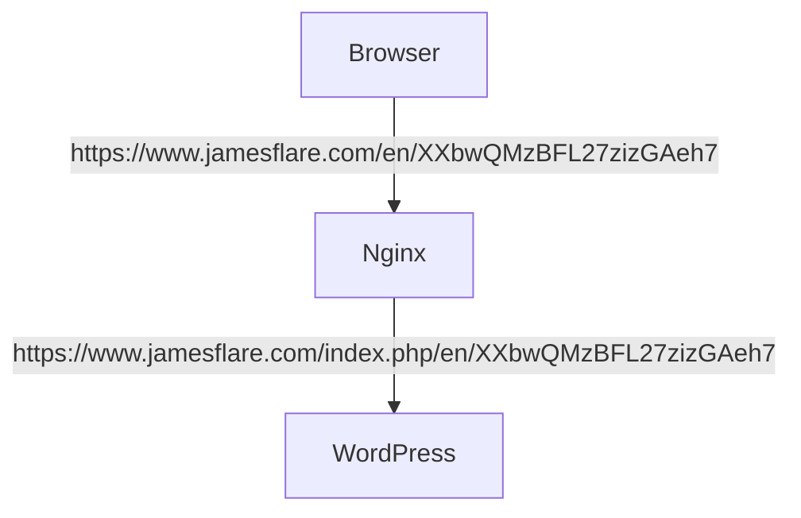

<!--more-->

## Background

KEIJILION mentioned in [Website Defense Upgrade: fail2ban Integrates with CloudFlare to Intelligently Block Malicious Attacks](https://blog.kejilion.pro/fail2ban-cloudflare/) that there is a DDoS attack method targeting WordPress instances, which bypasses the caching mechanism by requesting a non-existent path to attack the server. However, he did not clearly explain the principle of this attack method, so I will attempt to explain it here.

First, Layer 7 DDoS attacks require the target server to run a program or code in order to consume its resources. In other words, our requests cannot be intercepted before reaching WordPress, because the overhead of WAFs like Nginx intercepting requests is very small, and it would be very costly to exhaust them with a massive number of requests, which is beyond the capability of most people.

Secondly, the requests cannot hit the cache, because if they are cached by CDN or other means, the WordPress program is not involved in serving them, and our goal of exhausting the target server's resources cannot be achieved. Finally, avoid being banned based on IP, UA, or other content, for the same reason as why requests cannot be intercepted before reaching WordPress.

## Challenge

So why does the "404" attack mentioned by KEIJILION result in cache penetration and resource exhaustion?

### Behavior

First, let's talk about what the "404" attack he refers to is. It's actually generating random URL paths. For example:

```text
https://www.jamesflare.com/en/XXbwQMzBFL27zizGAeh7
https://www.jamesflare.com/en/mvQ3oX3NJRCfy8LBdWdL
https://www.jamesflare.com/en/AK3VdReDX4AKmAYanV9j
https://www.jamesflare.com/en/2Msmu2zDGwA4Fd4hDroF
https://www.jamesflare.com/en/crq8KXvMaFphdYhGNaFA
```

This is done to penetrate the cache and let the requests reach the WordPress instance.

### Nginx Rewrite Rule

You may ask, doesn't that just return a 404? What's the problem with that? First, we need to understand that returning a 404 also has an overhead, and this overhead varies across different applications. If it's a static website served by Nginx, then when Nginx can't find the requested file locally, it will return a 404, and the overhead is very low.

But in WordPress, this overhead is not very low, which has to do with its logic. WordPress pages need to be handled by `index.php`, and we've probably written similar Rewrite Rules when configuring it, right?

```nginx
# enforce NO www
if ($host ~* ^www\.(.*))
{
    set $host_without_www $1;
    rewrite ^/(.*)$ $scheme://$host_without_www/$1 permanent;
}

# unless the request is for a valid file, send to bootstrap
if (!-e $request_filename)
{
    rewrite ^(.+)$ /index.php?q=$1 last;
}
```

The idea is to let `index.php` handle the request,

```text
# Requested by the browser
https://www.jamesflare.com/en/XXbwQMzBFL27zizGAeh7
https://www.jamesflare.com/en/XXbwQMzBFL27zizGAeh7.jpg
# What WordPress sees
https://www.jamesflare.com/index.php/en/XXbwQMzBFL27zizGAeh7
https://www.jamesflare.com/index.php?q=XXbwQMzBFL27zizGAeh7.jpg
```



### Performance

Now the pressure is on WordPress. It first matches the database to see if there is such an article, and after not finding it, returns a 404, then starts weaving the HTML content of the 404 page like knitting a sweater. If your 404 page is more stylish and uses more resources, the overhead is even greater. It's almost equivalent to directly accessing a dynamic article (but the overhead should still be less than a real article).

Also, people may overestimate the performance of their VPS. The vast majority of VPS have poor performance, and 3-4 junk cores may not even match half a core of your laptop. Without caching, a few dozen RPS may be enough to crash the webpage.



This 18-core VPS only reaches the level of an AMD Ryzen 7 7840U, and that's conservative, because my laptop also has an AMD Ryzen 7 7840U, and its performance is about 40% higher than the data in Geekbench 6. The multi-core score in the database is 8718, while my actual test is 12127, so the 18-core VPS is roughly 8650.

## Blue Team

I speculate that KEIJILION's solution to this `index.php` feature is to scan the Nginx logs for IPs that generate abnormal codes like 404, and add them to the CloudFlare blacklist via API, releasing them after an hour. The logs look something like this:

```text
47.29.201.179 - - [28/Feb/2019:13:17:10 +0000] "GET /?p=1 HTTP/2.0" 200 5316 "https://domain1.com/?p=1" "Mozilla/5.0 (Windows NT 6.1) AppleWebKit/537.36 (KHTML, like Gecko) Chrome/72.0.3626.119 Safari/537.36" "2.75"
```

This greatly alleviates this vulnerability (actually I think it's more appropriate to call it a feature).

## Red Team

So, what are the loopholes in this model? First, let's sort out the ideas. This specialized approach is based on:

1. Detect abnormal HTTP codes
2. Block IP

In addition to this extra patch, general security measures include:

1. Rate limiting
2. CloudFlare security rules
   1. IP address risk
   2. Browser fingerprint
   3. UA
   4. Human verification
3. Origin blocks non-CloudFlare IPs

### Objective

So, our approach is also clear, which is to find a way to hit the site's dynamic resources with our requests. Let's break down the tasks:

1. Find dynamic resources
2. Bypass CloudFlare's security measures 
3. Send requests at a not-so-aggressive rate

First, we need to understand that the performance of most people's VPS is not good, and WordPress is not as efficient as imagined. I think handling a few dozen to a hundred RPS without caching is already very high, and it's not impossible to crash with just a dozen RPS. Those who aggressively send packets, easily reaching thousands or tens of thousands of RPS, and don't spread the traffic across many IPs, who else would they ban if not you?

### IP Wave Tactics

Here I'll just throw out some ideas, as the Red Team I'll give a few bad ideas. The most brutal one is to use a bunch of IP addresses, still using the previous "404" attack, at most I'll use one IP per request. You might say, how is this possible, wouldn't it require tens of thousands or hundreds of thousands of IP addresses in an hour? Even those DDoS attacks recorded in history only had tens of thousands of addresses. Even renting IPs, one IP must cost at least $1, right?

You're right, but also not quite right. This is the case for IPv4 addresses, but what about IPv6? Many VPS come with a /48 subnet when you buy them, and even if they're stingy, it's a /64 subnet, which is still incomparably huge.

|Prefix Length|Example Address|Address Range|
|-|-|-|
|32|2001:db8::/32|2001:0db8:0000:0000:0000:0000:0000:0000 2001:0db8:ffff:ffff:ffff:ffff:ffff:ffff|
|40|2001:db8:ab00::/40|2001:0db8:ab00:0000:0000:0000:0000:0000 2001:0db8:abff:ffff:ffff:ffff:ffff:ffff|
|48|2001:db8\:abcd::/48|2001:0db8\:abcd:0000:0000:0000:0000:0000 2001:0db8\:abcd:ffff:ffff:ffff:ffff:ffff|
|56|2001:db8\:abcd:1200::/56|2001:0db8\:abcd:1200:0000:0000:0000:0000 2001:0db8\:abcd:12ff:ffff:ffff:ffff:ffff|
|64|2001:db8\:abcd\:1234::/64|2001:0db8\:abcd\:1234:0000:0000:0000:0000 2001:0db8\:abcd\:1234:ffff:ffff:ffff:ffff|

To make it easy, let's not count reserved addresses. A /64 prefix means there are still 64 bits of address space behind it, which is 2^64 IP addresses. This number is astronomical, and I don't know if there are that many grains of sand on Earth. If the blocking strategy is not changed, it is absolutely impossible to block them one address at a time.

You might say, isn't this tactic too outrageous, relying on the other party not reacting in time? Wouldn't it be unfortunate to make them block subnet by subnet? You're right, but you can mix subnets of different sizes, and blocking subnets will result in a huge number of IP addresses being blocked, which is a very bad choice. Besides, it's not impossible to rent a portion of a /32 subnet, right? If you have a good relationship with a vendor and they give you a subnet slightly smaller than a /32, wouldn't that be hard for you to deal with?

### Chromedriver

Okay, let me give you another bad idea. Since we don't need a very large request volume to crash WordPress, and the performance gap is very large, we can use some advanced tools to directly simulate browsers to bypass CloudFlare's verification code, which is not impossible.

[](https://github.com/ultrafunkamsterdam/undetected-chromedriver)

We can use this modified Selenium Chromedriver to bypass CloudFlare's verification code, UA, browser fingerprint, and other detection methods.

Or even more advanced, without webdriver, without selenium, it's even harder to detect.

[](https://github.com/ultrafunkamsterdam/nodriver)

Then find a more dynamic point, such as entering random content in the search box to search. Coupled with our IPv6 human wave tactics, just a few dozen RPS can lead to a performance crisis for them. So many Selenium Chromedrivers may indeed consume some performance, but it's not very difficult to run on your own laptop. But from the Blue Team's perspective, it's a headache. They will see an extremely normal scene, with different IP addresses having a user accessing only once every half hour, an hour, or even a few hours. Or some IP addresses may not even access a second time. Will you wonder if your website has gone viral somewhere, rather than being attacked?

## Summary

KEIJILION mentioned a DDoS attack method targeting WordPress instances, which bypasses the caching mechanism by requesting a non-existent path to consume server resources. This attack is effective because:

1. WordPress page requests all need to be handled by index.php, and even 404 pages consume some resources. Many VPS have limited performance, and WordPress without caching may only be able to handle a few dozen RPS.

2. Attackers bypass CDN, WAF, and other defenses by requesting random URL paths, allowing requests to penetrate the cache and directly reach the WordPress backend.

3. Attackers will avoid being banned based on IP, UA, etc. to evade detection.

KEIJILION may alleviate this problem by scanning Nginx logs for abnormal status codes and blocking the corresponding IPs. But this solution still has some loopholes:

1. Attackers can leverage the huge address space of IPv6, making it nearly impossible to block one by one.

2. By simulating real browser requests, CloudFlare's verification code, fingerprint, and other detections can be bypassed, making the attack look like normal access.

3. Due to WordPress's performance bottleneck, attackers only need low-rate attacks of a few dozen RPS to cause harm, which is difficult to notice.

In summary, this type of DDoS attack exploits the characteristics of the WordPress architecture and is difficult to completely prevent. In addition to improving WordPress performance, website administrators also need more comprehensive monitoring and defense measures.