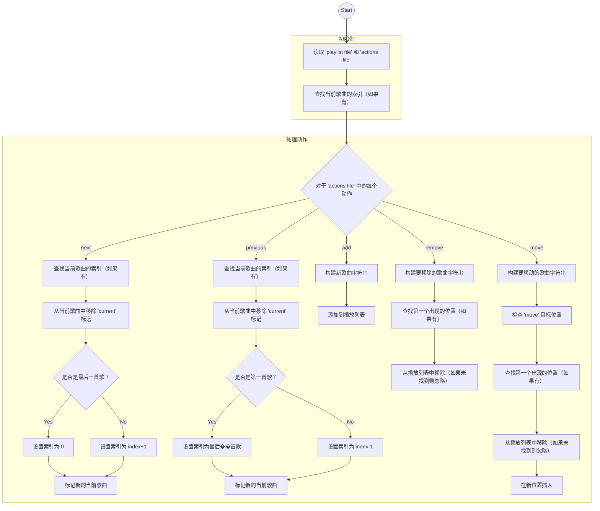
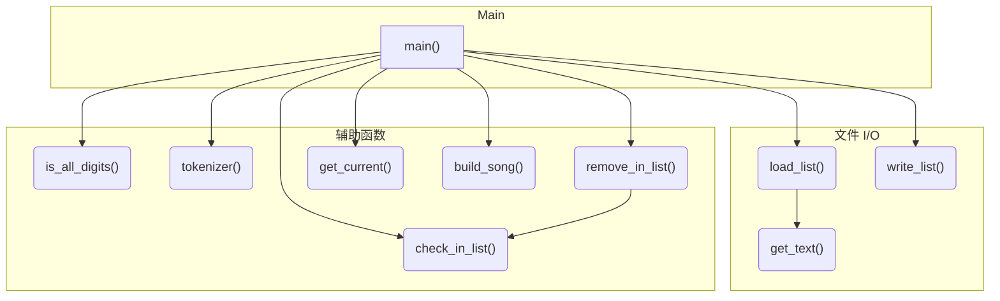

<!--more-->

## 作业要求


请先阅读并理解学术诚信政策，然后再开始这份家庭作业。

在这次作业中，你需要开发一个像 Spotify 那样管理音乐播放列表的程序，���们称之为 New York Playlists。请先完整地阅读整个手稿再开始编写代码。

## 学习目标

- 熟悉处理命令行参数。
- 熟悉文件输入和输出操作。
- 练习使用 C++ 标准模板库中的 string 和 vector 类。

## 命令行参数

你的程序将这样运行：

```console
./nyplaylists.exe playlist.txt actions.txt output.txt
```

这里：

- nyplaylists.exe 是可执行文件名。
- playlist.txt 是包含播放列表的输入文件，我们将在本 README 中称其为 **playlist file**（播放列表文件）。
- actions.txt 是定义一系列操作的输入文件，在本 README 中我们将它称为 **actions file**（动作文件）。
- output.txt 输出结果的位置。

## 播放列表文件格式和输出文件格式

播放列表文件和输出文件具有相同的格式。以 playlist_tiny1.txt 为例，该文件有以下四行：

```console
"Perfect Duet" Ed Sheeran, Beyonce
"Always Remember Us This Way" Lady Gaga current
"Million Reasons" Lady Gaga
"I Will Never Love Again - Film Version" Lady Gaga, Bradley Cooper
```

除了第二行外，每一行有两个字段：音乐标题和艺术家。这两个字段之间有一个空格分隔。

第二行是特殊的，它以单词 **current** 结尾，表示歌曲 "Always Remember Us This Way" 正在播放。这个单词 **current** 在 **playlist file** 中只出现一次，并且也应在输出文件中出现一次。

## 动作文件格式

动作文件定义了操作。以 actions1.txt 为例，该文件有以下几行：

```console
add "Umbrella" Rihanna
add "We Are Young" Fun
add "You Are Still the One" Shania Twain
remove "Million Reasons" Lady Gaga
add "Viva La Vida" Coldplay
move "I Will Never Love Again - Film Version" Lady Gaga, Bradley Cooper 1
next
next
next
previous
move "You Are Still the One" Shania Twain 4
```

**actions file** 可能包括五种不同类型的动作：

- add，将歌曲添加到播放列表的末尾。
- remove，从播放列表中移除一首歌。
- move，移动一首歌到新的位置 - 新的位置总是在行的最后。例如，*move "I Will Never Love Again - Film Version" Lady Gaga, Bradley Cooper 1* 将歌曲 "I Will Never Love Again - Film Version" 移动到位置 1，而 *move "You Are Still the One" Shania Twain 4* 将歌曲 "You Are Still the One" 移动到位置 4。注意，不同于 C/C++ 中的数组索引，Spotify 的定位从 1 开始，而不是从 0 开始。
- next，跳过正在播放的歌曲并开始播放列表中紧随其后的歌曲。如果当前播放的歌曲已经在播放列表底部，则操作 *next* 将使第一首歌（即，位于顶部的歌曲）成为当前播放的歌曲。
- previous，跳过正在播放的歌曲并回到列表中的前一首歌。如果当前播放的歌曲已在顶部，则操作 *previous* 将使最后一首歌（即，在底部的歌曲）成为当前播放的歌曲。

根据这个样本 **actions file**，将有四首歌被添加到播放列表中，有一首歌会被移除，两首歌会被移动，并且正在播放的歌曲将会是不同的歌曲，而不是 "Always Remember Us This Way" 这一首歌。

当 playlist_tiny1.txt 和 actions1.txt 作为两个输入文件提供给你的程序时，你的程序应该生成以下输出文件：

```console
"I Will Never Love Again - Film Version" Lady Gaga, Bradley Cooper
"Perfect Duet" Ed Sheeran, Beyonce
"Always Remember Us This Way" Lady Gaga
"You Are Still the One" Shania Twain
"Umbrella" Rihanna
"We Are Young" Fun current
"Viva La Vida" Coldplay
```

## 不存在的歌曲

如果在 **actions file** 中定义的动作试图移动或移除播放列表中不存在的歌曲，你的程序应该忽略这样的动作。

## 重复的歌曲

当同一首歌出现在播放列表中的多个位置时，请选择第一首（要移动或删除） - 即从顶部到底部搜索播放列表，找到该歌曲的第一个出现的位置，并使用它进行操作。

## 教师代码

你可以在这里测试（但不能查看）教师的代码：[instructor code](http://ds.cs.rpi.edu/hws/playlists/)。请注意，此站点托管在 RPI 的网络上，你只能通过 RPI 的网络访问该站点：要么在校内，要么使用 VPN 服务。此外，请注意，在本作业中不需要播放音乐，教师的 C++ 代码仅用于管理播放列表。

## 程序要求及提交详情

在这次作业中，你需要同时使用 std::string 和 std::vector。你不允许使用我们尚未学习过的任何数据结构。

在设计和实现程序时，请采用良好的编码风格。将你的程序组织成函数：不要把所有代码都放在 main 函数里！请务必阅读 [家庭作业政策](https://www.cs.rpi.edu/academics/courses/spring25/csci1200/homework_policies.php) 以完善你的解决方案。确保为你的程序编写新的测试用例，完全调试它，并不要忘记注释代码！完成提供的模板 [README.txt](./README.txt)。你必须独自完成这项作业，如 [合作政策及学术诚信](https://www.cs.rpi.edu/academics/courses/spring25/csci1200/academic_integrity.php) 页面所述。如果你与任何人讨论了问题或错误消息等，请在 README.txt 文件中列出他们的名字。按照课程网页上的指示准备并提交你的作业。如果需要帮助，可以向助教咨询。

**截止日期**: 2025年1月16日，晚上10点。

## 打分标准

13 分
- README.txt 完成 (3 分)
  - 名字、合作者或小时数未填写的 (-1)
  - 名字、合作者或小时数中有两个或以上未填写的 (-2)
  - 没有反思 (-1)
- STL Vector & String (3 分)
  - 使用了本课程尚未覆盖的数据结构 (-3)
  - 没有用到 STL vector (-2)
  - 没有用到 STL string (-2)
- 程序结构 (7 分)
  - 显著不完整实现，无分 (-7)
  - 几乎所有代码都在 main 函数中。建议为不同的任务创建单独的函数。(-2)
  - 不当使用或遗漏 const 和引用 (-1)
  - 几乎没有有用的注释 (-4)
  - 注释太少 (-2)
  - 包含无用的注释，如被注释掉的代码、终端命令或愚蠢的笔记 (-1)
  - 排版过于拥挤、空格过多或缩进不当 (-1)
  - 缺少错误检查（参数数量、无效文件名、无效命令等）(-1)
  - 变量命名不佳：非描述性名称（例如 'vec'，'str'，'var'），单字母变量名（除了循环计数器）等 (-2)
  - 使用全局变量 (-1)
  - 行过长，超过大约 100 字符。建议保持所有行短，并将注释放在单独的行上 (-1)



## 支持文件



## 程序设计

在开始之前，我们需要找出需要做什么。让我们画一个流程图来检查步骤。



然后，我们可以计划在这个程序中使用哪些函数。



## 难点

1. 正确加载每个参数很困难。例如，歌曲可以包含空格，歌手的名字也可以有空格或其他内容。但幸运的是，我们不需要太在意中间部分。我的意思是第一个参数总是命令，其余的部分是需要添加或删除的歌曲信息。我通过空格将参数/歌曲分割成各个部分：`<action> <song> <location>` 并根据需要取每个部分。
2. 当我在移动/添加歌曲时，可能该歌曲在播放列表文件中已经有一个 `current` 标记了（例如，在 playlist_tiny1.txt 文件中）。如果只检查歌曲名称的话，它将无法通过一些测试用例。例如，这是我对 `move` 命令的处理方式。

    ```diff
    if (tokens[0] == "move") {
        if (is_all_digits(tokens.back())){
            // 设置目标位置
            int dest = std::stoi(tokens.back());
            // 从 tokens 构建歌曲
            std::string song;
            song = build_song(tokens, 1, tokens.size() - 1);
    +       // 如果歌曲名称有 current 标记，则修复歌曲名称
    +       if (!check_in_list(song, playlist) &&
    +           !check_in_list(song + " current", playlist)) {continue;}
    +       else if (check_in_list(song + " current", playlist)) {
    +           song += " current";
    +       }
            remove_in_list(song, playlist);
            playlist.insert(playlist.begin() + dest - 1, song);
        } else {
            std::cout << "ERROR: Missing move destination" << std::endl;
            continue;
        }
    }
    ```

    我在实际添加到播放列表之前，又检查了歌曲加上 `current` 是否存在于播放列表中。

## 解决方案

### nyplaylists.cpp

```cpp
// CSCI-1200 HW1 Spotify Playlists 实现
// 日期：2025/1/16
// 作者：JamesFlare
#include <vector>
#include <string>
#include <iostream>
#include <fstream>

std::string get_text(const std::string &fname) {
    // 加载文本文件到字符串中
    std::ifstream inFile(fname);
    // 检查文件是否存在
    if (!inFile) {
        std::cout << "Error: File not found" << std::endl;
        return "";
    }
    std::string text;
    std::string line;
    while (std::getline(inFile, line)) {
        text += line;
        text += "\n";
    }
    inFile.close();

    return text;
}

std::vector<std::string> load_list(const std::string &fname) {
    // 加载文本文件到字符串向量中
    std::string text = get_text(fname);

    std::vector<std::string> lines;
    std::size_t start = 0;
    std::size_t end   = 0;
    while ((end = text.find('\n', start)) != std::string::npos) {
        lines.push_back(text.substr(start, end - start));
        start = end + 1;    
    }
    if (start < text.size()) {
        lines.push_back(text.substr(start));
    }

    return lines;
}

bool is_all_digits(const std::string& s) {
    // 检查字符串是否为整数
    for (char c : s) {
        if (!std::isdigit(static_cast<unsigned char>(c))) {
            return false;
        }
    }
    return !s.empty();
}

std::vector<std::string> tokenizer(const std::string &s) {
    // 将字符串分割成标记
    std::vector<std::string> tokens;
    std::string token;
    for (char c : s) {
        if (c == ' ') {
            tokens.push_back(token);
            token = "";
        } else {
            token += c;
        }
    }
    tokens.push_back(token);
    return tokens;
}

bool check_in_list (const std::string &s, const std::vector<std::string> &list) {
    // 检查字符串是否在列表中
    for (std::string item : list) {
        if (s == item) {
            return true;
        }
    }
    return false;
}

void remove_in_list (const std::string &s, std::vector<std::string> &list) {
    // 从列表中移除字符串
    if (!check_in_list(s, list)) {return;}
    for (int i = 0; i < list.size(); i++) {
        if (list[i] == s) {
            list.erase(list.begin() + i);
            return;
        }
    }
}

int get_current (std::vector<std::string> &playlist) {
    // 返回带有 "current" 标记的字符串的索引
    for (int i = 0; i < playlist.size(); i++) {
        if (playlist[i].find("current") != std::string::npos) {
            return i;
        }
    }
    return -1;
}

std::string build_song (const std::vector<std::string> &tokens, const int &start, const int &end) {
    // 使用起始和结束位置从标记构建字符串
    std::string song;
    for (int i = start; i < end; i++) {
        song += tokens[i];
        if (i != end - 1) {
            song += " ";
        }
    }
    return song;
}

void write_list(const std::string &fname, const std::vector<std::string> &list) {
    // 将列表写入文件
    std::ofstream outFile(fname);
    for (std::string line : list) {
        outFile << line << std::endl;
    }
    outFile.close();
}

int main(int argc, char *argv[]) {
    // 接受 3 个参数
    if (argc < 3) {
        std::cout << "Error: Not enough arguments" << std::endl;
        return 1;
    }
    // 加载参数
    std::string playlist_fname = argv[1];
    std::string action_list_fname = argv[2];
    std::string output_fname = argv[3];
    // 加载工作文件
    std::vector<std::string> playlist = load_list(playlist_fname);
    std::vector<std::string> action_list = load_list(action_list_fname);
    // 获取当前播放歌曲的 ID
    int current_song_id = get_current(playlist);
    // 执行动作
    for (std::string command : action_list) {
        // 将命令分割成标记
        std::vector<std::string> tokens = tokenizer(command);
        if (tokens[0] == "next") {
            current_song_id = get_current(playlist);
            // 移除 "current" 标记
            playlist[current_song_id].erase(playlist[current_song_id].length() - 8);
            if (current_song_id == playlist.size() - 1) {
                current_song_id = 0;
            } else {
                current_song_id++;
            }
            // 更新当前歌曲
            playlist[current_song_id] += " current";
        }
        if (tokens[0] == "previous") {
            current_song_id = get_current(playlist);
            // 移除 "current" 标记
            playlist[current_song_id].erase(playlist[current_song_id].length() - 8);
            if (current_song_id == 0) {
                current_song_id = playlist.size() - 1;
            } else {
                current_song_id--;
            }
            // 更新当前歌曲
            playlist[current_song_id] += " current";
        }
        if (tokens[0] == "add") {
            std::string song;
            song = build_song(tokens, 1, tokens.size());
            playlist.push_back(song);
        }
        if (tokens[0] == "remove") {
            std::string song;
            song = build_song(tokens, 1, tokens.size());
            remove_in_list(song, playlist);
        }
        if (tokens[0] == "move") {
            if (is_all_digits(tokens.back())){
                // 设置目标位置
                int dest = std::stoi(tokens.back());
                // 从 tokens 构建歌曲
                std::string song;
                song = build_song(tokens, 1, tokens.size() - 1);
                // 如果歌曲名称有 current 标记，则修复歌曲名称
                if (!check_in_list(song, playlist) &&
                    !check_in_list(song + " current", playlist)) {continue;}
                else if (check_in_list(song + " current", playlist)) {
                    song += " current";
                }
                remove_in_list(song, playlist);
                playlist.insert(playlist.begin() + dest - 1, song);
            } else {
                std::cout << "ERROR: Missing move destination" << std::endl;
                continue;
            }
        }
    }
    // 写回文件
    write_list(output_fname, playlist);
    return 0;
}
```
