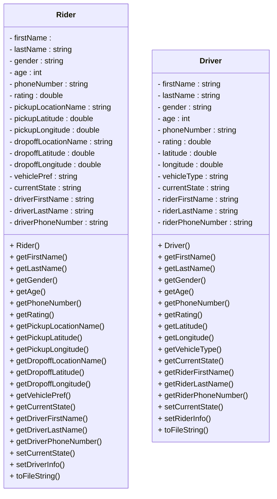

<!--more-->

## 作业要求

````markdown
# 作业 2 - 设计一个简单的 Uber

在这个作业中，你将开发一个名为 New York Ride 的简单拼车应用程序。请在开始编写代码前阅读整个说明文件。

## 学习目标

- 练习实现和使用 C++ 类。
- 练习使用字符串类（std::string）和向量容器（std::vector）。

## 规范

New York Ride 应用程序应该支持两种不同的角色：司机、乘客。乘客可以执行以下任务：

- 请求乘车
- 取消乘车请求 

司机可以执行一个任务：

- 取消乘车请求

*注意*: 一个像 Uber 或 Lyft 这样的商业拼车产品当然允许乘客和司机执行更多任务，但让我们诚实地说，Uber/Lyft 拥有成千上万的软件工程师，而你只有一个人，并且只有一周的时间来完成这个作业，因此我们简化了这些任务。

## 输入文件

像 Uber 和 Lyft 这样的公司会将所有司机和乘客的信息存储在数据库中，但数据库超出了本课程的范围。因此我们将仅使用两个简单的文本文件 [drivers.txt](drivers.txt) 和 [riders.txt](riders.txt) 来存储司机和乘客的信息。在这个作业中，你将再次读取这些文件作为程序的输入，并解析它们以检索司机和/或乘客信息，并将其存储在自己的数据结构中。在这个任务中，你必须使用 *std::vector* 来存储司机和乘客。建议使用一个 *std::vector* 实例来存储所有司机，另一个 *std::vector* 实例来存储所有乘客。

### 司机信息

[drivers.txt](drivers.txt) 文件的格式如下：

```console
Sandra Huang Female 25 853-977-5304 3.1 40.4269 -73.0753 Standard On_the_way_to_pickup Michael Richard 445-915-1645
Susan Li Female 51 997-217-1025 3.7 40.5863 -73.8684 Premium On_the_way_to_pickup Lucia Kenneth 829-477-7963
Mary Zhang Female 47 765-620-6297 4.5 40.6988 -73.3988 Economy On_the_way_to_pickup Amy Lee 545-639-2924
William David Male 37 324-571-7028 3.8 40.2445 -73.5073 Premium Available null null null
Christopher Javier Male 25 218-980-8846 4.5 40.5784 -73.5479 Economy During_the_trip Daniel Chen 820-327-7312
Dorothy Daniel Female 21 332-586-7858 4 40.6672 -73.2472 Premium During_the_trip Juan Carlos 204-752-4660
Mateo Andres Male 55 201-564-6348 3.8 40.8771 -73.6288 Standard During_the_trip Karen Michael 534-197-2988
Dorothy Liu Female 41 507-944-8147 4.5 40.4938 -73.9905 Economy On_the_way_to_pickup Amy Christopher 601-148-3144
Mateo Robert Male 49 592-397-3458 3.5 40.4106 -73.3736 Economy On_the_way_to_pickup William David 693-200-8952
Valentina Andres Female 40 299-602-1498 3.3 40.3159 -73.8891 Standard On_the_way_to_pickup Susan Edward 809-345-5043
```

以上是 [drivers.txt](drivers.txt) 文件的前 10 行。它有 13 个字段，用空格分隔。这 13 个字段分别是：

- 司机的名字
- 司机的姓氏
- 司机的性别
- 司机的年龄
- 司机的电话号码
- 司机的评分
- 司机当前的位置纬度
- 司机当前的位置经度
- 司机的车辆类型
- 司机当前的状态
- 乘客的名字（如果分配了乘车请求）
- 乘客的姓氏（如果分配了乘车请求）
- 乘客的电话号码（如果分配了乘车请求）

最后三个字段只有在乘车请求分配给该司机时才有意义。在这个作业中，我们假设司机一旦被分配到这个请求就会接受。

一个司机可以处于以下状态之一：

- 可用（等待请求）
- 前往接客地点（已接受请求）
- 在行程中

当司机处于可用状态时，这意味着这个司机没有被分配乘车请求，并且因此不与任何乘客关联。因此，该司机的最后三个字段将只是
```console
null null null
```

### 乘客信息

[riders.txt](riders.txt) 文件的格式如下：

```console
Isabella Richard Female 39 301-144-6533 3.2 Top_of_the_Rock 40.7593 -73.979 Gowanus 40.6733 -73.99 Economy Ready_to_request null null null
Juan James Male 47 717-480-4710 3.2 Forest_Hills 40.7196 -73.8448 Park_Slope 40.6728 -73.9778 Standard Driver_on_the_way Melissa Kim 435-773-6289
Deborah Thomas Female 45 501-380-7736 5 Park_Slope 40.6728 -73.9778 Flatiron_Building 40.7411 -73.9897 Economy Driver_on_the_way Paul Daniel 815-649-6492
Sofia Steven Female 28 780-650-6240 3 Bay_Ridge 40.635 -74.019 High_Line_Park 40.748 -74.0048 Premium During_the_trip Thomas Edward 557-939-8060
Anthony Thomas Male 58 302-206-4102 4.3 Prospect_Heights 40.6775 -73.9692 East_River_Park 40.7135 -73.9756 Economy During_the_trip Juan Timothy 471-264-9092
Lucia Andres Female 59 256-799-3283 3.1 Grand_Central_Terminal 40.7527 -73.9772 Central_Park_Zoo 40.7678 -73.9718 Economy Driver_on_the_way Camila Mark 939-309-5453
Melissa Christopher Female 28 392-390-8218 4.6 The_High_Line 40.748 -74.0048 The_Vessel 40.7536 -74.0023 Standard Driver_on_the_way Brian Luis 845-708-1986
William Timothy Male 46 808-688-3264 3.7 Broadway_Theater_District 40.7589 -73.9851 Coney_Island 40.5749 -73.9859 Economy Driver_on_the_way Brenda Christopher 886-285-9845
Linda Chen Female 60 320-807-7264 4.6 Bushwick 40.6944 -73.9213 Columbia_University 40.8075 -73.9642 Premium Ready_to_request null null null
Brenda Thomas Female 45 470-325-3275 3.2 Bay_Ridge 40.635 -74.019 High_Line_Park 40.748 -74.0048 Premium Driver_on_the_way John Javier 446-656-6614
```

以上是 [riders.txt](riders.txt) 文件的前 10 行。它有 17 个字段，用空格分隔。这 17 个字段分别是：

- 乘客的名字
- 乘客的姓氏
- 乘客的性别
- 乘客的年龄
- 乘客的电话号码
- 乘客的评分
- 接客地点名称（如果分配了乘车请求）
- 接客地点的位置纬度（如果分配了乘车请求）
- 接客地点的位置经度（如果分配了乘车请求）
- 目的地名称（如果分配了乘车请求）
- 目的地位置的纬度（如果分配了乘车请求）
- 目的地位置的经度（如果分配了乘车请求）
- 乘客偏好的车辆类型
- 乘客当前的状态
- 司机的名字（如果分配了乘车请求）
- 司机的姓氏（如果分配了乘车请求）
- 司机的电话号码（如果分配了乘车请求）

一个乘客可以处于以下状态之一：

- 准备请求乘车
- 司机正在前往接客地点（已接受请求）
- 在行程中

理想情况下，应该有四个状态，另一个状态是：已经发出请求但尚未被任何司机接受。然而，正如我们提到的，在这个作业中，假设当乘客发出请求时，它会被一个司机接受，因此我们可以排除这种状态。

当乘客处于准备请求乘车的状态时，这意味着没有司机现在被分配到该乘车请求，并且因此，该乘客的最后三个字段将只是

```console
null null null
```

## 支持的命令

你的程序只需要支持两个命令：

### 乘车请求

第一个命令允许乘客发送一个乘车请求。

```console
nyride.exe drivers.txt riders.txt output0.txt output1.txt output2.txt phoneNumber request
```

这里

- `drivers.txt` 是包含所有司机信息的输入文件。你的程序不应该改变这个文件。
- `riders.txt` 是包含所有乘客信息的输入文件。你的程序不应该改变这个文件。
- `output0.txt` 是你向乘客或司机打印消息的输出文件。
- `output1.txt` 是更新后的司机信息，因此该文件应该与 drivers.txt 格式相同。
- `output2.txt` 是更新后的乘客信息，因此该文件应该与 riders.txt 格式相同。
- `phoneNumber`。理想情况下这应该是与 riders.txt 中状态为 "Ready_to_request" 的一个乘客的电话号码对应的；但生活不总是理想的，并且你的程序如何处理各种电话号码情况将在本节中描述。
- `request` 表示这是一个乘车请求。

当运行此命令时，如果找到司机，则

1. 你应该在 output0.txt 文件中打印以下信息：
```console
Ride requested for rider Rebecca, looking for an Economy vehicle.
Pick Up Location: Williamsburg, Drop Off Location: Statue_of_Liberty.
We have found the closest driver Elena(4.7) for you.
Elena is now 7.9 miles away from you.
```
用乘客的名字替换 *Rebecca*，用乘客偏好的车辆类型替换 *Economy*，用接客地点名称替换 *Williamsburg*，用目的地名称替换 *Statue_of_Liberty*。用司机的名字替换 *Elena*，用司机的评分替换 *4.7*。用司机距离乘客的距离替换 *7.9*。

1.2 在 output1.txt 文件中打印更新后的 drivers.txt 版本。
1.3 在 output2.txt 文件中打印更新后的 riders.txt 版本。

2. 如果找不到司机，则你的程序应该在 output0.txt 文件中打印以下消息：
```console
Ride requested for rider Isabella, looking for a Luxury vehicle.
Pick Up Location: Williamsburg, Drop Off Location: Boerum_Hill.
Sorry we can not find a driver for you at this moment.
```

用乘客的名字替换 *Isabella*，用乘客偏好的车辆类型替换 *Luxury*，用接客地点名称替换 *Williamsburg*，用目的地名称替换 *Boerum_Hill*。

3. 如果从命令行提供的电话号码不符合 xxx-xxx-xxxx 格式，则你的程序应该在 output0.txt 文件中打印以下消息：
```console
Phone number is invalid.
```

4. 如果从命令行提供的电话号码与任何乘客的电话号码都不匹配，则你的程序应该在 output0.txt 文件中打印以下消息：
```console
Account does not exist.
```

5. 如果发出此请求的乘客处于 "Driver_on_the_way" 状态，则你的程序应该在 output0.txt 文件中打印以下消息：
```console
You have already requested a ride and your driver is on the way to the pickup location.
```

6. 如果发出此请求的乘客处于 "During_the_trip" 状态，则你的程序应该在 output0.txt 文件中打印以下消息：
```console
You can not request a ride at this moment as you are already on a trip.
```

### 取消请求

第二个命令允许乘客或司机取消请求。请记住，乘客和司机都有权取消请求。

```console
nyride.exe drivers.txt riders.txt output0.txt output1.txt output2.txt phoneNumber cancel
```

此命令与第一个命令的唯一区别是最后一个参数是 *cancel*，而在第一个命令中，最后一个参数是 *request*。

当乘客取消请求时，你应该只取消该请求；当司机取消请求时，你也应该取消该请求，但同时找到另一个最近的司机为这个乘客服务。

只有处于前往接客地点状态的司机或其司机正在前往接客地点的乘客才能取消请求。

当运行此第二个命令时，

1. 如果从命令行提供的电话号码与任何乘客的电话号码都不匹配，并且也不与任何司机的电话号码匹配，则你的程序应该在 output0.txt 文件中打印以下消息：
```console
Account does not exist.
```

2. 如果发出取消请求的是一个状态不是 "Driver_on_the_way" 的乘客，则你的程序应该在 output0.txt 文件中打印以下消息：
```console
You can only cancel a ride request if your driver is currently on the way to the pickup location.
```

3. 如果发出取消请求的是一个状态不是 "On_the_way_to_pickup" 的司机，则你的程序应该在 output0.txt 文件中打印以下消息：
```console
You can only cancel a ride request if you are currently on the way to the pickup location.
```

4. 如果发出取消请求的是一个处于 "Driver_on_the_way" 状态的乘客，则

4.1 在 output0.txt 文件中打印以下消息：
```console
Ride request for rider Brenda is now canceled by the rider.
```
4.2 在 output1.txt 文件中打印更新后的 drivers.txt 版本：司机的状态应从 "On_the_way_to_pickup" 更改为 "Available"，并且该司机的最后三个字段应重置为 null，这意味着这个司机现在不再与任何乘客关联。

4.3 在 output2.txt 文件中打印更新后的 riders.txt 版本：乘客的状态应从 "Driver_on_the_way" 更改为 "Ready_to_request"，并且该乘客的最后三个字段应重置为 null，这意味着没有司机现在与这个乘客关联。

5. 如果发出取消请求的是一个处于 "On_the_way_to_pickup" 状态的司机，则

5.1 在 output0.txt 文件中打印以下消息：
```console
Your driver Edward has canceled the ride request. We will now find a new driver for you.
Ride requested for rider Angela, looking for a Standard vehicle.
Pick Up Location: The_Met_Cloisters, Drop Off Location: Brooklyn_Navy_Yard.
We have found the closest driver Robert(3.2) for you.
Robert is now 2.1 miles away from you.
```

用司机的名字替换 *Edward*。用乘客的名字替换 *Angela*，用乘客偏好的车辆类型替换 *Standard*。用接客地点名称替换 *The_Met_Cloisters*，用目的地名称替换 *Brooklyn_Navy_Yard*。用新司机的名字替换 *Robert*。用新司机的评分替换 *3.2*。用新司机距离乘客的距离替换 *2.1*。

5.2 在 output1.txt 文件中打印更新后的 drivers.txt 版本：旧司机的状态应从 "On_the_way_to_pickup" 更改为 "Available"。应该分配一个新的司机，并且该新司机的状态也应相应地更新。同时，旧司机不再与这个乘客关联，而新的司机现在与这个乘客关联。

5.3 在 output2.txt 文件中打印更新后的 riders.txt 版本：乘客现在应该与新的司机关联。

## 基于 Haversine 公式的距离计算

在查找司机时，你必须始终找到最近的车辆类型匹配乘客偏好的司机。当找到最接近的司机后，你也需要打印该司机和乘客之间的距离。因此，你需要一种方法来计算两个坐标之间的距离，在这个任务中，我们将使用 Haversine 公式，并且使用 Haversine 公式的代码如下：

```cpp
// 使用 Haversine 公式计算两个坐标之间的距离
double calculateDistance(double lat1, double lon1, double lat2, double lon2) {
    const double radiusOfEarth = 6371.0; // 地球半径（单位：公里）

    // 将纬度和经度从度转换为弧度
    lat1 *= M_PI / 180.0;
    lon1 *= M_PI / 180.0;
    lat2 *= M_PI / 180.0;
    lon2 *= M_PI / 180.0;

    // Haversine 公式
    double dLat = lat2 - lat1;
    double dLon = lon2 - lon1;
    double a = sin(dLat / 2.0) * sin(dLat / 2.0) + cos(lat1) * cos(lat2) * sin(dLon / 2.0) * sin(dLon / 2.0);
    double c = 2.0 * atan2(sqrt(a), sqrt(1.0 - a));
    // 距离（单位：公里）
    double distanceKM = radiusOfEarth * c;
    // 将距离转换为英里
    double distanceMiles = distanceKM * 0.621371;

    return distanceMiles;
}
```

此函数接受四个参数，即两个地理位置的纬度和经度，并返回这两个位置之间的距离（单位：英里）。该函数调用了几个数学库函数，因此你需要包含 cmath 库：

```cpp
#include <cmath>
```

## 包含防护

如果你编写了多个类，在编译时可能会遇到奇怪的编译错误。这可能是由于包括你的类文件的问题，可以通过以下方式解决：对于名为 myclass.h 的头文件，在该头文件顶部添加这两行：

```cpp
#ifndef __MYCLASS_H
#define __MYCLASS_H
```

并在 .h 文件底部添加这一行：

```cpp
#endif
```

这种技术称为“包含防护”。包含防护确保编译器只会处理一次头文件，无论它被包括多少次。

## 常见问题

1. Q: 乘客请求的车辆类型是否是严格要求？还是只是一个偏好。如果一个乘客请求 Economy 车型但没有可用的 Economy 司机，而有其他车型的司机，我们应该输出找不到司机，还是匹配最近的不同车型司机？

A: 这是一个严格的要求。不要为乘客选择不同的车型。

2. Q: 输出的距离精度是多少？是保留一位小数吗？是否需要四舍五入或直接截断？

A: 与 Uber 相同。保留一位小数。直接截断即可。例如，如果距离是 11.4571 英里，则应输出为 11.4 英里，而不是 11.5 英里。

## 程序要求及提交细节

在这个作业中，你必须使用 vector 来存储所有司机，并使用 vector 来存储所有乘客。你不允许使用我们尚未学习的数据结构，特别是 std::list。你的程序应该涉及至少两个类的定义，每个类都有自己的 .h 和 .cpp 文件。

在设计和实现程序时，请采用良好的编程风格：将代码组织成函数，不要把所有的代码都放在 main 函数中！请务必阅读 [家庭作业政策](https://www.cs.rpi.edu/academics/courses/spring25/csci1200/homework_policies.php) 以完善你的解决方案。请务必创建新的测试用例来完全调试程序，并不要忘记注释代码！使用提供的模板 [README.txt](./README.txt) 文件来记录你想评分者阅读的笔记。
你必须独立完成这个作业，如在 [合作政策及学术诚信](https://www.cs.rpi.edu/academics/courses/spring25/csci1200/academic_integrity.php) 页面中所述。如果你与任何人讨论过问题或错误信息等，请在 README.txt 文件中列出他们的名字。

**截止日期**: 2025 年 1 月 23 日，星期四晚上 10 点。

## 打分标准

14 分

- README.txt 完成 (3 分)
  - 缺少姓名、合作者或小时数中的一个 (-1)
  - 缺少姓名、合作者或小时数中的两个以上 (-2)
  - 没有反思 (-1)
- 类声明及实现和编码风格（良好的类设计，拆分为 .h 和 .cpp 文件。超过一行的函数放在 .cpp 文件中。组织良好的类实现，并在适当位置添加注释。正确使用 const/const& 和类方法 const） (6 分)
  - 没有信用（显著不完整的实现） (-6)
  - 不成功声明或使用任何新类 (-6)
  - 只声明或使用一个类 (-5)
  - 几乎所有代码都在 main 函数中。建议为不同的任务创建单独的函数。 (-2)
  - 错误使用或遗漏 const 和引用 (-1)
  - 超过一行语句的函数体放在 .h 文件中（模板类可以例外） (-2)
  - 函数没有很好地文档化，或者注释不足 (在 .h 或 .cpp 文件中) (-1)
  - 缺乏间距、过多空白或不良缩进 (-1)
  - 不良文件组织：将多个类放在一个文件中（非常小的辅助类可以例外） (-1)
  - 变量名选择不当：非描述性名称（例如 'vec'，'str'，'var'），单字母变量名（除了单个循环计数器除外）等。 (-2)
  - 使用全局变量 (-1)
- 数据表示 (必须使用向量实现) (5 分)
  - 没有信用（显著不完整的实现）。 (-5)
  - 不使用 std::vector 存储司机或乘客 (-5)
  - 使用 std::list 或本课程中未涵盖的数据结构 (-5)
  - 成员变量是公开的。 (-2)
````

## 支持文件



## 程序设计

由于这次作业比较复杂，我们在开始前最好好好构思一下怎么实现。这里我借用两种情况，也就是指令是“request”和“cancel”两种情况分别设计它们单独的流程，然后在主程序中使用这两部分。姑且把它们称作`handleRequest()`以及`handleCancel()`。

由于流程图比较大，我暂时把它转换成了图片。



Mermaid 源码如下：

```text
flowchart TD
    subgraph "Main Program"
        A(["Start main()"]) --> B["读取命令行参数 'drivers.txt' 'riders.txt' 'output0.txt' 'output1.txt' 'output2.txt' 'phoneNumber' 'command'"]
        B --> C["loadDrivers(): 读取 'drivers.txt' 到 drivers"]
        C --> D["loadRiders(): 读取 'riders.txt' 到 riders"]
        D --> E{"command == 'request'?"}
        E -- Yes --> MR["调用 handleRequest()"]
        E -- No --> F{"command == 'cancel'?"}
        F -- Yes --> MC["调用 handleCancel()"]
        F -- No --> G["输出 'Invalid command.'"]
        MR --> H["输出处理结果到 'output0.txt'"]
        MC --> H
        G --> H
        H --> I["将更新后的 drivers 写到 'output1.txt'"]
        I --> J["将更新后的 riders 写到 'output2.txt'"]
        J --> K(["End main()"])
    end
    
    subgraph "handleRequest()"
        R1["检查 phoneNumber 格式 (xxx-xxx-xxxx)"] --> R2{"有效?"}
        R2 -- No --> R3["输出 'Phone number is invalid.'"]
        R2 -- Yes --> R4["在 riders 中查找匹配的 phoneNumber"]
        R4 --> R5{"找到 Rider?"}
        R5 -- No --> R6["输出 'Account does not exist.'"]
        R5 -- Yes --> R7{"Rider.state？"}
        R7 -- "Driver_on_the_way" --> R71["输出 'You have already requested a ride...'"]
        R7 -- "During_the_trip" --> R72["输出 'You can not request a ride...'"]
        R7 -- "Ready_to_request" --> R8["输出 'Ride requested...' 信息,<br/>在 drivers 中查找匹配车辆类型<br/>且状态为 'Available' 的最近司机"]
        R8 --> R9{"找到可用 Driver?"}
        R9 -- No --> R10["输出 'Sorry we can not find a driver...'"]
        R9 -- Yes --> R11["计算距离, 更新状态：<br/>Driver='On_the_way_to_pickup', Rider='Driver_on_the_way'<br/>输出 'We have found the closest driver...'"]
    end
    
    subgraph "handleCancel()"
        C1["在 riders 中查找 phoneNumber"] --> C2{"找到 Rider?"}
        C2 -- No --> C3["在 drivers 中查找 phoneNumber"]
        C3 --> C4{"找到 Driver?"}
        C4 -- No --> C5["输出 'Account does not exist.'"]
        C4 -- Yes --> C6{"Driver.state == 'On_the_way_to_pickup'?"}
        C6 -- No --> C7["输出 'You can only cancel...'"]
        C6 -- Yes --> C8["Driver 取消: 状态->'Available'<br/>清空 Rider 关联信息"]
        C8 --> C9["输出 'Your driver X has canceled...'"]
        C9 --> C10["将 Rider 状态临时重置为 'Ready_to_request'<br/>再自动为 Rider 找新司机 (类似 request )"]
        C10 --> C11{"找到新 Driver?"}
        C11 -- No --> C12["输出 'Sorry we can not find...'"]
        C11 -- Yes --> C13["更新新 Driver='On_the_way_to_pickup',<br/>Rider='Driver_on_the_way'<br/>输出 'We have found the closest driver...'"]

        C2 -- Yes --> C14{"Rider.state == 'Driver_on_the_way'?"}
        C14 -- No --> C15["输出 'You can only cancel...'"]
        C14 -- Yes --> C16["输出 'Ride request for rider X is now canceled...',<br/>Driver->'Available', Rider->'Ready_to_request'"]
    end
```

有了流程图我们就可以慢慢实现它们了。当然，不一定要真写`handleRequest()`和`handleCancel()`两个function。把它们的逻辑直接在`main()`中实现也是可以的，我这里只是为了思路清晰而已。

此外，我们要设计两个Class，因为这是作业要求，也是为了方便我们实现功能。



## 踩坑内容

1. 在打印`output0.txt`时，looking for 后面要跟一个 Rider 期望的vehicle。但是这个vehicle可能有元音字母，所以要判断一下，到底是用a还是an。这是一个小问题，实现起来并不复杂，但是别忘了。我用了一个function来返回a还是an。

   ```cpp
   std::string autoAAn(const std::string &word) {
       if (word.empty()) return "";
       if (word[0] == 'A' || word[0] == 'E' || word[0] == 'I' || word[0] == 'O' || word[0] == 'U') {
           return "an";
       }
       return "a";
   }
   ```

   然后在后面配合`<sstream>`的`ostringstream`的方式拼接从Rider Class获取的字段。下面的代码就展示以下逻辑和结构，不必较真。

   ```cpp
   #include <sstream>
   //...
   Rider &r = riders[rIdx]; //just consider `r` as your rider class
   std::ostringstream msg;
   msg << "Ride requested for rider " << r.getFirstName()
       << ", looking for " << autoAAn(r.getVehiclePref()) << " "
       << r.getVehiclePref() << " vehicle.\n"
       << "Pick Up Location: " << r.getPickupLocationName()
       << ", Drop Off Location: " << r.getDropoffLocationName() << ".\n";
   ```

2. 在处理司机状态的时候要特别小心，一旦有变化要马上更新，因为一些逻辑是依赖于司机状态的。比如当司机从`On_the_way_to_pickup`变为`Available`时，需要清空Rider关联信息，并且再自动为Rider找新司机。重新寻找司机的时候，也要避免重新找到之前已经分配过的司机。
3. Class的变量不能是Public（作业要求）的，调用内容必须用方法，而不是直接对变量操作。
4. 根据作业要求，我们不能用`auto`类型，这导致我不得不修改了for循环的内容，比如：

   ```diff
   void exportDrivers(const std::string &filename, const std::vector<Driver> &drivers) {
       //...
       std::ofstream ofs(filename);
   -   for (const auto &d : drivers) {
   +   for (int i = 0; i < (int)drivers.size(); i++) {
   +       const Driver &d = drivers[i];
           ofs << d.toFileString() << "\n";
       }
       ofs.close();
   }
   ```

## 参考代码

### nyrider.cpp

```cpp
//An implement of CSCI-1200 HW2 Ride Sharing
//Author: JamesFlare
//Date: 2025/1/20
//#include <algorithm>
//#include <cstdlib>
#include <cmath>
#include <vector>
#include <fstream>
#include <sstream>
#include <string>
#include <iostream>
#include <iomanip>

#include "Driver.h"
#include "Rider.h"

void debug_print(const std::string &msg) {
    std::cout << "DEBUG: " << msg << std::endl;
}

bool isPhoneNumberValid(const std::string &phone)
{
    if (phone.size() != 12) return false;
    //xxx-xxx-xxxx
    for (int i = 0; i < 12; i++) {
        if (i == 3 || i == 7) {
            if (phone[i] != '-') return false;
        } else {
            if (!std::isdigit((unsigned char)phone[i])) return false;
        }
    }
    return true;
}

void loadDrivers(std::ifstream &ifs, std::vector<Driver> &drivers) {
    //read the file line by line, total of 13
    while (!ifs.eof()) {
        std::string fName, lName, gender, phone, vehicleType, state;
        std::string rF, rL, rP;
        int age;
        double rating, lat, lon;
        ifs >> fName >> lName >> gender >> age >> phone >> rating >> lat >> lon
            >> vehicleType >> state >> rF >> rL >> rP;
        if (!ifs.fail()) {
            //change "null" to empty string
            if (rF == "null") rF = "";
            if (rL == "null") rL = "";
            if (rP == "null") rP = "";
            //create driver
            Driver d(fName, lName, gender, age, phone, rating, lat, lon,
                     vehicleType, state, rF, rL, rP);
            drivers.push_back(d);
        }
    }
    ifs.close();
}

void loadRiders(std::ifstream &ifs, std::vector<Rider> &riders) {
    //read the file line by line, total of 17
    while (!ifs.eof()) {
        std::string fName, lName, gender, phone, pickupLoc, dropoffLoc, vPref, state;
        std::string dF, dL, dP;
        int age;
        double rating, pickupLat, pickupLon, dropoffLat, dropoffLon;
        ifs >> fName >> lName >> gender >> age >> phone >> rating
            >> pickupLoc >> pickupLat >> pickupLon
            >> dropoffLoc >> dropoffLat >> dropoffLon
            >> vPref >> state
            >> dF >> dL >> dP;
        if (!ifs.fail()) {
            //fill null with empty string
            if (dF == "null") dF = "";
            if (dL == "null") dL = "";
            if (dP == "null") dP = "";
            //create rider
            Rider r(fName, lName, gender, age, phone, rating,
                    pickupLoc, pickupLat, pickupLon,
                    dropoffLoc, dropoffLat, dropoffLon,
                    vPref, state, dF, dL, dP);
            riders.push_back(r);
        }
    }
    ifs.close();
}

std::ifstream loadFile(const std::string &filename) {
    //read file and return ifstream
    std::ifstream ifs(filename);
    if (!ifs) {
        std::cerr << "Error opening file: " << filename << std::endl;
        exit(1);
    }
    return ifs;
}

void saveFile(const std::string &filename, const std::string &msg) {
    std::ofstream ofs(filename);
    if (!ofs) {
        std::cerr << "Error opening file: " << filename << std::endl;
        exit(1);
    }
    ofs << msg;
    ofs.close();
}

void exportDrivers(const std::string &filename, const std::vector<Driver> &drivers) {
    //save drivers to file
    std::ofstream ofs(filename);
    if (!ofs) {
        std::cerr << "Error opening output file: " << filename << std::endl;
        return;
    }
    for (int i = 0; i < (int)drivers.size(); i++) {
        const Driver &d = drivers[i];
        ofs << d.toFileString() << "\n";
    }
    ofs.close();
}

void exportRiders(const std::string &filename, const std::vector<Rider> &riders) {
    //save riders to file
    std::ofstream ofs(filename);
    if (!ofs) {
        std::cerr << "Error opening output file: " << filename << std::endl;
        return;
    }
    for (int i = 0; i < (int)riders.size(); i++) {
        const Rider &r = riders[i];
        ofs << r.toFileString() << "\n";
    }
    ofs.close();
}

// calculate the distance between two coordinates using Haversine formula
double calculateDistance(double lat1, double lon1, double lat2, double lon2) {
    const double radiusOfEarth = 6371.0; // Earth's radius in kilometers
    // convert latitude and longitude from degrees to radians
    lat1 *= M_PI / 180.0;
    lon1 *= M_PI / 180.0;
    lat2 *= M_PI / 180.0;
    lon2 *= M_PI / 180.0;
    // Haversine formula
    double dLat = lat2 - lat1;
    double dLon = lon2 - lon1;
    double a = sin(dLat / 2.0) * sin(dLat / 2.0) + cos(lat1) * cos(lat2) * sin(dLon / 2.0) * sin(dLon / 2.0);
    double c = 2.0 * atan2(sqrt(a), sqrt(1.0 - a));
    // distance in kilometers
    double distanceKM = radiusOfEarth * c;
    // convert it to distance in miles
    double distanceMiles = distanceKM * 0.621371;

    return distanceMiles;
}

int findClosestDriver(const std::vector<Driver> &drivers,
                      const Rider &rider) {
    double minDistance = 1e9;
    int bestIndex = -1;
    for (int i = 0; i < (int)drivers.size(); i++) {
        const Driver &drv = drivers[i];
        if (drv.getCurrentState() == "Available" &&
            drv.getVehicleType() == rider.getVehiclePref()) {
            double dist = calculateDistance(drv.getLatitude(), drv.getLongitude(),
                                            rider.getPickupLatitude(), rider.getPickupLongitude());
            if (dist < minDistance) {
                minDistance = dist;
                bestIndex = i;
            }
        }
    }
    return bestIndex;
}

int findRiderIndexByPhone(const std::vector<Rider> &riders, const std::string &phone) {
    for (int i = 0; i < (int)riders.size(); i++) {
        if (riders[i].getPhoneNumber() == phone) {
            return i;
        }
    }
    return -1;
}

int findDriverIndexByPhone(const std::vector<Driver> &drivers, const std::string &phone) {
    for (int i = 0; i < (int)drivers.size(); i++) {
        if (drivers[i].getPhoneNumber() == phone) {
            return i;
        }
    }
    return -1;
}

std::string autoAAn(const std::string &word) {
    if (word.empty()) return "";
    if (word[0] == 'A' || word[0] == 'E' || word[0] == 'I' || word[0] == 'O' || word[0] == 'U') {
        return "an";
    }
    return "a";
}

int main(int argc, char *argv[]) {
    //take 3 arguments
    if (argc < 8) {
        std::cout << "Usage: nyride drivers.txt riders.txt output0.txt output1.txt output2.txt phoneNumber [request|cancel]\n" << std::endl;
        return 1;
    }
    //load arguments
    const std::string drivers_fName = argv[1];
    const std::string riders_fName = argv[2];
    std::string msg_fName = argv[3];
    std::string updated_drivers_fName = argv[4];
    std::string updated_riders_fName = argv[5];
    std::string phone_number = argv[6];
    std::string command = argv[7];
    //turn on debug mode is last argument is debug
    bool debug_mode = false;
    if (std::string(argv[argc - 1]) == "debug") {
        debug_mode = true;
    }

    if (debug_mode) {
        debug_print("drivers_fName = " + drivers_fName);
        debug_print("riders_fName = " + riders_fName);
        debug_print("msg_fName = " + msg_fName);
        debug_print("updated_drivers_fName = " + updated_drivers_fName);
        debug_print("updated_riders_fName = " + updated_riders_fName);
        debug_print("phone_number = " + phone_number);
        debug_print("command = " + command);
    }
    //load drivers
    std::vector<Driver> drivers;
    std::ifstream drivers_file = loadFile(drivers_fName);
    loadDrivers(drivers_file, drivers);
    //load riders
    std::vector<Rider> riders;
    std::ifstream riders_file = loadFile(riders_fName);
    loadRiders(riders_file, riders);
    if (debug_mode) {
        debug_print("drivers.size() = " + std::to_string(drivers.size()));
        debug_print("riders.size() = " + std::to_string(riders.size()));
    }
    //check if phone number is valid
    std::ostringstream msg;
    if (!isPhoneNumberValid(phone_number)) {
        std::cout << "Error: Invalid phone number" << std::endl;
        msg << "Phone number is invalid.\n";
        saveFile(msg_fName, msg.str());
        return 1;
    }
    //check if command is valid
    if (command != "request" && command != "cancel") {
        std::cout << "Error: Invalid command" << std::endl;
        return 1;
    } else if (command == "request") {
        //for request cases
        int rIdx = findRiderIndexByPhone(riders, phone_number);
        if (rIdx == -1) {
            //if rider does not exist
            msg << "Account does not exist.\n";
            saveFile(msg_fName, msg.str());
            return 1;
        }
        Rider &r = riders[rIdx];
        //check rider
        if (r.getCurrentState() == "Driver_on_the_way") {
            msg << "You have already requested a ride and your driver is on the way to the pickup location.\n";
            saveFile(msg_fName, msg.str());
            return 1;
        }
        if (r.getCurrentState() == "During_the_trip") {
            msg << "You can not request a ride at this moment as you are already on a trip.\n";
            saveFile(msg_fName, msg.str());
            return 1;
        }
        if (r.getCurrentState() == "Ready_to_request") {
            msg << "Ride requested for rider " << r.getFirstName()
                << ", looking for " << autoAAn(r.getVehiclePref()) << " "
                << r.getVehiclePref() << " vehicle.\n"
                << "Pick Up Location: " << r.getPickupLocationName()
                << ", Drop Off Location: " << r.getDropoffLocationName() << ".\n";
            //find closest driver
            int dIdx = findClosestDriver(drivers, r);
            if (dIdx == -1) {
                //no driver
                msg << "Sorry we can not find a driver for you at this moment.\n";
            } else {
                Driver &d = drivers[dIdx];
                double dist = calculateDistance(d.getLatitude(), d.getLongitude(),
                                                r.getPickupLatitude(), r.getPickupLongitude());
                dist = (int)(dist * 10) / 10.0; //cut to 1 decimal
                msg << "We have found the closest driver " << d.getFirstName() << "("
                    << std::fixed << std::setprecision(1) << d.getRating() << ") for you.\n"
                    << d.getFirstName() << " is now " 
                    << std::fixed << std::setprecision(1) << dist 
                    << " miles away from you.\n";
                //update status
                d.setCurrentState("On_the_way_to_pickup");
                d.setRiderInfo(r.getFirstName(), r.getLastName(), r.getPhoneNumber());
                r.setCurrentState("Driver_on_the_way");
                r.setDriverInfo(d.getFirstName(), d.getLastName(), d.getPhoneNumber());
            }
        }
    } else if (command == "cancel") {
        //for cancel cases
        //find phone_number in riders
        int rIdx = findRiderIndexByPhone(riders, phone_number);
        if (rIdx == -1) {
            //in case of driver's cancel
            int dIdx = findDriverIndexByPhone(drivers, phone_number);
            if (dIdx == -1) {
                //in case of not both rider and driver
                msg << "Account does not exist.\n";
                saveFile(msg_fName, msg.str());
                return 1;
            }
            Driver &driver = drivers[dIdx];
            if (driver.getCurrentState() != "On_the_way_to_pickup") {
                msg << "You can only cancel a ride request if you are currently on the way to the pickup location.\n";
                saveFile(msg_fName, msg.str());
                return 1;
            }
            //get rider's phone number
            std::string rPh = driver.getRiderPhoneNumber();
            //clean driver's rider info
            driver.setCurrentState("Available");
            driver.setRiderInfo("", "", "");
            msg << "Your driver " << driver.getFirstName()
                << " has canceled the ride request. We will now find a new driver for you.\n";
            //find rider
            int theRiderIdx = findRiderIndexByPhone(riders, rPh);
            Rider &r = riders[theRiderIdx];
            //reset rider
            r.setCurrentState("Ready_to_request");
            r.setDriverInfo("", "", "");
            //find a new driver
            msg << "Ride requested for rider " << r.getFirstName()
                << ", looking for " << autoAAn(r.getVehiclePref()) << " "
                << r.getVehiclePref() << " vehicle.\n"
                << "Pick Up Location: " << r.getPickupLocationName()
                << ", Drop Off Location: " << r.getDropoffLocationName() << ".\n";
            int newDIdx = findClosestDriver(drivers, r);
            if (newDIdx == -1) {
                msg << "Sorry we can not find a driver for you at this moment.\n";
            } else {
                Driver &newDriver = drivers[newDIdx];
                double dist = calculateDistance(newDriver.getLatitude(), newDriver.getLongitude(),
                                                r.getPickupLatitude(), r.getPickupLongitude());
                dist = (int)(dist * 10) / 10.0; //cut to 1 decimal
                msg << "We have found the closest driver " << newDriver.getFirstName() << "("
                    << std::fixed << std::setprecision(1) << newDriver.getRating() << ") for you.\n"
                    << newDriver.getFirstName() << " is now " 
                    << std::fixed << std::setprecision(1) << dist 
                    << " miles away from you.\n";
                //update driver's status
                newDriver.setCurrentState("On_the_way_to_pickup");
                newDriver.setRiderInfo(r.getFirstName(), r.getLastName(), r.getPhoneNumber());
                //update rider's status
                r.setCurrentState("Driver_on_the_way");
                r.setDriverInfo(newDriver.getFirstName(), newDriver.getLastName(), newDriver.getPhoneNumber());
            }
        } else {
            //in case of rider's cancel
            Rider &rider = riders[rIdx];
            if (rider.getCurrentState() != "Driver_on_the_way") {
                msg << "You can only cancel a ride request if your driver is currently on the way to the pickup location.\n";
                saveFile(msg_fName, msg.str());
                return 1;
            }
            //find driver's phone_number
            std::string dPh = rider.getDriverPhoneNumber();
            msg << "Ride request for rider " << rider.getFirstName()
                << " is now canceled by the rider.\n";
            //set driver's status to Available
            int dIdx = findDriverIndexByPhone(drivers, dPh);
            if (dIdx != -1) {
                Driver &drv = drivers[dIdx];
                drv.setCurrentState("Available");
                drv.setRiderInfo("", "", "");
            }
            //set rider's status to Ready_to_request
            rider.setCurrentState("Ready_to_request");
            rider.setDriverInfo("", "", "");
        }
    }
    //save msg
    saveFile(msg_fName, msg.str());
    //save updated drivers and riders
    exportDrivers(updated_drivers_fName, drivers);
    exportRiders(updated_riders_fName, riders);

    return 0;
}
```

### Rider.h

```cpp
#ifndef __RIDER_H
#define __RIDER_H

#include <string>

class Rider {
private:
    std::string firstName;
    std::string lastName;
    std::string gender;
    int age;
    std::string phoneNumber;
    double rating;
    std::string pickupLocationName;
    double pickupLatitude;
    double pickupLongitude;
    std::string dropoffLocationName;
    double dropoffLatitude;
    double dropoffLongitude;
    std::string vehiclePref;
    std::string currentState;
    //driver's info
    std::string driverFirstName;
    std::string driverLastName;
    std::string driverPhoneNumber;

public:
    //init
    Rider();
    Rider(const std::string &fName, const std::string &lName,
          const std::string &gen, int a, const std::string &phone,
          double r, const std::string &pickupLocName, double pickupLat, double pickupLon,
          const std::string &dropoffLocName, double dropoffLat, double dropoffLon,
          const std::string &vehiclePref, const std::string &state,
          const std::string &dF, const std::string &dL, const std::string &dP);

    //getters & setters
    const std::string& getFirstName() const;
    const std::string& getLastName() const;
    const std::string& getGender() const;
    int getAge() const;
    const std::string& getPhoneNumber() const;
    double getRating() const;
    const std::string& getPickupLocationName() const;
    double getPickupLatitude() const;
    double getPickupLongitude() const;
    const std::string& getDropoffLocationName() const;
    double getDropoffLatitude() const;
    double getDropoffLongitude() const;
    const std::string& getVehiclePref() const;
    const std::string& getCurrentState() const;
    const std::string& getDriverFirstName() const;
    const std::string& getDriverLastName() const;
    const std::string& getDriverPhoneNumber() const;

    void setCurrentState(const std::string &state);
    void setDriverInfo(const std::string &df, const std::string &dl, const std::string &dp);
    //return a string representation of the rider
    std::string toFileString() const;
};

#endif
```

### Rider.cpp

```cpp
#include "Rider.h"
#include <sstream>

Rider::Rider()
 : age(0), rating(0.0), pickupLatitude(0.0), pickupLongitude(0.0),
   dropoffLatitude(0.0), dropoffLongitude(0.0) {}

Rider::Rider(const std::string &fName, const std::string &lName,
             const std::string &gen, int a, const std::string &phone,
             double r, const std::string &pickupLocName, double pickupLat, double pickupLon,
             const std::string &dropoffLocName, double dropoffLat, double dropoffLon,
             const std::string &vPref, const std::string &state,
             const std::string &dF, const std::string &dL, const std::string &dP)
 : firstName(fName), lastName(lName), gender(gen), age(a),
   phoneNumber(phone), rating(r),
   pickupLocationName(pickupLocName), pickupLatitude(pickupLat), pickupLongitude(pickupLon),
   dropoffLocationName(dropoffLocName), dropoffLatitude(dropoffLat), dropoffLongitude(dropoffLon),
   vehiclePref(vPref), currentState(state),
   driverFirstName(dF), driverLastName(dL), driverPhoneNumber(dP) {}

const std::string& Rider::getFirstName() const { return firstName; }
const std::string& Rider::getLastName() const { return lastName; }
const std::string& Rider::getGender() const { return gender; }
int Rider::getAge() const { return age; }
const std::string& Rider::getPhoneNumber() const { return phoneNumber; }
double Rider::getRating() const { return rating; }
const std::string& Rider::getPickupLocationName() const { return pickupLocationName; }
double Rider::getPickupLatitude() const { return pickupLatitude; }
double Rider::getPickupLongitude() const { return pickupLongitude; }
const std::string& Rider::getDropoffLocationName() const { return dropoffLocationName; }
double Rider::getDropoffLatitude() const { return dropoffLatitude; }
double Rider::getDropoffLongitude() const { return dropoffLongitude; }
const std::string& Rider::getVehiclePref() const { return vehiclePref; }
const std::string& Rider::getCurrentState() const { return currentState; }
const std::string& Rider::getDriverFirstName() const { return driverFirstName; }
const std::string& Rider::getDriverLastName() const { return driverLastName; }
const std::string& Rider::getDriverPhoneNumber() const { return driverPhoneNumber; }

void Rider::setCurrentState(const std::string &state) {
    currentState = state;
}

void Rider::setDriverInfo(const std::string &df, const std::string &dl, const std::string &dp) {
    driverFirstName = df;
    driverLastName = dl;
    driverPhoneNumber = dp;
}

std::string Rider::toFileString() const {
    //Isabella
    //Richard
    //Female
    //39
    //301-144-6533
    //3.2
    //Top_of_the_Rock
    //40.7593 -73.979
    //Gowanus
    //40.6733
    //-73.99
    //Economy
    //Ready_to_request
    //null
    //null
    //null
    std::ostringstream oss;
    oss << firstName << " "
        << lastName << " "
        << gender << " "
        << age << " "
        << phoneNumber << " "
        << rating << " "
        << pickupLocationName << " "
        << pickupLatitude << " "
        << pickupLongitude << " "
        << dropoffLocationName << " "
        << dropoffLatitude << " "
        << dropoffLongitude << " "
        << vehiclePref << " "
        << currentState << " "
        << (driverFirstName.empty() ? "null" : driverFirstName) << " "
        << (driverLastName.empty() ? "null" : driverLastName) << " "
        << (driverPhoneNumber.empty() ? "null" : driverPhoneNumber);

    return oss.str();
}
```

### Driver.h

```cpp
#ifndef __DRIVER_H
#define __DRIVER_H

#include <string>

class Driver {
private:
    std::string firstName;
    std::string lastName;
    std::string gender;
    int age;
    std::string phoneNumber;
    double rating;
    double latitude;
    double longitude;
    std::string vehicleType;
    std::string currentState;
    //rider's info
    std::string riderFirstName;
    std::string riderLastName;
    std::string riderPhoneNumber;

public:
    //init
    Driver();
    Driver(const std::string &firstName, const std::string &lastName,
           const std::string &gender, int age, const std::string &phoneNumber,
           double rating, double latitude, double longitude,
           const std::string &vehicleType, const std::string &currentState,
           const std::string &riderFirstName, const std::string &riderLastName,
           const std::string &riderPhoneNumber);

    //getters & setters
    const std::string& getFirstName() const;
    const std::string& getLastName() const;
    const std::string& getGender() const;
    int getAge() const;
    const std::string& getPhoneNumber() const;
    double getRating() const;
    double getLatitude() const;
    double getLongitude() const;
    const std::string& getVehicleType() const;
    const std::string& getCurrentState() const;
    const std::string& getRiderFirstName() const;
    const std::string& getRiderLastName() const;
    const std::string& getRiderPhoneNumber() const;

    void setCurrentState(const std::string &state);
    void setRiderInfo(const std::string &rf, const std::string &rl, const std::string &rp);
    //return a string representation of the driver
    std::string toFileString() const;
};

#endif
```

### Driver.cpp

```cpp
#include "Driver.h"
#include <sstream>

Driver::Driver() : age(0), rating(0.0), latitude(0.0), longitude(0.0) {}

Driver::Driver(const std::string &fName, const std::string &lName,
               const std::string &gen, int a, const std::string &phone,
               double r, double lat, double lon,
               const std::string &vehType, const std::string &state,
               const std::string &rF, const std::string &rL,
               const std::string &rP)
 : firstName(fName), lastName(lName), gender(gen), age(a),
   phoneNumber(phone), rating(r), latitude(lat), longitude(lon),
   vehicleType(vehType), currentState(state),
   riderFirstName(rF), riderLastName(rL), riderPhoneNumber(rP) {}

//getters
const std::string& Driver::getFirstName() const { return firstName; }
const std::string& Driver::getLastName() const { return lastName; }
const std::string& Driver::getGender() const { return gender; }
int Driver::getAge() const { return age; }
const std::string& Driver::getPhoneNumber() const { return phoneNumber; }
double Driver::getRating() const { return rating; }
double Driver::getLatitude() const { return latitude; }
double Driver::getLongitude() const { return longitude; }
const std::string& Driver::getVehicleType() const { return vehicleType; }
const std::string& Driver::getCurrentState() const { return currentState; }
const std::string& Driver::getRiderFirstName() const { return riderFirstName; }
const std::string& Driver::getRiderLastName() const { return riderLastName; }
const std::string& Driver::getRiderPhoneNumber() const { return riderPhoneNumber; }

//setters
void Driver::setCurrentState(const std::string &state) {
    currentState = state;
}

void Driver::setRiderInfo(const std::string &rf, const std::string &rl, const std::string &rp) {
    riderFirstName = rf;
    riderLastName = rl;
    riderPhoneNumber = rp;
}

std::string Driver::toFileString() const {
    //Sandra
    //Huang
    //Female
    //25
    //853-977-5304  
    //3.1
    //40.4269
    //-73.0753
    //Standard
    //On_the_way_to_pickup
    //Michael
    //Richard
    //445-915-1645
    std::ostringstream oss;
    oss << firstName << " "
        << lastName << " "
        << gender << " "
        << age << " "
        << phoneNumber << " "
        << rating << " "
        << latitude << " "
        << longitude << " "
        << vehicleType << " "
        << currentState << " "
        << (riderFirstName.empty() ? "null" : riderFirstName) << " "
        << (riderLastName.empty() ? "null" : riderLastName) << " "
        << (riderPhoneNumber.empty() ? "null" : riderPhoneNumber);
    return oss.str();
}
```
