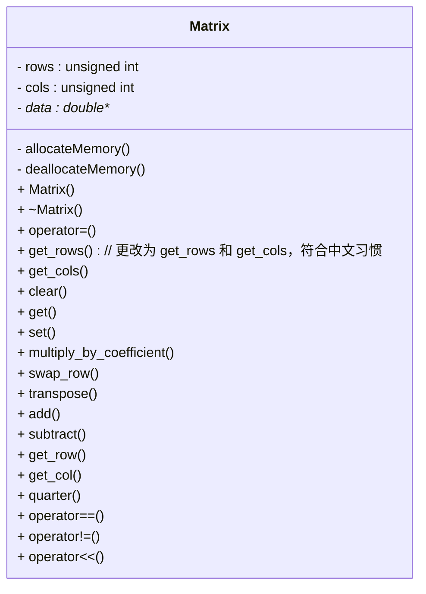

<!--more-->

## 作业要求


在本次作业中，你需要构建一个名为 Matrix 的自定义类，该类将模仿传统的矩阵（matrix 的复数形式）。你不需要深入了解矩阵的知识，但如果你感兴趣的话可以在网上阅读更多关于它的内容：[矩阵 (数学)](https://en.wikipedia.org/wiki/Matrix_(mathematics))。

矩阵在许多不同应用中被使用，并且多年来已经开发了许多优化、技巧和数值方法来快速处理矩阵运算并解决更复杂的问题。

构建这个数据结构将让你练习指针的使用，动态数组分配与释放以及二维指针。实现该数据结构需要编写一个新类。你不能使用任何 STL 容器类或除了 Matrix 之外的其他附加类或结构体。你需要使用 `new` 和 `delete` 关键字。你可以使用数组索引 `[]`。请在开始你的实现之前阅读整个作业说明。

## 数据结构

矩阵是一个二维数字排列。在这个作业中，我们假设每个矩阵包含双精度数（doubles）。我们用 m 行和 n 列的矩阵大小表示为 m×n 矩阵。例如，下面显示的是一个 4×3 的矩阵：

$$
\begin{bmatrix}
-6 & 10 & 1 \\\
3 & -8 & 22 \\\
-17 & 4 & 7 \\\
2 & 5 & 0
\end{bmatrix}
$$

我们将使用二维数组表示 Matrix 类中的数据。因为矩阵可能具有任意大小，你需要使用动态内存来完成这个任务。上面显示的相同矩阵可以这样表示：



我们将用 $a_{i,j}$ 表示矩阵 A 中第 i 行和第 j 列的值。因此，一个通用矩阵可以描述为：

$$
A = \begin{bmatrix}
a_{0,0} & a_{0,1} & \cdots & a_{0,n-2} & a_{0,n-1} \\\
a_{1,0} & a_{1,1} & \cdots & a_{1,n-2} & a_{1,n-1} \\\
\vdots  & \vdots  & \ddots & \vdots    & \vdots    \\\
a_{m-2,0} & a_{m-2,1} & \cdots & a_{m-2,n-2} & a_{m-2,n-1} \\\
a_{m-1,0} & a_{m-1,1} & \cdots & a_{m-1,n-2} & a_{m-1,n-1}
\end{bmatrix}
$$

## 基本功能

类的私有部分将相对较小，主要挑战在于在实现特性以使类具有功能性时处理动态内存。你可以按任何顺序实现这些方法；我们首先提到一些会使得调试更容易的方法。

建议你先编写一个构造函数，它接受两个 `unsigned int` 类型：行数和列数以及一个双精度填充值。该构造函数应创建一个表示为 m×n 的数据结构，并将每个值初始化为 fill。如果任一维度为 0，则生成的矩阵大小应为 0×0。

你的类必须支持相等运算符 `==` 和不等运算符 `!=`。两个矩阵被认为是相等的，当且仅当它们在每一个位置上的值都相同。换句话说，矩阵 A 和 B 相等如果并且仅如果

$$(\forall_{i, j}|i \in {0,1,\ldots,m-2,m-1}, j \in {0,1,\ldots,n-2,n-1})a_{i,j} = b_{i,j}$$

$\forall$ 是一个常见的缩写，表示“对于所有”，因此 $\forall_{i, j}$ 表示“对每一个 i 和 j 的值”。$\in$ 也是一个常见的缩写，表示“属于”。

由于矩阵具有两个维度，你需要实现 `num_rows()` 和 `num_cols()` 方法，分别返回矩阵中的行数和列数。我们可能希望将一个已填充的矩阵变为一个空矩阵，因此你必须编写一个 `clear()` 方法。此方法应重置行数和列数为 0，并释放 Matrix 当前持有的任何内存。

当然我们需要能够访问存储在 Matrix 类中的数据。为此我们将实现一个“安全”的访问器叫做 `get()`，它接受一行、一列以及一个双精度值。如果行和列在矩阵范围内，则应将 `arow,col` 的值存入 `double` 中，并返回 `true`；否则函数应该返回 `false`。

与访问数据类似的任务是能够在矩阵的特定位置设置一个值。这是通过安全修改器 `set()` 来完成的。此函数也接受一行、一列以及一个双精度值。如果位置有效，`set()` 应该返回 `true` 并将 `arow,col` 设置为传入 `double` 的值；否则返回 `false`。

## 重载输出运算符

在某个时候，编写用于输出的方法可能是个好主意。与之前类中我们写方法来执行打印不同，我们将依赖于非成员重载的 `operator<<`。我们以前练习过重载其他操作符以调用 `std::sort()`，这与此类似。在 Matrix 类定义之外但在你的 .cpp 和 .h 文件中，你应该编写以下 `operator:`

```cpp
std::ostream& operator<< (std::ostream& out, const Matrix& m)
```

这将允许我们按顺序打印一个或多个输出。如果您的 `operator<<` 实现正确，则下面的代码应该都能正常工作：

```cpp
Matrix m1;
Matrix m2;
std::ofstream outfile(output_filename); // 假设我们已经有了文件名
std::cout << m1 << m2 << std::endl;
outfile << m1;
outfile << m2 << std::endl;
std::cout << "打印完成。" << std::endl;
```

假设在上述示例中：

$$
m1 = \begin{bmatrix} \quad \end{bmatrix}, \quad
m2 = \begin{bmatrix}
3 & 5.21 \\\
-2 & 4 \\\
-18 & 1
\end{bmatrix}
$$

则输出应该类似于：

```console
0 x 0 矩阵：
[ ]
3 x 2 矩阵：
[ 3 5.21
-2 4
-18 1 ]
打印完成。
```

我们忽略空白，但我们期望你的操作符输出矩阵元素的顺序正确，并且大小输出在矩阵之前并遵循下面所示格式 - 每行一个，元素之间有空格。请注意，即使这些示例中对齐也不理想。我们更希望你专注于实现 Matrix 类的正确性以及处理内存问题而不是关注使输出漂亮。

### 简单矩阵运算

首先介绍一些基本的矩阵运算。第一个是方法 `multiply_by_coefficient()`，它接受一个名为系数的 double 类型参数。该方法应将矩阵中的每个元素乘以系数。例如：

$$
m1 = \begin{bmatrix}
1 & 2 \\\
3 & 4
\end{bmatrix}, \quad
m1\text{.multiply\\_by\\_coefficient(5)} \Longrightarrow \begin{bmatrix}
5 & 10 \\\
15 & 20
\end{bmatrix}
$$

另一个常见的操作是交换矩阵的两行。这将通过方法 `swap_row()` 来完成，该方法接受两个类型为 `unsigned int` 的参数：源行号和目标行号。如果这两行都在矩阵范围内，则函数应该交换这两个行中的值并返回 true；否则应返回 false。例如：

$$
m1 = \begin{bmatrix}
1 & 2 & 3 \\\
4 & 5 & 6 \\\
7 & 8 & 9
\end{bmatrix}, \quad
m1\text{.swap\\_row(1,2)} \Longrightarrow \begin{bmatrix}
1 & 2 & 3 \\\
7 & 8 & 9 \\\
4 & 5 & 6
\end{bmatrix}
$$

> [!NOTE]
> 完成基本函数和 `swap_row()` 后，可以调用提供的 `rref()` 函数的测试。我们在这里不详细解释该函数，并且你不需要了解它的工作原理，但计算行阶梯形矩阵（RREF）可以用于找到逆矩阵，在许多领域中非常重要。我们使用一种简单的实现方法称为高斯-约旦消元法，你可以在此处阅读更多：[高斯消去法](https://en.wikipedia.org/wiki/Gaussian_elimination)。有其他更好的技术来寻找 RREF，但我们选择这种方法是因为它的简单性。

“翻转”矩阵是一个常见的需求，这个过程叫做转置。你需要编写 `transpose()` 方法，其返回类型为 void。形式上，$m \times n$ 矩阵 $A$ 转置成 $n \times m$ 矩阵 $A^T$ 定义如下：

$$(\forall_{i, j}|i \in {0,1,\ldots,m-2,m-1}, j \in {0,1,\ldots,n-2,n-1})a_{i,j}^{T} = a_{j,i}$$

$$
m1 = \begin{bmatrix}
1 & 2 & 3 \\\
4 & 5 & 6
\end{bmatrix}, \quad
m1\text{.transpose\\_row(1,2)} \Longrightarrow \begin{bmatrix}
1 & 4 \\\
2 & 5 \\\
3 & 6
\end{bmatrix}
$$

## 双矩阵运算

双矩阵运算是涉及两个矩阵的操作。为了简化，我们将其写为类定义中的方法（不是操作符），因此当前的 Matrix 对象始终是“左部”矩阵 $A$。你需要实现 `add()` 和 `subtract()` 方法。这两个函数只接受一个参数，第二个 Matrix 类型的对象，我们将称之为 $B$，如果 $A$ 和 $B$ 的维度匹配，则修改 $A$。如果维度匹配，函数应该返回 true；否则它们应返回 false。两个矩阵的加法和减法形式定义如下：

$$
(\forall_{i, j}|i \in {0,1,\ldots,m-2,m-1}, j \in {0,1,\ldots,n-2,n-1})C_{i,j} = a_{i,j} + b_{i,j} \\\
(\forall_{i, j}|i \in {0,1,\ldots,m-2,m-1}, j \in {0,1,\ldots,n-2,n-1})D_{i,j} = a_{i,j} - b_{i,j}
$$

考虑这两个矩阵：

$$
m1 = \begin{bmatrix}
1 & 2 & 3 \\\
4 & 5 & 6
\end{bmatrix}, \quad
m2 = \begin{bmatrix}
4 & 16 & 25 \\\
14 & 3.4 & 3.64159
\end{bmatrix}
$$

$$
m1 + m2 = \begin{bmatrix}
1 + 4 & 2 + 16 & 3 + 25 \\\
4 + 14 & 5 + 3.4 & 6 + 3.64159
\end{bmatrix} =
\begin{bmatrix}
5 & 18 & 28 \\\
18 & 8.4 & 9.64159
\end{bmatrix}
$$

$$
m1 - m2 = \begin{bmatrix}
1 - 4 & 2 - 16 & 3 - 25 \\\
4 - 14 & 5 - 3.4 & 6 - 3.64159
\end{bmatrix} =
\begin{bmatrix}
-3 & -14 & -22 \\\
-10 & 1.6 & 2.35841
\end{bmatrix}
$$

## 更复杂的矩阵运算

如果要获取整个行或列的内容，使用 `get()` 逐个提取值会很烦人，尤其是因为我们的实现是一个“安全”的访问器，所以我们不能使用一些通常使用的编码技巧。为了解决这个问题，你需要再实现两个访问器方法：`get_row()` 和 `get_col()`。这两个函数都接受一个无符号整数并返回一个 `double*` 类型的值。对于 `get_row()`，参数是需要获取的行号；而对于 `get_col()` 参数则是要获取的列号。如果请求的行/列超出矩阵范围，则方法应返回一个指向 NULL 的指针。

我们期望你实现的最后一个方法 `quarter()` 不是一个传统的矩阵操作。该方法不接受任何参数并返回一个包含四个新 Matrix 元素的 `Matrix*`，顺序为：左上（UL）象限、右上（UR）象限、左下（LL��象限和最后是右下（LR）象限。所有四个象限应该具有相同的大小。记住当函数结束时所有的局部变量都会超出作用域并被销毁，所以你需要特别小心如何构建和返回这些象限。在下一页有两个关于 quarter 操作的例子：

$$
m1 = \begin{bmatrix}
1 & 2 & 3 & 4 \\\
5 & 6 & 7 & 8
\end{bmatrix}, \quad
m2 = \begin{bmatrix}
1 & 2 & 3 & 4 \\\
5 & 6 & 7 & 8 \\\
9 & 10 & 11 & 12
\end{bmatrix}
$$

$$
m1^{(\mathrm{UL})} = \begin{bmatrix} 1 & 2 \end{bmatrix}, \quad
m1^{(\mathrm{UR})} = \begin{bmatrix} 3 & 4 \end{bmatrix}, \quad
m1^{(\mathrm{LL})} = \begin{bmatrix} 5 & 6 \end{bmatrix}, \quad
m1^{(\mathrm{LR})} = \begin{bmatrix} 7 & 8 \end{bmatrix}
$$

$$
m2^{(\mathrm{UL})} = \begin{bmatrix}
1 & 2 \\\
5 & 6
\end{bmatrix}, \quad
m2^{(\mathrm{UR})} = \begin{bmatrix}
3 & 4 \\\
7 & 8
\end{bmatrix}, \quad
m2^{(\mathrm{LL})} = \begin{bmatrix}
5 & 6 \\\
9 & 10
\end{bmatrix}, \quad
m2^{(\mathrm{LR})} = \begin{bmatrix}
7 & 8 \\\
11 & 12
\end{bmatrix}
$$

## 测试和调试

我们提供了一个 [matrix_main.cpp](matrix_main.cpp) 文件，其中包含对 Matrix 类的各种测试。一些这些测试最初被注释掉了。我们建议你在基本测试上让类运行正常，并在实现和调试剩余功能时取消注释额外的测试。研究提供的测试用例以了解参数和返回值。

注意：不要编辑提供的 [matrix_main.cpp](matrix_main.cpp) 文件，除非是为了取消注释提供的测试用例并添加指定位置的新测试用例。

`assert()` 函数在整个测试代码中使用。这是 C 和 C++ 中都可用的一个函数，如果条件为真则不做任何事情，如果条件为假则立即崩溃。如果条件为假，则你的命令行应该显示在崩溃前的断言失败信息。

我们建议使用内存调试工具来查找内存错误和内存泄漏。关于安装和使用“Dr. Memory”（适用于 Linux/MacOSX/Windows）和“Valgrind”（适用Linux/MacOS）的信息可以在课程网页上找到：https://www.cs.rpi.edu/academics/courses/fall23/csci1200/memory_debugging.php

作业提交服务器也将使用 Dr. Memory 运行你的代码以查找内存问题。为了获得满分，你的程序必须是无内存错误和无内存泄漏的。

## 任务及提供的代码

你必须根据本说明实现 Matrix 类。你的类应该分为一个 .cpp 文件和一个 .h 文件。你还应在 [matrix_main.cpp](matrix_main.cpp) 的 StudentTest() 函数中添加一些额外测试用例。在实现类时，请特别注意正确地实现拷贝构造函数、赋值运算符和析构函数。

务必编写自己的新测试用例，并不要忘记注释代码！使用提供的模板 [README.txt](README.txt) 文件来写你需要评分者阅读的笔记。在 [README.txt](README.txt) 文件中填写顺序表示部分。你必须独自完成此作业，如“合作政策与学术诚信”说明所述。如果你讨论了该作业、问题解决技巧或错误消息等，请在你的 README.txt 文件中列出他们的名字。

**截止日期**: 2025年2月6日（星期四），晚上10点。

## 评分标准

20分

- README.txt 完成情况 (3 分)
  - 缺少姓名、合作者或时间中的一个 (-1)
  - 缺少姓名、合作者或时间中的两个以上 (-2)
  - 没有反思 (-1)
- 类声明和实现及编码风格（良好的类设计，分为 .h 和 .cpp 文件。超过一行的函数放在 .cpp 文件中。组织合理的类实现，并在适当的地方添加注释。正确使用 const/const& 和类方法 const） (5 分)
  - 没有信用 (显著不完整的实现) (-5)
  - Matrix 自身没有提供文档（函数文档和部分标题不算）。(-1)
  - 函数体中包含多于一条语句的放在 .h 文件中。（模板类可以例外）(-2)
  - 函数在 .h 或 .cpp 文件中的注释不充分或注释质量差 (-1)
  - 错误使用或遗漏了 const 和引用。(-1)
  - 缩进过于紧凑，空白过多，缩进不良。(-1)
  - 变量名选择不当：描述性不足的名称（例如 'vec', 'str', 'var'），单字母变量名（除了循环计数器）等 (-2)
- 数据表示 (4 分)
  - 没有信用 (显著不完整的实现) (-4)
  - 使用 STL 数据结构（列表���向量等）。(-4)
  - 成员变量是公开的。(-2)
- 顺序符号 (README 包含正确的顺序符号分析，包括适当的符号和提供的变量使用) (5 分)
- 额外测试用例 (广泛的额外学生编写测试用例) (4 分)
  - 没有测试 `transpose()` (-1)
  - 没有测试 `multiply_by_coefficient()` (-1)
  - 没有测试 `get_col()` (-1)
  - 没有测试某种情况的边界条件（行或列 = 0，奇数维度分块等）(-1)
  - 没有测试用例，或者只是极小的测试用例，只测试了 SimpleTests 中涵盖的内容 (-4)



## 支持文件



## 程序设计

首先，我们需要确定 Matrix 类的设计。根据提供的信息，我制作了一个图。



## 踩坑内容

1. 矩阵的大小不一定总是奇数。因此，当处理接近边缘的情况时需要额外努力。
2. 我们需要编写一些测试用例，并且这些用例将由隐藏自动评分器进行测试。

## 解决方案

### Matrix.h

```cpp
#ifndef MATRIX_H
#define MATRIX_H

#include <iostream>

class Matrix {
public:
    // 构造函数和析构函数
    Matrix();  // 默认构造函数（创建一个空的 0 x 0 矩阵）
    Matrix(unsigned int rows, unsigned int cols, double fill);
    Matrix(const Matrix &other);
    ~Matrix();

    Matrix& operator=(const Matrix &other);

    // 访问维度的方法
    unsigned int get_rows() const; // 更改为 get_rows 和 get_cols，符合中文习惯
    unsigned int get_cols() const;

    // 清除矩阵（释放内存并设置大小为 0 x 0）
    void clear();

    // 安全访问器和修改器方法
    bool get(unsigned int row, unsigned int col, double &value) const;
    bool set(unsigned int row, unsigned int col, double value);

    // 简单矩阵运算
    void multiply_by_coefficient(double coefficient);
    bool swap_row(unsigned int row1, unsigned int row2);
    void transpose();

    // 二元矩阵运算（修改当前矩阵）
    bool add(const Matrix &other);
    bool subtract(const Matrix &other);

    // 高级访问器：返回请求的行或列的动态数组。
    // 调用者负责删除返回的数组。
    double* get_row(unsigned int row) const;
    double* get_col(unsigned int col) const;

    // 将矩阵分成四个大小相等的象限。
    // 四个矩阵以动态分配的数组形式按顺序返回：UL，UR，LL，LR。
    // 如果矩阵太小（即少于 2 行或 2 列），则返回四个空矩阵。
    Matrix* quarter() const;

    // 等式运算符
    bool operator==(const Matrix &other) const;
    bool operator!=(const Matrix &other) const;

    // 友元重载输出操作符，用于打印矩阵。
    friend std::ostream& operator<<(std::ostream &out, const Matrix &m);

private:
    unsigned int rows;
    unsigned int cols;
    double** data;

    // 辅助函数以分配和释放二维数组的内存
    void allocate(unsigned int r, unsigned int c, double fill);
    void deallocate();
};

#endif
```

### Matrix.cpp

```cpp
#include "Matrix.h"
#include <iostream>

//-------------------------
// 私有辅助函数
//-------------------------

// 分配 m x n 矩阵的内存，并将每个元素填充为 'fill'
void Matrix::allocate(unsigned int r, unsigned int c, double fill) {
    rows = r;
    cols = c;
    data = new double*[rows];
    for (unsigned int i = 0; i < rows; i++) {
        data[i] = new double[cols];
        for (unsigned int j = 0; j < cols; j++) {
            data[i][j] = fill;
        }
    }
}

// 释放矩阵使用的内存
void Matrix::deallocate() {
    if (data) {
        for (unsigned int i = 0; i < rows; i++) {
            delete [] data[i];
        }
        delete [] data;
    }
    data = nullptr;
    rows = 0;
    cols = 0;
}

//-------------------------
// 构造函数和析构函数
//-------------------------

// 默认构造函数：创建一个空矩阵（0 x 0）
Matrix::Matrix() : rows(0), cols(0), data(nullptr) {}

// 参数化构造函数：创建一个 m x n 矩阵，填充为 'fill'
// 如果任一维度为 0，则生成的矩阵大小应为 0×0。
Matrix::Matrix(unsigned int r, unsigned int c, double fill) : rows(0), cols(0), data(nullptr) {
    if (r == 0 || c == 0) {
        // 创建一个空矩阵。
        rows = 0;
        cols = 0;
        data = nullptr;
    } else {
        allocate(r, c, fill);
    }
}

// 拷贝构造函数
Matrix::Matrix(const Matrix &other) : rows(0), cols(0), data(nullptr) {
    if (other.rows == 0 || other.cols == 0) {
        rows = 0;
        cols = 0;
        data = nullptr;
    } else {
        allocate(other.rows, other.cols, 0.0);
        for (unsigned int i = 0; i < rows; i++) {
            for (unsigned int j = 0; j < cols; j++) {
                data[i][j] = other.data[i][j];
            }
        }
    }
}

// 析构函数
Matrix::~Matrix() {
    deallocate();
}

// 赋值运算符
Matrix& Matrix::operator=(const Matrix &other) {
    if (this == &other)
        return *this;

    deallocate();

    if (other.rows == 0 || other.cols == 0) {
        rows = 0;
        cols = 0;
        data = nullptr;
    } else {
        allocate(other.rows, other.cols, 0.0);
        for (unsigned int i = 0; i < rows; i++) {
            for (unsigned int j = 0; j < cols; j++) {
                data[i][j] = other.data[i][j];
            }
        }
    }
    return *this;
}

//-------------------------
// 维度访问器和清除
//-------------------------

unsigned int Matrix::get_rows() const { // 更改为 get_rows 和 get_cols，符合中文习惯
    return rows;
}

unsigned int Matrix::get_cols() const {
    return cols;
}

void Matrix::clear() {
    deallocate();
}

//-------------------------
// 安全访问器与修改器
//-------------------------

// get(): 如果 (row,col) 在范围内，则将值存入 value 并返回 true；否则，返回 false。
bool Matrix::get(unsigned int row, unsigned int col, double &value) const {
    if (row >= rows || col >= cols)
        return false;
    value = data[row][col];
    return true;
}

// set(): 如果 (row,col) 有效，则将值赋给 arow,col 并返回 true；否则，返回 false。
bool Matrix::set(unsigned int row, unsigned int col, double value) {
    if (row >= rows || col >= cols)
        return false;
    data[row][col] = value;
    return true;
}

//-------------------------
// 简单矩阵运算
//-------------------------

// 将矩阵中的每个元素乘以给定的系数。
void Matrix::multiply_by_coefficient(double coefficient) {
    for (unsigned int i = 0; i < rows; i++) {
        for (unsigned int j = 0; j < cols; j++) {
            data[i][j] *= coefficient;
        }
    }
}

// 如果两个索引都有效，则交换行 row1 和 row2 的整个内容。
bool Matrix::swap_row(unsigned int row1, unsigned int row2) {
    if (row1 >= rows || row2 >= rows)
        return false;
    double* temp = data[row1];
    data[row1] = data[row2];
    data[row2] = temp;
    return true;
}

// 就地转置矩阵。
// 对于非方阵，将分配一个具有交换维度的新二维数组，内容被转置，
// 并释放旧内存。
void Matrix::transpose() {
    if (rows == 0 || cols == 0)
        return;

    // 分配新数组，使用交换后的维度。
    double** newData = new double*[cols];
    for (unsigned int i = 0; i < cols; i++) {
        newData[i] = new double[rows];
    }
    // 转置：newData[j][i] 变成 data[i][j]
    for (unsigned int i = 0; i < rows; i++) {
        for (unsigned int j = 0; j < cols; j++) {
            newData[j][i] = data[i][j];
        }
    }
    // 释放旧数据。
    for (unsigned int i = 0; i < rows; i++) {
        delete [] data[i];
    }
    delete [] data;

    // 交换维度。
    unsigned int temp = rows;
    rows = cols;
    cols = temp;
    data = newData;
}

//-------------------------
// 双矩阵运算
//-------------------------

// 将 other 的对应元素加到当前矩阵中。
// 如果维度匹配，返回 true；否则返回 false。
bool Matrix::add(const Matrix &other) {
    if (rows != other.rows || cols != other.cols)
        return false;
    for (unsigned int i = 0; i < rows; i++) {
        for (unsigned int j = 0; j < cols; j++) {
            data[i][j] += other.data[i][j];
        }
    }
    return true;
}

// 将当前矩阵中的对应元素减去 other 的值。
// 如果维度匹配，返回 true；否则返回 false。
bool Matrix::subtract(const Matrix &other) {
    if (rows != other.rows || cols != other.cols)
        return false;
    for (unsigned int i = 0; i < rows; i++) {
        for (unsigned int j = 0; j < cols; j++) {
            data[i][j] -= other.data[i][j];
        }
    }
    return true;
}

//-------------------------
// 高级访问器
//-------------------------

// 返回一个包含请求行的新动态分配数组。
// 如果行索引超出范围，则返回 nullptr。
double* Matrix::get_row(unsigned int row) const {
    if (row >= rows)
        return nullptr;
    double* rowArray = new double[cols];
    for (unsigned int j = 0; j < cols; j++) {
        rowArray[j] = data[row][j];
    }
    return rowArray;
}

// 返回一个包含请求列的新动态分配数组。
// 如果列索引超出范围，则返回 nullptr。
double* Matrix::get_col(unsigned int col) const {
    if (col >= cols)
        return nullptr;
    double* colArray = new double[rows];
    for (unsigned int i = 0; i < rows; i++) {
        colArray[i] = data[i][col];
    }
    return colArray;
}

//-------------------------
// Quarter 操作
//-------------------------

// 将矩阵分成四个象限（UL，UR，LL，LR）并返回它们在新数组中。
// 所有四个象限将具有相同的大小。
// 如果矩阵少于 2 行或 2 列，则返回四个空矩阵。
Matrix* Matrix::quarter() const {
    Matrix* quadrants = new Matrix[4];
    if (rows < 2 || cols < 2) {
        // 返回四个空矩阵。
        return quadrants;
    }

    // 确定象限的维度。
    // 使用 (dim + 1) / 2 可以确保如果维度为奇数，则共享中间行/列被包含在内。
    unsigned int quad_rows = (rows + 1) / 2;
    unsigned int quad_cols = (cols + 1) / 2;

    quadrants[0] = Matrix(quad_rows, quad_cols, 0.0); // 左上（UL）
    quadrants[1] = Matrix(quad_rows, quad_cols, 0.0); // 右上（UR）
    quadrants[2] = Matrix(quad_rows, quad_cols, 0.0); // 左下（LL）
    quadrants[3] = Matrix(quad_rows, quad_cols, 0.0); // 右下（LR）

    // 填充 UL 象限：行 0 .. quad_rows-1，列 0 .. quad_cols-1。
    for (unsigned int i = 0; i < quad_rows; i++) {
        for (unsigned int j = 0; j < quad_cols; j++) {
            quadrants[0].set(i, j, data[i][j]);
        }
    }

    // 填充 UR 象限：行 0 .. quad_rows-1，列 (cols - quad_cols) .. (cols - 1)。
    for (unsigned int i = 0; i < quad_rows; i++) {
        for (unsigned int j = 0; j < quad_cols; j++) {
            quadrants[1].set(i, j, data[i][(cols - quad_cols) + j]);
        }
    }

    // 填充 LL 象限：行 (rows - quad_rows) .. (rows - 1)，列 0 .. quad_cols-1。
    for (unsigned int i = 0; i < quad_rows; i++) {
        for (unsigned int j = 0; j < quad_cols; j++) {
            quadrants[2].set(i, j, data[(rows - quad_rows) + i][j]);
        }
    }

    // 填充 LR 象限：行 (rows - quad_rows) .. (rows - 1)，列 (cols - quad_cols) .. (cols - 1)。
    for (unsigned int i = 0; i < quad_rows; i++) {
        for (unsigned int j = 0; j < quad_cols; j++) {
            quadrants[3].set(i, j, data[(rows - quad_rows) + i][(cols - quad_cols) + j]);
        }
    }

    return quadrants;
}

//-------------------------
// 等式运算符
//-------------------------

bool Matrix::operator==(const Matrix &other) const {
    if (rows != other.rows || cols != other.cols)
        return false;
    for (unsigned int i = 0; i < rows; i++) {
        for (unsigned int j = 0; j < cols; j++) {
            if (data[i][j] != other.data[i][j])
                return false;
        }
    }
    return true;
}

bool Matrix::operator!=(const Matrix &other) const {
    return !(*this == other);
}

//-------------------------
// 重载输出运算符
//-------------------------

std::ostream& operator<<(std::ostream &out, const Matrix &m) {
    out << m.rows << " x " << m.cols << " 矩阵:" << std::endl;
    out << "[";
    if (m.rows > 0 && m.cols > 0) {
        for (unsigned int i = 0; i < m.rows; i++) {
            out << " ";
            for (unsigned int j = 0; j < m.cols; j++) {
                out << m.data[i][j];
                if (j < m.cols - 1)
                    out << " ";
            }
            if (i < m.rows - 1)
                out << std::endl;
        }
        out << " ]";
    } else {
        out << " ]";
    }
    return out;
}
```

### matrix_main.cpp（包含更多测试用例）

```cpp
// =======================================================
//
// IMPORTANT NOTE: Do not modify this file
//     (except to uncomment the provided test cases 
//     and add your test cases where specified)
//
// =======================================================

#include <iostream>
#include <fstream>
#include <cmath>
#include <cassert>
#include "Matrix.h"

#define __EPSILON 0.0000000001 // 需要这个来比较双精度数，因为表示方式不同。

void SimpleTest(); // 基本测试
void StudentTest(); // 在这里编写自己的测试用例

// 函数用于一次测试大量矩阵。
void BatchTest(double start, double step, unsigned int rows, unsigned int cols,
               unsigned int num);

// 快速函数，返回两个双精度数是否非常相似。
bool double_compare(double a, double b);

// 使用高斯-约旦消元法创建行阶梯形矩阵。
Matrix rref(const Matrix& m);

int main(){
  SimpleTest();
  std::cout << "完成所有基本测试。" << std::endl;

  // 取消注释以分配大量 100x100 矩阵，以便泄漏更大。
  BatchTest(100,0.1,100,100,50);
  std::cout << "完成所有批量测试。" << std::endl;

  StudentTest();
  std::cout << "完成所有学生测试。" << std::endl;

  return 0;
}

//////////////// 测试函数 ////////////////////
// 基本测试
void SimpleTest(){  // well behaved getrow/read after
  // 默认构造函数
  Matrix m1;
  assert(m1.get_rows() == 0 && m1.get_cols() == 0);

  // 拷贝构造函数
  Matrix m2(3,4,0);
  assert(m2.get_rows() == 3 && m2.get_cols() == 4);

  Matrix m2_copy(m2);
  assert(m2_copy.get_rows() == 3 && m2_copy.get_cols() == 4);
  m2_copy.set(1,1,27);
  double d0;
  assert(m2.get(1,1,d0));
  assert(double_compare(d0,0.0));
  assert(m2_copy.get(1,1,d0));
  assert(double_compare(d0,27));

  // 等式和不等式
  Matrix m3;
  assert(m1 == m3);
  assert(m1 != m2);

  // 打印输出
  std::cout << "空矩阵：";
  std::cout << m1 << std::endl;

  std::cout << "零填充的 3x4 矩阵：";
  std::cout << m2 << std::endl;

  std::cout << "一个接一个：";
  std::cout << m1 << m2 << std::endl;

  // set 和 get
  Matrix m5(4,4,2);
  Matrix m6(4,4,12);
  assert(m6.set(2,1,7));
  assert(m6.set(3,3,11));
  double d1;
  assert(m6.get(2,1,d1));
  assert(d1==7);

  // 加法
  std::cout << "m5 和 m6 相加" << std::endl;
  std::cout << m5 << m6 << std::endl;

  Matrix m7;
  m7 = m5;
  Matrix m8(m5);
  assert(m7 == m8);

  assert(m7.add(m6));
  std::cout << "结果：" << std::endl;
  std::cout << m7 << std::endl;

  double* r1 = NULL;
  r1 = m7.get_row(2);
  assert(r1[0] == 14 && r1[1] == 9);

  delete [] r1; // 记得我们需要清理动态分配。

  Matrix m9(3,6,0);
  m9.set(0,0,1);
  m9.set(0,1,2);
  m9.set(0,2,1);
  m9.set(0,3,1);
  m9.set(1,0,2);
  m9.set(1,1,3);
  m9.set(1,2,-1);
  m9.set(1,4,1);
  m9.set(2,0,3);
  m9.set(2,1,-2);
  m9.set(2,2,-1);
  m9.set(2,5,1);

  std::cout << "尝试高斯-约旦行阶梯形。" 
      << m9 << std::endl;
  Matrix m12 = rref(m9);
  std::cout << m12 << std::endl;
  double comparison_value;
  assert(m12.get(0,3,comparison_value));
  assert(double_compare(comparison_value,0.25));
  assert(m12.get(0,1,comparison_value));
  assert(double_compare(comparison_value,0.0));
  assert(m12.get(1,5,comparison_value));
  assert(double_compare(comparison_value,-3.00/20));
  assert(m9.get(0,3,comparison_value));
  assert(double_compare(comparison_value,1.0));
  assert(m9.get(0,1,comparison_value));
  assert(double_compare(comparison_value,2.0));
  assert(m9.get(1,5,comparison_value));
  assert(double_compare(comparison_value,0.0));

  Matrix m11(3,4,0);
  m11.set(0,0,1);
  m11.set(0,1,2);
  m11.set(0,2,3);
  m11.set(0,3,4);

  m11.set(1,0,5);
  m11.set(1,1,6);
  m11.set(1,2,7);
  m11.set(1,3,8);

  m11.set(2,0,9);
  m11.set(2,1,10);
  m11.set(2,2,11);
  m11.set(2,3,12);

  std::cout << "M11 将被四分：" << std::endl;
  std::cout << m11 << std::endl;

  Matrix* ma1 = NULL;
  ma1 = m11.quarter();
  assert(ma1 != NULL);

  std::cout << "UL: " << std::endl << ma1[0] << std::endl;
  std::cout << "UR: " << std::endl << ma1[1] << std::endl;
  std::cout << "LL: " << std::endl << ma1[2] << std::endl;
  std::cout << "LR: " << std::endl << ma1[3] << std::endl;

  for(unsigned int i=0; i<4; i++){
    assert((ma1[i].get_rows() == 2) && (ma1[i].get_cols() == 2));
  }

  // 上左
  assert(ma1[0].get(0,0,comparison_value));
  assert(double_compare(comparison_value,1));
  assert(ma1[0].get(1,1,comparison_value));
  assert(double_compare(comparison_value,6));

  // 右上
  assert(ma1[1].get(0,0,comparison_value));
  assert(double_compare(comparison_value,3));
  assert(ma1[1].get(1,1,comparison_value));
  assert(double_compare(comparison_value,8));

  // 下左
  assert(ma1[2].get(0,0,comparison_value));
  assert(double_compare(comparison_value,5));
  assert(ma1[2].get(1,1,comparison_value));
  assert(double_compare(comparison_value,10));

  // 右下
  assert(ma1[3].get(0,0,comparison_value));
  assert(double_compare(comparison_value,7));
  assert(ma1[3].get(1,1,comparison_value));
  assert(double_compare(comparison_value,12));

  delete [] ma1;
}

// 在这里编写自己的测试用例
void StudentTest() {
    double val;

    // 测试 1：转置一个非方阵。
    Matrix m(2, 3, 1.0);
    m.set(0, 0, 1.0); m.set(0, 1, 2.0); m.set(0, 2, 3.0);
    m.set(1, 0, 4.0); m.set(1, 1, 5.0); m.set(1, 2, 6.0);
    m.transpose(); // ��在 m 应该是 3 x 2。
    assert(m.get_rows() == 3 && m.get_cols() == 2);
    m.get(0, 0, val); assert(val == 1.0);
    m.get(0, 1, val); assert(val == 4.0);
    m.get(1, 0, val); assert(val == 2.0);
    m.get(1, 1, val); assert(val == 5.0);
    m.get(2, 0, val); assert(val == 3.0);
    m.get(2, 1, val); assert(val == 6.0);

    // 测试 2：矩阵乘以系数。
    Matrix m2(2, 2, 2.0);
    m2.multiply_by_coefficient(3.0);
    m2.get(0, 0, val); assert(val == 6.0);
    m2.get(1, 1, val); assert(val == 6.0);

    // 测试 3：get_col() 功能。
    Matrix m3(3, 3, 0.0);
    int counter = 1;
    for (unsigned int i = 0; i < 3; i++) {
        for (unsigned int j = 0; j < 3; j++) {
            m3.set(i, j, counter++);
        }
    }
    double* col1 = m3.get_col(1);
    // 预期列 1 应为：2，5，8。
    assert(col1[0] == 2);
    assert(col1[1] == 5);
    assert(col1[2] == 8);
    delete [] col1;

    // 测试 4：swap_row()。
    Matrix m4(2, 3, 0.0);
    m4.set(0, 0, 1); m4.set(0, 1, 2); m4.set(0, 2, 3);
    m4.set(1, 0, 4); m4.set(1, 1, 5); m4.set(1, 2, 6);
    m4.swap_row(0, 1);
    m4.get(0, 0, val); assert(val == 4);
    m4.get(1, 0, val); assert(val == 1);

    // 测试 5：减法。
    Matrix m5(2, 2, 10.0);
    Matrix m6(2, 2, 3.0);
    bool success = m5.subtract(m6);
    assert(success);
    m5.get(0, 0, val); assert(val == 7.0);

    // 测试 6：quarter() 对偶数维度矩阵。
    Matrix m7(4, 4, 0.0);
    counter = 1;
    for (unsigned int i = 0; i < 4; i++) {
        for (unsigned int j = 0; j < 4; j++) {
            m7.set(i, j, counter++);
        }
    }
    Matrix* quads = m7.quarter();
    // 对于一个 4 x 4 矩阵，象限大小应为 (4+1)/2 = 2（整除）
    assert(quads[0].get_rows() == 2 && quads[0].get_cols() == 2);
    // 上左象限应该为：
    // [ 1 2 ]
    // [ 5 6 ]
    quads[0].get(0, 0, val); assert(val == 1);
    quads[0].get(0, 1, val); assert(val == 2);
    quads[0].get(1, 0, val); assert(val == 5);
    quads[0].get(1, 1, val); assert(val == 6);
    delete [] quads;

    // 测试 7：clear() 方法。
    Matrix m8(3, 3, 9.0);
    m8.clear();
    assert(m8.get_rows() == 0 && m8.get_cols() == 0);

    // 测试 8：自我赋值。
    Matrix m9(2, 2, 7.0);
    m9 = m9;
    m9.get(0, 0, val); assert(val == 7.0);

    // 测试 9：二元加法，维度不匹配。
    Matrix m10(2, 3, 1.0);
    Matrix m11(3, 2, 1.0);
    bool res = m10.add(m11);
    assert(res == false);

    // 测试 10：二元减法，维度不匹配。
    res = m10.subtract(m11);
    assert(res == false);
}

//////////////// 工具函数 ////////////////////

/* 快速填充一个 rows x cols 矩阵的值从
 * start 开始以 step 的增量进行 num_times 次。
 */
void BatchTest(double start, double step, unsigned int rows, unsigned int cols,
               unsigned int num){
  Matrix* m_arr = new Matrix[num];
  for(unsigned int i=0; i<num; i++){
    m_arr[i] = Matrix(rows,cols,0.0);
    unsigned int curr_elem = 0;
    for(unsigned int j=0; j<rows; j++){
      for(unsigned int k=0; k<rows; k++){
        m_arr[i].set(j,k,start+(step*curr_elem));
        curr_elem++;
      }
    }
  }
  delete [] m_arr;
}

// 快速函数，返回两个双精度数是否非常相似。
bool double_compare(double a, double b){
  return (fabs(a-b) < __EPSILON);
}

/* 使用高斯-约旦消元法创建行阶梯形矩阵。
 * 这些是好和坏的变量名。
 * 看看这使得代码跟踪变得多么困难？
 * 缺乏注释也没有帮助。
 */

Matrix rref(const Matrix& m){
  Matrix ret(m);
  unsigned int curr_col = 0;
  double dummy;
  for(unsigned int i=0; i<ret.get_rows(); i++){
    bool col_all_zeros = true;
    // while(col_all_zeros && col_all_zeros < ret.get_cols()){
    while(col_all_zeros && curr_col < ret.get_cols()){
      for(unsigned int scan_i = 0; scan_i < ret.get_rows(); scan_i++){
        ret.get(scan_i,curr_col,dummy);
        if (!double_compare(dummy,0.0)){
          col_all_zeros = false;
          break;
        }
      }
      if(col_all_zeros){
        curr_col += 1;
      }
    }
    if(curr_col>=ret.get_cols()){
      return ret;
    }

    ret.get(i,curr_col,dummy);
    if(double_compare(dummy,0.0)){
      // 与非零行交换
      for(unsigned int scan_i = i+1; scan_i < ret.get_rows(); scan_i++){
        ret.get(scan_i,curr_col,dummy);
        if(!double_compare(dummy,0.0)){
          ret.swap_row(scan_i,i);
          break;
        }
      }
    }

    // 现在我们知道 ret i,curr_col 是非零的，所以我们可以用它作为枢轴。
    double pivot;
    ret.get(i,curr_col,pivot);
    for(unsigned int j=0; j<ret.get_cols(); j++){
      ret.get(i,j,dummy);
      ret.set(i,j,dummy/pivot);
    }

    for(unsigned int row_i = 0; row_i < ret.get_rows(); row_i++){
      if (row_i == i){
        continue;
      }
      double row_leading_coeff;
      ret.get(row_i,curr_col,row_leading_coeff);
      for(unsigned int col_j = 0; col_j < ret.get_cols(); col_j++){
        double lhs_dummy,rhs_dummy;
        ret.get(row_i,col_j,lhs_dummy);
        ret.get(i,col_j,rhs_dummy);
        ret.set(row_i,col_j,lhs_dummy - (row_leading_coeff*rhs_dummy));
      }
    }
    curr_col +=1 ;
  }
  return ret;
}
```