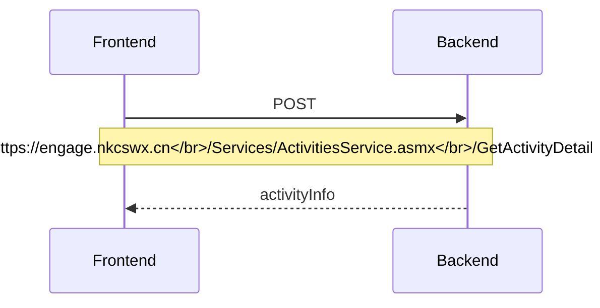
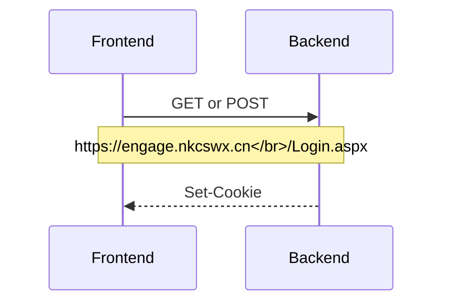
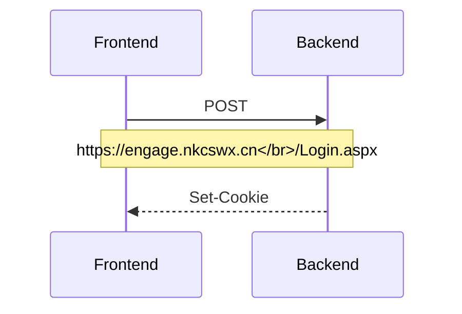
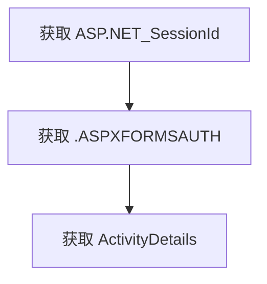

<!--more-->

## 开始之前

DSAS（无锡狄邦文理学校）有一个名为 Engage 的系统来管理活动社团。他们称这些社团为 CCAs。

官方网站速度很慢，而且无法查看所有 CCAs。如果我们想创建一个类似 CCA 展览的网站，首先需要以某种方式获取所有 CCA 信息。

## 分析

让我们看看前端是如何从 Engage 后端获取 CCA 信息的。

### GetActivityDetails

`GetActivityDetails` POST 请求是获取最终 CCA 信息的请求。其负载包含 `activityID`。

```json
{
  "activityID": "3350"
}
```



以下是一个 Python 实现：

```python
import requests

def post_engage(activityID, cookies):
    url = 'https://engage.nkcswx.cn/Services/ActivitiesService.asmx/GetActivityDetails'
    headers = {
        'Content-Type': 'application/json; charset=UTF-8',
        'Cookie': cookies
    }
    data = {'activityID': activityID}
    response = requests.post(url, json=data, headers=headers)

    return response.text

if __name__ == "__main__":
  cookies = 'your cookies'

  cca_info = post_engage('3350', cookies)
  print(cca_info)
```

HTTP 响应体太大，无法展示，因为 Engage 还返回了 Base64 编码的图像。

```json
{
  "d": "another json body"
}
```

以下是来自 `https://engage.nkcswx.cn/Services/ActivitiesService.asmx/GetActivityDetails` 的 `{'activityID': '3350'}` 的原始 HTTP 响应体。



这个 HTTP 响应体的大小为 203.21 KB，这非常不合理。网络资源的开销极大，可能对用户和服务器带来性能问题。这还只是单个请求，一个页面上有超过十个请求。

### Login.aspx

`/Login.aspx` 端点提供了许多功能。但我们只对获取 `ASP.NET_SessionId` 和 `.ASPXFORMSAUTH` 感兴趣。这两个值是我们向 `/Services/ActivitiesService.asmx/GetActivityDetails` 发出有效请求所需要的。我们将在接下来的部分讨论这部分内容。

#### `ASP.NET_SessionId`

以下是我们获取 `ASP.NET_SessionId` 的方式。



稍后我将讨论如何获取这个 Cookie 的细节。

#### `.ASPXFORMSAUTH`

以下是我们如何获取 `.ASPXFORMSAUTH`。



稍后我将讨论如何获取这个 Cookie。这个请求所需的负载很大且混乱。

## Cookies

整个 Cookie 包含：

| Key | Value |
|--|--|
| LanguageID | 类似 `ENG` 的字符串 |
| ASP.NET_SessionId | 24 个字符长的字符串 |
| usernameCookie | 67 个字符长的字符串 |
| .ASPXFORMSAUTH | 232 个字符长的字符串 |

但 `GetActivityDetails` 只需要 `ASP.NET_SessionId` 和 `.ASPXFORMSAUTH`。

### 获取 `ASP.NET_SessionId`

要获取 `ASP.NET_SessionId`，如果我们请求 `https://engage.nkcswx.cn/Login.aspx` 而没有 `ASP.NET_SessionId`，其 HTTP 响应头会有三个 `Set-Cookie` 头，

| Key | Value |
|--|--|
| Set-Cookie | ASP.NET_SessionId=2qbifskvg5i4kj32w25kvwe3; path=/; secure; HttpOnly; SameSite=None |
| Set-Cookie | .ASPXFORMSAUTH=; expires=Mon, 11-Oct-1999 16:00:00 GMT; path=/; HttpOnly; SameSite=Lax |
| Set-Cookie | LanguageID=ENG; expires=Sun, 29-Jun-2025 17:03:51 GMT; path=/; samesite=Lax; HttpOnly |

任何方法都可以触发这个响应，无论是 GET 还是 POST。

以下是一个 Python 实现，

```python
import requests

def get_SessionId():
    url = 'https://engage.nkcswx.cn/Login.aspx'
    response = requests.get(url)
    set_cookie = response.headers.get('Set-Cookie')
    SessionId = set_cookie.split(';')[0]
    return(SessionId)

if __name__ == "__main__":
  SessionId = get_SessionId()
  print(SessionId)
```

`SessionId` 是随机的。

### 获取 `.ASPXFORMSAUTH`

要获取 `.ASPXFORMSAUTH`，我们首先需要 `ASP.NET_SessionId`，然后是一个包含用户名和密码的 URL 编码的负载。

这个负载非常大且设计不佳，它有三个部分。

1. 控制和状态管理
| Key | 描述 |
| --- | --- |
| `ctl00_ctl13_TSSM` | Telerik Web UI 组件的控制标识符。 |
| `ctl00$ScriptManager1$HiddenField` | 与 AJAX 功能相关的控制标识符。 |
| `__VIEWSTATE` | ASP.NET 字段，用于在回发之间保持状态。 |
| `__VIEWSTATEGENERATOR` | ASP.NET 字段，用于生成 `__VIEWSTATE`。 |
| `__VIEWSTATEENCRYPTED` | 指示视图状态是否加密。 |
| `__EVENTVALIDATION` | ASP.NET 字段，用于验证表单回发。 |

2. 用户输入和交互
| Key | 描述 |
| --- | --- |
| `__LASTFOCUS` | 记住最后一个聚焦的元素。 |
| `__EVENTTARGET` | ASP.NET 字段，用于处理事件。 |
| `__EVENTARGUMENT` | ASP.NET 字段，用于处理事件参数。 |
| `ctl00$PageContent$loginControl$txtUN` | 用户名输入的文本字段。 |
| `ctl00$PageContent$loginControl$txtPwd` | 密码输入的文本字段。 |
| `ctl00$PageContent$loginControl$txtMFA` | MFA 代码输入的文本字段。 |
| `ctl00$PageContent$loginControl$cbRememberMe` | 记住用户的复选框。 |
| `ctl00$PageContent$loginControl$btnLogin` | 触发登录操作的按钮。 |

3. 隐藏字段和元数据
| Key | 描述 |
| --- | --- |
| `ctl00$hdnUnsavedDataWarningEnabled` | 指示是否启用了未保存数据警告。 |
| `ctl00$hdnHorizontalScrollPosition` | 存储水平滚动位置。 |
| `ctl00$hdnVerticalScrollPosition` | 存储垂直滚动位置。 |
| `ctl00$hdnStaffRegisterInFlag` | 指示员工注册标志。 |
| `ctl00$PageContent$loginControl$hdnMaxLoginAttempts` | 最大登录尝试次数的隐藏字段。 |
| `ctl00$PageContent$loginControl$hdnToken` | 令牌的隐藏字段。 |
| `ctl00$PageContent$loginControl$hdnLinkAccount` | 链接账户的隐藏字段。 |
| `ctl00$PageContent$loginControl$hdnIsPupilPortal` | 指示是否是学生门户。 |
| `ctl00$PageContent$loginControl$languageSelect$ddlLanguage` | 语言选择的下拉菜单。 |
| `ctl00$ddlReason` | 选择原因的下拉菜单。 |
| `ctl00$txtNotes` | 附加笔记的文本字段。 |

我们只需要将 `ctl00$PageContent$loginControl$txtUN` 和 `ctl00$PageContent$loginControl$txtPwd` 改为你自己的值。例如，

| Key | 描述 |
| --- | --- |
| `ctl00$PageContent$loginControl$txtUN` | info%40jamesflare.com |
| `ctl00$PageContent$loginControl$txtPwd` | Password%401234 |

一个技巧是 HTTP 响应头有三个 `Set-Cookie` 头。例如，

| Key | 描述 |
| ---- | --- |
| Set-Cookie | .ASPXFORMSAUTH=; expires=Mon, 11-Oct-1999 16:00:00 GMT; path=/; secure; HttpOnly; SameSite=Lax |
| Set-Cookie | LanguageID=ENG; expires=Sun, 29-Jun-2025 17:44:20 GMT; path=/; samesite=Lax; HttpOnly |
| Set-Cookie | .ASPXFORMSAUTH=6A6D74FA384A0359F3DEABB32A9795FD11FBEE7E798EF68B5EAA256305CF1061B36EE895A306B29E00A12F82D74A7F0504293A1994166384A3DA6A8E36A766DEE3EBA4805F67D78E1608A0EFBCEED37DDA8A0BAD03925CB7E2356CEC73150CAA014FA3A758E229BD2B32EAD55360B7DC6C5EC0FB; path=/; HttpOnly; SameSite=Lax |

但 Python 的 `requests` 库无法获取所有三个同名头。因此，我们需要使用 `http.client` 来获取原始头。

以下是一个 Python 实现，

```python
import http.client

def get_MSAUTH(SessionId,user_name,user_pwd):

    def post_with_headers(host, path, data, headers):
        conn = http.client.HTTPSConnection(host)
        conn.request("POST", path, body=data, headers=headers)
        response = conn.getresponse()
        headers = response.getheaders()
        set_cookies = [value for name, value in headers if name == 'Set-Cookie']
        conn.close()
        return set_cookies

    host = 'engage.nkcswx.cn'
    path = '/Login.aspx'
    headers = {
        'Content-Type': 'application/x-www-form-urlencoded',
        'Cookie': SessionId
    }
    data = 'ctl00_ctl13_TSSM=%3BTelerik.Web.UI%2C+Version%3D2021.3.1111.45%2C+Culture%3Dneutral%2C+PublicKeyToken%3D121fae78165ba3d4%3Aen-GB%3Ab406acc5-0028-4c73-8915-a9da355d848a%3A1c2121e&ctl00_ScriptManager1_HiddenField=&__LASTFOCUS=&__EVENTTARGET=&__EVENTARGUMENT=&__VIEWSTATE=pKaH5F3otHosG4r24lmDPRIspWqbbAMpsJLanFjRNXqr5e1T8Q6iZwjjXLdcLT0v3GWv7zQ9bK6ODye657W4jPwllrGhgeG%2BVUnPB85iX3B%2FcYOky1by2z5hD41Jfg9fnlN1oOtJ8ihjzzgufVv%2Bktc7RmfUEt%2BhAAQ%2FXxW2fno9OjYcxO4jSdW5psDv7wGk9JvHBiDjBECVFcPgwFCnaIphrC%2BFcJgRL1NMT2HBDd%2FwAoy4EwsUZlvriLMfD7Tj%2F5B8tsLTLPHK756PHjOzheLZ5Es2rmzMB19g0OL1xb7i42VA%2FsUY%2BevQuOJLyBm2e1Fphk4eVFCVMkX%2BF8%2B7b6jphK%2FbXFLF7oKEcJWctFn7LNjiiqOEYIv0BOronH5mNowjRAxYI97cF90OuCX%2BI2kK62Okr%2FZ7MADZWnsKYah6fuOBXGgYzRBVU5affWya2rkygKcCRFdh4LzB6j3pJsqee37bvIIvS%2FzDD6NzxSjilChamXBEnEGzC3EWfG0w3%2BDm8kQQKBPVmc4QU10KMZzYkjdzjyJNhA8QncnYg9xdWdCJ3bKu5GY%2FFhf1y8ACFA1FkwTaDxZy%2FT42BS1L5zxMWGQ24Ch0J4IgOKHkIHT0RVfLuZLE3LkLCI%2BMQ3mbiTloWJJ265lRre5wo76CExyyVHoh3ZR8L44e%2BusvVp44tisI0KdNuYlTm2BfNIWFZ7c36dZoNPb8Bp%2BcTRUneBghRoR9Jwr42AY2Z%2FfpeOwQpPl21lzOMuUEgi4MZRY2PFSZCyEeWMY%2FxqLqdC%2F0ITBULzVGdRSOqf2aXIjYEoJTfmkeYliZL21z7Pzxgm%2F%2BFX8RPcKWqobGDDlQvmiitC9%2FtmahiQxdavc3bNpNv%2BLvK3QXZuWxBnAzrwKADPrap4iNNp48ZVuD9IMTcccaPhXshXKSZkxdlDtPYwXPtKOBAsJtXmjWcy%2BPr8wvBUXlzxraEAMhmjtjklaGjZUgen25vrCgeUfOyswdpvmKuEtsY5wObSz09ftChpwyPDQVYgwbDViU8yNH%2Bf0x2C0stsRu1KZg%2FpGG6786DcyLgzQ2muju02aSoDTzv1oUPetGmeHiiT3KwJsSXCqDJuk9z9Z3FAW0DpYt1dN%2BBZWu%2BXHEkv9M2rfcCeYwfLJhI%2FNZMXZuHhGGYTxwkIg9OTud5PbDP1A0gr7KhlRcfZ47DzZZA%2BLebtxoVvSeaFdiGCZtbr5wZAxrdu3knyFRiRR5XR3S0FFSqxsTVGZEyJPu890WLNFgonQ85nQmdD8U6mtwtFxr9CHeR%2BYRwvPmrLr%2Blz7WpPpayMR9HRreg2TjBIRMeQjO6PFgNtytMzFCFJdfcsB7oM6eDVDfVyAPrFeFCHrY7TJCGB0HKvJSXhKMYhzekwtJ2J47B5XAduRUITkpRIMqRG0dv0RKoOozKPXBnEJbdUl%2BnE5W6Sxh8L9VrBgRVjHwfekfBGI4c7ZHVUW1FYZqb6YYC1YJa2LL5CvzGbhbc2biJ3u9U51ug4%2FXDNgXic%2BfUWSzALUZoJa7YOSpnKKm01DNkqCVA2JGJwT8M2C62vTevGGAJ5QQUT%2FmyJi2LdOOkIXTuXaEnul1ZEgdubhov1QYRWwimpjCtuTc7i7aW265LYCUdusbZsgqGDihuKuwA4Ifpw32R0g6aUvuwjPI9yYOhtzewpFHkX8nY0cV%2FJr%2F2tlaLVRqybZ%2B5RgqN3RTDqPgX6kxnFrxrvBB%2Fml%2FgN3mG9XIJiT9Tza4vR3ARB88A%2BXb1yrkVBTLRPXY3Zjy1ZKO6Px0WKliitlegU2h%2Bv089Hmyq%2FafCuNLwFlJSKvhekhM4gLEa4ZSo0IT1hOsDndg3ebEbNdZN0gtS%2BL9v4yTWh3qCMIqWSUh9QFJ0BjJjEeM4UwJD2f5J5CCpsYe60cjLU65ynczTl1eMbN5a%2B7wnWcIh2J9denQ0xNR%2FGK2vH368SlDoqknuIaDYAng4UIGy2UobAvqz5wIB7vN1aLfmcxvzoU%2BP1RjWNCK9P6U5yg70GROdABeAXjRQT3RUe09Y2T2QdL%2Bn0aTU%2BdWToCkT0AxFDdg9NwMe%2B1EL5ShJ0pBHsS%2FsfglhGObj3yGrRblmSetzjICK1uhC1nPS%2BN3pmURXO5gGZjD0IUYrLuaVDjek1Z4AHoUKMdZkoDUMmvGLSwSXnCWOiDgC0rMYTa8O8sqChrXKLJSmCR6ScYIiaJ5rDmhqx9wpvgSwLP7QhRYEK%2FYhj2FlkCQmws9EWGWAZkmHy%2FkTsJX%2FutgndM594gKCQSzWDICz0r7PJ5sOjmyd5n8YzeqUyZWGg960ojAI1nmldycoj9UY7GYBu%2FUd7YUgEd2Xt4u86nMKBMvnt85JDZ0DmpLvMnIsr6pxDh2hUA6BNskLhMQgKQkPWp7zy74hvWbabmezQFkJ%2BAXmRtxqiTxnlUUkkNp7cvCkVKCX%2BmNSfYq2mDE9%2BO9rUnSEu%2BLqomXh0cxAa3ZQcCy52wGcqjm1dEaOBDOI1Qam7hcAhDjrI7vke0FNKmdFePX%2FX2RcoY8ReyQLZvLriDrleNL1%2FGC6ufBXH2%2F3saDhPOLz2vcAUMJGj1rU%2BCxOXB3WMw4JlDHk8ggnd9ZBfnQcT%2BNQiHXbe%2Bea7lNGaUBtmgTkxzOHfwAAfx8tHu0tkoArMDENtXay9ljS4NMvcIIcIP5WIpeuQN5xCN2i1PM5zBGWa14KNFpcO%2BPSDewhGFsAFszW3AxIimKnAW6S2Zev4gywMC5soQF8t0aXoRYIk8Mos4p6wNKigjvMWcaxbe6xnSpYKnJ7HaAk8cPZrh%2BxNaitR0x4mC5yO2sHyFzh2axWhota7HHvoraJOeczkHnL00FF6MgaV6%2Fcn0vSq%2Brrtnb3p6eVp2D3CsexvzHuqYLP9V50NCE3u2eW1aa94WHVF9uGBqsZGaFlwvnfVz1tMdwGONWu3ks%2F7OVLNCQX52FBBCOlR5Gy%2FzYxgA07rCQZ6d%2FKYQYB%2FMS0XdMi3wSg6cy%2BXtL650dsdg68HBfz37IFLi24zJ7EBPV3SzYQ%2BcXWopgBwprd8cfyLF%2FFoXsvIWQc3n5SLcst8hqyEho1IKR9bZEyp1L6Fx3sJaRhZEaaRjCglUULJYNb1NJxh%2F3c8iNetj7bOrVGFOZZTjGuET8pgDhwrST2AN%2B9C0AnmeM82uh%2BHbnzcQ08zEVEWS2zafj2knQlYYvvgO7Ej7W1%2BilFos941WR69CTLP0jwiYMMsVfFq4wz4i7WCMGBzcwH7rqVgc4IHVOeBP4fnuY1WQcwnz2suWe2cPSyucNFIakeT3XgDphF4V3AxOuuYR%2FZMKaSoOH4WprAfpmSaeWO51CzPTD1joCLp5kC951zSTC1CO4N56ORDig1iC6uqEFiBoIS37fU%2F%2B9%2F36BT6McLvn8mDMviShDfmic95TbrAmd44VoagmaLzXv9Zs2iAnejPV4uuMbzRMFbZ7n0os6yEE%2F9Zf8QRim%2F%2F%2BMJ9I6z1H%2BxUUBxQS3sa18QHB%2F%2BMz0t4yKA3bKJqf8PtJM%2FYN6JEEh1%2FSf2Gay9iDZ%2FrVvGDkTZ%2FHJH7y2uO0LJrR2%2Bvw0dA7YVWEJW5gyo5TR7HTPO1H1iKMvVzee0KSxyMyfFtGpYaVEUELBq9iS9UpyWp%2BRmBSAHsHLiJpRmmCpmwVA%2BRtN4xEP2NdZlsp8ASRS9bfQ0ODHrPnzt49nSXHs10zdM%2FVmBQ6bO57m1sOygXkRT3Atvgh%2BKkD4IQmE9jZ9pd8gQNbT%2FZwqSjnmn4qcPfO4qxV9R5enwEMeso9fkNdDKQK9H89Pc%2Fr07Td0UtoQitsg9NJk1%2FUljvrlnv4C88dfC324QyoK6SQUMSgScbNVkMmdjttGsmDLb37IMSTF%2BYX85d1VH8KGL6ydgGRadbSx%2Fg3Dq8IY%2BalLscag%2FmbIkPq4oJ09HlATEVwl1mJU1rNNSYojU4F4Q3K4Mwrz2BFP062LclV31EUDTixQKPsI9KGHjbPA9tmKxNNvPZp5r6cFoq405DpgMKWSRJCADg%2BN4ODFkVnD8K1aER%2B8Hk4y7IMk4U1kZeXDTJQ4cpWsZskOCsRI%2BQS6ooRFJ4oXqR9Ca2850lW3IK334QKI2XeZNQ8V9QkIqaeNCnZZTOx3qasvuq2tRxbaVpCyqRcOdJnCqlJP8DikbN5TVDZlmmZMBZs%2BWVCIqLzXyxpmvZKKWdBgdjTJ5u97pmQb5nQO%2B03pccnkNBxHLc9vlpa81JgNkLCBzq1OMGbCb3dP2i0XoHkx54bi9%2B%2BjgRVcRRyTSDt9WzQ8dIZ2ZmwSbEe%2BnK1nxvH01IlfXMnTrHpvPELMl%2FjufyhXsaTwwrCNES%2F6U5FjoonGK9r0iu0VPFqsf5V00izKlCiOJ%2F9kogPdLw4f7f3KAEpe33AgpDop9J4NwGFOo4LvVl9LnjMB%2FFCTo9O%2BH5UQz4zSL%2FMhg6Jwvx4YqiVgpF2%2FrouiYDUyIdmU90807d4GrHOFblcXciHv0xUGe7OIeHM9WjWzNCIBoIs2Ccroen%2FEAshdc4ovQ%2FYeaKtvVCxwHHiMz6%2BCqjg2UOxbbAbNJwhCEvnvxrqOnWO8MC%2BP6GJESISjtpon3GovBtpeuQYPcP%2B1G8EoB35m2vKtLFKyBtHAUY8lkvBYL37%2BzYxuX3w7lqkyAHG2mJie2wprlZkY78z1PQ%2BrHI%2FzpCB1N%2F2swf0v5SLpbGO7TfdW3pRODWoTXI5pWkxKMpBTJ6vU0DXpvy9DgIAcq2kP1CyJsMcuf9YRlIA1NchJYnp81YZN3q%2F%2ByBApI0Z6vX%2FoNn5Z6IqeI9w5vHpHx7BwjqORSxjo8XAa8VAI4jYJhrisnTgwzy3b%2Box1FzOqPVcHlxv59WoKsF6iLvMUVSZCGLOKi95e%2BRQWJgiH2ofLbj50z%2BBxUC7SRj1yPI0CPZuui%2BB2s5rp%2FdU3HM6493zCcgArDGH4luC08K6RgaXk0JkDwePvLzMoM04ct9JOy5x9X91mhJQAbmoZnAeOPKIRsFInMjmUY%2FiOXFJPQMVYDCIjRtQCav4kj3X5%2FnZB4I7xgZVfT8JSREyeY6aDH2XEiDJ9wA9rhW0KWJVVgjKDtvhN3GSX2jCG%2BXQXWbKYmagCROOVJanPCRLSvbNFPLyroPiKxgQSujPDqd6RvpojfolHtHxPkyfluc8bjUXJteJfRj2iWnjphO065dU6tVwCkgU%2FEsnA7cQ140rkMhmX9eaqUYdsq%2FCgghr1OrVaL3x2d4iIrnnizycF2NX%2BHwITQrL%2BOj7NKBys9BVjDBxTSlXUk3hAwYN8JWLDqifC4q1KOwmlRORGrv%2Fzz9LNeyE9e5VY8Ag23DAwTCC2ARIB66o5gJZZ0oZQ7uAcurrMRasswtaRPim8yHbdNa0B98Q%2FlUpc0XUcaDtIZbH8vSy8AaLm%2FA5CLyQb8J0qr55dLJ4iFnfBBTc7ZWBfEbv5VncU%2BzBPG%2BWudu0UCt%2FfcdI%2FM3kN3xjvE0viL90n8Di%2FQUSXEjEr59GQZ2RqWuxPU7UAfQOjf4%2FZ1urDZGyJGjtR%2BWgBrygO8PzzDSxYwZJRrCMYHTAYLripkAn440Mpk7MvPKjTcDV8epDmyrAzHRAkPf71w13tWls%2BZo0AwWjYo4ZtjvXA7IFq4lGPPefQQ6vT%2BTWk3nWCXAhV0gvpIVdGD4nA3dNRKylBtZsQX7GXagO%2FA9wLEv5k2SrI7oC6CVjoCax70ElSqsjjHecumX1PV2yTZBxS047OdLwW04K1eaNDMCUZm17jkKQwellcueQoc1Zmu%2B79c83Wqv%2F9lcTqnr4BdmHj2gLp6qCaoGXB2oqa9wxx6x9BKCX682umHWYc5OMtFdio49QUzfrfjpZzvw6OrcI3uA5GvzQU37BEx6Grxi1YAI2phEYFXmbCBRVxSuktT1z%2BVIqG%2FaxQymhIcZjm6Kwzp4uDDARqBVLDqfKHvzheM0SPmx865MUR2YK8ErEBgmfTiD5Bh8WKNr%2B14kySESWdaKRmg5qSNcoijssVqn7NKgSJSxiORoONCruH7naTr3GCUUYlkXn74TC48GIJBBeCbvLS8VGLkDbyQC%2Bvf5YNS3w7lV8neVcU3%2FwYzg%2BgVwQDTYFStYePxddOYGW4T0tpqzIehky%2FX1UX6jP%2BjbILeDejjbV4%2FEackltSHSA8ueZy0IRjB0g7ljARiFJ5sAxZvfemENO2yMbVOr872R3%2B2kKfpg5UWs8DUSQQPDwjttCkUbYT6Afn3YYqZwce84jHN1W5ZIUcxPWI20X65MTsA7WTXd2mQmKUKcoWAJE6w71tFycOiPl01j8PYjiErIrWQiUcN2a8uOnjSZAz3J8IWLb2Wgv9k%2FSMFn2k9ohXXZiGw4b59bsqDuon5qCDYkrH1Dw9KfTWhRjtTgWe3xLbPIkpU%2B0Hwd97p%2FhPGYTCC6NQhcbOVu9Rj61Eo64HFjvK7WI6WXkBegJp1%2FhfOhLkIQ8%2BgYNP8p0I%2BFTXuk5p3F2LdY56bBXVVe5CGFDVFSSlqrO0KoMasdtCQ%2BTcIS%2BZ1yfS5wl9duw6seog4e1mzpnpQ8iAlIcNbA8fgQNKfbEf2vk3S%2FCP8WOuI6B4mIWz%2BdLhuAtunQ2IH2dm6CJM9WrCw6OpF7vBMo%2BGqc6dZY9zTN8QnyxlxiPnN1b51mTdjppusAv1gc0O7r%2Bjq1bv728xN%2B6yNrJnOjxEHuPP5C7VzkYoMZbMGWvDvS69T05Zkk0i5jEJjO0exVUYmpaTCybqkaboYkBD18czz1Y4NZuMsIH0pPnCafimkwrzk1LZ%2BgaD5Es87gDjs%2BFgxONGhuUjaltLaKYyshmQb%2BqzgOlnMCzeAHatY%2FTpYaynT0CAvsjnxrca36ojEZHrf3MAD%2Bx0ZIwICKecYWSjEU11DXUS5340%2FxfmrU2qUrvbKHG4AnH5CQjDltofnPKfGL5K%2Fzank8Dkhlik7XSuTdNtpa0tUM%2FaZEr4Bz20WjaoMXIxy%2Bgk9zjHVqZoXOSwH2AOJWv4xVJSZFbG0niTUeNLCRnuSQwoEidUNrWUmU8ZS7BD07WpRzEI43OFb7bv2j3Be7kdAv9Be2V3cT9SOvkHMxixp9eNTHivjnzj87B42tZVjXCYs8GORNHkgXCkDsi%2F%2BADJzTXv1qjUUa5EjBOpavHoxicLttoD2Jjxa0%2BIhsG5qKOMEHQvven3OKQC0wlW1dNY9KQ%2F5B4h7Zhy8tF%2BcwUhddunNl4iG%2BNp%2Fsv0mJy7y6LP1vifgdVxBXIwzjaBRRXLCY7TqGrwtIZidu8dNqTRKHg7%2FwcVJW2TxwdGjXi2Le7tzCd6HaLkHeqR2Prx%2Fh59IaG9eQ9q8vp3raEK7mFMeg2lnkuG5PV1nfghiOpM9H8C2Y6QOGEU%2FpF7gz4PoR8Fm699SJjTvJv93UFbB03iyL2zuSJEVYg7ukY0yPueVIqXpj0DH66c3gEGMFoZKXVQmmE9BPaXVSL1Yb6ZaMjm9vIVSVMf4qiiYDlGEipcIx1WTC8nQvYfxDDe5V%2FgQMCh5Tjf0YTfqhGTHegTmCNyeapWQbIYSKC51yUi11txCRbh1PmiqnGR%2BrSUE4Rr%2BuOUhtQ5hkxgwBiKTGSYFF0iwjZtWtpV3855G5Stdonk00h81KkaCsFgk6x7eglcOpFebO8zpSz8CINJgsfBFzRxL2dDEORfJEXQu7vB97gtQTAxiSqmGLpu74r%2F9%2FQdXMxlwvcK2JFdyhhBj1O86xXnwDi0PpX4NDezkB0oLmTzQHMb8d7BnPpEmijcaSbAmpsutM6Uqdz3QV%2FOu2HG94xAgW0M%2BOC6VA0TVnlGRaGYfVKR%2BGIO07HWOqjjclkIPaTyYnhKSdS0zJJEZDKyiVMvoGoar1WjfZMRpdQA%2FafuK4rm5GmZtyUUXa4kDDDE3tMMG%2FcbrCej%2Fm4zduSkvwUpmNDhB3veXg6xYRMfd0zfQHy8mCm7kc54sckM4xLeebjUMiWmQ7YSEPLcC5SG7%2FNIiy7GDzmNLCI3oi8iDXwQEnGj%2FTVMWu2bXfWVUNLazp261ftKVe8xL8ZZcYeJlQ7IYGNGsUAdR82%2BgqkRWW590RZ%2FZrrT5JOq%2B0N7sONfKeTur3XK2VTQ4hpmHx%2FYGj%2F4B8SYOz9HaMfmq4Qngm5o7AK2cNTF8Gn25li7EeCtzyzqE32DcYcU8Dq4Ne8gr3HoP%2B2bulk92rFblkxBcoMyZYAUXRdHAC4mEuhAlNwZ3UH7%2F6aCrQNHZVTRNx059%2B2SXPiqgGkgTCE%2BOGPAGiQEjPTL0EaD7ojA4NYUjb8YKYOPnM57FCyB2dj55sNMRU9Gy5f7%2Fucj6%2B5KF1RYTgoyr28q3ovJU6ePLXkgrG1IgFMz%2FEdV%2FKkmElZbvN5DV5UWw2qlHnQNJePUooTFhArmsuHhyITSvLAHdq6fcTKW1p6aH3znc1Ml6JbxV6hVXNrUoFaQ3sP6RbzhOptKmi7VWFEEmFQvcJ9C8%2BETu6YU4PqQy6kO0vKti2qZYr7hXG2d88ZxdMG%2FE3VHI45h5hao7LxmDTU2ZxrvHsGj%2Fgitf%2ByaJD8pGZCKJ4WBriyfpgRo0hos2gkxgE5%2BJRjt1Lx5TZNAYdvH1zodhf3B9R2ddjnvSVc5Zc%2FQkZ8Ixtj81nAevx%2BRGbF9QBOD1%2BGmngNRpy3O1%2FZt0OPZ2rPwJfutApakOKVmxeRCW5kTa4Yo2F6fh3DaRW%2BFBL9VbJa%2Fnj8tG0RbuPBAcK7o%2BawLrW6JxpkyN%2BMGwoiXkrBn%2FE8NfvS6O0xsmxtbOWABlbpTY3uDjk%2BEtUndGq2iNA95mTcM5WMKmhEk%2FcTyKVlK1dsi5oUVwqCAsoM2qasUigbU3Cycar85mt6iHkUP7VstHl5MwXLp1u4W5HiNl4BVhrual9cHhoAp4DbwIQPpaqa3VcKiLVUbyYSVhgvFTrqYzQeRMz9IJiGDB9Oj8u%2FQFtW7zWGAbilPadp2el3S8wj58Q5v1qHulBWkb0NZJV7whx0YYrEmQw4xxB8wvSgbZmkNMHRFpc6rZjckj30SnBAlfzxTJZ18HtEvrfAr0rpv%2FitROeL6Z5Cdmt2ZaeoyJ%2FQmhhGE77GHwr6oHUh%2FA0R6CseoGAzMHzdROjaRKZGcitkHY07fV4lUP4sRx0o%2FXxFOqSd9Xw8NyXTZmjMGbHCxk617J9PwDQslaaJQW5bYnsyBkkphXwuSVVHesh36eu5JBgdLaCj32qu%2BiZmlR5IbTu5HkVHmF6rvBb60ihNIfres%2FNj%2BFZFuqP0oHSV%2FhKHu5Y402PcPUOy4fYqS5iG4NdLmnY5u45%2B3%2Fi1NQEU41FHQkYXu0dVRmSHplMrlVJTaK7ow%2BMZbVO8hGNzLdkstvdeC35vJGPD3BtrXCuHeo0HwcaUoQ0ZGYF8FtCMVRfTDfupjgTBtIN%2B%2BBEdt%2FvHh1lR8qgRLeF%2FuzPnxlMxwIR3TswN5r2DESB6sNth%2B5O1aqfN8gOid3XRg6RibsgMoFicNQ3s6EEyOB7v45RipYBSQQqXQYtY1Hdgt5gBlKw7Vac6UQ2XQYmRiYO7giqSutcH2hjq%2FHl8NZDP32y9i6VY4mZmCC2aLLZ54qRy9bdYpNTUImhBBpF32%2B3C3Rfwa7Ma4NboUppq%2FElVfp50ZNYSkbVEstjAWc2ZdDVgn%2BTPbVp4tLg0VGwMfMCI4gb%2B5V%2FLl%2BriV1k%2BN8%2FL%2BK1bfyBHbAaP8lGJVr8s%2BWOWm2hY5f0skELL1kTBTw9om8KYygI3mQLWaXLvgqlAyFRBkIJhbw5BJRU1q2%2FvI6C5lKScxjrB4PbXFxp6jXixCNa60DrOWQr56DLOyuplex9ej9T5Tj3OAZ30Si2K17hJTi9l4KwT4hsGU%2B1fiYtdhkFCrafeUC5cPhkg2RDKNxqbBWPpPW9Fux1JcmSBAEPyiCg%2BWylQgfyZSn5MXapT5GoQ8XHfBOfIpKBN3dT43vJoRlkmiZnwiHilSA3u9lxRFqkn%2FURjK8ho1sR8UYgz3CrOce6%2BZ5KI71jbk%2BNTsFt%2BOBgr4SvNrJVQsEgxwAWbAxleU%2FG%2Biv68Y5bZC9TuAwcuwuzAQWR%2B9poapwvO0N14oa9%2FqY0SHszbED808vXFxEHuDLBu92SZvOjECOpCiTkuL6LAGXEepRsGpFKo1pp%2FI6edP4AWMB7%2F3PlORS2KCctNBHyWw19UI0qri9%2BP80ych400Fub990ZQFN4sGrigG%2FeiPLEkYT%2BHW4vURE554a3rvyA67LNPmijCJYWWmR7hFvwk%2FZ4rkmIFiTetvefuq1G%2FyPhT8u5eIvNcRsdTgi%2B0a1bhmg7ZT7ngMGEtf7RzhEUVlqhMRzxxe%2FQp1HtL5ItdMJeRYXWYxPt4WgYrb%2B34ms0LcJ%2FET3xc4eNcyeHsSqXdek%2B9D6gRFfyRrMUktXqwkAuQ1lwVIIAbKMzeXtl73rtMCXeyxrWe11I1q7KteO%2BdbpmbSbe%2FQCszlPQKNdR%2BTgf3vsOiJPqzGYMXsCU49rsAtt185JxAgMZHytmLsFpkpiQl4WkutYnMFWNySCzvrznarNoLWTbbirmvrq26Q%2BtSZJ9YE6B4s9TebBJj%2B4dn%2F8jcjbyZVlIzyUs9unmYMVDuSZDxXIUTcARjnTRL0Dnwx4F%2BAuXr1CTRtk04py3d9PeBW7deyK2hJUsZTKP7K5GSntnSkCofOftRYJIVkmMpe2fsDQm5njJbkJ%2FzTXMMW4Df4%2FGDZTUwYXS5mpBgV7tXgK78kvU0Pk7T1UTHBDhrgWEqGrJ9ye66UYUbgT68Eo7WM3bDaf9BlGk6kBA%2FWbjwwVQ5R%2FjU955KadJCLV03IHRvHcGc5oSp%2BvV0Obxfs8DCIqkfgx%2BDXknymatWD1bpI1ZChk66QQRzeZvpP67fSD5KWyQmSho0OZdUA%2FVnyOw3JaYWPYXEGXlUEaMEUjhHbawzriNsDTU1MI2GkRmnsugJeIqciKscf0RAUV%2Fwkp1wBOqHLWiJHAKMIng6rT7tvFvF8B2t%2FP6Mxd8zjlx7mpP8s5abh1ElZKU%2Fi0nBfNK9VtBu88dbfGCRGwwY6%2FZhCKEjAy%2BQmmyauWYiOpYzW9fWrgWEAgmDEoAeiR1h7pQo6QQk%2BtlQFOhZeUj7neJ%2Bl8IGOmjBPLgIofs8jD772D7lkbCMUI1SuOZJpYVS77F%2BPY4J4375I%2FpUkDoe5QOWYWgrwyQXqhalOCCLqt4vlIaCSDgBcC9Nl2T3akJKAcS2%2FCiKqn7H9iMkFk5QC02%2FeX91uk%2BkZT1Ldo%2BGwaBgObaLlhsw56j%2FQhI3CX%2F%2F7iSv1lbEb%2Bj48XTYho1pLqk9Z3mLeaFjSweqKHxg5KB1AVvBN6HHwjL7WCNnLtTuOcx0v8drBU5pczIRztiRc4yJqm3C4civFTos5sxtReYG0qZMUa5DBf4z95eTGMx0SbtqoY6eZ2xubw2C9X3pV5ZKqlVJmrX5RyUCxYZ%2FGXgwA3ccF38Egzk4oTCr8wDO9giQnceIRFlg9JsFfG3fQdFXi7p4AkjChB679JCdDTJQCUrGtKOwveinx42HOId4PJFPH5Te65qRnbpQW62%2B0m%2F%2FXU6Dp%2BurAYLWckQgyUuLJLzHD7ND1JROZZoo%2BX4ViOGPA3CfbKuOEa%2B0kmdIpdYOI7t2uJhG136y%2FjjB%2Foh8nmfz5KogBkt%2Bmhg%2FQtbH4iurFzqctVjtIZrLup5aME9s15NSWnwZnTluj0YObRpX2kJXmbN4OB68QwfRoqvjsJMJNGj91MuvKOZp6GkJblpIMflpgbI9R8ElQnpyfQeSeU%2BbTi5rIGZB0EvKID5rS%2BOEVLYhhPSCOtHAha%2Bk%2BBdVDpZNpG%2BFHeiW1tMQAnNlDyANoPMNuEFRPKaf2TbAA6SATNo7RWH%2FZqrpYGF0IkwT7UEd5fmZ6paIw%2BSGlbNT0HvV22gQUlmWa4sAglOhReDyJAzL4tycF6s5VP91GR%2FzBdCuxFKdGpYQDEP%2F%2FIFQQjGO8qx5erCGO%2BdW1WVe03OMsRUA0oLkgE2s7V3sRC7vIkdLmNTCpcOzU2DtKEKDqeaNFIlKhaxmiV00dNFJWB8tAHdHLDTJSIacEj%2FHKrk0QOQZKVp1NlvFC4FThtYElcNlajzywp%2Fe2mf%2FGKKyloS8nL8bNsFe4quqcAjENCb0Ho5Dj83nMte%2B32JoqzWUs7Hj8%2FbYsXBlbMaXmto4XDcihSPB9AvolBrSg14p1pmZlEDHyuMB1c4HoHJkSnK5DlSL55UELCmg98tmY2m1hmOXt%2FinmM%2FWqfgDg%2ByiJTIi4Y7km7l%2FMY%2FhCEnmvnlPTekjIf1qC0ZfLF%2B1dFUBOvqMz9GI1KiamUHOLJxqDF8oh5VSN9rPiRo5WAVyCBb%2BF%2BQPu5QY%2BCc97JcUmE%2Bf%2BNJQiJWP%2FGNqqPSTcBAL%2F8LP6G7nuQzB5E01oB%2BUY7WdeTPQQmy%2B5AWAG8g5HkeBUK8vvbTf3Z%2FnYtG2ob3DLYuFvaECsz1L57rRU2tYfU9uUMRjNC1DPEipZOKoRRPzlkaApY7HcypJY58qgYcx%2BkRkdsBTKp6dmuMSlYXGgMjA76oC1Ut3t92h8SF1gFVuntDK%2F3FeFT8KINLSyZff96hV2lI6xlGp%2F7dpXWifK2zWqNR3SumKHrUy8JIbUKxft1DACI%2Bw48NimL6chYiTIpTZIn3iDt73VuXeasRbOA8NIAE%2BC3X%2FG63%2F511LDRHVR2eJa2VDUkVYrwVnxKmpLpfCTlgfcrAgLmIp0DAqA%2FqDyXi9pd2R5f1%2F6kXAUTTzB1WJVKsgPIAwVp93m7Pc0kS6wrltIwTbAhjLOmsaLsPIjI%2FfrdIft0nnE5pF0dMPZQijI6cVJ6GoZ9G9ZaIX0eJ1Rc7MV2a32cc7yRcWg7Gh59r8OrtZnz%2Fqc3gW2lWi51xfpoVzX%2BMYnAy3%2F7QeB01m0Eif8PotzcImj4NgVZnB508uYFtbER6i0HX2ndNEnqE%2BO%2B5JoNhJ9mBEgukxHC4lOcDPkzyn02BQbr6e8z4PYZWyiNayxyBVjUE1XnsKVkdyd%2FMKuoIaYqhucLYwpiXM9lQBgoYuNtGhmGdbaYFB05rmi74cYLtebwrcvyX%2Brj12g%2FjlwsC4PCbPwh3D1BpzMjHMsQhSKnctyLx42M9L0B9ciIoShXDC%2BXHx31A6WftqMq5rsvKJ7%2F0N8ubarduhekxA93s8gTc%2BLDnG9HZ4mLZODMApYWJJTGM1IL%2FBJ%2F1d6ELiOdRhiy%2BQ1VqU44dnziswuw%2FhK2IzIiAqtFxm%2BtmGo33MHBzxu06YvqBKOZndFp6CYoco3Soqrl8nxOJq9Cb%2BurzAF7ci3X97DO10T4P5xuqZZpyWP3mScDjxgRLMo2vmrNhORTkUfdIv%2B4wtSWtdQyQ%2FArhq01sZ4KDbUz1KQhjfeZNpyQf%2BLY0e7gozN1JmhgL9wC0QsCsRKteJa45qqKSmvDoyuZwFpnPFxo%2F1VP4Nz%2BLl9eGiilJnTLAOLBP5Q1va8pFby76cij1IwUKakQ%2B6nr7yhXBETobWpNCP3flezVr8z2w3mZduY2GBzfWItsGqnhv%2FFpskZsq%2BLqOuTltIAWzWPn%2FL%2FgAZPoqX%2Bn60yj6OeRDnesf6NB%2FPThsYNpKAYEP7wIkpljikBmc7ugFCIFpV9epN%2FTXM5ccFhvWvPR64H%2BRJd%2BWj0wrU4z7xOOznSthciu3%2F6TBK9BB71MEaAuhiWK3DH%2FNwNGbShA4P1CWn9xf1ArGl8PXHTk8iQQGM8qR8Bi1B42YkfaCaHiOq4CShcMe%2BMn9mLySXZiwDCqAYNUclZQKt%2BdYZ3ViVN6ivIkMNVgDFXc7O1lbXlI0UIViMWt1Avlb8%2B3lNbG1jWqjF2WiTom3dX4%2Be%2BNYqsDpaC%2FpDg2pwHu89vyIUsQa7Gx3NQLWLNzfdZEwURjk6kie%2F3GGtiVGUIKx82pY2ZExOz7oEzeF3jnAyLD62HAdv8fAXRNPEOP8YKm8ye%2FO6aZG9UpyOFQIVWCbpYAQrm7iU8db2NXm61FEWvY83JpahPSJr58gbqCp9sCr%2F7YdVe%2FjbRONtFu1PD07w8WUZSEpmm6KkIe2RrfN1gZxJKKGiCjnQAdBe3oIASxn30%2FpPBKlHbS5t1jTZiGuDHdtnPKelIa6CtNwBhA7vPcFcVLLBBbCR%2FkOz6j%2Bnr5uAwac0KxaM4a7uhoi1ayhwUjlqhchGtV81P1a57S9ma8twPS%2BoqmTZruRRiapZOQLbv41FXv89gVcmqH0AZcFipPahK35nRyeBvSCyrYt39N%2Fb3jjPdkoZOwxkJc7VAQPVjHl7RpHrOflW1CVzyMqdWBExmHgafPsCF3UKjZeNaCZj0TzIrJI48%2BvB1ZCOHtXaECU6mVuAUuqWgmGsPskg1vkIcWRBvEyslN73uY5xwS38QCV7xnEbdlPJDlXkc8BZLgvnLLlFTp2GNecMn51RnnsFS4KB1aDLmDGk%2BZVV4ZFbLoo86gDwqyFvJ65iK443FPIscmykE2Ye6kkUFrJC6Jse69YqWzcOhFei1CGVLdDZTlGMszcYaQ5DmrPJiAP2Ojm61AnCWKLXCkMEvPRNRX1rQHGjNjtoUjDapbtmNXOhqDrNsVGksAWmT22nZqBLorpwMtINZhD5xJwEm2XMmcTakhLPhuIaO04nq%2F9Yoa1w6j02BKr8zsAhFMRXox0uq%2B5GLjSXjXztcIiQdxBWCl7UajIUbyoeEQFWsc%2FmMtj4BW8T%2F9NM0LqV9dFhXIBBwo1bZwnC8rdAHT2qD5HHcyNpNcmOfrW%2FDOy4je96tbhE2TjzHN9gcnWsbsIQvX%2Fi2rzR%2FLkFrGZPOkT1gKbSnx7%2F3VoiVtngGqsVE2fzFwpCmTvXlKsmGs6xThzMUaYBY0a3PipCaPEWLynmo2IeGHih%2B5rI95YLNwAk8SvDSd4zxygwaegenuGaYv6xebLF9BHRRuxTdlT9Ps%2B7ELuxGhNVIVa%2BtipUi9N40F8p1K3XzHDKD%2FcdKMhgSFNbK%2BGeclT9KIoq4LPxbmzT%2BGKRJ4Yxl%2FRVgxTi9Gl%2BACg%3D%3D&__VIEWSTATEGENERATOR=C2EE9ABB&__VIEWSTATEENCRYPTED=&__EVENTVALIDATION=P0ldEyCXyRIx4S1aexEbtjI40PGbrukNkS1tPWHWZHDs1BueEG%2B6vUxTALDU6zKoH5MfPzTbOi%2FxfNyOHNm88MDf7FMJbDc%2BqTIbb9xGfLjXAH4tjJjIOAxxKc7yzAnLIBlAJlrdlLVHLB2FDWcoUfE2Ll%2FmoRTEKdPfDFbcbgC2sAbjkGGDz9cPqQeOyZmlVCDVrHN6DocxsbFkljofVLxf2ojXRlFu%2F7tj1rB20c0Tfal2Oopjp7Fd%2FOBGinTqCIXyaVKCn4FcerfQdDLoKCVOKytg0NDVc%2BmH%2B8ENdQdDf2AdeO3Dp03ljNzXBENEBCrXtnBrw%2B92RzPYoOQqI8h7LS9xo3ojce7T1tKkCHFZm8GiZhvOkYTPi11shdDkkX4%2FwXh977vMyWhhW%2F7QwQ9bumdZ5D1MZ4slOaIZnxNHPWBCVjtSXfKLCzRdPfhGCDbQusGQoC4UII9%2F33A1eQsOXDFExBZM6OHycqywRBJr8FjFtt%2FkEnI1W6QLrGepz%2FYtbS%2F48l1xe1VQbuJP%2B3AI0YU%3D&ctl00%24hdnUnsavedDataWarningEnabled=false&ctl00%24hdnHorizontalScrollPosition=&ctl00%24hdnVerticalScrollPosition=&ctl00%24hdnStaffRegisterInFlag=in&ctl00%24PageContent%24loginControl%24hdnMaxLoginAttempts=0&ctl00%24PageContent%24loginControl%24hdnToken=&ctl00%24PageContent%24loginControl%24hdnLinkAccount=0&ctl00%24PageContent%24loginControl%24hdnIsPWALogin=false&ctl00%24PageContent%24loginControl%24hdnIsPupilPortal=0&ctl00%24PageContent%24loginControl%24languageSelect%24ddlLanguage=UK+English&ctl00_PageContent_loginControl_languageSelect_ddlLanguage_ClientState=&ctl00%24PageContent%24loginControl%24txtUN='
    data += user_name + '&ctl00%24PageContent%24loginControl%24txtPwd=' + user_pwd
    data += '&ctl00%24PageContent%24loginControl%24txtMFA=&ctl00%24PageContent%24loginControl%24btnLogin=Login&ctl00%24ddlReason=Select&ctl00_ddlReason_ClientState=&ctl00%24txtNotes='
    
    set_cookie = post_with_headers(host, path, data, headers)[-1].split(';')[0]
    
    return(set_cookie)

if __name__ == "__main__":
  SessionId = 'ASP.NET_SessionId=2qbifskvg5i4kj32w25kvwe3' # Change to your own value
  user_name = 'Your username in URL encoding'
  user_pwd = 'Your password in URL encoding'

  MSAUTH = get_MSAUTH(SessionId, user_name, user_pwd)
  print(MSAUTH)
```

## 写在最后

如果你想自动化获取 CCA 信息，你可以这样做



我将在后续的项目中进一步探索这个 API，敬请期待。
