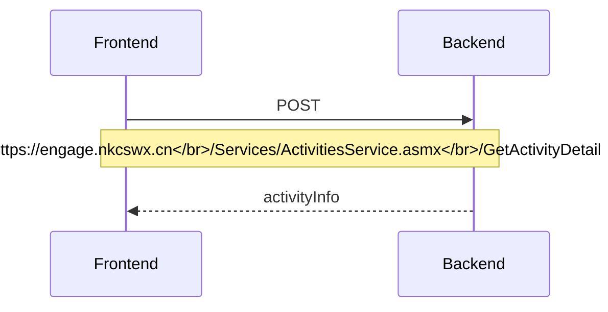
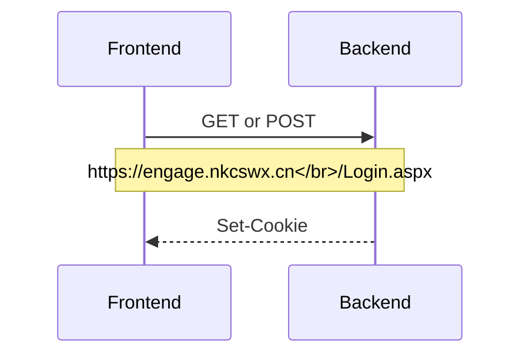
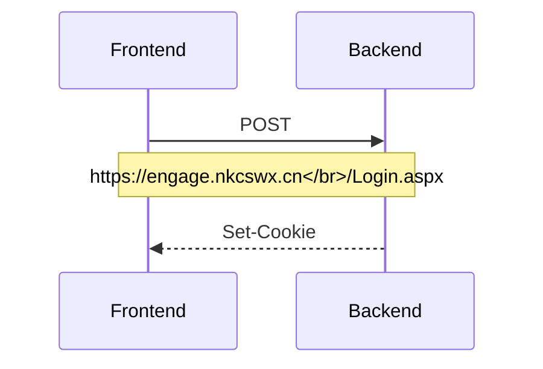
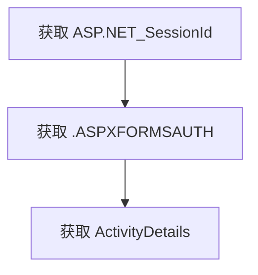

<!--more-->

## 开始之前

DSAS（无锡狄邦文理学校）有一个名为 Engage 的系统来管理活动社团。他们称这些社团为 CCAs。

官方网站速度很慢，而且无法查看所有 CCAs。如果我们想创建一个类似 CCA 展览的网站，首先需要以某种方式获取所有 CCA 信息。

## 分析

让我们看看前端是如何从 Engage 后端获取 CCA 信息的。

### GetActivityDetails

`GetActivityDetails` POST 请求是获取最终 CCA 信息的请求。其负载包含 `activityID`。

```json
{
  "activityID": "3350"
}
```



以下是一个 Python 实现：

```python
import requests

def post_engage(activityID, cookies):
    url = 'https://engage.nkcswx.cn/Services/ActivitiesService.asmx/GetActivityDetails'
    headers = {
        'Content-Type': 'application/json; charset=UTF-8',
        'Cookie': cookies
    }
    data = {'activityID': activityID}
    response = requests.post(url, json=data, headers=headers)

    return response.text

if __name__ == "__main__":
  cookies = 'your cookies'

  cca_info = post_engage('3350', cookies)
  print(cca_info)
```

HTTP 响应体太大，无法展示，因为 Engage 还返回了 Base64 编码的图像。

```json
{
  "d": "another json body"
}
```

以下是来自 `https://engage.nkcswx.cn/Services/ActivitiesService.asmx/GetActivityDetails` 的 `{'activityID': '3350'}` 的原始 HTTP 响应体。



这个 HTTP 响应体的大小为 203.21 KB，这非常不合理。网络资源的开销极大，可能对用户和服务器带来性能问题。这还只是单个请求，一个页面上有超过十个请求。

### Login.aspx

`/Login.aspx` 端点提供了许多功能。但我们只对获取 `ASP.NET_SessionId` 和 `.ASPXFORMSAUTH` 感兴趣。这两个值是我们向 `/Services/ActivitiesService.asmx/GetActivityDetails` 发出有效请求所需要的。我们将在接下来的部分讨论这部分内容。

#### `ASP.NET_SessionId`

以下是我们获取 `ASP.NET_SessionId` 的方式。



稍后我将讨论如何获取这个 Cookie 的细节。

#### `.ASPXFORMSAUTH`

以下是我们如何获取 `.ASPXFORMSAUTH`。



稍后我将讨论如何获取这个 Cookie。这个请求所需的负载很大且混乱。

## Cookies

整个 Cookie 包含：

| Key | Value |
|--|--|
| LanguageID | 类似 `ENG` 的字符串 |
| ASP.NET_SessionId | 24 个字符长的字符串 |
| usernameCookie | 67 个字符长的字符串 |
| .ASPXFORMSAUTH | 232 个字符长的字符串 |

但 `GetActivityDetails` 只需要 `ASP.NET_SessionId` 和 `.ASPXFORMSAUTH`。

### 获取 `ASP.NET_SessionId`

要获取 `ASP.NET_SessionId`，如果我们请求 `https://engage.nkcswx.cn/Login.aspx` 而没有 `ASP.NET_SessionId`，其 HTTP 响应头会有三个 `Set-Cookie` 头，

| Key | Value |
|--|--|
| Set-Cookie | ASP.NET_SessionId=2qbifskvg5i4kj32w25kvwe3; path=/; secure; HttpOnly; SameSite=None |
| Set-Cookie | .ASPXFORMSAUTH=; expires=Mon, 11-Oct-1999 16:00:00 GMT; path=/; HttpOnly; SameSite=Lax |
| Set-Cookie | LanguageID=ENG; expires=Sun, 29-Jun-2025 17:03:51 GMT; path=/; samesite=Lax; HttpOnly |

任何方法都可以触发这个响应，无论是 GET 还是 POST。

以下是一个 Python 实现，

```python
import requests

def get_SessionId():
    url = 'https://engage.nkcswx.cn/Login.aspx'
    response = requests.get(url)
    set_cookie = response.headers.get('Set-Cookie')
    SessionId = set_cookie.split(';')[0]
    return(SessionId)

if __name__ == "__main__":
  SessionId = get_SessionId()
  print(SessionId)
```

`SessionId` 是随机的。

### 获取 `.ASPXFORMSAUTH`

要获取 `.ASPXFORMSAUTH`，我们首先需要 `ASP.NET_SessionId`，然后是一个包含用户名和密码的 URL 编码的负载。

这个负载非常大且设计不佳，它有三个部分。

1. 控制和状态管理
| Key | 描述 |
| --- | --- |
| `ctl00$ctl11$TSSM` | Telerik Web UI 组件的控制标识符。 |
| `ctl00$ScriptManager1$HiddenField` | 与 AJAX 功能相关的控制标识符。 |
| `__VIEWSTATE` | ASP.NET 字段，用于在回发之间保持状态。 |
| `__VIEWSTATEGENERATOR` | ASP.NET 字段，用于生成 `__VIEWSTATE`。 |
| `__VIEWSTATEENCRYPTED` | 指示视图状态是否加密。 |
| `__EVENTVALIDATION` | ASP.NET 字段，用于验证表单回发。 |

2. 用户输入和交互
| Key | 描述 |
| --- | --- |
| `__LASTFOCUS` | 记住最后一个聚焦的元素。 |
| `__EVENTTARGET` | ASP.NET 字段，用于处理事件。 |
| `__EVENTARGUMENT` | ASP.NET 字段，用于处理事件参数。 |
| `ctl00$PageContent$loginControl$txtUN` | 用户名输入的文本字段。 |
| `ctl00$PageContent$loginControl$txtPwd` | 密码输入的文本字段。 |
| `ctl00$PageContent$loginControl$txtMFA` | MFA 代码输入的文本字段。 |
| `ctl00$PageContent$loginControl$cbRememberMe` | 记住用户的复选框。 |
| `ctl00$PageContent$loginControl$btnLogin` | 触发登录操作的按钮。 |

3. 隐藏字段和元数据
| Key | 描述 |
| --- | --- |
| `ctl00$hdnUnsavedDataWarningEnabled` | 指示是否启用了未保存数据警告。 |
| `ctl00$hdnHorizontalScrollPosition` | 存储水平滚动位置。 |
| `ctl00$hdnVerticalScrollPosition` | 存储垂直滚动位置。 |
| `ctl00$hdnStaffRegisterInFlag` | 指示员工注册标志。 |
| `ctl00$PageContent$loginControl$hdnMaxLoginAttempts` | 最大登录尝试次数的隐藏字段。 |
| `ctl00$PageContent$loginControl$hdnToken` | 令牌的隐藏字段。 |
| `ctl00$PageContent$loginControl$hdnLinkAccount` | 链接账户的隐藏字段。 |
| `ctl00$PageContent$loginControl$hdnIsPupilPortal` | 指示是否是学生门户。 |
| `ctl00$PageContent$loginControl$languageSelect$ddlLanguage` | 语言选择的下拉菜单。 |
| `ctl00$ddlReason` | 选择原因的下拉菜单。 |
| `ctl00$txtNotes` | 附加笔记的文本字段。 |

我们只需要将 `ctl00$PageContent$loginControl$txtUN` 和 `ctl00$PageContent$loginControl$txtPwd` 改为你自己的值。例如，

| Key | 描述 |
| --- | --- |
| `ctl00$PageContent$loginControl$txtUN` | info%40jamesflare.com |
| `ctl00$PageContent$loginControl$txtPwd` | Password%401234 |

一个技巧是 HTTP 响应头有三个 `Set-Cookie` 头。例如，

| Key | 描述 |
| ---- | --- |
| Set-Cookie | .ASPXFORMSAUTH=; expires=Mon, 11-Oct-1999 16:00:00 GMT; path=/; secure; HttpOnly; SameSite=Lax |
| Set-Cookie | LanguageID=ENG; expires=Sun, 29-Jun-2025 17:44:20 GMT; path=/; samesite=Lax; HttpOnly |
| Set-Cookie | .ASPXFORMSAUTH=6A6D74FA384A0359F3DEABB32A9795FD11FBEE7E798EF68B5EAA256305CF1061B36EE895A306B29E00A12F82D74A7F0504293A1994166384A3DA6A8E36A766DEE3EBA4805F67D78E1608A0EFBCEED37DDA8A0BAD03925CB7E2356CEC73150CAA014FA3A758E229BD2B32EAD55360B7DC6C5EC0FB; path=/; HttpOnly; SameSite=Lax |

但 Python 的 `requests` 库无法获取所有三个同名头。因此，我们需要使用 `http.client` 来获取原始头。

以下是一个 Python 实现，

```python
import http.client

def get_MSAUTH(SessionId,user_name,user_pwd):

    def post_with_headers(host, path, data, headers):
        conn = http.client.HTTPSConnection(host)
        conn.request("POST", path, body=data, headers=headers)
        response = conn.getresponse()
        headers = response.getheaders()
        set_cookies = [value for name, value in headers if name == 'Set-Cookie']
        conn.close()
        return set_cookies

    host = 'engage.nkcswx.cn'
    path = '/Login.aspx'
    headers = {
        'Content-Type': 'application/x-www-form-urlencoded',
        'Cookie': SessionId
    }
    data = 'ctl00_ctl11_TSSM=%3BTelerik.Web.UI%2C+Version%3D2021.3.1111.45%2C+Culture%3Dneutral%2C+PublicKeyToken%3D121fae78165ba3d4%3Aen-GB%3Ab406acc5-0028-4c73-8915-a9da355d848a%3A1c2121e&ctl00_ScriptManager1_HiddenField=&__LASTFOCUS=&__EVENTTARGET=&__EVENTARGUMENT=&__VIEWSTATE=c%2FM1Ho43c0%2BFthFEJqqroy523PC9%2B%2FNMyst63UWsnTtrJ9X9GwzlTXP0J3pZ0Zc3%2BYpfpfG7lk2QJ%2FJt8ZHzM7Kv7JYxTkprglEsm1ayvHrizlLd52IN%2Bd%2F4aaQaI2OyH3MNKOrUaii71v0jPf7eDqI79pOb42jsaLRBrXV7cpbz2QiJoQeDLygVigiCVMMy3aahKpPjdDf6oiOeFH96wGGqEIzbawrasZKkZgyrwnCyim%2BDpse6%2BRIA9%2BmdtgNERHRU7wMfOkdCOJ1qTP7ufh2NkURqb2TeiypNj3kLgQXPKXwQIvOsaxNlQ2leZ28IqAyWK4wk3aTmCyuhrGB4JuXx8IV2loMOgLWCWCmolIaH5LXIB4xHuTkAHivQy4grDXwnxe%2FSIBbCWEpdfJCHso1G7PKgek9jxGnVJve8hA8Gx5JWI7UnjKVtGP%2F7DD9Y50qhN%2Bc8zlsz9PmpXrKAyphHnVGaXUuit05vMlc82CGZX4Rytz3Q51%2BRxiCwST2xBiMYL97dMtelw9wreGDo1PgxWCmmxGAhFduROZD%2FGKQakOudJSN%2FohprNEvWQOljkN3LPWct5ZAWK275TQ33Re6uNWA12%2FU3x5czBklT%2BL3zAhMmS8YKuv%2FXDAlJgS28zsZ5kFiNybrAkZR7zfE4nYxUvEDLB0GqFRg0b4%2B4Tro2FEhGmU%2B8Yyg%2FXlhmhJY2IICqRGW7CDsvGapobZ3ev3pxOeigCQ4ZbNIup%2BlyGqB%2FGBihlLLSwwc9iiobcR3uKBP8upslnsjIQEzGNlyw5M2MGweKs5Sym65wBh00bvwc38WUGNK%2FhIBE6Qraav5rBLO%2FdIX0v1whlQnk7%2BuCd%2BPDn1SEGnruRNOMUlKY3pQ%2BWN%2FSgLy4Fb6SlcEFKPwnl5yxvs2Jlbr%2F595hfnJSKSzKQ1SRkBavCg2VNw0pE1fORoHy2GCG1LgWiP2p35dZvL9LLS7PnTRhqpiEodrBWs85R6imabke3kPB60hjiNMrICXtsEm%2B2yM4E6dQCQQrsOMfGe69PFAWOONSakuXlkmzZ8gPTtmoU0BT8zeTMEXFc0m%2FKVxo2Vij6LU%2FaHclnA9NICotQxP8gCs5U9F6Rl1vkh%2FEP44R7ECDIczxfT5InkIUlIGwJl7B2NGmHc75ydZohIilZ2mZXosopEGYxE5UmD1hHIOBf9CPGWab7cyfpxhb%2BvXKLubf%2FGmVCkfBLFxEtl8grwoNOjTqxi0eI5XY20vz4C7oZj0ZUrpSXwqdsCrKuN7Z6G6eARLFVOEXpFl29NtvbrNlsFCnh2Uw%2B3rgCF2hKkSkad51HE972b%2Br7wCjBNspKa1eABoFvBlywqRGkagSCW7MZRHah6b35RnZPW9cAv%2B0Ibk2RgtNPm%2BJ1jUGz9K%2BiVUqFMwndqJIsI1zQF%2BFMGL98YSbdvQCfhCSwp3x%2B3p53ZBWayUe8vfko%2Fh8AGMUGAybYlkGoDQZoL%2FTTin%2B9CKl0L9NMLXyWoClhe1zuJMRAuA73jTLBnc4BOp2uo23ZGS%2BLmhxFDmuHo5wByqrEa1RRR%2BWRi52n2RlAl6JJ9C3f1mhlSn69kyXn16z6rZor8uWn5bFXdTkOFyoaoYJR%2FckGniqR%2BsIiWivevHGXX8vKWGLQgDXiqvZUZQ%2BxQ13YxJ%2FP2r11QYAnyctbzRR%2FlvGoJ%2F8b5saz7fwI6q0%2FeGJPxybC2qliiLw0lT2GzVLPx6Q7YdymcN86IezTA5cq%2FKyB%2B6e5x4dSZcfYXYj6Vh9%2ByNUQYrL7YFeLvO3E9vgCT8cf10llfn8vDDHkuMgQBEl3JJFbKqvj%2BSLyrn%2BR6qTDI2wC8SXePiTh%2BKinCOTJdm%2BkqVlupXSPDRhRjDxl8GgWWamZ9t9V3ncg%2Fc6rG%2F3BUyeC6fobGHQ77eCHET8kpg%2FJ%2BYYpkV1vj4AMVQY%2Byxev%2F66Eqf1aErhwAa98LqWPrYk7NJiQYfQkGsPNtSUAKdyGWma9vXrA1900feeXyYh06WWDmPwVWCR8Kq9nsNR5gX3CyO2VTlWt4z1uDhNZA3JOZBkY%2Fp4MU2evOkYHdPkZaCocd%2FXKebT6v1y1C2Vx0%2FLLR3TOQ5YXBq8qCt3HdBFPP7VXv4Oepl7FjYqO513feUQeb9pknqq8wjPkfZ1QNrNwEOHs24bNADgDe3CNSB7ZD9m1ovZsnewefduqadPLku8BGvSvmBCg8E4ikNKT1%2Bn1QauUrakeNg0i%2FFeksHNHZTadD%2FwtKSd9xLHdi5X2SZvQkme8YSY1uzN9u%2FA%2BK6u3ZUIxa8EjuAI%2FJUFHpbLk3I5CbUhz5C4KylAXNSTEWaI03JC31hmSUkJPD5ctrGS%2BWVqFmlPQ0qC5UwgbC%2Bn9S%2FtNdVk78nhmJ%2Fom5fq5wmbketdcuq1sZjcwrGDkjrSoxblhCw4xSddSsj1eyS7C5rwcQfz%2Fc%2BLuqrP%2B%2FnsnP5YtFn%2F1K4SWCME0WdDZCG2PPqCoLW7zbZaKy2aBKKZlS08IYEVIVU7RR2VS0WiLf66XIv1tinvSKAMv5dOUdMDoVr46mjBDvMi%2F%2Bz5NUm%2FBpzAfvZtFXGOCUtUFL8f5BtxhqymiKE02nFUgik8%2Bkq5yHsHx%2BYU%2BcWPIwCulexMLxD9YMS7VsX05A1P1nc8p1QprMxo7mN5w5lrehC8xB8Aga%2BHqPsqMdYv4gjGfN9X8gtUkbzaAW11FOZTCpKwcDk5YijbYRIyJBR3lFgp7Z8xwCovarfOoiIFal4WFX6zINVs1U%2BBDemXfnbOdCGyP2sjrMIqdtDb4UtHLOaH%2Bn2kYGd1cd0wt1eokW3EMP%2FTLRZPoPPjw09RiphTvczkQimieSkrpU4Q%2BrGMbfHyH7l4mcBTZGb4uuVCLltSLokGnNX6zJ4PoMl7LqiI7w%2BYAno3rQ08BKAWLaUKJ5rlNB8cMviZFox%2BiHdvVHYABLRe6EEdxLJwgZA6KKH6BJL9O0A2fjTEJGPDRBf3Xcda5h35eq3hZrW%2Fam3c5R64dq8nQc8SdJZ5vQTJcqoHyjCXeJ82jEgeUikwtmajdCCyPgC16RLAU4SkuECZHEh9Ry8F9I9XhHebUBBZH33OCI4Doimqb6QQf%2BjtMbWYQNZX56efpffnFI%2FJdZcQipIMyUEn2FN%2BjOS54GMRk7j1oZwCPCaxm64k7HbxtHbuXRrSSqwYs9xXbBpTDhGLyCQcGGEWcwfA8zl56nHlDgJpcUaBcp6szUhUBj7LMJJ%2B5YGkD1VxOGAok9mxElxC8G8uO4cVoTrdsi%2FVqmWx2BDenGc17WS5pAb6HsSbM2T6uS7jtqbx2QUO61ck3b9cu%2Fi0skRjiaSBxaA3U47ccLrgMg08GeuiwS4tKBFg4mpY%2BUFcqnCsi1JBVAbRDZ05UL0XLPdigDbd2qE0Ec9d3X6CmT%2Fz8Vv9F6VpXFJBYdBK%2FZ4LrKGRS2E1VPSPu3gxF9kTZAD9ZxhjLCJWorfp0VPVTntokcIhXvHWnn%2FPxfTGpUuhYsbysaqtOkApQfkwhl6UxedghBo4L9UCadwmAhh8NPHRoQTRZxnKmLlnjFVJ9yUxB1l7zXKs3b64EPKHxNlnKPx36jxyDwhiUXxxAOIffAU6RPE%2FmWmMuypFK%2FES4yxqt22Yk%2FR9BcD71TVszlJTg0QYq5988wRNCGYWE%2F3XH2BU15sFCnjwthGN%2BYSX1Rvjd9krfG2IkuKrqx3jz6Zjdk%2FxEBCcNK7YVpNwwP7VzU08DWp3uaputtabqVn9vxlUUl2BjjFnRNC4BSrOQg4TkZUJtQc7uNbVrjCVr7zn5td%2BffBkBM%2FFL5RtaeALkQrMHKhdsOI9uVxRFV17VJL5qoU2%2F2t8%2BQiZwSwSlhQ4NO0HudFQp5ZpOpw1siLJPAe5JtgqmApjmUQy7gOX4t8cRz%2BF0ytYxw3ic1h0ETQ6ubzn8pvzVK2jl23ikYoUnCotN82VAwhLFpcfU6EdS8EUSHQz1zZCoo7iIi1NAPySMMzsvTY5woZBQwk4qJ9BTqg%2FyXIyY%2Bj3VAeTnfe7Q2yPBfT6JftSDCthkkcypMXU60IKSUWZM3YPu5tDBw8NN4Zm1jlIttXMIdtSqf4Wo%2ByxNSUbLgVK31y7tGXssOUFV%2BugtTq1tfIc4Ertc29MbmstBYO2ILf1o8tlhqnZC%2BWhJ7htHcTgWaxzxbr8ACHZTNkYM3GhRjz30wRhD0BAscTqd%2F1n7YWfZ3qrV67S7X6PQdWxtAV%2FjCeitBzmuMcynH9JOn4omLQCBS%2Fsy0sw6Vp3YQlZ1BB051Od9NeeMcZE2P6JKUgqXRD%2F%2BJllYnZupMs8G7zrCcokf3pXUVeBf7gC8g35K%2FsEnysMVfTerDQskViyEvPnqfH%2FPWaKAm9%2BTeHvb%2F3QWNoxgziCN0pckwKhNMZUK4mslj7HDSGczxSbeKGQsj5mAkCIzElrYK0y0XqLkvUigKHSGlKX5iZVAlP%2FDB53oUmCQrh9jQ9mix52j4W8do4xd69KZlRmA6boQFjihWlJY1H%2Ft%2B5jlfs5IoMCvW34NbmPWb8IRSA6xVJIrUdIgyHqxnuit4KZ%2FErVhQlLrCiV8rKPALON5jaopeZx2F%2B3FFHAFNuxLJuXYC5L%2Fbnwbe44grLR6PvIdhkSjQ%2BX60y%2BFN%2F4qOVuRNmrofQL0MeGe5goL1vFbsfrYAVPlVLWNJ4iqcTcA5nY801E%2BmUUmg77BMX02vA21zLMObzoG1%2B9hjbKhyvD1hiHyQoJG1hXub07bABNlMYsTvlyy9P2ckav97bqAT%2FeAWCuRXsS4zIVRQXsxATX97YM7m3F43DGDft5MTmhguVaQ87BJqFUrA%2Bm5KRPlMAAZ%2Bs4i9m7sY%2BJmVls9YEFyXeoKVH%2BdQvlCXzw8fzwhZOEd3PjEOJYsgGf2sg5%2B5RBGMWFh5U1hCxAphgAQzgtwZ9KMlgOw%2ByeB08H197NRYosLjmD%2BBrrhWmNJ%2F3tD2giEz2xD9u2GBwxJ7sPT8jqJ%2BMsh%2BeCOOshxsGl3pkGmze2OkI%2B6soI1azSFAd8jQ6qAq8qFJ49mH6ivxH4YN%2F7WY153UK05sgxNgoF%2F9GghsKnNFXb1hd9W%2Bq6lzy3nZQcRaJPd8R1PjlOA%2Fdf8EJsDwEB115WFY7yEnXxLLr3ZERkszC5o%2FFieH0fe1fmiPYbSwXCXJXd5nTyPInNSkvEMq3FJwA0OvfNISEJZHHLIA0t0uRgE1wYgsUBT%2FZqd6JH1yix7g5V5%2BUVg8%2Ftaq%2FD62cY%2BuUGDF6G28OzWl9PdurjN8fsJ8%2BP2qpYGM7EXH37IHHutiQbgn39SaKi2rjzRJ%2F%2B3uxSJjUcqw%2FH5k4GV17LXNCEnTo6z3n4nWU%2B8nq7t7aMd6Yx68umgxxTaRqLR0P%2F2b43kC%2FW%2BZJe%2B0KFGKgjNQRgKF2HNxSY3E0BFDApdeAS24xy42xGVIeowZF13PrtxlPP%2FZ7VeJyyCKa29gKKQMOhZ4XPLbl%2BlOJejluOfW%2FiyGCs9T4D6jvXxJ9gQ2EK%2BFdMTrC4t1W0TdX5uoPOAyLnCwwqPm2vzIS0QcuCTIBZKZJnRz4a37wlylLOgunl8bFEWxYky1S2sr5x6znK5iW0OCNRsYPUXXAslZUyrnoukH75fqRryZjh8gNbvb6KTWwdQdAAQ9jord9CptZVfliDX8ZNvM6h5LPyq3gwpgbnogfNf3VdhxUNDPjROyCyGlaVof7PoTMhJnspBxwuCH6NWyRsL6tylWVNmkt%2FpIA1afTzqTjyrhYm1tUQnSU4qod52xDpZXMBqmPVesHkD8fYqz9%2FVDbpf1w5FgZkPjvlKjyvxX3HMkqSpuXzNimpK1h%2F2o%2BXPkHjfOq6kttDpzb5PgwG9LomRa51NoCGCRdwLyBaJOjPuKURx23hqFUPbCVcsH0FEuU32fyB0O%2FnrOfqUeUn06H6OmducwsgTuByY3XUVrhfOVxIISK5MBheb%2Ba9SkE0jXVQc7uFB9cpV%2Fq1JG1InyaXddrXk%2Bsz7ZChOTZJEIIJmvcp4lscrB2rzZmaqPNOknb1K9MMP47UrP1Z567CZnaus3v7%2FaCCgiou0zSm4AbfDKRzjuLEz%2Bemz2nESqSYGL2xrbbXlIqwFvwaIl3MJoNj%2Fml5KKzC9tGqaeNU7HGTRuUTenj%2Fmmv0Q5yD9Mfb75fsdRsIMw4WcIwy0M%2BTncfg9fseUigdSF%2FrQFChjxhEa6VZIjprYxU3%2BwfRd7Qrwr%2BE1RgBk2icpBi0Oqi1eNl8feHwi4tZuoaL8kwrKTS6Fh2iIPb37gs8OlLewkkaOcT8WCZN6TpbwnNB%2BKVlmgHBRiIplKG9dqfXSrD9EYg5DlDI2tVzdNt%2Bo6tRuCUtELpqqZgN8otaP0iaa6F%2BXLTD0hV%2BrsJftQF3qpYiaVPdJqtdcHwBdx2aI0YADyoWq7ooLDQW0Ba35BbX53fzSxYkh5tOBrS6fb4FmQP9h2gk5io9XUjMw1UZIBBmSlVDa5V60YcFCQhw5HanJSF6ahhN%2BGjbZiQshPzCjdVxYTeui61wPN6yD1h1aQtueQ8XZlMhfU%2FSBi9Rv8XucjoR%2BLwlJJESi39e2ASPGl4DLlo74pM%2BMwKE0Z%2F%2FZZSI4hZc5X%2BEnCxdpRr1CGAVVeblJCx%2FDLN%2FPBBb%2BBwb%2FgPL09iCVmPy2q%2FMIWaou%2FboEqfHgQVkOoAy9uNot91cOSQcL4EtE4iitI8qc%2FIOuEbitDlNyUNDW5zEmvDTX6db5OJw%2BTX3TzQXPQuoLOQGH%2F9FiYbsq2OMOxycfAXk8kEy7x1DPQcjqrlTpYijNGXFld9J4uU5tDiJ3LTZpNwnwze3OiyRJBLSlEGUStfXVaFrTrgSvgqpqPbNgzzqaLoyqpjNX0bmI054HBgbLwoZ%2FUoT7h9byNVyjHduOFbCbXs9z%2FoQ%2B5%2BFPdr8yQHNoM8Lr6QG2GH%2Fc%2B89LpknS6bzhJuwLBj9p5QFBGlBpe4M6q2gbj3tjI3jJEIqP%2BxUqMwfp0Gr3MfAfb0J9%2Fqe9aCGj%2FhZBLQ02zMj0o%2FwYm%2FPdZAlS9HYqLDbN4%2BTQYuoJln1BcSOmnqNovIrTvZzbWVCYHzjapP3inPbAdvPGOOMv%2BDLN39rc3qIcwlbivm0Dc%2B2JJDhfEguSRLNv26lIifAwkYqpyFiCFLkTFb%2FQ3NHz7SjSTOrU1EvG4Qzy%2B4JGqoPJVwxafxi7fj0sdpAr%2F6HQyx2J%2Bd3YCZjHCyKzPe%2FtWBwTru%2B7ULqjykiBPXLKY4a32jf3vtK1eZQtLXI9nxs1AplQdAcdULjG2w4Xm%2FW69ppFB2yPWH5iaSPHyUTXSaBLCoA004ezDOdfvMbqG47qo7XUr73lWxXoT90nX4OuXFA8VzneSg7KzfDenpI1mVGWSxJva%2FBDeFxBgPbkolYY9jwYqGOICPLvGnqJyoyOdZimwRarcUf2s%2BK0iy3TN4sVILD7toJEdAtyBVNeTfdaBDBM%2FOL5SCz8l1kkhf61pN9yQFIwBdNmso6VgkRmKBxyVxaPTNPJ6hQrxpPN1rYEotAslmv%2BLGofrmGeCfoTtdKVKNo5Q6pEVVFrD3TRu3o6RTFmwTQRP80nBSUiB%2FXpmu14gBpgxmmsRptsjW9zq9VXOq%2BXdfDzeywM3k5X987oVhJFT6tWpSBq4YXPVqIJqxXiKxO7zjT6l8SsiCc27DSMbZDJXZHcQKKAfJE9DruRqr7GVmC0Do7tIh0gm3ht4GEIyzoElhGKIu%2BmO4Oo4WFLgUA5OOYsSErDJmhBww8TNm10E4ScX1A1wYOOrugIrpE13I5mN6DRaQuzK52ydrDN9PZ4jNg57EZsqQfudx17LSndTBYCk5Fd2t41VsiHF%2BlAcPxEGo6dTanR%2BMshHqBnHr3KKjOB6xVsmAhIjfvfm2xAJ6sSk%2FYh8VG0clfuZwbCT6ux1TWO57HHp8sNxSK964T7HiEOpUIGlcNLSMJxtYQA51pOfJ9i0a7IWs31XJg%2FCww2mIQb2zPsOnrDEsBQ3rNehGN%2F9Yf52nKT%2FW3nhUe1i76OHn3GTANofUxdWpxvM%2FHO%2BgiZk7DHMXt67CBiiNn9qFCsdutSfTMviV2Cf0fP6aA4vQFPzLesxsagma3otXXmfRs98MxuWUd05row%2BPPub5LgkuypTdMRr%2F1GfdLL3W9jsGKgefETB2TRlNbXYIrhtlSCwvi82QoCc2SCEy7wv1tWATHAZEHxG62hCYc1%2Fqpss1oMsG%2F69ALgtJ%2BcZNFJFb%2F2flskVx87dwlUiMimaj3vzkpT%2BVrVlNqfQoUl736s3O0AvlERJjFOAcqGZwPMSq3W2ColJanRheC%2F%2FvfmP1HDdaFt7hn55NkmLOx8vgZwd4WAGRJZl5gMng74NCKtwzzpBWKma%2BPMoV6XHQdvDPrza4Q5dq41Sqjmabzpxn4ai%2BULpJXvUFZmz9Dy3coWAdOLXNkFID1%2BMAby9h3qFT3sLUiqoL%2FJBPQUyEKhnNLGrxX97neyNaH6JelVlysiVY32seHB9CiGgBYWv0F4wExPngaRLNvqND7oORp6I99iwy3OejcRv9M%2BKBdTnE1dyBZGwkKKc5LxAe9XOc3Iuqbzl7Lap2SZClGS3K8lHQXfT4Y%2B%2Biyrzf2yOM%2FXhW%2B1cj7mNLWyrJiPVUvBlwhki%2Fwaquob5wM8er%2Bvzge3OAjvlv1MkmLLJEluNr6qmCYngwspGutQLAzNGDqwBC%2FeWCBGeF5oGv0%2FxLS0%2BgszzMHS2ozaq4vGmJtYY6J%2FM4Ol%2FF6ASaepG3JbEFyOuLb2GM%2BsgIeRUF%2B%2BnYcm9P%2BZ4xhW6KAq554dWtCFQDDwbvsB%2Bz5vwL32jJQI%2BOBra2LQZlN4VuXcS2hqe%2FOE4BGn1SbkoP53xEd2lcAUpxyfJIbytCnx%2F8zVREaWZD6WpMdiQgb74g%2BagnRfNU%2Fn%2Bf1ZB%2FGYLa8nLwylrG9bnRb3kyYWwJbtsLDsPPtoZmVF84ZsF8VBkO3vC5s0cD63wfPWztlLildQrx%2FKIVVBCu3SrhPB7fbggiA3Cr6v%2FCsytW7EL%2FH4mZkrix7DpSdDEOMYGPE7fHwW7QHZK0iFhbPQgIUj0RDeHtA5IQjZZV2N3AYRhKcRdTrrBCloSzhkh4zti6N%2BhgVjnyxvCiGjeLTtc7su2QJUSw%2BO0S839%2BcWgSVwnVfWTkpE44fnL9Xd6teBomAw%2FCSdIUdUi4jy618PMCBBd25LBLz53nftp5ZjsjRWBD186Uc1mkqbSPMilyDnqJOuJqEpo%2FsHCA7vWLcu8WrS9zhganxgDk2cVM8JeNGRkcLVlE%2FYB3gvOiET5Imsf83CyTfr9PwZPM8pmKRVs36Xa1yce42hNz6vGvwiWvtsoWg7HGf1tFwBG6%2BxKh84dA0T2K40%2F3b6JCtf%2BvfOYAeps0YgePJu%2FxEPgH4xuRmehe9CrMyfRuaTN5jF76%2F8YD1CTTNUHsUkGGpiPHjakSR3Np68u4UQvWpDPo3djEMfE3lOIYMw%2BR2bWaKQY7SfwBLHqfjXFjTssqG45q0%2FyFKQ1dPrtc2esfANi7T67i7669%2FgMB6%2BZE4NjQLBEPAk%2BPDJp%2F5Tv1xtfCYtVUy84h5xIOonW69%2BXvX8qt8lbfwxodSwclVvqbe%2B9yR7VM0y1O9Ut7X0XNziWxNTdG9neVsNJ%2FyI6BR3SRZMY9fz6%2BtNppURgMtKs%2F82DbU3j28L9cNihZ02I6%2BP205au2eq1eFFFI0kEKO2JwIKCp8hySxeDrEW1tqoWqSYvq0dgrVqgz8W9hDw6mlUFU6MUY1SJY85LHyXMNJIRyjIqqXWC18LjBCj372PDFPYsf3uCagYmuAfSC0HgmhWt2mlEox92OlX%2Fsf9G%2Bo5McvULShMpp6OyK%2FIEnWvGXCRPYOEq5huXaEs3loGcwMWp5fvRM56enEktQmqG0t51EGMOpFBDRsomiZsm9rYaZrsY6hB16SmOdakk%2BDpqgBPalTmX7nAMMJEkircqwOshsgcdcC2JNyKp%2Bnl1opsDdz%2B8Y8L16mdv%2FfFnKs40tvi6ht0VuQySHKh3APcbbiuzSrUWMaUFUonQdIzhW11jKLlpJOfDQzlJZQzmnEDJUdyAb%2Bx5sTOmIgnfHAovq%2BjyaTn9TP8TRqqbtxaDRUcaRgYuUbZH0rI23b4fGzaQDK0mKkVXOi1HSK5mpT71DQJ01LuxOCWrqLTc0NcX1rNIDVh5ORJey164wifZCMJed8eAYrT14x1SeZoBOB3UD37gRxPlFaeZWaQxgBSKbc8nF7FzsGjSi0qXNdlACkDXYfGT7pE%2FKYNaz6Kj0PogfkjVplU%2FFsTuPfdXK2wH5apPXsHHFvYgw4Q8lYvMQQ4dBHZUVfNvMeJheB18so5NLMKpDXWb74ov3%2F9blJ2niO7IA4Q2r62%2FJnBFkl9Lys5n7KWPUNdLg38Hmjg3d9q%2BOkfAJ7cLJKh8WhSf4ZTWBMIkmY68pI%2B3qoBMmaufH8%2Fm4yL3HK4H7T1AdmpxwWkbOnY5TI4KGsPAimNAGoUyMa%2B%2Fef98V%2F9uNAQzF0gyWWd9%2BkBlDKCMKHO5kSAlCqUBfg8d5xxp7KSPQVB47N48mxdU8oupOskPRm1pbQTZcMnpbkkXUMMKKgS3wlyakxj65TbPA3k51%2B%2B5GThoJEfwibhJw%2FLwA0%2FwwoHewYuQbV2uMkxzyqOfF3UTNIVQ8gzG30BHP%2FlnkXqy0qeWCuxnCFDBDbxVZ4NTa%2Bx7Vbv0w6t6MJ6d%2FZptBDfYEDdjIpI71Q5gIW81UySBBajM69mRVAkk%2BDUSrceEvLCSwTY7TQRZkPPVANg%2FnAOtXiA5pUGNSGd6%2B4w9PioZ%2Fah65z8%2FBdcbQsUfP1lKSnV08m5lRfaCZknwZAfH67hD3s0ZcDNHU6u5n%2Bn3viJ1a1bl%2Bx%2FNtiDGeWbxcc%2F6THkJHqyRcuLPBfDIp1mQXgoDfvErhHM5HZycgKEZomWwRBpA61vQZ1GIYicmAV6o5J8Q9i23UwZJLbzXZoahVV8uFthGum37AAW9dd0Du25hwGIoesQqVmUE46RZQvbz%2BUe%2Bs0OpieOenNTuw9BxFv18%2FqmUVAp%2FjBsJMJRWZaw4ion0EB7BX3gb2r8O8u%2BpzQghulxRNIhlAt7oyjqC4og9vgw0CsrNkG3cAk4jz85T6ouyiHWxWxboUEaLYO6JNtq7m3Wjip0mVLzU58KznxSJlfHb9c58op%2FT3gKIJhG8HfBrNTn9Ljn%2FDP%2Fr39Ur2ITSR%2BfwhGEevjXyb0UY2v9Tuw4rKoW8f%2F6YOLx0OvgF811UPj6325bgEChIb1BZik%2BjQv7pCsIJZ7hu8hPaaZHB6hTVkMk5s9sGz4SOWOaiM%2FLcieWyv6I7Vmsi3sdjsC0UtdAyd7%2BW%2B4VJqthHhSnZO3mXvTlz6R%2B6TCGSeqdoTKTni55DXnl%2BjPk05ef1Ihbh3M389rF9S%2BQSZll%2B7P0yceLYe%2B0n6jQ%2F4XhewkJbEN42cXtXIixFzLD2inr%2BL8uAodr5XFW42FJNcRoxxdtqcs50Ml4CcryiF5kvs%2BmEmVGM6Ca6%2FHik0xfn1DiftF7fMpRmvMr8JyOhXLcGwXOTF%2BoU2ZPqz%2BAm%2Fn4KizFoePDLEUyuFDMX3fGOtA2%2B7%2BoU1tUoEg7%2BYP%2Bgp%2BeqCXlsoRnwuc5w9L0cP2RY%2BzyKyl%2FWqkUnqKFsZ%2BD%2Fb%2Bkri0mfq2kpkhX4IH3jzbt9JYqFP6zXFugDaPi7nnDi9o4ceqC%2BjWAOiG8LnXmDBJX5hXz1f47FjcbrY8ZzykutRQvzPV%2B5wqcK0CUGHBPzBKeQhsb7eG9c%2B4kcPGFjjcDxkFsbz3PoHCp3ezIHjddjQ%2Bchet5x%2FCR744YkUOYBt1Mgt3x1b%2BbBTdTvNEyoYb6n%2BDbuQeS23FEf%2FpKBczUXsvuVq26UnPdAja2miCcw0fzHhHz2%2BeNh5qveuKc4fP5BLudG9o8KH83NfzPbGyZko6SQeM%2Bp34wLWOInN5SKrq7H%2FZvL6eG%2F%2B5ecrBkp9kAoH4Mh7KXCLIDljuPREOqi2xNp3zrjz4C4e8EX8JyjeBZj9pHSZIiefRciIUCdqQa3OSTtF0O%2FKFchUGiHuWsQYQ%2BuL06GOIpE3w16dOE76%2B%2BqjZixhF30XQfPb7hr%2FLzU9u07WMU9hPWn6P6unEn99FiB8oz%2F%2BasYgMPtbSaB6zWwxDsOLxITedk7rzuM2Dr1AUjK0AIUmPWhijqNzQNBRsNztB%2B3S%2BOWDS4Bg%2FMZ%2F3zJXVL38WzGDfmtP5EpEsUKs%2BqU7ZxzKXMHk4VKhqDzbZmJRdkdnsDPeq1S4CIY6tmg1hMhrzXTccmbWzVNdL4NOA1ypLFW5LRKOVoKw7By0ar3wFF30GYp35Zl4grrNVXYpXCuYC0mGIS4uYEhhpE9pBJBnQiBjTQ9TfvP89AVKA34a%2BtMgpIvUvFK%2FeVrBlm4Ou3qh%2FeFSzMwyaDDJNjJh9kx%2B%2BsGilMR73IjfbGh0DVBOc1dYKY0%2BupdJntGOVPzPxKwg7B%2Bj2LfyfRc27xyH5WfnLi0i7eaQdSejzXhLRtqNYMfucvDPexDtuqdR3gnDOKw%2FA9k0UaRSxy5hDUlb65RY6u9mfDNlMZ%2Fl6dctvTWREXYCSUKj5GYCQMrg5W5TknxkvFciCsoYAIS4SJHf7Is3B%2BCcp5xrujSLJIRg2n0%2FAF9EwyQnRMDeuhlNhAU%2Bsdj3ZSOQvCaZuyEGpg1jTXWv5SHyLsJN1%2BregntHQxDHU8HpCDNqlAjQFqYqEyXUgLPZp9i04cR2ZNV0k91L95DklNPIPpaPzU26Z8cxizAPJZzWUSyqVF%2B7S3Ji%2BhyyPh77xrIhO0jCSdd4VQdMaNv8FufSb%2F9eCVVPjVhMTZWrEn0mYJe0UioSwfVvXo%2FQGIbVbG3HBRrBpvJhY%2BlPt90OID2Dnk1jVMETpd5Z0xNM09cFFBYy1GhZLPvV3X73zp3D2EoKNY1YHlmw7n%2FK5Dxsc0nwGNp6Eh7MTzuvawkJis6fX77H%2FDPfbcFdoyBYwaZ781oy10%2Bk6DRPiucD9YILDsg6s9dFnuHdkBMBD3Pul5GZgY6uiT6MXUE2PWt5AwqIy5alUYyRhtN0ZtnOemZTbrEXcVXpahdceYgQxvfm2rDFOBua9%2B%2F6WiKbQ19KDozUHMTrQbXZtI7ukKl0AgOcLw2FNb2g7VR5Ubrlh0rIqRiQwC%2FBdj%2BkPEQoM4uXR6W4zUyQLguu9L5nj80hw5W4rr%2FTjvzoHpOANRh1rL4jSUAylIKhlDup4oyJlnJcAfJ4QYKawqK1Em0dodctzAZGqt4HvEXjdqj5UJBGSefvHte30uvNvzZKEKUsRZm%2B%2FRSVZh8J8xgZVLH1F7Ngxj27Ez7gIEllCZOt9tIR9d%2F%2B5oKi3u5mrQrdf90oRVEiwVSPr7ay4hcMWBHmpAbgsVVFiUzpBjXyQYU6H2hyafhHLKjII%2BlAFR%2BIT8kwomjGA1gng4%2BeBogBOMDFXPFwtVEOJ%2BGKrLmR51c61mXSb%2BwvBxHz6JlbjjR0U8sKNMzsBnZR1Rpt1un02oo8Lgt6fIW7DpWs%2FhKI7TJXlPuEyls94Q%2Bi7jxmr3KY%2Bx4P25Ml1dJPi5RmGVHHlUZiePBig%2BvVinETkQAj2QDsvDKSAjidwP05ram3wYm7xqJdmIlVyloFxHRbL4awmSc2POkCKYBkIA%2F%2B4d9Jec82k4aAZqtTCFF1gxHRDxaUqQRgVl7mgIN5l5T6D6gR2fbUgl8yl%2FLPX3QWgm4OZC694SfdISTO7svwuVvnS8Q14T48GhT3q9S8zfW3TaV5HrOflHz7o26a4HQLJyH%2FL3WiYDhDzi33QsK5onBasu5daZyaEd1JAOH48ROz5tKKVWuUCcAhVCx2HppmpixjVoagvLzmnODr5%2B0zQ5mI8fly8PFQx75jD%2FrnwY7LTy5vs9S1B88QJPM36ChqhN0g1s049AzaRScI2o7UzuyGKeLEoNfkyK2rZw%2BsYLHGq4ad80%2FVg9cOWlV9KgAoitQijazKFyh0bYXGUy9HMhv38s84hwBySHCniMgoMgWbLneKNCO9VqzDxsqa%2FE7Xwmc7Ymi7q4ByVvuIcq8UcNTsaKyzbxpffXvh1qkSS6xZJ9szXrLWVR9jDvbiuGXFS95cZSJr1WB48gPw8Q2U%2FDfi7UeQktuXLxJGF61x8GN17eO0tbTRaUTBNOwYKwJbcsLO5sgtD%2BxJJdfYwCHkjtAinZTGGgbc3vyII3L1dumDSZqx5PwhmBlhHALpxmcCnTH7PjL7tHidTEVa7kYR8qRnaDW1EO4qdsRfzqR51YyKAaE9od%2FlmM%2BeEMW77D7K%2Bh6JjcQjWsgkEmQvTlQCn9%2F96prX2rORNc6lUezwBbySqK30yc8kGPwI3vVTV4oQvDLgcDiEO4Tvg0C0xklqxcVhbz0T97Sck8cP8Uyn%2FAn65Scr5YSKW3omVrhdvFKUnwj3end6n%2Fx%2FzyBennAdUu%2BaTiaVMTZk%2FMjlUqAu5TKXDbzai%2BWFESw2XDi6HUDjnk8P3GRd7qocNeuSuBnJu2mhJMbhDnwI1yeRKLRXCciPCqutJgJzKFc56caSAswc%2Byqy10xUenndyR0JwNL9LcRTkizYQj2dFxFGH%2F99HoW5SDtFa6w9uI9WCq9JaX5QGhEVLzeVcULMMfdVJKlV0%2B%2FwZJ3yMVHCVIJqi%2Fw0JP8OIyw7qfJb7wQukyL54wEBV0G8HVPfzfqmJe4MCTiaa7VUFLq5XQTH7vVWiKCdKynT3KgSQwuLFWl8Ee%2BRJBlqvMk9Qlu%2F%2B6Ge1zngdKv7ojt3oovX%2BiOt34FOdbjPcrbyaBXAnUk0NoC0f9Dk3cfEJ33rYSHajHpwWL%2FqjaUaOS9TRTxtC7CGn9as8uYFOKUjoXWTzn5UU5EIaYeOLquI%2F%2FgvsAvL7nWINV1UaRkUjChgLryybYTzDoIGex4t4HxIlrs9%2FmsNDbx%2BQPs2KkjFuO3Vss4FeZUH9lk2FE%2B%2B4m%2B%2FSP%2Fmqg0SCCb6X0zbLox90uttoSaFu8c1zMcNKB6ZTqFv%2BRgKytpraOF5SlqfvSSkZB8I%3D&__VIEWSTATEGENERATOR=C2EE9ABB&__VIEWSTATEENCRYPTED=&__EVENTVALIDATION=xcTZw6TEf%2BV7Z4B4JHdFm3KbkeM3paSDL%2Fe3V2M72nv9omswdqVY%2FXPX6ZXXrw2Yf4l4KgJADx7VrYf5jmGrJjdCdJiyE%2Bt97P3Gx0QGF6%2BtLcw7DlDvvgGeyxVY3BcAs4RXoouDBj4ZiJ0dBOUDlvrLIq18Ewhy2wSS7rl6RxWLgBuxrBxBrGII0yrfIV9%2FhvMRNRKd71lKFv%2BedQo6TjNj2OHwU5lA3SrV1v9xquexeO2k5MGgaEYc%2FqxvEGtqB%2FjUPkSRAw5OkcElA5J99waF%2Fzt8Rvxp56xLzXWd%2BnzVxAilBQoXGwsT3dQGz1lewsvf2OT%2BINMt%2B6Ud8LTRGc%2F9HBIkXrqxr9lgnz8BoiKphs6AGcd367qbrDyiiZGbmdLuf2mpruudLtgAMO%2BYugJAU5JIzXqc0Q8z8ec5c9%2F6Ed3nCQKyu2sM%2FxgdQQ9uysh8OCg6%2FI4xSEp0kp8kqqDdGadh46TOlJrIUr87NqJ7ujhlBTXXjmxa%2BkFV9SyWWnUsHA%3D%3D&ctl00%24hdnUnsavedDataWarningEnabled=false&ctl00%24hdnHorizontalScrollPosition=&ctl00%24hdnVerticalScrollPosition=&ctl00%24hdnStaffRegisterInFlag=in&ctl00%24PageContent%24loginControl%24hdnMaxLoginAttempts=0&ctl00%24PageContent%24loginControl%24hdnToken=&ctl00%24PageContent%24loginControl%24hdnLinkAccount=0&ctl00%24PageContent%24loginControl%24hdnIsPupilPortal=0&ctl00%24PageContent%24loginControl%24languageSelect%24ddlLanguage=UK+English&ctl00_PageContent_loginControl_languageSelect_ddlLanguage_ClientState=&ctl00%24PageContent%24loginControl%24txtUN='
    data += user_name + '&ctl00%24PageContent%24loginControl%24txtPwd=' + user_pwd
    data += '&ctl00%24PageContent%24loginControl%24txtMFA=&ctl00%24PageContent%24loginControl%24cbRememberMe=on&ctl00%24PageContent%24loginControl%24btnLogin=Login&ctl00%24ddlReason=Select&ctl00_ddlReason_ClientState=&ctl00%24txtNotes='
    
    set_cookie = post_with_headers(host, path, data, headers)[-1].split(';')[0]
    
    return(set_cookie)

if __name__ == "__main__":
  SessionId = 'ASP.NET_SessionId=2qbifskvg5i4kj32w25kvwe3' # Change to your own value
  user_name = 'Your username in URL encoding'
  user_pwd = 'Your password in URL encoding'

  MSAUTH = get_MSAUTH(SessionId, user_name, user_pwd)
  print(MSAUTH)
```

## 写在最后

如果你想自动化获取 CCA 信息，你可以这样做



我将在后续的项目中进一步探索这个 API，敬请期待。
