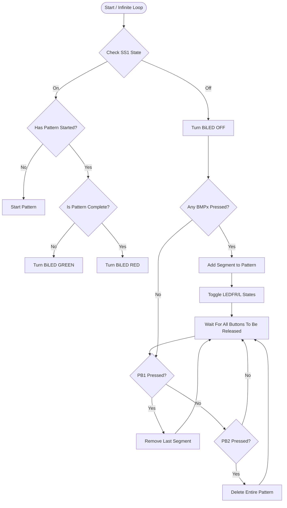

<!--more-->

## 实验简介

在本实验室中，使用简单的数字输入来编程 TI-RSLK 使其按照由独立段组成的期望模式运行：

1. 驱动并左转90°
2. 驱动并左转45°
3. 前进
4. 驱动并右转45°
5. 驱动并右转90°
6. 停止1秒。

汽车上的碰撞按钮将用于输入每个连续步骤，而面包板上的滑动开关则会触发已输入的模式执行和/或停止。一个按键可用于删除最后一步输入，另一个按键则可清除所有输入步骤。双色 LED 将指示模式是否正在运行（绿色），模式是否完成（红色）或者程序是否在等待用户输入（关闭）。

### 实验室目标

本实验室旨在进一步加深学生对以下内容的理解：

* Code Composer Studio (CCS) 集成开发环境
* MSP432P401R 微控制器编程，
* 输入和输出的实现与使用，
* 向功能系统发展的模块化 C 程序开发，以及
* TI 机器人系统学习套件（TI-RSLK）的功能。

### 准备

学生应在开始本实验室之前完成活动 1-5。*理解活动 5 的任务对于本实验至关重要。*

### 硬件和工具

- TI-RSLK 机器人汽车
- 面包板
- 组件（提供）：
  - 2x 按键
  - 1x 滑动开关
  - 1x 双色 LED (BiLED)
  - 各种电阻（1x 510Ω，3x 1kΩ）
- 导线（在教室提供）

### 项目模板



## 第一部分：构建和测试 I/O

本实验室的第一天包括建立所需的硬件，生成 GPIO 初始化代码，并实现测试以验证所有输入和输出的正确操作。所需电路如图 Lab 1 原理图所示。请注意，此原理图提供了 TI-RSLK 上包含的电路以及需要在外部面包板上构建的部分电路。需要在外部面包板上构建的电路应允许其他团队使用同一辆车。

> [!WARNING]
> 在 Lab 1 原理图中没有5V连接！只有3.3V！这是因为微控制器引脚仅支持3.3V，如果施加5V可能会损坏。确保您在连接此微控制器时不要使用5V！



RSLK 上的左、右驱动电机由两条输出线控制：**On/Off** 和 **Direction**。**On/Off** 线将使电机开启（高电平）或关闭（低电平），而 **Direction** 引脚表示轮子是否向前旋转（低电平）或向后旋转（高电平）。

在搭建好电路之后，需要初始化 GPIO 引脚。**您必须使用模板项目** [lab1_template.zip](lab1_template.zip)。此模板项目有一个专门的库([Lab1Lib 驱动程序库](#lab1lib-driver-library-functions))用于与电机交互。在此项目中，使用 **DriverLib** 函数初始化引脚，不要使用 **寄存器**。

> [!IMPORTANT]
> 您必须使用 DriverLib 函数
>
> ```c
> void GPIO_setAsInputPinWithPullUpResistor(uint8_t port,uint8_t pins);
> ```
>
> 来初始化碰撞按钮。这是必需的，因为在原理图上所示的相应电阻 **R_PU** 是微控制器的一部分，并不是一个实际组件。因此，必须通过启用微控制器上的 **R_PU** 来创建所需的 **下拉电阻**。

最后，在 `testIO()` 函数提供的代码中完成测试输入和输出的实现。每次按下键盘键时，应打印输入值。此外，如果按下的键盘键包含在以下列表中的某个位置，则应执行指定的操作以测试输出。模板代码提供了如何完成此操作的例子。
|    Key      | Function                  |
|:-----------:|:-------------------------:|
|     `a`     | LEDFL On                  |
|     `z`     | LEDFL Off                 |
|     `s`     | LEDFR On                  |
|     `x`     | LEDFR off                 |
|     `q`     | BiLED1 Red                |
|     `w`     | BiLED1 Off                |
|     `e`     | BiLED1 Green              |

> [!WARNING]
> 不要忘记在测试时打开汽车！如果不开启汽车，电机将无法工作；然而，所有其他组件都可以正常工作。

要打开/关闭汽车：按下位于车后角标记为“Power”的非常小的按钮。如果汽车内有充满电的电池，则靠近汽车的一个蓝色 LED 会亮起以表示它已开启。

请记得在使用完毕时关闭汽车！

完成第一部分后，请工作人员检查并继续进行第二部分。

## 第二部分：模式输入和运行

在构建、配置和测试了输入和输出之后，可以将模式���制程序添加到项目中。如上文描述所示，每个碰撞按钮用于向模式输入一个特定的动作。它们应被配置为：

- BMP0 添加“右转90°”段
- BMP1 添加“右转45°”段
- BMP2 添加“前进”段
- BMP3 添加“停止1秒”段
- BMP4 添加“左转45°”段
- BMP5 添加“左转90°”段

每当按下碰撞按钮时，会切换 LEDFR 或 LEDFL 的状态，并保持其中一个常亮，以表示已成功添加一个步骤。如果面包板按键被按压，则应从程序中删除最后一个输入的步骤。最后，如果面包板滑动开关从关闭状态切换到开启状态，则程序应该触发模式运行并点亮 BiLED 为绿色。一旦模式完成，BiLED 应该在滑动开关再次关闭之前保持红色亮起。当 BiLED 处于任何颜色时，输入将被忽略。

上面的简单功能描述可以转换成流程图：



带有红色文本的块表示由 [Lab1Lib 驱动程序库](#lab1lib-driver-library-functions)中的函数提供的功能。

> [!WARNING]
> 碰撞按钮容易出现弹跳。您需要去抖您的按键按压/释放和滑动开关开/关检测，以避免单次物理按压被注册为多次按键按压。

在 `controlSystem()` 函数中实现上述控制方案。流程图必须**严格按照执行**；也就是说，不要对未由图表描述的行为做出假设。您需要注释掉 `main()` 函数的 `while(1)` 循环中的 `testIO()` 调用，并取消注释 `controlSystem()` 的调用。

完成第二部分后，请工作人员检查并提交最终代码到 [Gradescope]。该代码必须成功实现上述逻辑，且不易受到按键弹跳的影响。为了演示目的，在教室里可以设置一个简单的障碍课程供汽车通过。

## Lab1Lib 驱动程序库函数

### initSequence

```c
void initSequence(void)
```

此函数初始化 Lab1Lib 驱动程序。

### recordSegment

```c
int8_t recordSegment(int8_t mv)
```

该函数向编程序列中添加一个段。输入 `int8_t mv` 表示要添加的段：

| `mv` 值 |   对应的段  |
|:----------:|:------------------------:|
|     -2     | 驱动并左转90°  |
|     -1     | 驱动并左转45°  |
|      0     | 直行           |
|      1     | 驱动并右转45° |
|      2     | 驱动并右转90° |
|     127    | 停止1秒        |

该函数将输出：

- `0` 如果段已添加到序列中
- `1` 如果段达到最大长度（50），未添加
- `-1` 如果 `mv` 的值不在上面的表中

### popSegment

```c
uint8_t popSegment(void)
```

此函数删除最近添加的一个段。输出 0 表示已擦除一个段，或 1 表示没有段可擦除（序列为空）。

### clearSequence

```c
void clearSequence(void)
```

清除当前编程的序列。

### runSequence

```c
uint8_t runSequence(void)
```

运行编程的序列。返回值为：

- `0` 如果启动成功，
- `1` 如果序列为空，或者
- `2` 如果电机引脚未正确设置。

在返回 2 的情况下，程序还会打印一条消息以指示问题所在。

### statusSegment

```c
int8_t statusSegment(void)
```

返回当前正在运行的段（参见 `record_segment` 表）或如果序列没有运行则返回100。

### statusSequence

```c
uint8_t statusSequence(void)
```

返回正在运行的序列中的步骤编号（如 1,2,3 等），或者如果序列未运行，则返回100。

### getSequenceLength

```c
uint8_t getSequenceLength(void)
```

返回当前编程到序列中的段总数。序列的最大长度为50。

## 我的方法

### 第一部分

第一部分并不难，关键是需要使用各种函数来设置引脚。

对于 `GPIOInit()` 应该看起来像这样：

```c
void GPIOInit(){
    //MP0 ~ BMP5 P4.0, P4.2, P4.3, P4.5, P4.6, P4.7
    GPIO_setAsInputPinWithPullUpResistor(GPIO_PORT_P4, GPIO_PIN0);
    GPIO_setAsInputPinWithPullUpResistor(GPIO_PORT_P4, GPIO_PIN2);
    GPIO_setAsInputPinWithPullUpResistor(GPIO_PORT_P4, GPIO_PIN3);
    GPIO_setAsInputPinWithPullUpResistor(GPIO_PORT_P4, GPIO_PIN5);
    GPIO_setAsInputPinWithPullUpResistor(GPIO_PORT_P4, GPIO_PIN6);
    GPIO_setAsInputPinWithPullUpResistor(GPIO_PORT_P4, GPIO_PIN7);

    //PB1 P2.4
    //PB2 P2.5
    GPIO_setAsInputPin(GPIO_PORT_P2, GPIO_PIN4);
    GPIO_setAsInputPin(GPIO_PORT_P2, GPIO_PIN5);

    //SS1 P5.6
    GPIO_setAsInputPin(GPIO_PORT_P5, GPIO_PIN6);

    //LEDFL P8.0
    //LEDFR P8.5
    GPIO_setAsOutputPin(GPIO_PORT_P8, GPIO_PIN0);
    GPIO_setOutputLowOnPin(GPIO_PORT_P8, GPIO_PIN0);

    GPIO_setAsOutputPin(GPIO_PORT_P8, GPIO_PIN5);
    GPIO_setOutputLowOnPin(GPIO_PORT_P8, GPIO_PIN5);

    //BiColor LED P6.0, P6.1
    GPIO_setAsOutputPin(GPIO_PORT_P6, GPIO_PIN0);
    GPIO_setOutputLowOnPin(GPIO_PORT_P6, GPIO_PIN0);

    GPIO_setAsOutputPin(GPIO_PORT_P6, GPIO_PIN1);
    GPIO_setOutputLowOnPin(GPIO_PORT_P6, GPIO_PIN1);

    //左、右电机
    GPIO_setAsOutputPin(GPIO_PORT_P3, GPIO_PIN7);
    GPIO_setOutputLowOnPin(GPIO_PORT_P3, GPIO_PIN7);
    GPIO_setAsOutputPin(GPIO_PORT_P5, GPIO_PIN4);
    GPIO_setOutputLowOnPin(GPIO_PORT_P5, GPIO_PIN4);

    GPIO_setAsOutputPin(GPIO_PORT_P3, GPIO_PIN6);
    GPIO_setOutputLowOnPin(GPIO_PORT_P3, GPIO_PIN6);
    GPIO_setAsOutputPin(GPIO_PORT_P5, GPIO_PIN5);
    GPIO_setOutputLowOnPin(GPIO_PORT_P5, GPIO_PIN5);
}
```

然后，完成 `TestIO()` 的其余部分。

```c
void testIO(){
    while(1){
        uint8_t cmd = getchar();
        if(cmd == 'a'){
            // 打开 LEDL
            GPIO_setOutputHighOnPin(GPIO_PORT_P8, GPIO_PIN0);
            printf("LEDL is on.\n\r");

        }else if(cmd == 'z'){
            // 关闭 LEDL
            GPIO_setOutputLowOnPin(GPIO_PORT_P8,GPIO_PIN0);
            printf("LEDL is off.\n\r");

        }else if(cmd == 's'){
            //打开 LEDR
            GPIO_setOutputHighOnPin(GPIO_PORT_P8, GPIO_PIN5);
            printf("LEDR is on.\n\r");

        } else if (cmd == 'x'){
            //关闭 LEDR
            GPIO_setOutputLowOnPin(GPIO_PORT_P8,GPIO_PIN5);
            printf("LEDR is off.\n\r");

        } else if (cmd == 'q'){
            //将 BiLED 设置为红色
            GPIO_setOutputLowOnPin(GPIO_PORT_P6,GPIO_PIN0);
            GPIO_setOutputHighOnPin(GPIO_PORT_P6, GPIO_PIN1);
            printf("Turn BiLED Red.\n\r");

        } else if (cmd == 'w'){
            //关闭 BiLED
            GPIO_setOutputLowOnPin(GPIO_PORT_P6,GPIO_PIN0 | GPIO_PIN1);
            printf("Turn BiLED off.\n\r");

        } else if (cmd == 'e'){
            //将 BiLED 设置为绿色
            GPIO_setOutputLowOnPin(GPIO_PORT_P6,GPIO_PIN1);
            GPIO_setOutputHighOnPin(GPIO_PORT_P6, GPIO_PIN0);
            printf("Turn BiLED Green.\n\r");
        }
    }
}
```

BMPs 需要使用 `GPIO_setAsInputPinWithPullUpResistor()` 来设置引脚，而 PBs 则需要使用 `GPIO_setAsInputPin()` 来设置引脚。因为已经连接了电阻到 PBs。

### 第二部分

第二部分复杂得多。如果您查看给定的流程图，可能会感到困惑。因此，我重新绘制了流程图，并将其转换为单个循环视图（它会起作用，因为在主程序中有一个无限循环。`controlSystem()` 只需要是一个单循环）



之后，我们可以更容易地创建我们的函数。(完整的 main.c 在页面底部)

```c
void controlSystem(void){
    // 用于跟踪序列是否当前正在运行（以便我们知道
    // 它刚刚完成，或者根本没有开始等）
    static uint8_t patternRunning = 0;
    static uint8_t runSeq = 1;

    uint8_t ss_state = GPIO_getInputPinValue(GPIO_PORT_P5, GPIO_PIN6);

    if (ss_state == GPIO_INPUT_PIN_HIGH){
        // 如果 SS1 打开
        printf("SS1 is on\n\r");
        if (statusSequence() == 100){
            // 如果序列完成或为空
            uint8_t seqLength = getSequenceLength();
            if (seqLength == 0){
                // 如果序列为空
                patternRunning = 1;
                printf("sequence is empty, won't start\n\r");
            } else {
                // 如果序列不为空
                uint8_t seqCallback;
                if (runSeq == 1){
                    seqCallback = runSequence();
                    runSeq = 0;
                }
                if (seqCallback == 0){
                    // 如果序列启动成功
                    printf("sequence started OK\n\r");
                } else if (seqCallback == 1){
                    // 如果序列为空
                    printf("sequence is empty\n\r");
                } else if (seqCallback == 2){
                    // 如果 GPIO 错误
                    printf("fail to start sequence\n\r");
                }
            }
        }
        if (patternRunning){
            // 如果序列正在运行
            if (statusSequence() == 100){
                // 如果序列完成 => 将 BiLED 设置为红色
                GPIO_setOutputLowOnPin(GPIO_PORT_P6, GPIO_PIN0);
                GPIO_setOutputHighOnPin(GPIO_PORT_P6, GPIO_PIN1);
            } else{
                // 如果序列正在运行 => 将 BiLED 设置为绿色
                GPIO_setOutputHighOnPin(GPIO_PORT_P6, GPIO_PIN0);
                GPIO_setOutputLowOnPin(GPIO_PORT_P6, GPIO_PIN1);
            }
        }
    } else{
        // 如果 SS1 关闭
        patternRunning = 0;
        // 将 BiLED 设置为关闭状态
        GPIO_setOutputLowOnPin(GPIO_PORT_P6, GPIO_PIN0 | GPIO_PIN1);

        // 静态切换变量，用于跟踪下次成功记录段时哪个前 LED 应该亮起
        static uint8_t toggleLED = 0;

        if (runSeq == 0){
            runSeq = 1;
            clearSequence();
        }

        // 单独检查每个碰撞按钮
        if (GPIO_getInputPinValue(GPIO_PORT_P4, GPIO_PIN0) == GPIO_INPUT_PIN_LOW) {
            // 等待释放
            while (GPIO_getInputPinValue(GPIO_PORT_P4, GPIO_PIN0) == GPIO_INPUT_PIN_LOW) {}
            __delay_cycles(240e3); // ~简单去抖延迟

            // 记录请求的段
            int8_t recStatus = recordSegment(2);  // 右转90°
            if (recStatus == 0) {
                printf("Turn right 90 added.\r\n");
                // 切换前 LED 状态
                if (toggleLED == 0) {
                    GPIO_setOutputHighOnPin(GPIO_PORT_P8, GPIO_PIN5);
                    GPIO_setOutputLowOnPin(GPIO_PORT_P8, GPIO_PIN0);
                    toggleLED = 1;
                    printf("Left LED toggled.\r\n");
                } else {
                    GPIO_setOutputHighOnPin(GPIO_PORT_P8, GPIO_PIN0);
                    GPIO_setOutputLowOnPin(GPIO_PORT_P8, GPIO_PIN5);
                    toggleLED = 0;
                    printf("Right LED toggled.\r\n");
                }
            } else if (recStatus == 1) {
                printf("ERROR: Sequence reached max length (50). Segment not added.\r\n");
            } else if (recStatus == -1) {
                printf("ERROR: mv value not recognized by recordSegment.\r\n");
            }
        }
        else if (GPIO_getInputPinValue(GPIO_PORT_P4, GPIO_PIN2) == GPIO_INPUT_PIN_LOW) {
            // 等待释放
            while (GPIO_getInputPinValue(GPIO_PORT_P4, GPIO_PIN2) == GPIO_INPUT_PIN_LOW) {}
            _delay_cycles(240e3); // ~简单去抖延迟

            // 记录请求的段
            int8_t recStatus = recordSegment(1);  // 右转45°
            if (recStatus == 0) {
                printf("Turn right 45 added.\r\n");
                // 切换前 LED 状态
                if (toggleLED == 0) {
                    GPIO_setOutputHighOnPin(GPIO_PORT_P8, GPIO_PIN5);
                    GPIO_setOutputLowOnPin(GPIO_PORT_P8, GPIO_PIN0);
                    toggleLED = 1;
                    printf("Left LED toggled.\r\n");
                } else {
                    GPIO_setOutputHighOnPin(GPIO_PORT_P8, GPIO_PIN0);
                    GPIO_setOutputLowOnPin(GPIO_PORT_P8, GPIO_PIN5);
                    toggleLED = 0;
                }
            } else if (recStatus == 1) {
                printf("ERROR: Sequence reached max length (50). Segment not added.\r\n");
            } else if (recStatus == -1) {
                printf("ERROR: mv value not recognized by recordSegment.\r\n");
            }
        }
        else if (GPIO_getInputPinValue(GPIO_PORT_P4, GPIO_PIN3) == GPIO_INPUT_PIN_LOW) {
            // 等待释放
            while (GPIO_getInputPinValue(GPIO_PORT_P4, GPIO_PIN3) == GPIO_INPUT_PIN_LOW) {}
            __delay_cycles(240e3); // ~简单去抖延迟

            // 记录请求的段
            int8_t recStatus = recordSegment(0);  // 前进
            if (recStatus == 0) {
                printf("Drive forward added.\r\n");
                // 切换前 LED 状态
                if (toggleLED == 0) {
                    GPIO_setOutputHighOnPin(GPIO_PORT_P8, GPIO_PIN5);
                    GPIO_setOutputLowOnPin(GPIO_PORT_P8, GPIO_PIN0);
                    toggleLED = 1;
                    printf("Left LED toggled.\r\n");
                } else {
                    GPIO_setOutputHighOnPin(GPIO_PORT_P8, GPIO_PIN0);
                    GPIO_setOutputLowOnPin(GPIO_PORT_P8, GPIO_PIN5);
                    toggleLED = 0;
                }
            } else if (recStatus == 1) {
                printf("ERROR: Sequence reached max length (50). Segment not added.\r\n");
            } else if (recStatus == -1) {
                printf("ERROR: mv value not recognized by recordSegment.\r\n");
            }
        }
        else if (GPIO_getInputPinValue(GPIO_PORT_P4, GPIO_PIN5) == GPIO_INPUT_PIN_LOW) {
            // 等待释放
            while (GPIO_getInputPinValue(GPIO_PORT_P4, GPIO_PIN5) == GPIO_INPUT_PIN_LOW) {}
            __delay_cycles(240e3); // ~简单去抖延迟

            // 记录请求的段
            int8_t recStatus = recordSegment(127);  // 停止1秒
            if (recStatus == 0) {
                printf("Stop for 1 s added.\r\n");
                // 切换前 LED 状态
                if (toggleLED == 0) {
                    GPIO_setOutputHighOnPin(GPIO_PORT_P8, GPIO_PIN5);
                    GPIO_setOutputLowOnPin(GPIO_PORT_P8, GPIO_PIN0);
                    toggleLED = 1;
                    printf("Left LED toggled.\r\n");
                } else {
                    GPIO_setOutputHighOnPin(GPIO_PORT_P8, GPIO_PIN0);
                    GPIO_setOutputLowOnPin(GPIO_PORT_P8, GPIO_PIN5);
                    toggleLED = 0;
                }
            } else if (recStatus == 1) {
                printf("ERROR: Sequence reached max length (50). Segment not added.\r\n");
            } else if (recStatus == -1) {
                printf("ERROR: mv value not recognized by recordSegment.\r\n");
            }
        }
        else if (GPIO_getInputPinValue(GPIO_PORT_P4, GPIO_PIN6) == GPIO_INPUT_PIN_LOW) {
            // 等待释放
            while (GPIO_getInputPinValue(GPIO_PORT_P4, GPIO_PIN6) == GPIO_INPUT_PIN_LOW) {}
            __delay_cycles(240e3); // ~简单去抖延迟

            // 记录请求的段
            int8_t recStatus = recordSegment(-1);  // 左转45°
            if (recStatus == 0) {
                printf("Turn left 45 added.\r\n");
                // 切换前 LED 状态
                if (toggleLED == 0) {
                    GPIO_setOutputHighOnPin(GPIO_PORT_P8, GPIO_PIN5);
                    GPIO_setOutputLowOnPin(GPIO_PORT_P8, GPIO_PIN0);
                    toggleLED = 1;
                    printf("Left LED toggled.\r\n");
                } else {
                    GPIO_setOutputHighOnPin(GPIO_PORT_P8, GPIO_PIN0);
                    GPIO_setOutputLowOnPin(GPIO_PORT_P8, GPIO_PIN5);
                    toggleLED = 0;
                }
            } else if (recStatus == 1) {
                printf("ERROR: Sequence reached max length (50). Segment not added.\r\n");
            } else if (recStatus == -1) {
                printf("ERROR: mv value not recognized by recordSegment.\r\n");
            }
        }
        else if (GPIO_getInputPinValue(GPIO_PORT_P4, GPIO_PIN7) == GPIO_INPUT_PIN_LOW) {
            // 等待释放
            while (GPIO_getInputPinValue(GPIO_PORT_P4, GPIO_PIN7) == GPIO_INPUT_PIN_LOW) {}
            __delay_cycles(240e3); // ~简单去抖延迟

            // 记录请求的段
            int8_t recStatus = recordSegment(-2);  // 左转90°
            if (recStatus == 0) {
                printf("Turn left 90 added.\r\n");
                // 切换前 LED 状态
                if (toggleLED == 0) {
                    GPIO_setOutputHighOnPin(GPIO_PORT_P8, GPIO_PIN5);
                    GPIO_setOutputLowOnPin(GPIO_PORT_P8, GPIO_PIN0);
                    toggleLED = 1;
                    printf("Left LED toggled.\r\n");
                } else {
                    GPIO_setOutputHighOnPin(GPIO_PORT_P8, GPIO_PIN0);
                    GPIO_setOutputLowOnPin(GPIO_PORT_P8, GPIO_PIN5);
                    toggleLED = 0;
                }
            } else if (recStatus == 1) {
                printf("ERROR: Sequence reached max length (50). Segment not added.\r\n");
            } else if (recStatus == -1) {
                printf("ERROR: mv value not recognized by recordSegment.\r\n");
            }
        }
        // -- 检查 PB1（弹出最后一步）--
        if(!GPIO_getInputPinValue(GPIO_PORT_P2, GPIO_PIN4) == GPIO_INPUT_PIN_LOW)
        {
            // 等待释放
            while(!GPIO_getInputPinValue(GPIO_PORT_P2, GPIO_PIN4) == GPIO_INPUT_PIN_LOW){}
            __delay_cycles(200000);

            uint8_t popRes = popSegment();
            if(popRes == 0)
            {
                printf("Last segment popped.\r\n");
            }
            else
            {
                printf("No segment to pop.\r\n");
            }
        }

        // -- 检查 PB2（清除整个序列）--
        if(!GPIO_getInputPinValue(GPIO_PORT_P2, GPIO_PIN5) == GPIO_INPUT_PIN_LOW)
        {
            // 等待释放
            while(!GPIO_getInputPinValue(GPIO_PORT_P2, GPIO_PIN5) == GPIO_INPUT_PIN_LOW){}
            __delay_cycles(200000);

            clearSequence();
            printf("Entire sequence cleared.\r\n");
        }
    }
}
```

这里有一些技巧。首先，BMPs 在释放微动开关时会弹跳。没有去抖的话，在一秒钟内会产生超过50次点击。为了去抖，我使用了一个空循环等待其被释放，并且延迟以等待弹跳结束。

```diff
if (GPIO_getInputPinValue(GPIO_PORT_P4, GPIO_PIN0) == GPIO_INPUT_PIN_LOW) {
+    while (GPIO_getInputPinValue(GPIO_PORT_P4, GPIO_PIN0) == GPIO_INPUT_PIN_LOW) {}
+    __delay_cycles(240e3);
    //...
}
```

其次，确保 `runSequence()` 只在需要时运行一次。否则汽车将永远无法停止。我的解决方案是创建一个全局变量来跟踪这一点并保持更新。

```diff
void controlSystem(void){
+   static uint8_t runSeq = 1;
    if (ss_state == GPIO_INPUT_PIN_HIGH){
        // 如果 SS1 打开
        if (statusSequence() == 100){
          // 如果序列完成或为空
          if (seqLength == 0){
              // 如果序列为空
          } else {
              // 如果序列不为空
+             if (runSeq == 1){
                  seqCallback = runSequence();
+                 runSeq = 0;
              }
              //...
          }
        }
        //...
    } else{
        // 如果 SS1 关闭
+       if (runSeq == 0){
+           runSeq = 1;
+           clearSequence();
+       }
        //...
    }
}
```

最后，根据函数返回的状态码打印足够的调试信息和错误日志。

### 最终代码

```c
#include "engr2350_msp432.h"
#include "lab1lib.h"
#include <stdlib.h>

void GPIOInit();
void testIO();
void controlSystem();

uint8_t LEDFL = 0; // 两个变量��于存储前左/右LED（车上的）的状态
uint8_t LEDFR = 0;

int main() {

    sysInit(); // 基本汽车初始化
    initSequence(); // 初始化 lab1Lib 驱动程序
    GPIOInit();

    printf("\r\n\n"
           "===========\r\n"
           "Lab 1 Begin\r\n"
           "===========\r\n");

    while(1){
        //testIO(); // 在第一部分中用于测试 I/O
        controlSystem(); // 在第二部分中实现所需的功能
    }
}

void GPIOInit(){
    //MP0 ~ BMP5 P4.0, P4.2, P4.3, P4.5, P4.6, P4.7
    GPIO_setAsInputPinWithPullUpResistor(GPIO_PORT_P4, GPIO_PIN0);
    GPIO_setAsInputPinWithPullUpResistor(GPIO_PORT_P4, GPIO_PIN2);
    GPIO_setAsInputPinWithPullUpResistor(GPIO_PORT_P4, GPIO_PIN3);
    GPIO_setAsInputPinWithPullUpResistor(GPIO_PORT_P4, GPIO_PIN5);
    GPIO_setAsInputPinWithPullUpResistor(GPIO_PORT_P4, GPIO_PIN6);
    GPIO_setAsInputPinWithPullUpResistor(GPIO_PORT_P4, GPIO_PIN7);

    //PB1 P2.4
    //PB2 P2.5
    GPIO_setAsInputPin(GPIO_PORT_P2, GPIO_PIN4);
    GPIO_setAsInputPin(GPIO_PORT_P2, GPIO_PIN5);

    //SS1 P5.6
    GPIO_setAsInputPin(GPIO_PORT_P5, GPIO_PIN6);

    //LEDFL P8.0
    //LEDFR P8.5
    GPIO_setAsOutputPin(GPIO_PORT_P8, GPIO_PIN0);
    GPIO_setOutputLowOnPin(GPIO_PORT_P8, GPIO_PIN0);

    GPIO_setAsOutputPin(GPIO_PORT_P8, GPIO_PIN5);
    GPIO_setOutputLowOnPin(GPIO_PORT_P8, GPIO_PIN5);

    //BiColor LED P6.0, P6.1
    GPIO_setAsOutputPin(GPIO_PORT_P6, GPIO_PIN0);
    GPIO_setOutputLowOnPin(GPIO_PORT_P6, GPIO_PIN0);

    GPIO_setAsOutputPin(GPIO_PORT_P6, GPIO_PIN1);
    GPIO_setOutputLowOnPin(GPIO_PORT_P6, GPIO_PIN1);

    //左、右电机
    GPIO_setAsOutputPin(GPIO_PORT_P3, GPIO_PIN7);
    GPIO_setOutputLowOnPin(GPIO_PORT_P3, GPIO_PIN7);
    GPIO_setAsOutputPin(GPIO_PORT_P5, GPIO_PIN4);
    GPIO_setOutputLowOnPin(GPIO_PORT_P5, GPIO_PIN4);

    GPIO_setAsOutputPin(GPIO_PORT_P3, GPIO_PIN6);
    GPIO_setOutputLowOnPin(GPIO_PORT_P3, GPIO_PIN6);
    GPIO_setAsOutputPin(GPIO_PORT_P5, GPIO_PIN5);
    GPIO_setOutputLowOnPin(GPIO_PORT_P5, GPIO_PIN5);
}

void testIO(){
    while(1){
        uint8_t cmd = getchar();
        if(cmd == 'a'){
            // 打开 LEDL
            GPIO_setOutputHighOnPin(GPIO_PORT_P8, GPIO_PIN0);
            printf("LEDL is on.\n\r");

        }else if(cmd == 'z'){
            // 关闭 LEDL
            GPIO_setOutputLowOnPin(GPIO_PORT_P8,GPIO_PIN0);
            printf("LEDL is off.\n\r");

        }else if(cmd == 's'){
            //打开 LEDR
            GPIO_setOutputHighOnPin(GPIO_PORT_P8, GPIO_PIN5);
            printf("LEDR is on.\n\r");

        } else if (cmd == 'x'){
            //关闭 LEDR
            GPIO_setOutputLowOnPin(GPIO_PORT_P8,GPIO_PIN5);
            printf("LEDR is off.\n\r");

        } else if (cmd == 'q'){
            //将 BiLED 设置为红色
            GPIO_setOutputLowOnPin(GPIO_PORT_P6,GPIO_PIN0);
            GPIO_setOutputHighOnPin(GPIO_PORT_P6, GPIO_PIN1);
            printf("Turn BiLED Red.\n\r");

        } else if (cmd == 'w'){
            //关闭 BiLED
            GPIO_setOutputLowOnPin(GPIO_PORT_P6,GPIO_PIN0 | GPIO_PIN1);
            printf("Turn BiLED off.\n\r");

        } else if (cmd == 'e'){
            //将 BiLED 设置为绿色
            GPIO_setOutputLowOnPin(GPIO_PORT_P6,GPIO_PIN1);
            GPIO_setOutputHighOnPin(GPIO_PORT_P6, GPIO_PIN0);
            printf("Turn BiLED Green.\n\r");
        }
    }
}

void controlSystem(void){
    // 用于跟踪序列是否当前正在运行（以便我们知道
    // 如果刚刚完成，或者根本没有开始等）
    static uint8_t patternRunning = 0;
    static uint8_t runSeq = 1;

    uint8_t ss_state = GPIO_getInputPinValue(GPIO_PORT_P5, GPIO_PIN6);

    if (ss_state == GPIO_INPUT_PIN_HIGH){
        // 如果 SS1 打开
        printf("SS1 is on\n\r");
        if (statusSequence() == 100){
            // 如果序列完成或为空
            uint8_t seqLength = getSequenceLength();
            if (seqLength == 0){
                // 如果序列为空
                patternRunning = 1;
                printf("sequence is empty, won't start\n\r");
            } else {
                // 如果序列不为空
                uint8_t seqCallback;
                if (runSeq == 1){
                    seqCallback = runSequence();
                    runSeq = 0;
                }
                if (seqCallback == 0){
                    // 如果序列启动成功
                    printf("sequence started OK\n\r");
                } else if (seqCallback == 1){
                    // 如果序列为空
                    printf("sequence is empty\n\r");
                } else if (seqCallback == 2){
                    // 如果 GPIO 错误
                    printf("fail to start sequence\n\r");
                }
            }
        }
        if (patternRunning){
            // 如果序列正在运行
            if (statusSequence() == 100){
                // 如果序列完成 => 将 BiLED 设置为红色
                GPIO_setOutputLowOnPin(GPIO_PORT_P6, GPIO_PIN0);
                GPIO_setOutputHighOnPin(GPIO_PORT_P6, GPIO_PIN1);
            } else{
                // 如果序列正在运行 => 将 BiLED 设置为绿色
                GPIO_setOutputHighOnPin(GPIO_PORT_P6, GPIO_PIN0);
                GPIO_setOutputLowOnPin(GPIO_PORT_P6, GPIO_PIN1);
            }
        }
    } else{
        // 如果 SS1 关闭
        patternRunning = 0;
        // 将 BiLED 设置为关闭状态
        GPIO_setOutputLowOnPin(GPIO_PORT_P6, GPIO_PIN0 | GPIO_PIN1);

        // 静态切换变量，用于跟踪下次成功记录段时哪个前 LED 应该亮起
        static uint8_t toggleLED = 0;

        if (runSeq == 0){
            runSeq = 1;
            clearSequence();
        }

        // 单独检查每个碰撞按钮
        if (GPIO_getInputPinValue(GPIO_PORT_P4, GPIO_PIN0) == GPIO_INPUT_PIN_LOW) {
            // 等待释放
            while (GPIO_getInputPinValue(GPIO_PORT_P4, GPIO_PIN0) == GPIO_INPUT_PIN_LOW) {}
            __delay_cycles(240e3); // ~简单去抖延迟

            // 记录请求的段
            int8_t recStatus = recordSegment(2);  // 右转90°
            if (recStatus == 0) {
                printf("Turn right 90 added.\r\n");
                // 切换前 LED 状态
                if (toggleLED == 0) {
                    GPIO_setOutputHighOnPin(GPIO_PORT_P8, GPIO_PIN5);
                    GPIO_setOutputLowOnPin(GPIO_PORT_P8, GPIO_PIN0);
                    toggleLED = 1;
                    printf("Left LED toggled.\r\n");
                } else {
                    GPIO_setOutputHighOnPin(GPIO_PORT_P8, GPIO_PIN0);
                    GPIO_setOutputLowOnPin(GPIO_PORT_P8, GPIO_PIN5);
                    toggleLED = 0;
                    printf("Right LED toggled.\r\n");
                }
            } else if (recStatus == 1) {
                printf("ERROR: Sequence reached max length (50). Segment not added.\r\n");
            } else if (recStatus == -1) {
                printf("ERROR: mv value not recognized by recordSegment.\r\n");
            }
        }
        else if (GPIO_getInputPinValue(GPIO_PORT_P4, GPIO_PIN2) == GPIO_INPUT_PIN_LOW) {
            // 等待释放
            while (GPIO_getInputPinValue(GPIO_PORT_P4, GPIO_PIN2) == GPIO_INPUT_PIN_LOW) {}
            _delay_cycles(240e3); // ~简单去抖延迟

            // 记录请求的段
            int8_t recStatus = recordSegment(1);  // 右转45°
            if (recStatus == 0) {
                printf("Turn right 45 added.\r\n");
                // 切换前 LED 状态
                if (toggleLED == 0) {
                    GPIO_setOutputHighOnPin(GPIO_PORT_P8, GPIO_PIN5);
                    GPIO_setOutputLowOnPin(GPIO_PORT_P8, GPIO_PIN0);
                    toggleLED = 1;
                    printf("Left LED toggled.\r\n");
                } else {
                    GPIO_setOutputHighOnPin(GPIO_PORT_P8, GPIO_PIN0);
                    GPIO_setOutputLowOnPin(GPIO_PORT_P8, GPIO_PIN5);
                    toggleLED = 0;
                }
            } else if (recStatus == 1) {
                printf("ERROR: Sequence reached max length (50). Segment not added.\r\n");
            } else if (recStatus == -1) {
                printf("ERROR: mv value not recognized by recordSegment.\r\n");
            }
        }
        else if (GPIO_getInputPinValue(GPIO_PORT_P4, GPIO_PIN3) == GPIO_INPUT_PIN_LOW) {
            // 等待释放
            while (GPIO_getInputPinValue(GPIO_PORT_P4, GPIO_PIN3) == GPIO_INPUT_PIN_LOW) {}
            __delay_cycles(240e3); // ~简单去抖延迟

            // 记录请求的段
            int8_t recStatus = recordSegment(0);  // 前进
            if (recStatus == 0) {
                printf("Drive forward added.\r\n");
                // 切换前 LED 状态
                if (toggleLED == 0) {
                    GPIO_setOutputHighOnPin(GPIO_PORT_P8, GPIO_PIN5);
                    GPIO_setOutputLowOnPin(GPIO_PORT_P8, GPIO_PIN0);
                    toggleLED = 1;
                    printf("Left LED toggled.\r\n");
                } else {
                    GPIO_setOutputHighOnPin(GPIO_PORT_P8, GPIO_PIN0);
                    GPIO_setOutputLowOnPin(GPIO_PORT_P8, GPIO_PIN5);
                    toggleLED = 0;
                }
            } else if (recStatus == 1) {
                printf("ERROR: Sequence reached max length (50). Segment not added.\r\n");
            } else if (recStatus == -1) {
                printf("ERROR: mv value not recognized by recordSegment.\r\n");
            }
        }
        else if (GPIO_getInputPinValue(GPIO_PORT_P4, GPIO_PIN5) == GPIO_INPUT_PIN_LOW) {
            // 等待释放
            while (GPIO_getInputPinValue(GPIO_PORT_P4, GPIO_PIN5) == GPIO_INPUT_PIN_LOW) {}
            __delay_cycles(240e3); // ~简单去抖延迟

            // 记录请求的段
            int8_t recStatus = recordSegment(127);  // 停止1秒
            if (recStatus == 0) {
                printf("Stop for 1 s added.\r\n");
                // 切换前 LED 状态
                if (toggleLED == 0) {
                    GPIO_setOutputHighOnPin(GPIO_PORT_P8, GPIO_PIN5);
                    GPIO_setOutputLowOnPin(GPIO_PORT_P8, GPIO_PIN0);
                    toggleLED = 1;
                    printf("Left LED toggled.\r\n");
                } else {
                    GPIO_setOutputHighOnPin(GPIO_PORT_P8, GPIO_PIN0);
                    GPIO_setOutputLowOnPin(GPIO_PORT_P8, GPIO_PIN5);
                    toggleLED = 0;
                }
            } else if (recStatus == 1) {
                printf("ERROR: Sequence reached max length (50). Segment not added.\r\n");
            } else if (recStatus == -1) {
                printf("ERROR: mv value not recognized by recordSegment.\r\n");
            }
        }
        else if (GPIO_getInputPinValue(GPIO_PORT_P4, GPIO_PIN6) == GPIO_INPUT_PIN_LOW) {
            // 等待释放
            while (GPIO_getInputPinValue(GPIO_PORT_P4, GPIO_PIN6) == GPIO_INPUT_PIN_LOW) {}
            __delay_cycles(240e3); // ~简单去抖延迟

            // 记录请求的段
            int8_t recStatus = recordSegment(-1);  // 左转45°
            if (recStatus == 0) {
                printf("Turn left 45 added.\r\n");
                // 切换前 LED 状态
                if (toggleLED == 0) {
                    GPIO_setOutputHighOnPin(GPIO_PORT_P8, GPIO_PIN5);
                    GPIO_setOutputLowOnPin(GPIO_PORT_P8, GPIO_PIN0);
                    toggleLED = 1;
                    printf("Left LED toggled.\r\n");
                } else {
                    GPIO_setOutputHighOnPin(GPIO_PORT_P8, GPIO_PIN0);
                    GPIO_setOutputLowOnPin(GPIO_PORT_P8, GPIO_PIN5);
                    toggleLED = 0;
                }
            } else if (recStatus == 1) {
                printf("ERROR: Sequence reached max length (50). Segment not added.\r\n");
            } else if (recStatus == -1) {
                printf("ERROR: mv value not recognized by recordSegment.\r\n");
            }
        }
        else if (GPIO_getInputPinValue(GPIO_PORT_P4, GPIO_PIN7) == GPIO_INPUT_PIN_LOW) {
            // 等待释放
            while (GPIO_getInputPinValue(GPIO_PORT_P4, GPIO_PIN7) == GPIO_INPUT_PIN_LOW) {}
            __delay_cycles(240e3); // ~简单去抖延迟

            // 记录请求的段
            int8_t recStatus = recordSegment(-2);  // 左转90°
            if (recStatus == 0) {
                printf("Turn left 90 added.\r\n");
                // 切换前 LED 状态
                if (toggleLED == 0) {
                    GPIO_setOutputHighOnPin(GPIO_PORT_P8, GPIO_PIN5);
                    GPIO_setOutputLowOnPin(GPIO_PORT_P8, GPIO_PIN0);
                    toggleLED = 1;
                    printf("Left LED toggled.\r\n");
                } else {
                    GPIO_setOutputHighOnPin(GPIO_PORT_P8, GPIO_PIN0);
                    GPIO_setOutputLowOnPin(GPIO_PORT_P8, GPIO_PIN5);
                    toggleLED = 0;
                }
            } else if (recStatus == 1) {
                printf("ERROR: Sequence reached max length (50). Segment not added.\r\n");
            } else if (recStatus == -1) {
                printf("ERROR: mv value not recognized by recordSegment.\r\n");
            }
        }
        // -- 检查 PB1（弹出最后一步��--
        if(!GPIO_getInputPinValue(GPIO_PORT_P2, GPIO_PIN4) == GPIO_INPUT_PIN_LOW)
        {
            // 等待释放
            while(!GPIO_getInputPinValue(GPIO_PORT_P2, GPIO_PIN4) == GPIO_INPUT_PIN_LOW){}
            __delay_cycles(200000);

            uint8_t popRes = popSegment();
            if(popRes == 0)
            {
                printf("Last segment popped.\r\n");
            }
            else
            {
                printf("No segment to pop.\r\n");
            }
        }

        // -- 检查 PB2（清除整个序列）--
        if(!GPIO_getInputPinValue(GPIO_PORT_P2, GPIO_PIN5) == GPIO_INPUT_PIN_LOW)
        {
            // 等待释放
            while(!GPIO_getInputPinValue(GPIO_PORT_P2, GPIO_PIN5) == GPIO_INPUT_PIN_LOW){}
            __delay_cycles(200000);

            clearSequence();
            printf("Entire sequence cleared.\r\n");
        }
    }
}
```

## 可改进的部分

首先，有很多重复代码。例如，每次有开关被按下时都会应用去抖逻辑。我可以将它们打包成一个函数并多次调用。

```diff
+void debouncePin(uint8_t port, uint16_t pin) {
+    while (GPIO_getInputPinValue(port, pin) == GPIO_INPUT_PIN_LOW) {}
+    __delay_cycles(240000); 
+}

if (GPIO_getInputPinValue(GPIO_PORT_P4, GPIO_PIN0) == GPIO_INPUT_PIN_LOW) {
-    while (GPIO_getInputPinValue(GPIO_PORT_P4, GPIO_PIN0) == GPIO_INPUT_PIN_LOW) {}
-    __delay_cycles(240e3);
+    debouncePin(GPIO_PORT_P4, GPIO_PIN0);
    // ... do the rest ...
}
```

此外，我们可以将更多代码移入函数。例如，“记录段”检查可以放入一个函数中。

```c
int8_t recStatus = recordSegment(2);  // 或其他值
if (recStatus == 0) {
    // ...
} else if (recStatus == 1) {
    // ...
} else if (recStatus == -1) {
    // ...
}
```

因为这些检查和消息重复出现，我们可以创建一个辅助函数。

```c
void handleSegmentRecord(int8_t mv, uint8_t *toggleLED, const char *message)
{
    int8_t recStatus = recordSegment(mv);
    if (recStatus == 0) {
        printf("%s added.\r\n", message);
        toggleFrontLEDs(toggleLED);
    } else if (recStatus == 1) {
        printf("ERROR: Sequence reached max length.\r\n");
    } else if (recStatus == -1) {
        printf("ERROR: mv value not recognized.\r\n");
    }
}
```

然后我们可以这样写：

```c
if (GPIO_getInputPinValue(GPIO_PORT_P4, GPIO_PIN0) == GPIO_INPUT_PIN_LOW) {
    debouncePin(GPIO_PORT_P4, GPIO_PIN0);
    handleSegmentRecord(2, &toggleLED, "Turn right 90");
}
```
