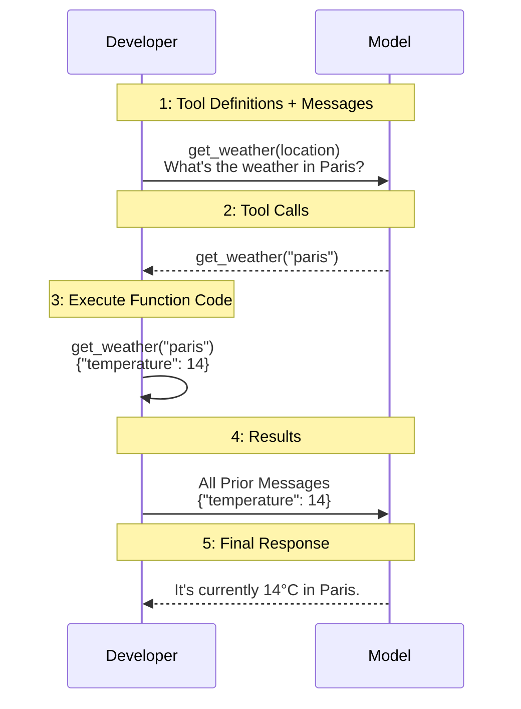

<!--more-->

## 模型是怎么生成回答的？

现在的主流模型用的都是自回归生成，它会根据上文生成下文。模型本身没有记忆，也没有真的在和你对话，而是这样的一个情况



每一次对话都在增加这个上下文长度，直到它超过一个上限，超过这个上限后，要么丢弃内容，要么压缩总结。这个上限就叫上下文窗口。

在一些情况下，上下文窗口不够大就没法有效处理一些内容。Google 的 Gemini 2.5 Pro 支持 100 万的上下文长度，OpenAI 新发布的 GPT-4.1 也支持最长 100 万的上下文长度，o3 有 20 万的上下文长度。

### Temperature

温度是 LLM 中的一个参数，它影响生成文本的随机性和创造性。较低的温度，如 0.2，会使输出更加集中和可预测，适合需要准确性的任务，如技术写作。较高的温度，如 0.7，会使输出更加多样化和富有创造性，适合讲故事或头脑风暴。

可以看看 IBM 写的 [What is LLM Temperature?](https://www.ibm.com/think/topics/llm-temperature) 是一篇不错的文章。

### Top K 以及 Top P

Top K 将下一个 Token 的选择限制在模型输出中概率最高的前 K 个选项。例如，如果 K 设置为 5，模型只会考虑最有可能的 5 个 Token ，使生成的文本更加连贯和可预测。这有助于减少随机性，但将 K 设置得太低可能会限制创造力。

Top P（也称为核心采样）通过选择累积概率超过指定阈值（例如 0.9）的最小一组 Token 来工作。这意味着它包含所有共同占 90% 概率质量的标记，从而在避免非常低概率、可能无意义的标记的同时，允许产生更多样化的输出。它通常被认为比 Top K 更灵活。

有一篇文章写得很好 [How to generate text: using different decoding methods for language generation with Transformers](https://huggingface.co/blog/how-to-generate) 可以看看。

### 小小实践

如果你还没完全理解上下文的概念，先看这个请求



```bash
curl https://api.openai.com/v1/chat/completions \
  -H "Content-Type: application/json" \
  -H "Authorization: Bearer $OPENAI_API_KEY" \
  -d '{
    "model": "gpt-4.1",
    "messages": [
      {
        "role": "developer",
        "content": "You are a helpful assistant."
      },
      {
        "role": "user",
        "content": "Hello!"
      }
    ],
    "temperature": 0.7
  }'
```

它向模型`gpt-4.1`发起了一个消息`Hello!`。它的系统提示词是`You are a helpful assistant.`，`temperature`为`0.7`。

> [!Tip]
> 其中，`developer`是一个新的 role。它在 o1 以及之后的模型中替代原先的`system`。

你应该会得到这样的一个响应



```json
{
  "id": "chatcmpl-BPctVve9zkK7PuUsFvpWbsWzWdR0b",
  "object": "chat.completion",
  "created": 1745447409,
  "model": "gpt-4.1-2025-04-14",
  "choices": [
    {
      "index": 0,
      "message": {
        "role": "assistant",
        "content": "Hello! How can I help you today?",
        "refusal": null,
        "annotations": []
      },
      "logprobs": null,
      "finish_reason": "stop"
    }
  ],
  "usage": {
    "prompt_tokens": 19,
    "completion_tokens": 10,
    "total_tokens": 29,
    "prompt_tokens_details": {
      "cached_tokens": 0,
      "audio_tokens": 0
    },
    "completion_tokens_details": {
      "reasoning_tokens": 0,
      "audio_tokens": 0,
      "accepted_prediction_tokens": 0,
      "rejected_prediction_tokens": 0
    }
  },
  "service_tier": "default",
  "system_fingerprint": "fp_b38e740b47"
}
```

而多轮对话会像这样发起请求。



```bash
curl https://api.openai.com/v1/chat/completions \
  -H "Content-Type: application/json" \
  -H "Authorization: Bearer $OPENAI_API_KEY" \
  -d '{
    "model": "gpt-4.1",
    "messages": [
      {
        "role": "developer",
        "content": "You are a helpful assistant."
      },
      {
        "role": "user",
        "content": "Hello!"
      },
      {
        "role": "assistant",
        "content": "Hello! How can I help you today?"
      },
      {
        "role": "user",
        "content": "1+1等于几"
      }
    ],
    "temperature": 0.7
  }'
```

我们也会收到一个响应



```json
{
  "id": "chatcmpl-BPcv4alGyqzbbwN9ZBzXVXUcX7CWS",
  "object": "chat.completion",
  "created": 1745447506,
  "model": "gpt-4.1-2025-04-14",
  "choices": [
    {
      "index": 0,
      "message": {
        "role": "assistant",
        "content": "1+1等于2。",
        "refusal": null,
        "annotations": []
      },
      "logprobs": null,
      "finish_reason": "stop"
    }
  ],
  "usage": {
    "prompt_tokens": 42,
    "completion_tokens": 8,
    "total_tokens": 50,
    "prompt_tokens_details": {
      "cached_tokens": 0,
      "audio_tokens": 0
    },
    "completion_tokens_details": {
      "reasoning_tokens": 0,
      "audio_tokens": 0,
      "accepted_prediction_tokens": 0,
      "rejected_prediction_tokens": 0
    }
  },
  "service_tier": "default",
  "system_fingerprint": "fp_a1102cf978"
}
```

这基本上就是API基本的作用方式了，相信你也对对话形式有了更深的了解。

### 常见疑问

> **我能对话多少轮？**
>
> 不少用户侧产品都会限制用户的对话数量，不同等级有不同的配额。如果你理解了上面的内容，你会发现。API是每次请求收费的，和上下文长度有直接关系，和对话轮数没有直接关系。也就是说，如果想最大化发挥配额的价值，那你应该仔细构建提示词，争取在几轮对话内完成任务。另外即便模型一样，不同级别套餐的Content Window也未必是一样的。

> **这个模型支持文件上传吗？**
>
> 不少用户会上传PPT，PDF等文件给模型。但是我想提醒的是，模型本身可能并没法原生读取这些文件。大多数模型只能处理文本输入输出，如果能处理多种输入输出的我们叫做多模态模型。现在主流模型都支持图像输入，也是多模态模型。一些前言模型支持语音，视频输入输出。你可能注意到了，它们都不支持所谓的PPT，PDF文件。  
> 事实上，文件上传是各家的独自实现。本质是把它解析成文本内容，也许有图像内容。如果你不清楚它的原理，你可以看看[Mathpix](https://mathpix.com/)的服务，它给多家公司提供了PDF的解析服务。它可以把PDF解析成Markdown之类的文本格式，然后附带在给LLM的请求里实现文档理解和QA。所以，如果你讲究一点的话，可以把PDF里的文本内容手动粘贴在请求里，效果不会更差，甚至会更好。

> **有时文本长度明显超过了窗口限制，为什么还能对话？**
>
> 这也是一种优化技巧，早期GPT-3.5的上下文窗口只有4096 Token，很快就满了。这时候会让模型总结上文来压缩上下文长度，除了这招，还有一些高端一点的操作，比如RAG这样的检索增强技术。不过性能是绝对不如原生窗口的，，而且随着对话轮数增多，模型性能也会下降。这在早期的LLM上非常明显，经过这些年行业的改进，多轮对话性能已经有了长足的提升了。

## 细分的模型类型

在模型不断的发展过程中，有很多新技术，新特性被引入。它们有什么区别，又代表了什么呢？

### 多模态模型 Muti-model

如果一个模型只能处理文本输入，同时输出文本，那它就是单模态模型。反之就是多模态模型。比如当初的GPT-4，它支持文字和图像输入，文本输出。首次给LLM引入了图像理解能力，也就是多模态模型。

现在我们希望模型有更多模态，比如语音输入，视频输入，图像输入，以及语音输出，图像生成。这些也在最新发布的模型中越来越常见。

### 推理模型 Reasoning Model

很早之前，人们就发现，如果在请求里加上诸如“请一步一步思考”，就可以显著提升LLM回答的正确率。

OpenAI发布的o1是第一个真正大规模商用的Reasoning Model。它和其它模型的区别就是它会在生成回答之前进行CoT（Chain-of-Thought）推理。对STEM理科方面的性能提升特别明显，比如数学。对复杂任务的性能提升也特别显著。OpenAI写了篇文章来讲述它的性能提升[Learning to reason with LLMs](https://openai.com/index/learning-to-reason-with-llms/)。

可以看到性能相比一般模型的提升有多么巨大，它开创了一个新时代。

 {
  "tooltip": {
    "trigger": "axis",
    "axisPointer": {
      "type": "shadow"
    }
  },
  "legend": {
    "top": 30,
    "data": ["gpt4o", "o1 preview", "o1", "expert human"]
  },
  "grid": {
    "left": "8%",
    "right": "8%",
    "bottom": "10%",
    "containLabel": true
  },
  "xAxis": {
    "type": "category",
    "data": [
      "AIME 2024\n(Competition Math)",
      "Codeforces\n(Competition Code)",
      "GPQA Diamond\n(PhD-Level Science)"
    ],
    "axisLabel": {
      "interval": 0
    }
  },
  "yAxis": {
    "type": "value",
    "min": 0,
    "max": 100,
    "name": "Accuracy / Percentile (%)",
    "nameGap": 32,
    "nameLocation": "center"
  },
  "series": [
    {
      "name": "gpt4o",
      "type": "bar",
      "data": [13.4, 11.0, 56.1],
      "barGap": "0",
      "label": {
        "show": true,
        "position": "top"
      }
    },
    {
      "name": "o1 preview",
      "type": "bar",
      "data": [56.7, 62.0, 78.3],
      "label": {
        "show": true,
        "position": "top"
      }
    },
    {
      "name": "o1",
      "type": "bar",
      "data": [83.3, 89.0, 78.0],
      "label": {
        "show": true,
        "position": "top"
      }
    },
    {
      "name": "expert human",
      "type": "bar",
      "data": [null, null, 69.7],
      "label": {
        "show": true,
        "position": "top"
      }
    }
  ]
}


而DeepSeek R1则是第一个能媲美o1的开源推理模型。它也开创了一个新时代，类似的训练方法用在了许多模型上，也启发了新研究。开源社区首次有了o1级别的模型。

### 非推理模型 Non-reasoning Model

有了推理模型后，为了方便区分就把回答之前不进行推理的模型归类为非推理模型。它们在STEM领域的性能显著不如推理模型。但是它们有很好的成本效益，因为推理的CoT有时候会很长，从而带来巨大的成本。并且推理模型相比非推理模型在文学方面并没有显著优势。而且等待模型进行推理的时间也不是在哪里都可以接受的。

### 混合模型 Hybrid Model

那有没有办法综合推理模型的性能以及非推理模型的成本效益优势呢？Anthropic给出的答案是Claude 3.7 Sonnet，首个混合模型。也就是能在非推理和非推理之间进行切换。而且还能给模型指定CoT Token的预算，实现更好的成本控制。

 {
  "tooltip": {
    "trigger": "axis",
    "axisPointer": {
      "type": "shadow"
    }
  },
  "legend": {
    "top": 30,
    "data": [
      "Claude 3.7 Sonnet (ext)",
      "Claude 3.7 Sonnet",
      "OpenAI o1",
      "DeepSeek R1"
    ]
  },
  "grid": {
    "left": "8%",
    "right": "8%",
    "bottom": "10%",
    "containLabel": true
  },
  "xAxis": {
    "type": "category",
    "data": [
      "GPQA\nDiamond",
      "SWE-bench\nVerified",
      "MMALU",
      "IFEval",
      "MATH 500",
      "AIME 2024"
    ],
    "axisLabel": {
      "interval": 0
    }
  },
  "yAxis": {
    "type": "value",
    "min": 0,
    "max": 100,
    "name": "Accuracy / Percentile (%)",
    "nameGap": 32,
    "nameLocation": "center"
  },
  "series": [
    {
      "name": "Claude 3.7 Sonnet (ext)",
      "type": "bar",
      "data": [84.8, null, 86.1, 93.2, 96.2, 80.0],
      "label": {
        "show": true,
        "position": "top",
        "fontSize": 10
      }
    },
    {
      "name": "Claude 3.7 Sonnet",
      "type": "bar",
      "data": [68.0, 70.3, 83.2, 90.8, 82.2, 23.3],
      "label": {
        "show": true,
        "position": "top",
        "fontSize": 10
      }
    },
    {
      "name": "OpenAI o1",
      "type": "bar",
      "data": [78.0, 48.9, 87.7, null, 96.4, 83.3],
      "label": {
        "show": true,
        "position": "top",
        "fontSize": 10
      }
    },
    {
      "name": "DeepSeek R1",
      "type": "bar",
      "data": [71.5, 49.2, 79.5, 83.3, 97.3, 79.8],
      "label": {
        "show": true,
        "position": "top",
        "fontSize": 10
      }
    }
  ]
}


后来也有一些开源模型采用了这样的理念，比如Cogito v1 Preview。它通过在System Prompt开头加一句“Enable deep thinking subroutine.”以开启推理模式。

## 模型特性

LLM也在引入越来越多的新特性，有些很强大，也很时髦。

### Function Calling

我们希望扩展模型的能力，例如调用外部工具的能力。发出这样的一个请求

```bash
curl https://api.openai.com/v1/chat/completions \
-H "Content-Type: application/json" \
-H "Authorization: Bearer $OPENAI_API_KEY" \
-d '{
    "model": "gpt-4.1",
    "messages": [
        {
            "role": "user",
            "content": "Can you send an email to ilan@example.com and katia@example.com saying hi?"
        }
    ],
    "tools": [
        {
            "type": "function",
            "function": {
                "name": "send_email",
                "description": "Send an email to a given recipient with a subject and message.",
                "parameters": {
                    "type": "object",
                    "properties": {
                        "to": {
                            "type": "string",
                            "description": "The recipient email address."
                        },
                        "subject": {
                            "type": "string",
                            "description": "Email subject line."
                        },
                        "body": {
                            "type": "string",
                            "description": "Body of the email message."
                        }
                    },
                    "required": [
                        "to",
                        "subject",
                        "body"
                    ],
                    "additionalProperties": false
                },
                "strict": true
            }
        }
    ]
}'
```

你会收到这样的模型返回，内容是调用先前我们定义的工具。

```json
{
  "id": "chatcmpl-BPy4wVm9NJBqduSwkHF3FKtyvBRF0",
  "object": "chat.completion",
  "created": 1745528842,
  "model": "gpt-4.1-2025-04-14",
  "choices": [
    {
      "index": 0,
      "message": {
        "role": "assistant",
        "content": null,
        "tool_calls": [
          {
            "id": "call_RLgC1PNJou9nepd5zB6rh3Yj",
            "type": "function",
            "function": {
              "name": "send_email",
              "arguments": "{\"to\": \"ilan@example.com\", \"subject\": \"Hello!\", \"body\": \"Hi Ilan,\"}"
            }
          },
          {
            "id": "call_zum2F3ZHdlv0ECZQ1Tur4zyZ",
            "type": "function",
            "function": {
              "name": "send_email",
              "arguments": "{\"to\": \"katia@example.com\", \"subject\": \"Hello!\", \"body\": \"Hi Katia,\"}"
            }
          }
        ],
        "refusal": null,
        "annotations": []
      },
      "logprobs": null,
      "finish_reason": "tool_calls"
    }
  ],
  "usage": {
    "prompt_tokens": 91,
    "completion_tokens": 74,
    "total_tokens": 165,
    "prompt_tokens_details": {
      "cached_tokens": 0,
      "audio_tokens": 0
    },
    "completion_tokens_details": {
      "reasoning_tokens": 0,
      "audio_tokens": 0,
      "accepted_prediction_tokens": 0,
      "rejected_prediction_tokens": 0
    }
  },
  "service_tier": "default",
  "system_fingerprint": "fp_a1102cf978"
}
```

不过整个流程到这里还没结束，因为模型不会执行调用的工具，这需要你执行工具调用并且把内容返回给模型。完整流程类似于



有兴趣可以看看OpenAI给出的示例[Function calling](https://platform.openai.com/docs/guides/function-calling?api-mode=chat&lang=curl&example=get-weather&strict-mode=enabled)。

### Structured Outputs

这个就是字面意思，可以让模型返回预先定义的JSON格式的响应。可以看看OpenAI给出的示例[Structured Outputs](https://platform.openai.com/docs/guides/structured-outputs?api-mode=chat&lang=python)。

比如这段用Pydantic实现的例子，来自[SGLang的文档](https://docs.sglang.ai/backend/structured_outputs.html#JSON)。

```python
from pydantic import BaseModel, Field


# Define the schema using Pydantic
class CapitalInfo(BaseModel):
    name: str = Field(..., pattern=r"^\w+$", description="Name of the capital city")
    population: int = Field(..., description="Population of the capital city")


response = client.chat.completions.create(
    model="meta-llama/Meta-Llama-3.1-8B-Instruct",
    messages=[
        {
            "role": "user",
            "content": "Please generate the information of the capital of France in the JSON format.",
        },
    ],
    temperature=0,
    max_tokens=128,
    response_format={
        "type": "json_schema",
        "json_schema": {
            "name": "foo",
            # convert the pydantic model to json schema
            "schema": CapitalInfo.model_json_schema(),
        },
    },
)

response_content = response.choices[0].message.content
# validate the JSON response by the pydantic model
capital_info = CapitalInfo.model_validate_json(response_content)
print_highlight(f"Validated response: {capital_info.model_dump_json()}")
```

返回大概是这样的

```console
Validated response: {"name":"Paris","population":2147000}
```

也可以直接使用JSON实现

```python
import json

json_schema = json.dumps(
    {
        "type": "object",
        "properties": {
            "name": {"type": "string", "pattern": "^[\\w]+$"},
            "population": {"type": "integer"},
        },
        "required": ["name", "population"],
    }
)

response = client.chat.completions.create(
    model="meta-llama/Meta-Llama-3.1-8B-Instruct",
    messages=[
        {
            "role": "user",
            "content": "Give me the information of the capital of France in the JSON format.",
        },
    ],
    temperature=0,
    max_tokens=128,
    response_format={
        "type": "json_schema",
        "json_schema": {"name": "foo", "schema": json.loads(json_schema)},
    },
)

print_highlight(response.choices[0].message.content)
```

返回大概是这样的

```console
{"name": "Paris", "population": 2147000}
```

当然，Structured Outputs远不止JSON，不过这里只是抛砖引玉罢了。
