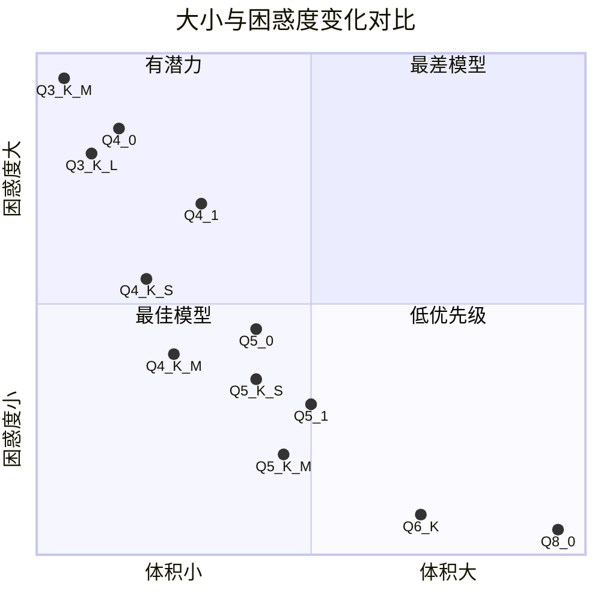

<!--more-->

当我们部署 llama.cpp 或 Ollama 实例时，我们更倾向于运行量化模型以节省内存并加速推理。

但是，量化模型的质量并不总是很好。我们需要选择合适的量化类型来平衡质量和性能。

## llama.cpp 中的量化类型

llama.cpp 中有许多量化类型。当你尝试量化模型时，可以看到以下打印信息。

```text
Allowed quantization types:
   2  or  Q4_0    :  3.56G, +0.2166 ppl @ LLaMA-v1-7B
   3  or  Q4_1    :  3.90G, +0.1585 ppl @ LLaMA-v1-7B
   8  or  Q5_0    :  4.33G, +0.0683 ppl @ LLaMA-v1-7B
   9  or  Q5_1    :  4.70G, +0.0349 ppl @ LLaMA-v1-7B
  19  or  IQ2_XXS :  2.06 bpw quantization
  20  or  IQ2_XS  :  2.31 bpw quantization
  24  or  IQ1_S   :  1.56 bpw quantization
  10  or  Q2_K    :  2.63G, +0.6717 ppl @ LLaMA-v1-7B
  21  or  Q2_K_S  :  2.16G, +9.0634 ppl @ LLaMA-v1-7B
  23  or  IQ3_XXS :  3.06 bpw quantization
  26  or  IQ3_S   :  3.44 bpw quantization
  27  or  IQ3_M   :  3.66 bpw quantization mix
  12  or  Q3_K    : alias for Q3_K_M
  22  or  Q3_K_XS : 3-bit extra small quantization
  11  or  Q3_K_S  :  2.75G, +0.5551 ppl @ LLaMA-v1-7B
  12  or  Q3_K_M  :  3.07G, +0.2496 ppl @ LLaMA-v1-7B
  13  or  Q3_K_L  :  3.35G, +0.1764 ppl @ LLaMA-v1-7B
  25  or  IQ4_NL  :  4.25 bpw non-linear quantization
  15  or  Q4_K    : alias for Q4_K_M
  14  or  Q4_K_S  :  3.59G, +0.0992 ppl @ LLaMA-v1-7B
  15  or  Q4_K_M  :  3.80G, +0.0532 ppl @ LLaMA-v1-7B
  17  or  Q5_K    : alias for Q5_K_M
  16  or  Q5_K_S  :  4.33G, +0.0400 ppl @ LLaMA-v1-7B
  17  or  Q5_K_M  :  4.45G, +0.0122 ppl @ LLaMA-v1-7B
  18  or  Q6_K    :  5.15G, +0.0008 ppl @ LLaMA-v1-7B
   7  or  Q8_0    :  6.70G, +0.0004 ppl @ LLaMA-v1-7B
   1  or  F16     : 13.00G              @ 7B
   0  or  F32     : 26.00G              @ 7B
          COPY    : only copy tensors, no quantizing
```

## 量化类型比较

为了帮助我们比较量化类型，我制作了一个表格来显示每种量化类型的大小和 ppl（困惑度）变化。ppl 变化越小意味着质量越好。困惑度通常衡量模型预测结果的置信度。困惑度越低，模型越好。

| Q Type | Size | ppl Change | Note |
|:---:|:---:|:---:|:---:|
| Q2\_K\_S | 2.16G | +9.0634 | @ LLaMA-v1-7B |
| Q2\_K | 2.63G | +0.6717 | @ LLaMA-v1-7B |
| Q3\_K\_S | 2.75G | +0.5551 | @ LLaMA-v1-7B |
| Q3\_K | - | - | alias for Q3\_K\_M |
| Q3\_K\_M | 3.07G | +0.2496 | @ LLaMA-v1-7B |
| Q3\_K\_L | 3.35G | +0.1764 | @ LLaMA-v1-7B |
| Q4\_0 | 3.56G | +0.2166 | @ LLaMA-v1-7B |
| Q4\_K\_S | 3.59G | +0.0992 | @ LLaMA-v1-7B |
| Q4\_K | - | - | alias for Q4\_K\_M |
| Q4\_K\_M | 3.80G | +0.0532 | @ LLaMA-v1-7B |
| Q4\_1 | 3.90G | +0.1585 | @ LLaMA-v1-7B |
| Q5\_0 | 4.33G | +0.0683 | @ LLaMA-v1-7B |
| Q5\_K\_S | 4.33G | +0.0400 | @ LLaMA-v1-7B |
| Q5\_1 | 4.70G | +0.0349 | @ LLaMA-v1-7B |
| Q5\_K | - | - | alias for Q5\_K\_M |
| Q5\_K\_M | 4.45G | +0.0122 | @ LLaMA-v1-7B |
| Q6\_K | 5.15G | +0.0008 | @ LLaMA-v1-7B |
| Q8\_0 | 6.70G | +0.0004 | @ LLaMA-v1-7B |

为了帮助我们理解大小和 ppl 变化之间的关系，我制作了一个象限图来显示这种关系。



## 总结

从表格和散点图中，我们可以看出 Q8\_0 质量最好，但大小也最大。Q2\_K\_S 质量最差，但大小最小。Q4\_K\_M 在质量和大小之间取得了最佳平衡。但我推荐 Q5\_K\_M，它具有良好的质量和合理的大小。

对于小模型，如 7B、14B，我推荐 Q6\_K，即使它比 Q5\_K\_M 大，但 ppl 变化非常小。对于像 RTX 4090 这样的 GPU，24GB 显存绰绰有余。但对于 GPU，其他量化类型如 exl2 可能是更好的选择。