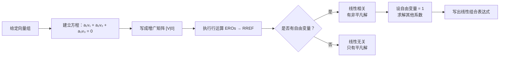
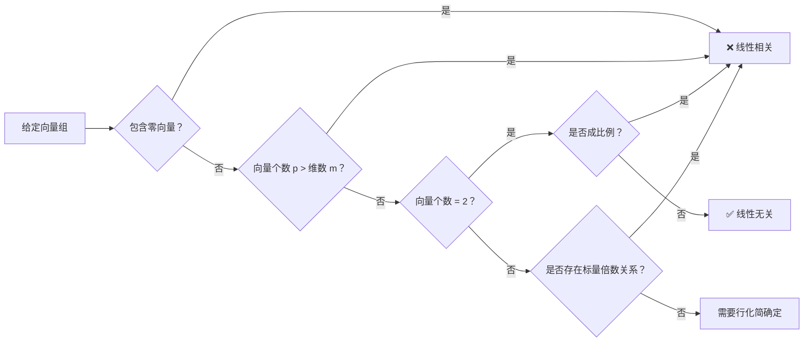

<!--more-->

## 概述

考试 #3 将于 4 月 1 日星期三在 Test Block 进行，涵盖矩阵代数部分**1.1、1.2、1.3、1.5、1.6、1.7、1.9 和 3.2 节**。

如果你提交了带有考试便利条件的 ANSS 备忘录，将通过电子邮件与你联系，告知你考试的替代地点详情。只有在 3 月 30 日星期一晚上 5 点之前通过电子邮件向讲师发送了便利条件备忘录的学生才能在考试 3 中使用他们的考试便利条件。

你将有 70 分钟完成考试。学生必须准时到达并听取关于座位要求的指示。学生必须将所有物品（背包和夹克）留在考试室前部的墙边。不要阻挡任何出口或阻碍任何通道。如果你在考试开始后到达，将不会给你额外时间完成考试。学生将被要求签到，并且会收集的考试将与签到表进行交叉检查。未签到的学生的考试将不予评分。

## 问题

### Q1. 含参数的线性方程组

> 考虑方程组 $\begin{cases} x_1 = 1 \\ 2x_1 + (a^2+a-2)x_2 = a^2-a-4 \end{cases}$  
> 确定 $a$ 的值使得方程组有
> - (i) 无穷多解
> - (ii) 无解
> - (iii) 满足 $x_2=0$ 的唯一解
>
> 写出解的向量形式


我们给定的方程组为：
$$\begin{cases} x_1 = 1 \\ 2x_1 + (a^2+a-2)x_2 = a^2-a-4 \end{cases}$$

将 $x_1 = 1$ 代入第二个方程：
$$2(1) + (a^2+a-2)x_2 = a^2-a-4$$
$$(a^2+a-2)x_2 = a^2-a-6$$

**情况分析：**

**(i) 无穷多解：**  
当系数和常数都为零时发生：  
$$a^2+a-2 = 0 \quad \text{且} \quad a^2-a-6 = 0$$  
解 $a^2+a-2=0$：$(a+2)(a-1)=0 \implies a = -2, 1$  
解 $a^2-a-6=0$：$(a-3)(a+2)=0 \implies a = -2, 3$  
公共值为 $a = -2$。

当 $a = -2$ 时，方程变为 $0 \cdot x_2 = 0$，这总是成立。  
**解：** $x_1 = 1$，$x_2$ 为自由变量。  
**向量形式：** $\vec{x} = \begin{bmatrix} 1 \\ 0 \end{bmatrix} + x_2 \begin{bmatrix} 0 \\ 1 \end{bmatrix}$

**(ii) 无解：**
当系数为零但常数非零时发生。  
由上可知，$a^2+a-2=0$ 给出 $a = -2, 1$
- 对于 $a = -2$：$0 \cdot x_2 = 0$（无穷多解，不是无解）
- 对于 $a = 1$：$0 \cdot x_2 = 1^2-1-6 = -6 \neq 0$（无解）

**答案：** $a = 1$

**(iii) 满足 $x_2 = 0$ 的唯一解：**  
对于唯一解，我们需要 $a^2+a-2 \neq 0$，即 $a \neq -2, 1$。  
对于 $x_2 = 0$，我们需要 $a^2-a-6 = 0$，即 $a = -2, 3$。  
由于 $a \neq -2$，必须有 $a = 3$。

当 $a = 3$ 时：$x_2 = 0$ 且 $x_1 = 1$。  
**向量形式：** $\vec{x} = \begin{bmatrix} 1 \\ 0 \end{bmatrix}$

**最终答案**
- (i) 无穷多解：$a = -2$，$\vec{x} = \begin{bmatrix} 1 \\ 0 \end{bmatrix} + x_2 \begin{bmatrix} 0 \\ 1 \end{bmatrix}$
- (ii) 无解：$a = 1$
- (iii) 满足 $x_2=0$ 的唯一解：$a = 3$，$\vec{x} = \begin{bmatrix} 1 \\ 0 \end{bmatrix}$


### Q2. 线性方程组（第一部分）

> 求解方程组或说明方程组无解：  
> $\begin{cases} 2x_1 + 4x_2 + 6x_3 = 0 \\ 4x_1 + 5x_2 + 6x_3 = 3 \\ 7x_1 + 8x_2 + 9x_3 = 6 \end{cases}$


我们构造增广矩阵并进行行化简：
$$\left[\begin{array}{ccc|c} 2 & 4 & 6 & 0 \\ 4 & 5 & 6 & 3 \\ 7 & 8 & 9 & 6 \end{array}\right]$$

**步骤 0：** 写出增广矩阵（如上所示）

**步骤 1：** 从最左边的非零列开始。通过 $R_1 \leftarrow \frac{1}{2}R_1$ 使主元变为 1：
$$\left[\begin{array}{ccc|c} 1 & 2 & 3 & 0 \\ 4 & 5 & 6 & 3 \\ 7 & 8 & 9 & 6 \end{array}\right]$$

**步骤 2：** 使用消元法在主元 1 下方创建零。  
$R_2 \leftarrow R_2 - 4R_1$，$R_3 \leftarrow R_3 - 7R_1$：
$$\left[\begin{array}{ccc|c} 1 & 2 & 3 & 0 \\ 0 & -3 & -6 & 3 \\ 0 & -6 & -12 & 6 \end{array}\right]$$

**步骤 3：** 重复步骤 1 和 2（忽略第 1 行）。通过 $R_2 \leftarrow -\frac{1}{3}R_2$ 使第 2 行的主元变为 1：
$$\left[\begin{array}{ccc|c} 1 & 2 & 3 & 0 \\ 0 & 1 & 2 & -1 \\ 0 & -6 & -12 & 6 \end{array}\right]$$

**步骤 4：** 在第 2 行的主元 1 下方创建零。  
$R_3 \leftarrow R_3 + 6R_2$：
$$\left[\begin{array}{ccc|c} 1 & 2 & 3 & 0 \\ 0 & 1 & 2 & -1 \\ 0 & 0 & 0 & 0 \end{array}\right]$$

矩阵现在处于**行阶梯形**。最后一行全为零，因此系统是**相容的**。由于第 3 列没有主元 1，$x_3$ 是**自由变量**，系统有**无穷多解**。

**步骤 5：** 在每个主元 1 上方创建零（从右向左工作）以得到**简化行阶梯形（RREF）**。  
$R_1 \leftarrow R_1 - 2R_2$：
$$\left[\begin{array}{ccc|c} 1 & 0 & -1 & 2 \\ 0 & 1 & 2 & -1 \\ 0 & 0 & 0 & 0 \end{array}\right]$$

**步骤 6：** 写出对应于 RREF 的方程组：
$$\begin{cases} x_1 - x_3 = 2 \\ x_2 + 2x_3 = -1 \end{cases}$$

**求解主元变量：**
$$\begin{cases} x_1 = 2 + x_3 \\ x_2 = -1 - 2x_3 \\ x_3 = \text{自由} \end{cases}$$

**最终答案**
方程组有无穷多解。向量形式为：
$$\vec{x} = \begin{bmatrix} x_1 \\ x_2 \\ x_3 \end{bmatrix} = \begin{bmatrix} 2 \\ -1 \\ 0 \end{bmatrix} + x_3 \begin{bmatrix} 1 \\ -2 \\ 1 \end{bmatrix}$$


### Q3. 线性方程组（第二部分）

> 求解方程组或说明方程组无解：  
> $\begin{cases} 2x_1 + 4x_2 + 6x_3 = 0 \\ 4x_1 + 5x_2 + 6x_3 = 3 \\ 7x_1 + 8x_2 + 9x_3 = 0 \end{cases}$


我们构造增广矩阵并进行高斯消元：

$$\left[\begin{array}{ccc|c} 2 & 4 & 6 & 0 \\ 4 & 5 & 6 & 3 \\ 7 & 8 & 9 & 0 \end{array}\right]$$

**步骤 1：** 从第 2 和第 3 行消去 $x_1$
- $R_2 \leftarrow R_2 - 2R_1$：$[4, 5, 6, 3] - [4, 8, 12, 0] = [0, -3, -6, 3]$
- $R_3 \leftarrow R_3 - \frac{7}{2}R_1$：$[7, 8, 9, 0] - [7, 14, 21, 0] = [0, -6, -12, 0]$

$$\left[\begin{array}{ccc|c} 2 & 4 & 6 & 0 \\ 0 & -3 & -6 & 3 \\ 0 & -6 & -12 & 0 \end{array}\right]$$

**步骤 2：** 化简第 2 行
- $R_2 \leftarrow -\frac{1}{3}R_2$：$[0, 1, 2, -1]$

$$\left[\begin{array}{ccc|c} 2 & 4 & 6 & 0 \\ 0 & 1 & 2 & -1 \\ 0 & -6 & -12 & 0 \end{array}\right]$$

**步骤 3：** 从第 3 行消去 $x_2$
- $R_3 \leftarrow R_3 + 6R_2$：$[0, -6, -12, 0] + [0, 6, 12, -6] = [0, 0, 0, -6]$

$$\left[\begin{array}{ccc|c} 2 & 4 & 6 & 0 \\ 0 & 1 & 2 & -1 \\ 0 & 0 & 0 & -6 \end{array}\right]$$

**分析：**
最后一行表示方程：
$$0x_1 + 0x_2 + 0x_3 = -6$$
简化为 $0 = -6$，这是一个**矛盾**。

这表明系统是**不相容的**，**无解**。

**验证：**
让我们通过检查方程之间的关系来验证方程是否兼容：
- 从方程 1 和 2，我们得到 $x_2 = -1 - 2x_3$ 和 $x_1 = 2 + x_3$（如 Q2 所示）
- 代入方程 3：$7(2+x_3) + 8(-1-2x_3) + 9x_3 = 14 + 7x_3 - 8 - 16x_3 + 9x_3 = 6 \neq 0$

这证实了不相容性。

**最终答案**
方程组**无解**（不相容）。


### Q4. RREF 形式的增广矩阵

> 以下每个矩阵都是以简化行阶梯形表示的线性方程组的增广矩阵，说明系统是相容的还是不相容的。如果系统相容，给出解的向量形式。  
> a) $\left[\begin{array}{ccc|c} 1 & 0 & 0 & 7 \\ 0 & 1 & 0 & -2 \\ 0 & 0 & 1 & 3 \\ 0 & 0 & 0 & 0 \end{array}\right]$  
> b) $\left[\begin{array}{cccc|c} 1 & -2 & 0 & 7 & 5 \\ 0 & 0 & 1 & -4 & 3 \\ 0 & 0 & 0 & 0 & 0 \end{array}\right]$  
> c) $\left[\begin{array}{ccc|c} 1 & 2 & -1 & 0 \\ 0 & 0 & 1 & 0 \\ 0 & 0 & 0 & 1 \end{array}\right]$


**a)** 
矩阵为：
$$\left[\begin{array}{ccc|c} 1 & 0 & 0 & 7 \\ 0 & 1 & 0 & -2 \\ 0 & 0 & 1 & 3 \\ 0 & 0 & 0 & 0 \end{array}\right]$$

这表示：
- $x_1 = 7$
- $x_2 = -2$
- $x_3 = 3$
- $0 = 0$（相容）

**答案：** 相容。解：$\vec{x} = \begin{bmatrix} 7 \\ -2 \\ 3 \end{bmatrix}$

**b)**
矩阵为：
$$\left[\begin{array}{cccc|c} 1 & -2 & 0 & 7 & 5 \\ 0 & 0 & 1 & -4 & 3 \\ 0 & 0 & 0 & 0 & 0 \end{array}\right]$$

这表示：
- $x_1 - 2x_2 + 7x_4 = 5$
- $x_3 - 4x_4 = 3$
- $0 = 0$（相容）

自由变量：$x_2, x_4$

从方程 2：$x_3 = 3 + 4x_4$
从方程 1：$x_1 = 5 + 2x_2 - 7x_4$

**答案：** 相容。解：$\vec{x} = \begin{bmatrix} 5 \\ 0 \\ 3 \\ 0 \end{bmatrix} + x_2 \begin{bmatrix} 2 \\ 1 \\ 0 \\ 0 \end{bmatrix} + x_4 \begin{bmatrix} -7 \\ 0 \\ 4 \\ 1 \end{bmatrix}$

**c)**
矩阵为：
$$\left[\begin{array}{ccc|c} 1 & 2 & -1 & 0 \\ 0 & 0 & 1 & 0 \\ 0 & 0 & 0 & 1 \end{array}\right]$$

最后一行给出 $0 = 1$，这是一个矛盾。

**答案：** 不相容。

**最终答案**
- a) 相容：$\vec{x} = \begin{bmatrix} 7 \\ -2 \\ 3 \end{bmatrix}$
- b) 相容：$\vec{x} = \begin{bmatrix} 5 \\ 0 \\ 3 \\ 0 \end{bmatrix} + x_2 \begin{bmatrix} 2 \\ 1 \\ 0 \\ 0 \end{bmatrix} + x_4 \begin{bmatrix} -7 \\ 0 \\ 4 \\ 1 \end{bmatrix}$
- c) 不相容


### Q5. 线性系统的相容性条件

> 考虑方程组：$\begin{cases} x_1 + 5x_2 + 3x_4 = b_1 \\ -x_1 - 5x_2 + x_3 - 5x_4 = b_2 \\ x_1 + 5x_2 + 3x_3 - 3x_4 = b_3 \end{cases}$  
> (a) 确定 $b_1, b_2, b_3$ 的必要且充分条件，使得系统相容。  
> (b) 在以下每种情况下，使用 (a) 的答案说明系统是相容的还是不相容的。如果系统相容，给出解的向量形式。
> - (i) $b_1 = -1, b_2 = 2, b_3 = 1$
> - (ii) $b_1 = 1, b_2 = 1, b_3 = 7$


**部分 (a)：找到相容性条件**

构造增广矩阵：
$$\left[\begin{array}{cccc|c} 1 & 5 & 0 & 3 & b_1 \\ -1 & -5 & 1 & -5 & b_2 \\ 1 & 5 & 3 & -3 & b_3 \end{array}\right]$$

**行化简：**  
$R_2 \leftarrow R_2 + R_1$：$[0, 0, 1, -2 | b_1 + b_2]$  
$R_3 \leftarrow R_3 - R_1$：$[0, 0, 3, -6 | b_3 - b_1]$

$$\left[\begin{array}{cccc|c} 1 & 5 & 0 & 3 & b_1 \\ 0 & 0 & 1 & -2 & b_1 + b_2 \\ 0 & 0 & 3 & -6 & b_3 - b_1 \end{array}\right]$$

$R_3 \leftarrow R_3 - 3R_2$：$[0, 0, 0, 0 | b_3 - b_1 - 3(b_1 + b_2)] = [0, 0, 0, 0 | b_3 - 4b_1 - 3b_2]$

对于相容性，我们需要：
$$b_3 - 4b_1 - 3b_2 = 0 \implies b_3 = 4b_1 + 3b_2$$

**答案 (a)：** 当且仅当 $b_3 = 4b_1 + 3b_2$ 时，系统相容。

---

**部分 (b)：检查具体情况**

**(i) $b_1 = -1, b_2 = 2, b_3 = 1$**  
检查：$4b_1 + 3b_2 = 4(-1) + 3(2) = -4 + 6 = 2 \neq 1 = b_3$  
**答案：** 不相容。

**(ii) $b_1 = 1, b_2 = 1, b_3 = 7$**  
检查：$4b_1 + 3b_2 = 4(1) + 3(1) = 7 = b_3$  
**答案：** 相容。

寻找解：  
从行化简：  
- $x_3 - 2x_4 = b_1 + b_2 = 2 \implies x_3 = 2 + 2x_4$
- $x_1 + 5x_2 + 3x_4 = b_1 = 1 \implies x_1 = 1 - 5x_2 - 3x_4$

自由变量：$x_2, x_4$

**向量形式：** $\vec{x} = \begin{bmatrix} 1 \\ 0 \\ 2 \\ 0 \end{bmatrix} + x_2 \begin{bmatrix} -5 \\ 1 \\ 0 \\ 0 \end{bmatrix} + x_4 \begin{bmatrix} -3 \\ 0 \\ 2 \\ 1 \end{bmatrix}$

**最终答案**
- (a) 相容性条件：$b_3 = 4b_1 + 3b_2$
- (b)(i) 不相容
- (b)(ii) 相容：$\vec{x} = \begin{bmatrix} 1 \\ 0 \\ 2 \\ 0 \end{bmatrix} + x_2 \begin{bmatrix} -5 \\ 1 \\ 0 \\ 0 \end{bmatrix} + x_4 \begin{bmatrix} -3 \\ 0 \\ 2 \\ 1 \end{bmatrix}$


### Q6. 矩阵运算

> $A=\begin{bmatrix} -3 & 1 \\ 2 & -1 \end{bmatrix}, B=\begin{bmatrix} 0 & 4 \\ -2 & 5 \end{bmatrix}, C=\begin{bmatrix} 5 & 0 \\ -1 & 4 \\ 3 & 3 \end{bmatrix}, D=\begin{bmatrix} 1 & 0 & -3 \\ -2 & 5 & -1 \end{bmatrix}, E=\begin{bmatrix} 1 & 4 & -5 \\ -2 & 1 & -3 \\ 0 & 2 & 6 \end{bmatrix}$。  
> 求下列运算（如果定义），否则解释为什么无法计算。  
> a) $CA$  
> b) $AC$  
> c) $(A-B)D$  
> d) $B(C^T + D)$  
> e) $CE$  
> f) $C^T B$


**a) $CA$**  
$C$ 是 $3 \times 2$，$A$ 是 $2 \times 2$。乘积有定义（$3 \times 2$）。
$$CA = \begin{bmatrix} 5 & 0 \\ -1 & 4 \\ 3 & 3 \end{bmatrix} \begin{bmatrix} -3 & 1 \\ 2 & -1 \end{bmatrix} = \begin{bmatrix} -15 & 5 \\ 11 & -5 \\ -3 & 0 \end{bmatrix}$$

---

**b) $AC$**  
$A$ 是 $2 \times 2$，$C$ 是 $3 \times 2$。乘积**无定义**（A 的列数 = 2，C 的行数 = 3）。  
**答案：** 无定义。

---

**c) $(A-B)D$**  
$A-B = \begin{bmatrix} -3 & 1 \\ 2 & -1 \end{bmatrix} - \begin{bmatrix} 0 & 4 \\ -2 & 5 \end{bmatrix} = \begin{bmatrix} -3 & -3 \\ 4 & -6 \end{bmatrix}$  
$(A-B)$ 是 $2 \times 2$，$D$ 是 $2 \times 3$。乘积有定义（$2 \times 3$）。
$$(A-B)D = \begin{bmatrix} -3 & -3 \\ 4 & -6 \end{bmatrix} \begin{bmatrix} 1 & 0 & -3 \\ -2 & 5 & -1 \end{bmatrix} = \begin{bmatrix} 3 & -15 & 12 \\ 16 & -30 & -6 \end{bmatrix}$$

---

**d) $B(C^T + D)$**  
$C^T = \begin{bmatrix} 5 & -1 & 3 \\ 0 & 4 & 3 \end{bmatrix}$，$D = \begin{bmatrix} 1 & 0 & -3 \\ -2 & 5 & -1 \end{bmatrix}$  
$C^T + D = \begin{bmatrix} 6 & -1 & 0 \\ -2 & 9 & 2 \end{bmatrix}$  
$B$ 是 $2 \times 2$，$C^T + D$ 是 $2 \times 3$。乘积有定义（$2 \times 3$）。
$$B(C^T + D) = \begin{bmatrix} 0 & 4 \\ -2 & 5 \end{bmatrix} \begin{bmatrix} 6 & -1 & 0 \\ -2 & 9 & 2 \end{bmatrix} = \begin{bmatrix} -8 & 36 & 8 \\ -22 & 47 & 10 \end{bmatrix}$$

---

**e) $CE$**  
$C$ 是 $3 \times 2$，$E$ 是 $3 \times 3$。乘积**无定义**（C 的列数 = 2，E 的行数 = 3）。  
**答案：** 无定义。

---

**f) $C^T B$**  
$C^T$ 是 $2 \times 3$，$B$ 是 $2 \times 2$。乘积**无定义**（C^T 的列数 = 3，B 的行数 = 2）。  
**答案：** 无定义。

---

**最终答案**
- a) $CA = \begin{bmatrix} -15 & 5 \\ 11 & -5 \\ -3 & 0 \end{bmatrix}$
- b) 无定义（维度不匹配）
- c) $(A-B)D = \begin{bmatrix} 3 & -15 & 12 \\ 16 & -30 & -6 \end{bmatrix}$
- d) $B(C^T + D) = \begin{bmatrix} -8 & 36 & 8 \\ -22 & 47 & 10 \end{bmatrix}$
- e) 无定义（维度不匹配）
- f) 无定义（维度不匹配）


### Q7. 向量的线性无关性

> 判断向量 $\begin{bmatrix} 1 \\ 0 \\ 2 \end{bmatrix}, \begin{bmatrix} 2 \\ -3 \\ 1 \end{bmatrix}, \begin{bmatrix} 1 \\ 3 \\ 5 \end{bmatrix}$ 是否线性无关。如果它们线性相关，将集合中的一个向量表示为其他向量的线性组合。



设 $\vec{v}_1 = \begin{bmatrix} 1 \\ 0 \\ 2 \end{bmatrix}, \vec{v}_2 = \begin{bmatrix} 2 \\ -3 \\ 1 \end{bmatrix}, \vec{v}_3 = \begin{bmatrix} 1 \\ 3 \\ 5 \end{bmatrix}$

**步骤 1：** 令 $a_1\vec{v}_1 + a_2\vec{v}_2 + a_3\vec{v}_3 = \vec{0}$，$a_1 = a_2 = a_3 = 0$ 是唯一解吗？

$$a_1\vec{v}_1 + a_2\vec{v}_2 + a_3\vec{v}_3 = \vec{0} \Rightarrow \begin{bmatrix} 1 & 2 & 1 \\ 0 & -3 & 3 \\ 2 & 1 & 5 \end{bmatrix} \begin{bmatrix} a_1 \\ a_2 \\ a_3 \end{bmatrix} = \begin{bmatrix} 0 \\ 0 \\ 0 \end{bmatrix} \Rightarrow \left[\begin{array}{ccc|c} 1 & 2 & 1 & 0 \\ 0 & -3 & 3 & 0 \\ 2 & 1 & 5 & 0 \end{array}\right]$$

**步骤 2：** 执行初等行运算（ERO）化简为 RREF：

$$\left[\begin{array}{ccc|c} 1 & 2 & 1 & 0 \\ 0 & -3 & 3 & 0 \\ 2 & 1 & 5 & 0 \end{array}\right] \xrightarrow{R_3 \to R_3 - 2R_1} \left[\begin{array}{ccc|c} 1 & 2 & 1 & 0 \\ 0 & -3 & 3 & 0 \\ 0 & -3 & 3 & 0 \end{array}\right]$$

$$\xrightarrow{R_3 \to R_3 - R_2} \left[\begin{array}{ccc|c} 1 & 2 & 1 & 0 \\ 0 & -3 & 3 & 0 \\ 0 & 0 & 0 & 0 \end{array}\right] \xrightarrow{R_2 \to -\frac{1}{3}R_2} \left[\begin{array}{ccc|c} 1 & 2 & 1 & 0 \\ 0 & 1 & -1 & 0 \\ 0 & 0 & 0 & 0 \end{array}\right]$$

$$\xrightarrow{R_1 \to R_1 - 2R_2} \left[\begin{array}{ccc|c} 1 & 0 & 3 & 0 \\ 0 & 1 & -1 & 0 \\ 0 & 0 & 0 & 0 \end{array}\right]$$

**步骤 3：** 分析 RREF：
- **主元 1 列**：第 1 列和第 2 列
- **自由列**：第 3 列 $\Rightarrow$ $a_3$ 是**自由变量**

由于存在自由变量，系统有**无穷多（非平凡）解**。

$$\Rightarrow \begin{cases} a_1 + 3a_3 = 0 \Rightarrow a_1 = -3a_3 \\ a_2 - a_3 = 0 \Rightarrow a_2 = a_3 \\ a_3 = a_3 \quad (a_3 \in \mathbb{R}) \end{cases}$$

**步骤 4：** 要将一个向量用其他向量表示，为自由变量选择一个非零值。

令 $a_3 = 1 \Rightarrow a_1 = -3(1) = -3, a_2 = 1$

$$\Rightarrow -3\vec{v}_1 + 1\vec{v}_2 + 1\vec{v}_3 = \vec{0} \Rightarrow \vec{v}_3 = 3\vec{v}_1 - \vec{v}_2$$

**验证：** $3\vec{v}_1 - \vec{v}_2 = 3\begin{bmatrix} 1 \\ 0 \\ 2 \end{bmatrix} - \begin{bmatrix} 2 \\ -3 \\ 1 \end{bmatrix} = \begin{bmatrix} 3 \\ 0 \\ 6 \end{bmatrix} - \begin{bmatrix} 2 \\ -3 \\ 1 \end{bmatrix} = \begin{bmatrix} 1 \\ 3 \\ 5 \end{bmatrix} = \vec{v}_3$ ✓

**结论：**

由于系统有非平凡解，$\{\vec{v}_1, \vec{v}_2, \vec{v}_3\}$ **线性相关**。

一个向量可以表示为：
$$\vec{v}_3 = 3\vec{v}_1 - \vec{v}_2 \quad \text{或} \quad \begin{bmatrix} 1 \\ 3 \\ 5 \end{bmatrix} = 3\begin{bmatrix} 1 \\ 0 \\ 2 \end{bmatrix} - \begin{bmatrix} 2 \\ -3 \\ 1 \end{bmatrix}$$


### Q8. 观察法判断线性无关性

> 判断 $\mathbb{R}^3$ 中的向量组是线性无关还是线性相关。证明你的答案。（提示：所有都可以通过观察完成。）  
> a) $\left\{ \begin{bmatrix} 0 \\ -2 \\ 8 \end{bmatrix}, \begin{bmatrix} 4 \\ 4 \\ 9 \end{bmatrix} \right\}$  
> b) $\left\{ \begin{bmatrix} 3 \\ 2 \\ -4 \end{bmatrix}, \begin{bmatrix} -6 \\ 1 \\ 7 \end{bmatrix}, \begin{bmatrix} 6 \\ -5 \\ 2 \end{bmatrix}, \begin{bmatrix} 3 \\ 7 \\ -5 \end{bmatrix} \right\}$  
> c) $\left\{ \begin{bmatrix} 3 \\ 1 \\ 5 \end{bmatrix}, \begin{bmatrix} 0 \\ 0 \\ 0 \end{bmatrix}, \begin{bmatrix} 0 \\ 7 \\ 8 \end{bmatrix} \right\}$  
> d) $\left\{ \begin{bmatrix} 3 \\ 1 \\ -2 \end{bmatrix}, \begin{bmatrix} 2 \\ -1 \\ 5 \end{bmatrix}, \begin{bmatrix} 12 \\ 4 \\ -8 \end{bmatrix} \right\}$


**逐步解答**

**a)** $\left\{ \begin{bmatrix} 0 \\ -2 \\ 8 \end{bmatrix}, \begin{bmatrix} 4 \\ 4 \\ 9 \end{bmatrix} \right\}$

**观察：**
- 这是 $\mathbb{R}^3$ 中的**2 个向量**的集合。
- 检查比例关系：第一个向量的第一个分量为 $0$，而第二个为 $4$。
- 不存在标量 $c$ 使得 $\begin{bmatrix} 0 \\ -2 \\ 8 \end{bmatrix} = c \begin{bmatrix} 4 \\ 4 \\ 9 \end{bmatrix}$。

**结论：** ✅ **线性无关**

**原因：** 两个向量不是彼此的标量倍数。

---

**b)** $\left\{ \begin{bmatrix} 3 \\ 2 \\ -4 \end{bmatrix}, \begin{bmatrix} -6 \\ 1 \\ 7 \end{bmatrix}, \begin{bmatrix} 6 \\ -5 \\ 2 \end{bmatrix}, \begin{bmatrix} 3 \\ 7 \\ -5 \end{bmatrix} \right\}$

**观察：**
- 这是 $\mathbb{R}^3$ 中的**4 个向量**的集合。
- 向量个数 $p = 4$，维数 $m = 3$。
- 条件 $p > m$（4 > 3）成立。

**结论：** ❌ **线性相关**

**原因：** 在 $\mathbb{R}^m$ 中，任何包含超过 $m$ 个向量的集合必然是线性相关的（鸽巢原理）。

---

**c)** $\left\{ \begin{bmatrix} 3 \\ 1 \\ 5 \end{bmatrix}, \begin{bmatrix} 0 \\ 0 \\ 0 \end{bmatrix}, \begin{bmatrix} 0 \\ 7 \\ 8 \end{bmatrix} \right\}$

**观察：**
- 集合包含**零向量** $\vec{0} = \begin{bmatrix} 0 \\ 0 \\ 0 \end{bmatrix}$。

**结论：** ❌ **线性相关**

**原因：** 任何包含零向量的集合都是线性相关的。
- 证明：$1 \cdot \vec{0} + 0 \cdot \vec{v}_1 + 0 \cdot \vec{v}_3 = \vec{0}$ 是一个非平凡解。

---

**d)** $\left\{ \begin{bmatrix} 3 \\ 1 \\ -2 \end{bmatrix}, \begin{bmatrix} 2 \\ -1 \\ 5 \end{bmatrix}, \begin{bmatrix} 12 \\ 4 \\ -8 \end{bmatrix} \right\}$

**观察：**
- 检查第 1 和第 3 个向量：
$$\begin{bmatrix} 12 \\ 4 \\ -8 \end{bmatrix} = 4 \times \begin{bmatrix} 3 \\ 1 \\ -2 \end{bmatrix}$$
- 第 3 个向量正好是第 1 个向量的**4 倍**。

**结论：** ❌ **线性相关**

**原因：** 存在标量倍数关系，$\vec{v}_3 = 4\vec{v}_1$。

---

**总结表**

| 部分 | 向量个数 | 维数 | 判断依据 | 结论 |
|------|----------|------|----------|------|
| **a)** | 2 | 3 | 不是标量倍数 | ✅ 线性无关 |
| **b)** | 4 | 3 | $p > m$ | ❌ 线性相关 |
| **c)** | 3 | 3 | 包含 $\vec{0}$ | ❌ 线性相关 |
| **d)** | 3 | 3 | 存在标量倍数 | ❌ 线性相关 |

---

**最终答案**
- **a)** 线性无关
- **b)** 线性相关（$\mathbb{R}^3$ 中的 4 个向量）
- **c)** 线性相关（包含零向量）
- **d)** 线性相关（$\vec{v}_3 = 4\vec{v}_1$）


### Q9. 矩阵非奇异性与逆矩阵

> 考虑 $A = \begin{bmatrix} \lambda & 2 \\ 2 & \lambda-3 \end{bmatrix}$。  
> (a) $\lambda$ 取何值时矩阵是非奇异的？  
> (b) 当 $A$ 非奇异时，求 $A^{-1}$（用 $\lambda$ 表示）。


**部分 (a)：找到使 $A$ 非奇异的 $\lambda$ 值**

当且仅当其行列式非零时，矩阵是非奇异的。
$$\det(A) = \lambda(\lambda-3) - 4 = \lambda^2 - 3\lambda - 4 = (\lambda-4)(\lambda+1)$$

对于 $A$ 非奇异：$\det(A) \neq 0$
$$(\lambda-4)(\lambda+1) \neq 0 \implies \lambda \neq 4 \text{ 且 } \lambda \neq -1$$

**答案 (a)：** 对于所有 $\lambda \neq 4$ 且 $\lambda \neq -1$，$A$ 是非奇异的。

---

**部分 (b)：求 $A^{-1}$**

对于 $2 \times 2$ 矩阵 $\begin{bmatrix} a & b \\ c & d \end{bmatrix}$，逆矩阵为：
$$\frac{1}{ad-bc} \begin{bmatrix} d & -b \\ -c & a \end{bmatrix}$$

因此：
$$A^{-1} = \frac{1}{(\lambda-4)(\lambda+1)} \begin{bmatrix} \lambda-3 & -2 \\ -2 & \lambda \end{bmatrix}$$

**最终答案**
- (a) 对于 $\lambda \neq 4$ 且 $\lambda \neq -1$，$A$ 是非奇异的
- (b) $A^{-1} = \frac{1}{(\lambda-4)(\lambda+1)} \begin{bmatrix} \lambda-3 & -2 \\ -2 & \lambda \end{bmatrix}$


### Q10. 矩阵逆与线性系统求解

> 设 $A = \begin{bmatrix} 1 & -2 & -3 \\ 1 & -1 & -2 \\ -1 & 3 & 5 \end{bmatrix}$。  
> (a) 求 $A^{-1}$。  
> (b) 使用 (a) 的答案求解方程组 $\begin{cases} x_1 - 2x_2 - 3x_3 = -1 \\ x_1 - x_2 - 2x_3 = 1 \\ -x_1 + 3x_2 + 5x_3 = 2 \end{cases}$


**部分 (a)：求 $A^{-1}$**

首先计算行列式：
$$\det(A) = 1 \cdot \det\begin{bmatrix} -1 & -2 \\ 3 & 5 \end{bmatrix} - (-2) \cdot \det\begin{bmatrix} 1 & -2 \\ -1 & 5 \end{bmatrix} + (-3) \cdot \det\begin{bmatrix} 1 & -1 \\ -1 & 3 \end{bmatrix}$$
$$= 1(-5 + 6) + 2(5 - 2) - 3(3 - 1)$$
$$= 1(1) + 2(3) - 3(2) = 1 + 6 - 6 = 1$$

由于 $\det(A) = 1 \neq 0$，$A$ 是可逆的。

现在求伴随矩阵：
- $C_{11} = +(-1 \cdot 5 - (-2) \cdot 3) = 1$
- $C_{12} = -(1 \cdot 5 - (-2) \cdot (-1)) = -3$
- $C_{13} = +(1 \cdot 3 - (-1) \cdot (-1)) = 2$
- $C_{21} = -(-2 \cdot 5 - (-3) \cdot 3) = 1$
- $C_{22} = +(1 \cdot 5 - (-3) \cdot (-1)) = 2$
- $C_{23} = -(1 \cdot 3 - (-2) \cdot (-1)) = -1$
- $C_{31} = +(-2 \cdot (-2) - (-3) \cdot (-1)) = 1$
- $C_{32} = -(1 \cdot (-2) - (-3) \cdot 1) = -1$
- $C_{33} = +(1 \cdot (-1) - (-2) \cdot 1) = 1$

代数余子式矩阵：
$$C = \begin{bmatrix} 1 & -3 & 2 \\ 1 & 2 & -1 \\ 1 & -1 & 1 \end{bmatrix}$$

伴随矩阵是代数余子式矩阵的转置：
$$\text{adj}(A) = C^T = \begin{bmatrix} 1 & 1 & 1 \\ -3 & 2 & -1 \\ 2 & -1 & 1 \end{bmatrix}$$

因此：
$$A^{-1} = \frac{1}{\det(A)} \text{adj}(A) = \begin{bmatrix} 1 & 1 & 1 \\ -3 & 2 & -1 \\ 2 & -1 & 1 \end{bmatrix}$$

---

**部分 (b)：求解方程组**

方程组可以写成 $A\vec{x} = \vec{b}$，其中 $\vec{b} = \begin{bmatrix} -1 \\ 1 \\ 2 \end{bmatrix}$。

$$\vec{x} = A^{-1}\vec{b} = \begin{bmatrix} 1 & 1 & 1 \\ -3 & 2 & -1 \\ 2 & -1 & 1 \end{bmatrix} \begin{bmatrix} -1 \\ 1 \\ 2 \end{bmatrix}$$

计算每个分量：
- $x_1 = 1(-1) + 1(1) + 1(2) = -1 + 1 + 2 = 2$
- $x_2 = -3(-1) + 2(1) + (-1)(2) = 3 + 2 - 2 = 3$
- $x_3 = 2(-1) + (-1)(1) + 1(2) = -2 - 1 + 2 = -1$

所以 $\vec{x} = \begin{bmatrix} 2 \\ 3 \\ -1 \end{bmatrix}$

**验证：**
- 方程 1：$1(2) - 2(3) - 3(-1) = 2 - 6 + 3 = -1$ ✓
- 方程 2：$1(2) - 1(3) - 2(-1) = 2 - 3 + 2 = 1$ ✓
- 方程 3：$-1(2) + 3(3) + 5(-1) = -2 + 9 - 5 = 2$ ✓

**最终答案**
- (a) $A^{-1} = \begin{bmatrix} 1 & 1 & 1 \\ -3 & 2 & -1 \\ 2 & -1 & 1 \end{bmatrix}$
- (b) $\vec{x} = \begin{bmatrix} 2 \\ 3 \\ -1 \end{bmatrix}$


### Q11. $\mathbb{R}^2$ 的子空间

> 判断以下 $\mathbb{R}^2$ 的子集 $W$ 是否为 $\mathbb{R}^2$ 的子空间。如果不是，给出说明违反哪个条件的例子。  
> a) $W = \{ \vec{x} \in \mathbb{R}^2 : x_2 = 2x_1 \}$。  
> b) $W = \{ \vec{x} \in \mathbb{R}^2 : x_1 + x_2 = 1 \}$。


**a) $W = \{ \vec{x} \in \mathbb{R}^2 : x_2 = 2x_1 \}$**

检查三个子空间条件：
1. **包含零向量：** $\vec{0} = \begin{bmatrix} 0 \\ 0 \end{bmatrix}$。由于 $0 = 2(0)$，$\vec{0} \in W$。✓
2. **对加法封闭：** 如果 $\vec{u} = \begin{bmatrix} u_1 \\ 2u_1 \end{bmatrix}$ 且 $\vec{v} = \begin{bmatrix} v_1 \\ 2v_1 \end{bmatrix}$，则 $\vec{u} + \vec{v} = \begin{bmatrix} u_1+v_1 \\ 2u_1+2v_1 \end{bmatrix} = \begin{bmatrix} u_1+v_1 \\ 2(u_1+v_1) \end{bmatrix} \in W$。✓
3. **对标量乘法封闭：** 如果 $\vec{u} = \begin{bmatrix} u_1 \\ 2u_1 \end{bmatrix}$ 且 $c \in \mathbb{R}$，则 $c\vec{u} = \begin{bmatrix} cu_1 \\ 2cu_1 \end{bmatrix} \in W$。✓

**答案：** $W$ 是 $\mathbb{R}^2$ 的子空间。

---

**b) $W = \{ \vec{x} \in \mathbb{R}^2 : x_1 + x_2 = 1 \}$**

检查子空间条件：
1. **包含零向量：** $\vec{0} = \begin{bmatrix} 0 \\ 0 \end{bmatrix}$。但 $0 + 0 = 0 \neq 1$，所以 $\vec{0} \notin W$。✗

**答案：** $W$ **不是** $\mathbb{R}^2$ 的子空间。反例：零向量 $\vec{0} = \begin{bmatrix} 0 \\ 0 \end{bmatrix}$ 不在 $W$ 中，因为 $0 + 0 = 0 \neq 1$。

**最终答案**
- a) $W$ 是 $\mathbb{R}^2$ 的子空间
- b) $W$ 不是子空间（不包含零向量）


### Q12. 非子空间反例

> 设 $W$ 为 $\mathbb{R}^3$ 的子集，定义为 $W = \{ \vec{x} \in \mathbb{R}^3 : x_1 x_2 = x_3 \}$。证明 $W$ 不是 $\mathbb{R}^3$ 的子空间。给出具体反例。


要证明 $W$ 不是子空间，我们需要找到违反子空间条件之一的情况。

让我们检查 $W$ 是否对加法封闭。

取 $W$ 中的两个向量：
- $\vec{u} = \begin{bmatrix} 1 \\ 1 \\ 1 \end{bmatrix}$（因为 $1 \cdot 1 = 1$）
- $\vec{v} = \begin{bmatrix} 2 \\ 2 \\ 4 \end{bmatrix}$（因为 $2 \cdot 2 = 4$）

$\vec{u}, \vec{v} \in W$。

现在检查 $\vec{u} + \vec{v} = \begin{bmatrix} 1+2 \\ 1+2 \\ 1+4 \end{bmatrix} = \begin{bmatrix} 3 \\ 3 \\ 5 \end{bmatrix}$

要使该向量在 $W$ 中，需要 $3 \cdot 3 = 5$，但 $9 \neq 5$。

**答案：** $W$ 不是 $\mathbb{R}^3$ 的子空间。

**反例：** $\vec{u} = \begin{bmatrix} 1 \\ 1 \\ 1 \end{bmatrix} \in W$ 且 $\vec{v} = \begin{bmatrix} 2 \\ 2 \\ 4 \end{bmatrix} \in W$，但 $\vec{u} + \vec{v} = \begin{bmatrix} 3 \\ 3 \\ 5 \end{bmatrix} \notin W$，因为 $3 \cdot 3 = 9 \neq 5$。


### Q13. 子空间验证与几何描述

> 设 $W = \{ \vec{x} \in \mathbb{R}^3 : x_2 = x_3 + x_1 \}$。证明 $W$ 是 $\mathbb{R}^3$ 的子空间，然后给出 $W$ 的几何描述。


**第一部分：证明 $W$ 是子空间**

条件可以重写为：$x_1 - x_2 + x_3 = 0$

检查三个子空间条件：

1. **包含零向量：** $\vec{0} = \begin{bmatrix} 0 \\ 0 \\ 0 \end{bmatrix}$。由于 $0 - 0 + 0 = 0$，$\vec{0} \in W$。✓

2. **对加法封闭：** 如果 $\vec{x} = \begin{bmatrix} x_1 \\ x_2 \\ x_3 \end{bmatrix} \in W$ 且 $\vec{y} = \begin{bmatrix} y_1 \\ y_2 \\ y_3 \end{bmatrix} \in W$，则：
   - $x_1 - x_2 + x_3 = 0$
   - $y_1 - y_2 + y_3 = 0$
   
   对于 $\vec{x} + \vec{y} = \begin{bmatrix} x_1+y_1 \\ x_2+y_2 \\ x_3+y_3 \end{bmatrix}$：
   $$(x_1+y_1) - (x_2+y_2) + (x_3+y_3) = (x_1-x_2+x_3) + (y_1-y_2+y_3) = 0 + 0 = 0$$
   所以 $\vec{x} + \vec{y} \in W$。✓

3. **对标量乘法封闭：** 如果 $\vec{x} = \begin{bmatrix} x_1 \\ x_2 \\ x_3 \end{bmatrix} \in W$ 且 $a \in \mathbb{R}$，则 $x_1 - x_2 + x_3 = 0$。
   
   对于 $a\vec{x} = \begin{bmatrix} ax_1 \\ ax_2 \\ ax_3 \end{bmatrix}$：
   $$ax_1 - ax_2 + ax_3 = a(x_1-x_2+x_3) = a(0) = 0$$
   所以 $a\vec{x} \in W$。✓

**答案：** $W$ 是 $\mathbb{R}^3$ 的子空间。

---

**第二部分：几何描述**

方程 $x_1 - x_2 + x_3 = 0$ 表示 $\mathbb{R}^3$ 中通过原点的平面。

为了找到基，我们可以用 $x_1$ 和 $x_3$ 表示 $x_2$：
$$x_2 = x_1 + x_3$$

因此，$W$ 中的任何向量都具有形式：
$$\vec{x} = \begin{bmatrix} x_1 \\ x_1+x_3 \\ x_3 \end{bmatrix} = x_1 \begin{bmatrix} 1 \\ 1 \\ 0 \end{bmatrix} + x_3 \begin{bmatrix} 0 \\ 1 \\ 1 \end{bmatrix}$$

这表明 $W$ 由 $\left\{ \begin{bmatrix} 1 \\ 1 \\ 0 \end{bmatrix}, \begin{bmatrix} 0 \\ 1 \\ 1 \end{bmatrix} \right\}$ 张成，它们是线性无关的。

**最终答案**
- $W$ 是 $\mathbb{R}^3$ 的子空间
- 几何描述：$W$ 是 $\mathbb{R}^3$ 中通过原点的平面，法向量为 $\begin{bmatrix} 1 \\ -1 \\ 1 \end{bmatrix}$
- 基：$\left\{ \begin{bmatrix} 1 \\ 1 \\ 0 \end{bmatrix}, \begin{bmatrix} 0 \\ 1 \\ 1 \end{bmatrix} \right\}$


### Q14. 线性代数判断题

> 不同的行运算序列可以对同一矩阵产生不同的简化阶梯形。

**答案：** ❌ **错误**

**解释：** 矩阵的简化行阶梯形（RREF）是**唯一**的。无论使用何种行运算序列，任何矩阵总是化简为同一个唯一的 RREF。

---

> 齐次线性方程组总是相容的。

**答案：** ✅ **正确**

**解释：** 齐次系统 $A\mathbf{x} = \mathbf{0}$ 总是至少有平凡解 $\mathbf{x} = \mathbf{0}$，因此总是相容的。

---

> $(5 \times 5)$ 线性方程组可能有恰好 5 个解。

**答案：** ❌ **错误**

**解释：** 线性方程组只能有：(1) 无解，(2) 恰好一个解，或 (3) 无穷多解。它不能有大于 1 的有限个解。

---

> $(2 \times 3)$ 线性方程组不能有唯一解。

**答案：** ✅ **正确**

**解释：** $(2 \times 3)$ 系统有 2 个方程和 3 个变量。这意味着至少有 1 个自由变量，因此如果存在解，将有无穷多解，永远不会是唯一解。

---

> 如果 $A$ 是具有线性无关列的矩阵，则 $A\mathbf{x} = \mathbf{b}$ 有非平凡解。

**答案：** ❌ **错误**

**解释：** 如果 $A$ 具有线性无关的列，则 $A\mathbf{x} = \mathbf{0}$ 只有平凡解 $\mathbf{x} = \mathbf{0}$。对于 $A\mathbf{x} = \mathbf{b}$，如果存在解，它是唯一的。

---

> 如果 $AB = AC$，则 $B = C$。

**答案：** ❌ **错误**

**解释：** 矩阵乘法不满足消去律。如果 $A$ 不可逆，$AB = AC$ 并不意味着 $B = C$。反例：$A = \begin{bmatrix} 0 & 0 \\ 0 & 0 \end{bmatrix}$，任何 $B$ 和 $C$ 都会给出 $AB = AC = O$。

---

> 如果 $A$ 是 $(m \times n)$ 矩阵且 $C$ 是 $(n \times p)$ 矩阵，则 $(AC)^T = C^T A^T$。

**答案：** ✅ **正确**

**解释：** 这是**乘积的转置性质**：$(AB)^T = B^T A^T$。取转置时矩阵的顺序反转。

---

> 矩阵 $A$ 必须是方阵才能可逆。

**答案：** ✅ **正确**

**解释：** 只有方阵才能可逆。要使矩阵有逆 $A^{-1}$，必须同时满足 $AA^{-1} = I$ 和 $A^{-1}A = I$，这要求 $A$ 是方阵。

## 公式表

### RREF

```mermaid
flowchart LR
    Start([开始判断]) --> Check1{是否为行阶梯形？}
    
    Check1 -->|否| CatI[类别 I：不是行阶梯形]
    Check1 -->|是| Check2{是否满足 RREF 条件？}
    
    Check2 -->|否| CatII[类别 II：行阶梯形<br/>但不是 RREF]
    Check2 -->|是| CatIII[类别 III：简化行阶梯形 (RREF)]
    
    Check1 -.->|检查条件| Conditions1
    Check2 -.->|检查条件| Conditions2
    
    Conditions1[行阶梯形条件：<br/>1. 非零行在零行之上<br/>2. 每行主元向右移动<br/>3. 主元下方全为 0]
    Conditions2[RREF 附加条件：<br/>1. 每个主元为 1<br/>2. 主元列其他位置全为 0]
```

### 向量的线性无关性



### 观察法判断线性无关性

| 情况 | 判断方法 | 结论 |
|------|----------|------|
| **两个向量** | 不是标量倍数 | 线性无关 |
| **p > m** | 向量个数 > 维数 | **线性相关** |
| **包含零向量** | 集合包含 $\vec{0}$ | **线性相关** |
| **标量倍数** | 一个向量 = c × 另一个 | **线性相关** |



### 矩阵非奇异性与逆矩阵

| 条件 | 含义 |
|------|------|
| $\det(A) \neq 0$ | 行列式非零 |
| $A$ 可逆 | $A^{-1}$ 存在 |
| $A\vec{x} = \vec{0}$ 只有平凡解 | 列向量线性无关 |
| $A$ 与 $I_n$ 行等价 | 秩为 $n$ |

对于 $2 \times 2$ 矩阵 $\begin{bmatrix} a & b \\ c & d \end{bmatrix}$，行列式公式为：
$$\det(A) = ad - bc$$

对于 $\begin{bmatrix} a & b \\ c & d \end{bmatrix}$，逆矩阵为：
$$\begin{bmatrix} a & b \\ c & d \end{bmatrix}^{-1} = \frac{1}{ad-bc} \begin{bmatrix} d & -b \\ -c & a \end{bmatrix} = \frac{1}{\det(A)} \begin{bmatrix} d & -b \\ -c & a \end{bmatrix}$$
