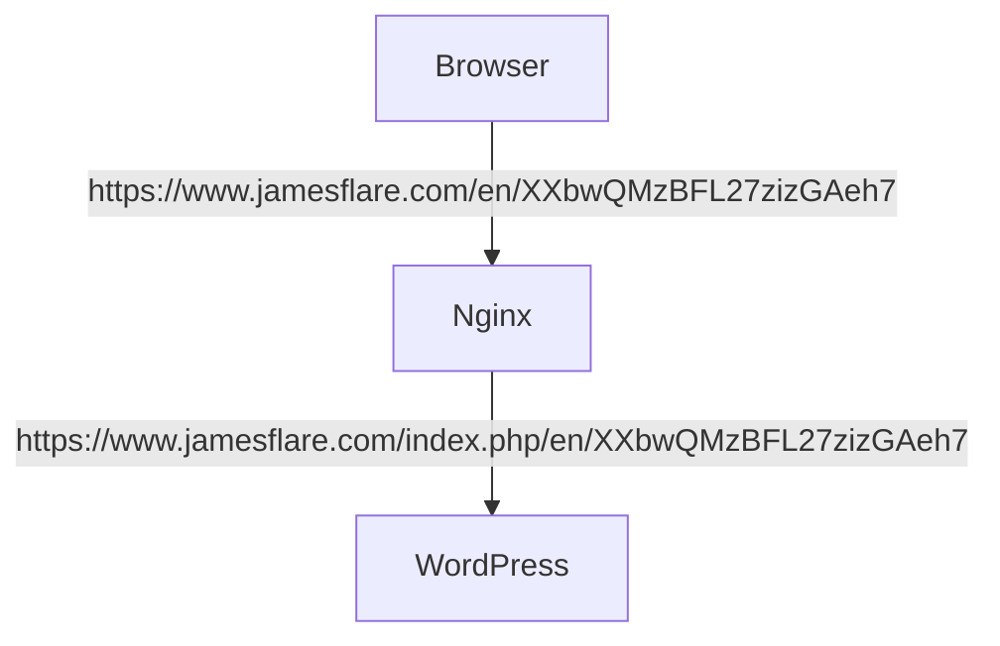

<!--more-->

## 前情提要

KEIJILION在 [网站防御再升级 fail2ban 对接 cloudflare 智能拦截恶意攻击](https://blog.kejilion.pro/fail2ban-cloudflare/) 中提到有一种针对WordPress实例的DDoS攻击方式，即通过请求请求一个不存在的路径绕过缓存机制来对服务器进行攻击。但是他没说清楚这种攻击方式的原理，我在这里尝试解释一下这种攻击方式的原理。

首先，Layer 7的DDoS攻击需要让目标服务器运行某个程序或者代码，这样才能消耗它的资源。换句话说，我们的请求不能在到达WordPress之前被拦截，因为Nginx等WAF拦截请求的开销非常小，如果我们要通过海量请求把它们耗死，代价会非常大，一般人根本做不到。

其次不能命中缓存，因为如果命中被CDN等缓存，那么WordPress程序没有参与服务，我们想耗尽目标服务器资源的目的就无法达成。最后，避免被封禁IP，UA等内容，原因和为什么请求不能在到达WordPress之前被拦截一样。

## 挑战

那么为什么KEIJILION提到的“404”攻击会造成缓存击穿，资源耗尽的结局呢？

### 行为

首先我们讲，它指的“404”攻击是什么？其实就是生成随机的URL Path。比如

```text
https://www.jamesflare.com/en/XXbwQMzBFL27zizGAeh7
https://www.jamesflare.com/en/mvQ3oX3NJRCfy8LBdWdL
https://www.jamesflare.com/en/AK3VdReDX4AKmAYanV9j
https://www.jamesflare.com/en/2Msmu2zDGwA4Fd4hDroF
https://www.jamesflare.com/en/crq8KXvMaFphdYhGNaFA
```

这么做是为了击穿缓存，让请求到达WordPres实例。

### Nginx Rewrite Rule

那么，你可能要问了，那不就返回404了吗，有什么问题呢？首先我们要明白返回一个404也是需要开销的，这个开销在不同应用下不一样。如果是一个Ngnix服务的静态网站，那么当Nginx在本地找不到请求的文件时就会返回404，这个开销很低。

但在WordPress里，这个开销不是很低，这要从它的逻辑说起。WordPress的页面需要让`index.php`来处理，我们在配置的时候想必写过类似的Rewrite Rule吧

```nginx
# enforce NO www
if ($host ~* ^www\.(.*))
{
    set $host_without_www $1;
    rewrite ^/(.*)$ $scheme://$host_without_www/$1 permanent;
}

# unless the request is for a valid file, send to bootstrap
if (!-e $request_filename)
{
    rewrite ^(.+)$ /index.php?q=$1 last;
}
```

道理就是把请求交给`index.php`处理，

```text
# 浏览器请求的
https://www.jamesflare.com/en/XXbwQMzBFL27zizGAeh7
https://www.jamesflare.com/en/XXbwQMzBFL27zizGAeh7.jpg
# WordPress看到的
https://www.jamesflare.com/index.php/en/XXbwQMzBFL27zizGAeh7
https://www.jamesflare.com/index.php?q=XXbwQMzBFL27zizGAeh7.jpg
```



### 性能

这下压力来到WordPress这一边，它首先匹配一遍数据库里有没有这篇文章，没有之后返回404，然后开始像织毛衣一样编织404页面的HTML内容，要是你的404页面还比较时髦，用到的资源比较多，那开销更大了。约等于直接访问了一次动态的文章（但开销应该还是比真文章小）。

还有就是一般人可能会高估他们VPS的性能，绝大多数的VPS性能很差，可能3-4个洋垃圾核心不如你笔记本的半个核心，没缓存的话可能几十rqs网页就爆了。



这一台18核心的VPS性能也才达到AMD Ryzen 7 7840U的水平，而且是保守的，因为我的笔记本同样搭载AMD Ryzen 7 7840U，性能比Geekbench 6里的数据高了40%左右。数据库里多核是8718，我实测有12127，那18核VPS差不多8650。

## Blue Team

我猜测KEIJILION针对这个`index.php`特性的解决方法是通过扫描Nginx日志中产生404等异常码的IP，并且通过API加入CloudFlare中的黑名单，一小时后释放。日志差不多长这个样子

```text
47.29.201.179 - - [28/Feb/2019:13:17:10 +0000] "GET /?p=1 HTTP/2.0" 200 5316 "https://domain1.com/?p=1" "Mozilla/5.0 (Windows NT 6.1) AppleWebKit/537.36 (KHTML, like Gecko) Chrome/72.0.3626.119 Safari/537.36" "2.75"
```

这样就极大程度缓解了这个漏洞（其实我觉得叫特性更合适）。

## Red Team

那么，它这个模式有什么漏洞呢？首先我们理一下思路，这个特化思路在于

1. 发现异常http code
2. 封禁IP

除了这个额外的补丁，一般的安全措施有

1. 速率限制
2. CloudFlare的安全规则
   1. IP地址风险
   2. 浏览器指纹
   3. UA
   4. 人机验证
3. 站源阻止非CloudFlare IP

### 目的

那么，我们的思路也就明确了，也就是通过一种办法把我们的请求命中站点的动态资源。分解一下任务

1. 找到动态资源
2. 绕过CloudFlare的安全措施
3. 以一个不是那么激进的速率发出请求

首先我们要明白，一般人的VPS性能并不好，WordPress也没想象中那么高效，我觉得没缓存处理几十上百rqs已经很高了，十几rqs就爆了也不是不可能。那些猛猛发包，动不动就几千上万rqs的人，而且没几个IP分摊流量，人家不封你封谁。

### 人海战术

这里我就抛砖引玉，作为Red Team那我就来几杯坏水。最粗暴的那就是来一堆IP地址，还是用之前的“404”攻击，大不了我一个请求换一个IP。你可能说，这怎么可能，1个小时下来岂不是要几万，十几万个IP地址，那些载入史册的DDoS攻击不过上万个地址。就算租IP，1个IP怎么也得1美元吧。

你说的对，也不对。IPv4地址是这样的，但是IPv6呢？很多VPS买就送你一个/48子网，就算抠门一点是/64子网，那也是无比巨大的。

|前缀长度|示例地址|地址范围|
|-|-|-|
|32|2001:db8::/32|2001:0db8:0000:0000:0000:0000:0000:0000 2001:0db8:ffff:ffff:ffff:ffff:ffff:ffff|
|40|2001:db8:ab00::/40|2001:0db8:ab00:0000:0000:0000:0000:0000 2001:0db8:abff:ffff:ffff:ffff:ffff:ffff|
|48|2001:db8\:abcd::/48|2001:0db8\:abcd:0000:0000:0000:0000:0000 2001:0db8\:abcd:ffff:ffff:ffff:ffff:ffff|
|56|2001:db8\:abcd:1200::/56|2001:0db8\:abcd:1200:0000:0000:0000:0000 2001:0db8\:abcd:12ff:ffff:ffff:ffff:ffff|
|64|2001:db8\:abcd\:1234::/64|2001:0db8\:abcd\:1234:0000:0000:0000:0000 2001:0db8\:abcd\:1234:ffff:ffff:ffff:ffff|

我们方便一点不算保留地址，/64前缀意味着后面还有64位的地址空间，也就是2的64次方个IP地址，这个数量是天文数值，我不知道地球上的沙子有没有这么多。如果不改变封禁策略，一个一个地址封那是根本不可能封禁的。

你可能说，这招也太逆天了吧，不就仗着人家没反应过来，要让人家一个子网一个子网封禁岂不是倒霉了。你说的对，但是你可以混合不同大小的子网，而且封禁子网会导致巨量的IP地址被封禁，这是一个很糟糕的选择。况且租一个/32子网中的一部分也不是不可能对吧，和哪个商家关系好，给你个/32子网下面一点的子网，你不就不好处理了。

### 微操大师

好吧，那我换一个坏水，介于我们打爆WordPress的请求量不需要很大，而且性能差距很大，我们用一些高级工具，直接模拟浏览器绕过CloudFlare的验证码也不是不可能。

[](https://github.com/ultrafunkamsterdam/undetected-chromedriver)

我们可以用这个改进的Selenium Chromedriver绕过CloudFlare的验证码，UA，浏览器指纹等检测方式。

或者更先进一点的，没有webdriver，也没有selenium，更加难以检测。

[](https://github.com/ultrafunkamsterdam/nodriver)

然后找一个动态点，比如去搜索框输入随机内容搜索。再配合我们的IPv6人海战术，只需要几十rqs就可以导致它的性能危机。这么多Selenium Chromedriver可能确实会有些消耗性能，但是在自己笔记本上运行也不是很有难度。但是在Blue Team看来就头大了。他们会看见无比正常的一幕，不同的IP地址有一个用户每半个小时，一个小时甚至几个小时才访问一次。或者有一些IP地址的用户甚至不会访问第二次，你会不会疑惑自己的网站是不是发到哪里火了，而不是被攻击了。

## 总结

KEIJILION提到了一种针对WordPress实例的DDoS攻击方式，即通过请求一个不存在的路径来绕过缓存机制，消耗服务器资源。这种攻击之所以有效，是因为

1. WordPress的页面请求都需要交给index.php处理，即使是404页面也需要消耗一定的资源。很多VPS性能有限，没有缓存的WordPress可能只能承受几十rqs。

2. 攻击者通过请求随机URL路径，使请求击穿缓存直达WordPress后端，绕过了CDN和WAF等防御。

3. 攻击者会避免被封禁IP、UA等，以逃避检测。

KEIJILION可能通过扫描Nginx日志中的异常状态码并封禁相应IP来缓解这个问题。但这个方案仍有一些漏洞

1. 攻击者可以利用IPv6的巨大地址空间，几乎不可能一个个封禁。

2. 通过模拟真实浏览器发起请求，可以绕过CloudFlare的验证码、指纹等检测，使攻击看起来像正常访问。

3. 由于WordPress的性能瓶颈，攻击者只需要几十rqs的低速率攻击就能造成危害，很难引起注意。

总之，这种DDoS攻击利用了WordPress架构的特点，难以彻底防范。网站管理员除了提高WordPress性能外，还需要更全面的监控和防御措施。