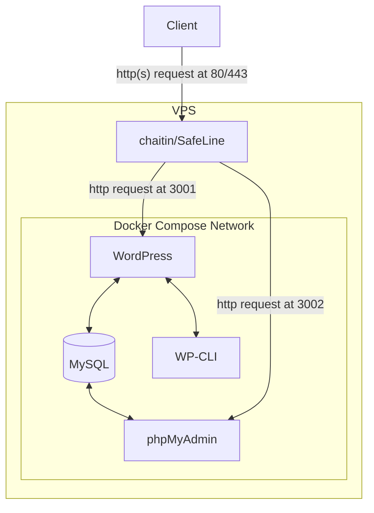

<!--more-->

## 开始之前

在选择使用WordPress（WP）之前，一个很重要的问题就是，你真的需要WordPress吗？它真的是最好的选择吗？**WP真的适合我吗？**

这一点真的非常重要，很多很多的萌新第一次开始用WP是因为道听途说别人说WP很好，什么都能干，甚至白宫都在用。然后想都不想就直接开采用了。这些个说法某种程度上是对的，那么，哪里不对呢？

如果你只是个人博客，亦或者自己捣鼓几下，即便未来不想用了删了也无所谓那种，那其实不要需要考虑这个问题。但如果你是某个公司的领导或者项目负责人，那就得好思考一下选择WP的合理性了。

### WP的优势区间

首先，WordPress是CMS的一类，不过它过分强大了，以至于它有些跳出这个范畴了。你可以拿它开商场，论坛，资源站，下载站，几乎你能想到的任何网站。没有什么是一个插件搞不定的。它的优点包括但不限于：

- 丰富的生态，各种插件，主题琳琅满目
- 历经时间考验，各种Bug报错，基本上网上一搜就有讨论和解决方法
- 开源软件，因此免费（不过这意味着省钱吗？有意思的问题）

这也就是说，别管好不好，反正用WordPress都能做。

### WP的劣势区间

具体一点，用它构建的站点是一个**动态站点**。动态站点的意思是，每一次用户的访问，都需要WordPress程序执行一次，生成网页内容后再传输给客户端浏览器。这意味着会带来不小的服务端开销，而且延迟相比静态网站也会高出不少。它的缺点包括但不限于：

- 不够轻量，历史包袱很大，当访问量和体量变大后，要做不少额外工作来优化
- 插件，主题的维护水平，质量层次不齐

### 内容驱动 vs 功能驱动

另一种思路是从场景方面考虑。

> [!NOTE]
>
> 典型的**内容驱动**场景：博客、新闻网站、知识库  
> 典型的**功能驱动**场景：电商、工具类网站、社交平台

如果是内容驱动的场景，那WordPress也算比较擅长。后台可以创建用户，并且实现一定的权限管理。有一个开箱即用的后台管理系统也算一个不错的选项。不过如果你需要对主题等内容进行深度改造，甚至是从底层编写一些组件。那么有很多的前端框架可以选择，React，Next.js，亦或者新兴的，以内容驱动场景为切入点的Astro。用它们无疑是一个比WP更稳妥的选择，项目可以拥有更多的底层控制，也可以接驳成熟的软件开发流程。

如果是功能驱动场景，比如电商。那WordPress真有可圈可点的地方。比如非常著名的WooCommerce插件，它的故事简直可以单开一页。它很成熟，有自己的生态和完整解决方案，甚至说是自建商城的不二之选。而下载站之类的场景，也有不少用WP做成的例子。至于社交平台，那我只能说不合适。特别是论坛，WP也有出名的论坛插件，但是和真正的论坛程序，比如Flarum之类的比，那完全不在一个水平上。

总结，WP诞生之初只是一个博客程序。这是它的局限性，它在内容驱动的场景中有一战之力，比如一个新闻媒体网站，有数十名作家。每天有写出新的文章，又要有人审核，那WP简直完美适合这个场景；如果是公司要做一个Landing Page或者其它的宣传网站，那显然，这个工作的重心全在搓一个不错的首页，俗称雕花。也就吃不到WP的那一套后台管理，还会引入额外的变量；而商城这样的例子则是因为有人摸索出一台完善的解决方案，也经历了市场考验。个人觉得WP在这里的贡献并不是很大，WooCommerce的贡献绝对是一等一的；而论坛这样的应用，无论是操作逻辑还是结构显然和原始的WP八字不合，另外也有许多竞品。无论是在功能还是性能，可迁移性上都远远不如Flarum这样的专业项目。

### 一些误区

**WordPress跑起来就万事大吉了吗？**  显然不是，你永远无法想到未来会有什么需求。软件的生命在于维护，随着时间前进，无论是来自业务需要，还是各种千奇百怪的原因。你的站点会加上越来越多的东西，技术债会越来越多，一些在当时看似合理的决策在未来会变成技术债。这是无法避免的，请提前做好准备，一种缓解的方式是在项目立项之初就最好选择。比如让技术人员，或者以后参与开发，维护的人参与到早期的决策，技术选型当中。除了开发角度的挑战，其实还有很多麻烦，比如被入侵，网站的备份，服务器宕机，更新后的兼容问题，插件/主题开发者弃坑，这些都是客观存在的。

**插件是越多越好吗？** 显然不是，多一个插件意味着对了一处变量。这和写代码的时候调用第三方库的概念是一样的，每个插件的维护水平层次不齐。此外，每多一个插件就对了一个可能被入侵的点。事实上，很多有关WP的入侵事件都是因为插件导致的。

## 部署选项

如果你已经下定决心要开始使用WordPress了，那么第一站就是把它跑起来，换一句话说就是在哪部署。相信我，这绝对是第一个坑。

### 完全托管

这种方案的代表是WordPress.com的[WordPress Hosting](https://wordpress.com/hosting/)，WP Engine的[WordPress Hosting](https://wpengine.com/wordpress-hosting/)以及GoDaddy的[Hosting for WordPress](https://www.godaddy.com/hosting/wordpress-hosting)。它会交付给你一个WordPress站点，但一般只有后台，你可以管理和自定义站点，但是没法修改运行环境和代码。

#### 风险

我并不推荐这样的方案，一个是它们的价格并不占优势，最重要的，也是我最在意的就是lock-in，以及捆绑销售。

所谓lock-in，就是难以迁移出平台，业务和平台高度绑定形成依赖。而且多数情况下它们对资源的承诺很模糊，比如能使用多少流量，多少CPU资源，多少空间？它们可能会承诺所谓的无限，但是如果你有一天触及到了无限的限制（很模糊，商家的一家之言），那它们多半会要你升级昂贵的高级计划。而你的资源已经和平台高度绑定，你只能选择妥协。

所谓捆绑销售，例子就很多了。有可能是兜售插件，也可能是和自家的域名注册和邮件服务捆绑销售。比如GoDaddy就会和它自家的域名注册服务绑定，而域名注册这方面的水很深。简而言之就是GoDaddy是二道贩子，你在它那买域名的行为约等于委托它和顶级域名注册机构购买，而它赚一个差价。

一般情况下这无伤大雅，但是有时候它会以一个低的首年价格吸引你购买，在你续费的时候大大涨价（这种做法很常见）。极端的情况可能是购买的时候不到20美元一年，而续费的时候高达数百美元一年。而GoDaddy付给顶级域名注册机构的钱几乎都是一样的（就是一样的），相当于赚取了几十倍的暴利。更可怕的是，假如你的整个业务都托管在它手里，那它可以轻易地知道你的盈利情况，然后定一个很高，但你可以承受的价格来赚取超额利润。

我不希望恶意揣测企业的意图，而且这样的事情很难实锤，但这样的风险是切实存在的。

### 虚拟主机

虚拟主机（Shared Hosting）是最传统的网站托管方案之一，服务商会在一台物理服务器上通过虚拟化技术划分出多个独立空间，每个用户共享服务器资源（CPU、内存等），但拥有独立的文件存储和网站环境。这类服务通常以「低门槛」为核心卖点。提供这样服务的商家很多，基本上只要安装一个cPanel就可以卖虚拟主机了，甚至你也可以在自家的VPS或者类似服务器上安装一个cPanel来管理虚拟主机。

#### 优点

大概率比单独购买VPS便宜。开箱即用，无需配置服务器环境（如Apache/Nginx、MySQL等）。大概率还有开箱即用的备份功能，可以省去一些工作。

#### 风险

无法自定义服务器环境（如PHP版本、扩展模块）。一些插件可能对PHP扩展和版本有所要求，随着插件变多，依赖越来越复杂，这也是不得不考虑的问题。

此外，不像完全托管的WP实例，你依然需要处理安全问题，而且给自己兜底。如果网站被黑了，服务提供商很可能会封禁你的账户。事实上，网上有很多类似的不愉快事件，每家的风评也不唯一，建议细细研究一下。

另外就是和完全托管类似的问题，例如承诺的资源不明确，承诺多少带宽，多少流量，又或者多少CPU资源。无限？那有一天碰到无限的限制会怎么样？还有服务与电子邮件服务，域名等产品捆绑销售。

### VPS服务器

虚拟专用服务器（VPS）通过虚拟化技术将一台物理服务器划分为多个独立虚拟服务器，每个VPS拥有专属资源（如CPU核心、内存、磁盘IO）。与虚拟主机相比，VPS提供了更高的自由度和可控性。

这也是我会选择的方式，稍后的演示会拿它演示。

#### 优点

可以完全掌控服务器环境（可自定义操作系统、软件栈），资源独享（至少买的时候会明确承诺你拥有哪些资源）。而且这样的云服务器各家都有提供，已经形成了行业标准。无论是Vultr，AWS，GCP，阿里云，腾讯云，以及各式各样的厂商。你都可以以一个比较小的代价在它们之间迁移，当然，这也得益于容器化等技术。

另一个就是花销可预期。不像serverless服务的按量付费，遇到攻击，意外的bug，你最坏的情况也就是耗尽VPS每月的流量。而对于serverless服务，它确实可能会保证你的服务不下线，但是可能产生天价账单（这已经不是罕见的例子了，比如[ServerlessHorrors](https://serverlesshorrors.com/)收录了不少例子）。

#### 风险

首先，这意味着你要为自己的服务兜底，比如被入侵了导致资料丢失，数据泄露后，你没法找别人给你背锅。再或者，被DDoS的时候，很可能导致服务器下线（其实这是无解的，如果你用托管或者虚拟主机，想不加钱也是不现实的）。

## 快速开始

接下来我会演示一下在一台VPS上运行一个基本的WordPress实例。开始之前，我们先小小地设计一下我们的技术栈，或者说拓扑结构。



首先，为了方便部署和稳定的环境，我们用容器部署WordPress主程序，数据库，还有一些小工具，比如phpMyAdmin，WP-CLI。最后，为了支持HTTPS，我们需要一个反向代理，我这里直接用雷池WAF充当反代，还能顺手缓解安全问题（保守一点，不敢说解决）。

### 软件仓库

为了方便你们看文档，我把几个用到的项目地址准备好了。


  
  
  


### Docker Compose配置

首先拉取[nezhar/wordpress-docker-compose](https://github.com/nezhar/wordpress-docker-compose)，因为我们要借用它的配置文件

```bash {.no-header}
git clone https://github.com/nezhar/wordpress-docker-compose.git
```

然后进入项目的目录，

```bash {.no-header}
cd wordpress-docker-compose
```

我在原版的基础上做出了一些修改，可以参考以下配置

```yaml {title="docker-compose.yaml",data-open=true,hl_lines=[7,"43-44","52-53"]}
version: '3'

services:
  wp:
    image: wordpress:latest # https://hub.docker.com/_/wordpress/
    ports:
      - 127.0.0.1:3001:80 # change ip if required
    volumes:
      - ./config/wp_php.ini:/usr/local/etc/php/conf.d/conf.ini
      - ./wp-app:/var/www/html # Full wordpress project
      #- ./plugin-name/trunk/:/var/www/html/wp-content/plugins/plugin-name # Plugin development
      #- ./theme-name/trunk/:/var/www/html/wp-content/themes/theme-name # Theme development
    environment:
      WORDPRESS_DB_HOST: db
      WORDPRESS_DB_NAME: wordpress
      WORDPRESS_DB_USER: root
      WORDPRESS_DB_PASSWORD: password
    depends_on:
      - db

  wpcli:
    image: wordpress:cli
    volumes:
      - ./config/wp_php.ini:/usr/local/etc/php/conf.d/conf.ini
      - ./wp-app:/var/www/html
    environment:
      WORDPRESS_DB_HOST: db
      WORDPRESS_DB_NAME: wordpress
      WORDPRESS_DB_USER: root
      WORDPRESS_DB_PASSWORD: password
    depends_on:
      - db
      - wp

  pma:
    image: phpmyadmin:latest  # https://hub.docker.com/_/phpmyadmin
    environment:
      # https://docs.phpmyadmin.net/en/latest/setup.html#docker-environment-variables
      PMA_HOST: db
      PMA_PORT: 3306
      MYSQL_ROOT_PASSWORD: password
      UPLOAD_LIMIT: 50M
    #ports:
    #  - 127.0.0.1:3002:80
    volumes:
      - ./config/wp_php.ini:/usr/local/etc/php/conf.d/conf.ini
      - ./config/pma_config.php:/etc/phpmyadmin/config.user.inc.php

  db:
    image: mysql:latest # https://hub.docker.com/_/mysql/ - or mariadb https://hub.docker.com/_/mariadb
    # platform: linux/x86_64  # Uncomment if your machine is running on arm (ex: Apple Silicon processor)
    # ports:
    #   - 127.0.0.1:3306:3306 # change ip if required
    command:
      - '--character-set-server=utf8mb4'
      - '--collation-server=utf8mb4_unicode_ci'
    volumes:
      - ./wp-data:/docker-entrypoint-initdb.d
      - ./db_data:/var/lib/mysql
    environment:
      MYSQL_DATABASE: wordpress
      MYSQL_ROOT_PASSWORD: password
```

高亮的部分是几个关键的更改，因为我们引入了不一样的网络结构，你可以根据你的具体情况做出修改。比如我为了安全，不把数据库和phpMyAdmin暴露出来。phpMyAdmin的名声可不太好，很多次大漏洞都是和它有关系，我的建议是要用的时候暴露一下，或者用WAF在前面挡一下。

完成后运行容器

```bash {.no-header}
docker compose up -d
```

查看容器的日志

```bash {.no-header}
docker compose logs
```

### 配置DNS

在我们需要添加几条DNS记录，只要域名指向了服务器的IP，用户才能正常通过域名访问站点。

> [!NOTE]
>
> A和AAAA是DNS记录的类型，A代表指向IPv4地址的记录，AAAA代表指向IPv6地址的记录

|Name|Type|Value|
|----|----|-----|
|@   |A   |IPv4 |
|@   |AAAA|IPv6 |
|www |A   |IPv4 |
|www |AAAA|IPv6 |

这里的`@`是root的意思（不同面板可能叫法不一样）。比如我给`jamesflare.com`添加一个名为`@`，值为`1.1.1.1`的A记录，那`jamesflare.com`就会指向`1.1.1.1`；

这里的`www`是三级域名的名字。比如我给`jamesflare.com`添加一个名为`www`，值为`1.1.1.1`的A记录，那`www.jamesflare.com`就会指向`1.1.1.1`。

我同时给`@`和`www`都添加记录的原因是，一些人会在访问的时候不输入域名完整名。比如访问`www.jamesflare.com`的时候只输入`jamesflare.com`。为了避免带来不必要的麻烦，我们额外添加一条记录。

当然，这里只是抛砖引玉，同时展示一种通用做法，请根据自己的情况举一反三。

### 配置WAF

有关这部分，我建议你亲自参考[官方的文档](https://help.waf-ce.chaitin.cn/node/01973fc6-df0f-7650-bafa-8ed8d2fc2bc1)。

我觉得自动安装已经足够好用了，其它的安装可以参考官方的介绍

```bash {.no-header}
bash -c "$(curl -fsSLk https://waf-ce.chaitin.cn/release/latest/manager.sh)"
```

往后的东西进很符合直觉，我就不重复造轮子了。

在安装完成后，先去雷池里添加/申请一个SSL证书。然后添加一个应用，指向`http://127.0.0.1:3001`（如果你用的我的配置），顺便设置相应的域名和其它需要的配置。

最后微调一下防火墙的配置，比如关闭一些不必要的检测。例如WP是一个php文件，Java的检测就没意义了。

> [!WARNING]
>
> 所有的防火墙都有一定的误报可能，它在拦截攻击的同时可能拦截合法请求。所以请时刻关注用户反馈，调整配置，添加规则。
>
> 讲究一点的话应该在开始项目之前好好评估一下检出率，误报率，处理能力等，但是我们这次就草台一点，直接干了!

### 配置WordPress

大部分配置都很符合直觉，一个比较坑的是Site URL，站点地址的设置。请确保你设置的地址是一个可以被访问的地址，因为WordPress会把新的请求重新定向到这个URL（如果访问的地址不一样的话）。如果你随便填了一个不能访问的地址，那就死循环了。如果发生这样的情况，只能去数据库里手动修改了。

### 评估

我会用autocannon进行压力测试，看看它的处理能力。

## 更进一步

### 扩容

往后扩大规模后要怎么办呢？这是一个好问题，扩容，缩容，迁移，备份……这都是随着业务规模增大，越来越正规后不得不考虑的问题。

这个没有一个标准答案，一个可以参考的思路是添加缓存，比如Redis，减少数据库操作。分离数据库，把数据库转移到更强大的机器上，前面的WordPress可以进行负载均衡。最后配合k8s这样的集群来管理实例，比如扩容，缩容，迁移等。

不过无论如何，做一个压力测试，找出系统瓶颈和极限所在也是很有必要的。

### 升级

按时更新WordPress是非常重要的，因为WP时不时就会爆出漏洞，要是更新不及时很可能站点就是别人的了。

由于我们用的Docker部署，更新的话最好重新拉取镜像，然后重新启动。

```bash
cd wordpress-docker-compose
docker compose pull
docker compose down
docker compose up -d
```

然后检查一下WP面板，没有更新的话再更新一下。

### 性能问题

我用的这个WordPress镜像它用了Apache作为Web Server。它的性能不如Ngnix等，这一点请须知。

## 写在最后

无论选择哪种部署方式，请记住：技术决策应服务于业务目标。

- 如果追求极简和低成本，静态站点生成器（如Hugo、Hexo）或许是更好的选择
- 如果需要快速验证想法，托管型WordPress能节省初期时间成本
- 如果预期业务快速增长，从VPS起步可减少后续迁移的麻烦

永远为最坏情况做预案。定期测试备份可用性，监控资源使用率，并在预算中预留至少20%的应急资金用于应对突发流量或安全事件。
